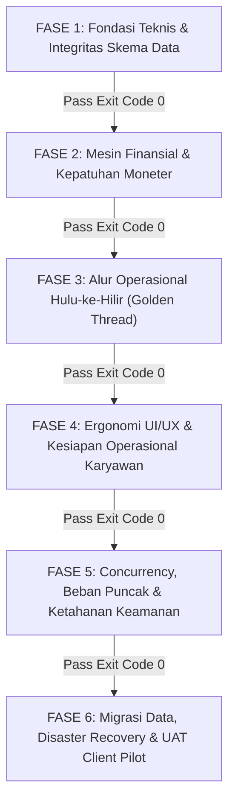

# MASTER BLUEPRINT AUDIT KESIAPAN ENTERPRISE ERP (NEX ERP)
**Klasifikasi Dokumen**: Enterprise Readiness & Handover Protocol  
**Tujuan**: Menilai kelayakan sistem sebelum deployment ke perusahaan klien dengan prinsip **Zero Fatal Error** dan **Zero Financial Loss**.

---

## 🏛️ 1. WORLD-CLASS AUDIT ROLES (Konsorsium 5 Peran Auditor Utama)

Untuk mengaudit ERP manufaktur & trading kelas enterprise tanpa celah, audit tidak boleh dilakukan oleh satu perspektif developer biasa. Diperlukan konsorsium audit 5 peran kelas dunia:

| # | Role & Standar Acuan | Fokus & Tanggung Jawab Utama | Risiko yang Dicegah |
|---|----------------------|------------------------------|---------------------|
| **1** | **Principal Enterprise Systems Architect** *(TOGAF / ISO/IEC 25010 / Martin Fowler Clean Arch)* | Meninjau isolasi layer, coupling-cohesion, kepatuhan batas file (*file size limit*), pola Facade Service, zero dead-code, dan stabilitas modularitas untuk perubahan fitur cepat. | Spaghetti code, regresi saat penambahan fitur, pembengkakan technical debt, vendor lock-in. |
| **2** | **Principal Financial & Forensic ERP Auditor** *(CPA / Big 4 ERP Assurance / PSAK & IFRS)* | Meninjau auto-journaling 9-trigger, keseimbangan neraca saldo (Debit = Credit), kalkulasi HPP/COGS (FIFO/FEFO/Average), rekonsiliasi kas/bank, PPN/PPh, dan jejak audit yang tidak bisa dimanipulasi (*immutable audit trail*). | Selisih uang, salah hitung margin laba/rugi, sanksi pajak, manipulasi kasbon/fraud karyawan. |
| **3** | **Staff Database Reliability Engineer (DBRE) & Data Architect** *(PostgreSQL / ACID / High-Throughput)* | Meninjau integritas referensial (FK constraints), isolasi multi-tenant, race condition saat *high concurrency* (locking stok & nomor dokumen), optimasi query/index, dan skenario backup/recovery (RTO < 15 mnt, RPO = 0). | Deadlock database, nomor faktur ganda, stok fisik minus tapi di sistem ada, data tenant bocor ke perusahaan lain. |
| **4** | **Director of Product & Enterprise Ergonomics (Lead UX Auditor)** *(Nielsen Norman Group / Enterprise B2B)* | Meninjau kecepatan input data harian karyawan (*keystroke efficiency*, navigasi tanpa mouse), kepadatan tabular (*data density*), konsistensi Visual DNA, status validasi form yang jelas, dan penanganan koneksi terputus. | Karyawan menolak pakai sistem baru (*user rejection*), antrean input gudang macet, salah input karena form membingungkan. |
| **5** | **VP of Industrial Operations & Quality Assurance (GMP / BPOM / ISO 9001)** | Meninjau ketertelusuran nomor batch (*lot traceability* dari bahan baku hingga barang jadi), karantina otomatis, otorisasi rilis APJ (Apoteker Penanggung Jawab), validasi formula R&D, dan Material Requirements Planning (MRP). | Produk cacat/terkontaminasi terkirim ke customer, penutupan pabrik oleh BPOM, salah formulasi batch produksi. |

---

## 📐 2. PARAMETER & KRITERIA KELAYAKAN CLIENT-READY

Selain kriteria dasar yang sudah Anda sebutkan, sistem ERP siap pakai di klien wajib lulus kriteria ketat berikut:

### A. Integritas Finansial & Kebenaran Moneter (Zero Financial Loss)
1. **Mathematical Balance Guarantee**: Setiap transaksi mutasi moneter wajib menghasilkan jurnal berpasangan `Sum(Debit) - Sum(Credit) == 0` secara instan dalam 1 transaksi ACID.
2. **Sequential Integrity**: Tidak boleh ada nomor dokumen yang lompat (*gapless sequence*) pada Faktur Pajak, Sales Invoice, dan Purchase Order.
3. **Period Locking & Immutability**: Transaksi pada periode yang sudah ditutup (*closed accounting period*) dilarang keras diubah atau dihapus; koreksi hanya boleh melalui jurnal pembalik (*reversal entry*).
4. **Rounding & Precision Safety**: Menggunakan tipe data `Decimal` / `Numeric` di database (bukan `Float` / `Double`) untuk mencegah *floating-point penny drift*.

### B. Konkurensi & Integritas Transaksional Database
1. **Row-Level Locking pada Inventori**: Mutasi stok barang harus dilindungi dengan `SELECT ... FOR UPDATE` atau *optimistic concurrency lock* agar tidak terjadi stok minus saat 2 kasir/gudang memotong barang yang sama di detik yang sama.
2. **Zero Orphan Records**: Dilarang menggunakan cascading delete tanpa kontrol ketat; seluruh foreign key wajib memiliki constraint eksplisit (`RESTRICT` / `NO ACTION` untuk data transaksi).
3. **Idempotency**: Seluruh endpoint transaksi (Bayar, Submit Order, Rilis Batch) harus kebal terhadap *double-click* atau *network retry* duplikat menggunakan *Idempotency-Key*.

### C. Ergonomi Operasional & Pengalaman Karyawan (Enterprise UX)
1. **Zero-Mock Verification**: 100% tampilan input dan tabel harus tersambung ke backend nyata. Tidak boleh ada komponen palsu atau data dummy di lingkungan produksi.
2. **Keyboard-First Workflow**: Karyawan operasional (Gudang, Kasir, Admin Pembelian) harus bisa menyelesaikan transaksi 100% menggunakan tombol keyboard (`Tab`, `Enter`, `Esc`, shortcut kombinasi) tanpa harus memindahkan tangan ke mouse.
3. **Predictable Feedback & State Recovery**: Jika koneksi putus atau validasi gagal, form tidak boleh mereset input yang sudah diketik pengguna; pesan error harus spesifik menunjuk kolom yang salah (*field-level error*).

### D. Keamanan, Tata Kelola & Audit Trail (SOX & RBAC)
1. **Separation of Duties (SoD)**: Pengaju transaksi dilarang menyetujui transaksinya sendiri (misal: Pembuat PO dilarang melakukan Approval PO miliknya).
2. **Immutable Audit Trail**: Siapa yang membuat, mengubah, menghapus, atau melihat data sensitif wajib tercatat lengkap dengan `userId`, `timestamp`, `ipAddress`, dan `deltaChanges` (sebelum vs sesudah).
3. **Multi-Tenant Leakage Proof**: Query ke database secara mutlak harus terisolasi per organisasi/tenant via middleware atau interceptor otomatis.

### E. Maintainability & Agility Pengembangan
1. **Adherence to Clean Architecture**:
   - Frontend: Tri-Layer Colocation (`_components`, `_hooks`, `_types`, `page.tsx < 120 baris`).
   - Backend: Facade Service (< 250 baris) dengan sub-services yang teratomisasi.
2. **Type Safety Gate**: 0 TypeScript error di frontend dan backend (`tsc --noEmit` exit code 0).
3. **Automated Test Coverage**: Golden Thread E2E test mencakup 100% skenario kritis dari intake leads hingga laporan keuangan.

---

## 🚦 3. ROADMAP 6 FASE AUDIT BERJENJANG

Audit ini tidak boleh dijalankan secara serentak karena akan membingungkan. Audit disusun dalam **6 Fase Berurutan (Gateways)**:

### Rincian Setiap Fase Audit:

#### 🔹 FASE 1: Fondasi Teknis, Arsitektur, & Integritas Skema Data
* **Objektif**: Memastikan fondasi kode bersih, bebas error tipe, skema database sehat, dan arsitektur modular.
* **Cakupan Pemeriksaan**:
  - Validasi Prisma Schema & relasi Foreign Key (pastikan tidak ada bug patah `P2003`).
  - Pemindaian static analysis: `npm run typecheck` di backend & frontend.
  - Audit limit ukuran file (`page.tsx` < 120 baris, Backend Facade < 250 baris).
  - Isolasi Multi-Tenant pada level database query.
* **Output / Delivery**: Laporan Kesiapan Arsitektur & Perbaikan Skema Database.

#### 🔹 FASE 2: Mesin Finansial, Akuntansi Otomatis, & Kepatuhan Moneter
* **Objektif**: Memastikan tidak ada potensi selisih uang 1 rupiah pun dalam sistem.
* **Cakupan Pemeriksaan**:
  - Pengujian Auto-Journal 9-Trigger (Sales, AP, AR, GRN, Release, COGS, Stock Opname, Cash In/Out).
  - Validasi keseimbangan Neraca Saldo (*Trial Balance*), Buku Besar, dan Laba Rugi.
  - Perhitungan HPP / COGS (apakah formula pembebanan bahan baku & overhead sudah akurat).
  - Validasi pembulatan pajak (PPN, PPh 21/23).
* **Output / Delivery**: Berita Acara Rekonsiliasi Finansial & Auto-Journal Validation Report.

#### 🔹 FASE 3: Alur Operasional Hulu-ke-Hilir (End-to-End Golden Thread)
* **Objektif**: Memastikan data mengalir mulus antar departemen tanpa ada data yang tersangkut.
* **Cakupan Pemeriksaan**:
  - Menjalankan rantai operasional penuh:
    `Lead CRM` ➔ `R&D Formula` ➔ `Sales Order` ➔ `MRP` ➔ `PO Supplier` ➔ `Inbound GRN` ➔ `SPK Produksi / BMR` ➔ `QC Lab & Release APJ` ➔ `Delivery Order` ➔ `Faktur Penjualan` ➔ `Pelunasan Kas/Bank`.
  - Sinkronisasi status approval multi-tier (PO, Pengeluaran Kas, Rilis Batch).
  - Pencegahan stok silang / alokasi ganda (*FEFO reservation lock*).
* **Output / Delivery**: Golden Thread Execution Matrix & Traceability Audit Report.

#### 🔹 FASE 4: Ergonomi UI/UX, Kecepatan Operasional, & Zero-Mock Plumping
* **Objektif**: Memastikan antarmuka nyaman, cepat, intuitif, dan tidak ada data fiktif.
* **Cakupan Pemeriksaan**:
  - Scanning zero-mock: memastikan 100% halaman (245+ file) sudah terhubung ke API backend.
  - Uji kecepatan input: form data master, invoice, dan stock opname dengan navigasi keyboard.
  - Validasi filter, pencarian, paginasi, dan export data di semua tabel utama.
  - Responsif terhadap resolusi layar standar operasional (Laptop 14", Desktop Kasir, Barcode Scanner).
* **Output / Delivery**: UX Ergonomics Scorecard & Mock-Elimination Verification Certificate.

#### 🔹 FASE 5: Concurrency, Ketahanan Beban, & Keamanan (Stress & Security)
* **Objektif**: Memastikan sistem tidak roboh saat diserbu transaksi serentak di lapangan.
* **Cakupan Pemeriksaan**:
  - Simulasi 50–100 pengguna serentak melakukan transaksi checkout, potong stok, dan generate invoice.
  - Verifikasi anti-race-condition pada nomor urut dokumen (tidak ada nomor kembar).
  - Penetrasi keamanan: OWASP Top 10 (SQL Injection, Broken Object Level Authorization / BOLA, XSS).
  - Uji kebocoran data antar tenant (akses data perusahaan A oleh user perusahaan B).
* **Output / Delivery**: Concurrency Benchmark Report & Security Assessment Certificate.

#### 🔹 FASE 6: Kesiapan Migrasi Data, Disaster Recovery, & UAT Client Pilot
* **Objektif**: Menjamin proses serah terima data lama ke sistem baru berjalan tanpa cacat.
* **Cakupan Pemeriksaan**:
  - Uji coba import data historis klien via Excel/CSV (Master Barang, Saldo Piutang/Hutang, CoA, Stok Awal).
  - Simulasi *Disaster Recovery*: backup database dan restore sistem dengan target RTO < 15 menit.
  - Pelaksanaan UAT Pilot (Dual-Run selama 14 hari) berdampingan dengan sistem lama klien.
* **Output / Delivery**: Dokumen Berita Acara UAT & Final Sign-Off Production Deployment.

---

## 📊 4. FRAMEWORK PENGUKURAN GAP (READINESS SCORING MODEL)

Untuk mengetahui seberapa jauh posisi sistem saat ini terhadap standar kelayakan klien, setiap modul akan dinilai dengan sistem **RAG (Red-Amber-Green)** dan Skor Kesiapan (0 - 100%):

| Level Kesiapan | Skor | Status | Definisi Operasional |
| :--- | :---: | :---: | :--- |
| **CRITICAL RISK** | 0% – 49% | 🔴 **RED** | Ada fatal bug, mock data dominan, atau potensi selisih uang. **Dilarang keras dikirim ke klien**. |
| **PARTIAL READY** | 50% – 79% | 🟡 **AMBER** | Fitur berfungsi di alur normal, namun gagal saat edge-case, concurrency, atau UX belum ergonomis. |
| **CLIENT PRODUCTION READY** | 80% – 100% | 🟢 **GREEN** | Lulus semua automated tests, data ACID terbukti, UI/UX cepat, zero-mock, dan lolos uji beban. |

Setiap temuan audit akan diklasifikasikan ke dalam 4 tingkat keparahan:
- **P0 (Blocker)**: Menyebabkan uang hilang, stok korup, server crash, atau data bocor. Harus diselesaikan sebelum lanjut fase.
- **P1 (Critical)**: Alur bisnis terputus atau form utama tidak bisa disubmit; ada workaround manual sementara.
- **P2 (Major)**: Masalah ergonomi, performa lambat pada data besar, atau validasi UI yang tidak informatif.
- **P3 (Minor)**: Ketidaksesuaian visual minor, typo teks, atau alignment styling yang tidak memengaruhi fungsi.
