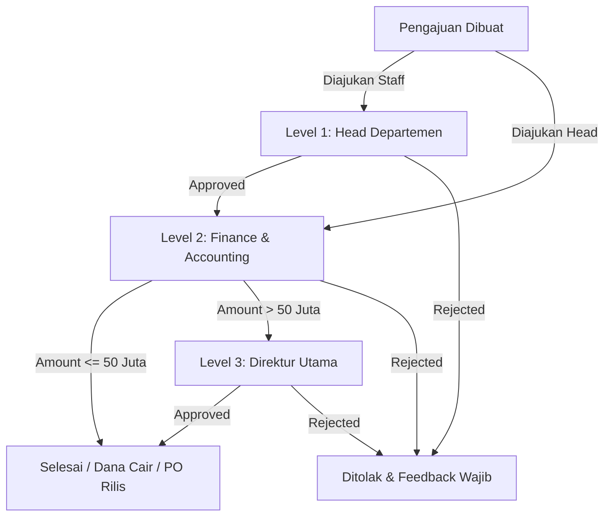

# NEX ERP ENTERPRISE MASTER SPECIFICATION (SSOT)
> **Sistem:** NEX Enterprise Resource Planning (Toll Manufacturing Kosmetik, Skincare, & Personal Care)  
> **Status:** SINGLE SOURCE OF TRUTH (OFFICIAL AUTHORITATIVE BLUEPRINT)  
> **Versi:** 2.0 (Final Comprehensive Consolidation)  
> **Tanggal Rilis:** 2026-09-09  
> **Target Production:** Biznet NEO Lite VPS (`103.93.134.215`) | `https://nexerp.id`

---

## 📑 DAFTAR ISI UTAMA
1. [BAGIAN I: PRINSIP ARSITEKTUR & STANDAR UNIVERSAL](#bagian-i-prinsip-arsitektur--standar-universal)
   - [1. Format Kode Universal Global (Universal Code Engine)](#1-format-kode-universal-global-universal-code-engine)
   - [2. Matriks Approval Bertingkat 3-Tier (Fund & Purchasing Approval)](#2-matriks-approval-bertingkat-3-tier-fund--purchasing-approval)
   - [3. Tiga Pilar Fisik Gudang & Purchasing (Bagus / Reject / Free)](#3-tiga-pilar-fisik-gudang--purchasing-bagus--reject--free)
   - [4. Engine Jurnal Otomatis (General Ledger & COA Triggers)](#4-engine-jurnal-otomatis-general-ledger--coa-triggers)
   - [5. Standar UI/UX Enterprise (DNA Design System)](#5-standar-uiux-enterprise-dna-design-system)
   - [6. Alur Makro Bisnis End-to-End (10 Fase Bisnis)](#6-alur-makro-bisnis-end-to-end-10-fase-bisnis)
   - [7. Kerangka Rumus KPI Universal](#7-kerangka-rumus-kpi-universal)
2. [BAGIAN II: SPESIFIKASI 12 MODUL & 178 FITUR / LAYAR](#bagian-ii-spesifikasi-12-modul--178-fitur--layar)
   - [MOD-01: Master Data Management](#mod-01-master-data-management)
   - [MOD-02: Business Development & CRM](#mod-02-business-development--crm)
   - [MOD-03: Research & Development (R&D) & Formulation](#mod-03-research--development-rd--formulation)
   - [MOD-04: SCM & Purchasing](#mod-04-scm--purchasing)
   - [MOD-05: Warehouse & Inventory Management](#mod-05-warehouse--inventory-management)
   - [MOD-06: Production & PPIC](#mod-06-production--ppic)
   - [MOD-07: Quality Control & Compliance](#mod-07-quality-control--compliance)
   - [MOD-08: Creative & Packaging Design](#mod-08-creative--packaging-design)
   - [MOD-09: Legality & Regulation](#mod-09-legality--regulation)
   - [MOD-10: Finance & Accounting](#mod-10-finance--accounting)
   - [MOD-11: Human Resources](#mod-11-human-resources)
   - [MOD-12: Executive & Analytics](#mod-12-executive--analytics)
3. [BAGIAN III: REKONSILIASI LENGKAP 78 POIN ATURAN BISNIS (REQUIREMENT.MD)](#bagian-iii-rekonsiliasi-lengkap-78-poin-aturan-bisnis-requirementmd)

---

# BAGIAN I: PRINSIP ARSITEKTUR & STANDAR UNIVERSAL

## 1. Format Kode Universal Global (Universal Code Engine)
*(Berdasarkan Requirement Poin 69, 70, 71)*

Seluruh kode dokumen, transaksi, dan master data di NEX ERP wajib di-generate secara otomatis oleh sistem tanpa input manual dengan 2 varian format:

### A. Format Lengkap (Standard Enterprise)
```text
[KODE_PERUSAHAAN]-[DIVISI]-[TIPE_DOKUMEN]-[TANGGAL_DDMMYYYY]-[NOMOR_URUT_GLOBAL]
Contoh: DL-FIN-SO-29062026-0001
```

### B. Format Ringkas (Compact View)
```text
[TIPE_DOKUMEN]-[TANGGAL_DDMMYYYY]-[NOMOR_URUT_GLOBAL]
Contoh: SO-29062026-0001
```

### Aturan Wajib Nomor Urut:
1. **Global & Berkelanjutan:** Dimulai dari `0001` dan terus bertambah (`0002`, `0003`, dst.) mengikuti riwayat seumur hidup sistem.
2. **Tanpa Reset:** Nomor urut **TIDAK PERNAH DIRESET** per bulan, per tahun, maupun per kategori.

---

## 2. Matriks Approval Bertingkat 3-Tier (Fund & Purchasing Approval)
*(Berdasarkan Requirement Poin 22, 23, 24, 25)*

Setiap pengajuan transaksi finansial dan pengadaan barang wajib melewati gerbang otorisasi bertingkat:



---

## 3. Tiga Pilar Fisik Gudang & Purchasing (Bagus / Reject / Free)
*(Berdasarkan Requirement Poin 53, 54, 55, 57, 65, 67)*

Setiap transaksi pengadaan, penerimaan barang (*Inbound Goods Receipt*), dan manajemen stok gudang wajib memisahkan 3 kategori fisik:

1. **Kuantitas Bagus (Real Stok):**
   - Barang lolos QC dan siap digunakan untuk produksi/penjualan.
   - **Hanya kuantitas bagus yang menambah `MaterialInventory.stockQty` dan menjadi dasar pembayaran Faktur Pembelian ke Supplier.**
2. **Kuantitas Cacat (Reject):**
   - Barang cacat/rusak/tidak sesuai spesifikasi PO.
   - **Barang reject TIDAK DIBAYAR ke supplier** dan langsung dicatat ke log Retur Pembelian.
3. **Kuantitas Gratis (Free / Bonus / Over-delivery):**
   - Barang ekstra yang diberikan supplier tanpa biaya.
   - Dicatat kuantitas fisiknya di gudang dengan nilai perolehan (HPP) Rp 0.

### Diskon & Ongkir PO:
- **Diskon PO dihitung dalam RUPIAH (Rp)**, bukan persentase.
- **Ongkir dicatat terpisah** dan ditambahkan ke total tagihan.
- Selisih pembulatan packing dimasukkan ke dalam potongan diskon.

---

## 4. Engine Jurnal Otomatis (General Ledger & COA Triggers)
*(Berdasarkan NEX_FINANCE_FINAL_SPEC.md & Requirement Poin 23-25)*

Setiap event operasional memicu posting otomatis ke Buku Besar berpasangan seimbang (Balanced Debit = Credit):

| Event Operasional | Trigger Status | Akun DEBIT (Dr) | Akun KREDIT (Cr) | Keterangan |
|---|---|---|---|---|
| **Penerimaan Bahan Baku** | `INBOUND_APPROVED` | `110401 - Persediaan Bahan Baku` | `210101 - Hutang Usaha Supplier` | Berdasarkan harga PO x Kuantitas Bagus |
| **Penerimaan Bahan Kemas** | `INBOUND_APPROVED` | `110402 - Persediaan Bahan Kemas` | `210101 - Hutang Usaha Supplier` | Hanya kondisi Bagus |
| **Pembayaran DP Supplier** | `DP_PAID` | `110501 - Uang Muka Pembelian` | `110101 - Kas & Bank` | Kas keluar |
| **Pelunasan Faktur Beli** | `INVOICE_PAID` | `210101 - Hutang Usaha Supplier` | `110101 - Kas & Bank` | Pembebasan hutang |
| **Penerimaan DP Klien (SO)**| `SO_DP_RECEIVED` | `110101 - Kas & Bank` | `210201 - Uang Muka Penjualan` | Kas masuk dari klien |
| **Pelunasan Penjualan** | `SO_PAID` | `110101 - Kas & Bank` | `110301 - Piutang Usaha Klien` | Pelunasan tagihan |
| **Pengeluaran Bahan Mixing**| `MIXING_STARTED` | `110404 - Barang Dalam Proses (WIP)` | `110401 - Persediaan Bahan Baku` | Pemindahan aset ke proses produksi |
| **Penyelesaian Produk Jadi** | `PACKING_COMPLETED`| `110403 - Persediaan Produk Jadi` | `110404 - Barang Dalam Proses (WIP)` | Masuk ke gudang FG |
| **Pengiriman Barang (DO)** | `DELIVERY_CONFIRMED`| `510101 - Harga Pokok Penjualan (HPP)` | `110403 - Persediaan Produk Jadi` | Pengakuan beban pokok penjualan |

---

## 5. Standar UI/UX Enterprise (DNA Design System)
- **Top Metric Cards:** 4-6 kartu metrik di atas setiap tabel (misal: Total, Pending, In-Progress, Completed) yang urutannya **100% selaras** dengan Tab/Filter di bawahnya.
- **Search-Select / Autocomplete:** Wajib pada semua field relasi (Supplier, Customer, COA, Material). Tidak ada dropdown statis yang lambat.
- **Custom Date Range Filter:** Kalender fleksibel di semua layar laporan (Jurnal, Buku Besar, Neraca, Laba Rugi, AP/AR Aging).
- **AP Aging Alerts:** H-3 berwarna Merah, H-7 berwarna Kuning, Overdue berkedip/bouncy dengan ringkasan Saldo Kas Bank di header.

---

## 6. Alur Makro Bisnis End-to-End (10 Fase Bisnis)
*(Berdasarkan 05_master_business_process_blueprint.md)*

1. **Fase 0: Akuisisi & Leads** ➔ Digital Marketing input Daily Ads ➔ BusDev kualifikasi prospek di Buku Tamu & Leads.
2. **Fase 1: Pra-Kualifikasi & Sampel** ➔ BusDev buat NPF & Sample Request ➔ Klien bayar biaya sample ➔ Finance verifikasi (**Gate G1**) ➔ R&D buat Formula & Kirim Sample ➔ Klien review (Revisi Rev 1-3) ➔ Sample Approved.
3. **Fase 2: Komitmen Produksi & Sales Order** ➔ BusDev input SO ➔ Klien transfer DP ≥ 50% ➔ Finance verifikasi DP (**Gate G2**) ➔ SO Aktif.
4. **Fase 3: Eksekusi Triple-Parallel:**
   - **Track A (Legalitas):** Pengurusan BPOM Merk & Notifikasi NA, HKI, MoU Kontrak.
   - **Track B (Creative Desain):** Pembuatan Desain Kemasan ➔ Approval BusDev & Purchasing ➔ Foto Kemasan di Checklist.
   - **Track C (SCM Purchasing):** Hitung Kebutuhan Bahan ➔ Terbitkan PO ➔ Inbound Gudang (Bagus/Reject/Free).
5. **Fase 4: Manufaktur Produksi:**
   - **Mixing:** Penimbangan bahan baku ➔ Proses Mixing ➔ Uji Lab In-Process QC.
   - **Filling:** Pengisian cairan ke botol/jar/tube primer.
   - **Packaging:** Pemasangan label, batch lot number, segel, dan inner box.
6. **Fase 5: Quality Control Release:**
   - Uji Laboratorium & Mikrobiologi ➔ Terbitkan Certificate of Analysis (COA) & Release QC Pass.
7. **Fase 6: Pengiriman & Faktur Penjualan:**
   - Klien melunasi sisa tagihan (Pelunasan 100%) (**Gate G3**) ➔ Warehouse terbitkan Surat Jalan (DO) ➔ Barang dikirim.
8. **Fase 7: Financial Closing & Post-Sales:**
   - Jurnal HPP terbit otomatis ➔ Pencatatan Laba Rugi ➔ BusDev monitoring Repeat Order (Client RO).

---

## 7. Kerangka Rumus KPI Universal
*(Berdasarkan KPI_REFERENCE.md)*

- **BusDev Deal Conversion Rate:** `CR (%) = (Total SO Deal / Total Leads Masuk) x 100`
- **R&D Sample Approval Rate:** `SAR (%) = (Sample Approved / Total Sample Dikerjakan) x 100`
- **SCM On-Time Inbound Delivery (OTD):** `OTD (%) = (PO Tiba Tepat Waktu / Total PO) x 100`
- **Produksi Batch Success Rate:** `BSR (%) = (Batch Lolos QC Tanpa Rework / Total Batch Mixing) x 100`
- **QC Defect Rate Supplier:** `QDR (%) = (Kuantitas Reject / Total Kuantitas Diterima) x 100`

---

# BAGIAN II: SPESIFIKASI 12 MODUL & 178 FITUR / LAYAR
*(Disusun lengkap dari kil_erp_full_inventory_v2.csv & seluruh catatan domain spesifik)*


## MOD-01: Master Data
> **Total Layar / Fitur Terdaftar:** 107 Layar

### [SCR-023] Cost Allocation Setup (Kelola Akuntansi Biaya)
- **Area Menu**: `Master` ➔ `Kelola Akuntansi Biaya`
- **URL Route NexERP**: `/master/cost-allocation-setup` (Legacy: `/cost-allocation-setup`)
- **Tipe Tampilan**: `Overhead Allocation Rules`
- **Kolom Tabel**: `Overhead Pool (misal Listrik Pabrik | QC Lab | Maintenance Mesin) | Allocation Base (Machine Hours / Volume Produksi / Headcount) | Formula | Active | #`
- **Input Form & Filters**: `Nama Pool* | Akun Biaya* | Dasar Alokasi* | Bobot Alokasi*`
- **Detail View / Modal AJAX**: `Simulasi distribusi pembebanan overhead ke batch mixing dan packaging`
- **Aksi / Tombol Operasional**: `+ Buat Allocation Rule | Edit | Run Allocation Test | Simpan`
- **📌 Catatan Khusus & Aturan Bisnis**: Dikonfigurasi oleh Finance Controller untuk pembebanan overhead pabrik ke Job Order Costing

### [SCR-024] Asset Register (Kelola Aset Tetap)
- **Area Menu**: `Master` ➔ `Kelola Aset Tetap`
- **URL Route NexERP**: `/master/asset-register` (Legacy: `/asset-register`)
- **Tipe Tampilan**: `Master List & Asset History`
- **Top Metric Cards**: 
  - 📊 Total Nilai Perolehan Aset, Total Akumulasi Penyusutan, Total Nilai Buku Bersih (Book Value)
- **Kolom Tabel**: `Asset Code (Universal Global) | Name | Category | Acquisition Date | Acquisition Cost | Accum. Depreciation | Book Value | Riwayat Pembelian (History Upgrade/Repair) | Location | Department | #`
- **Input Form & Filters**: `Filter Kategori Aset | Filter Departemen | Filter Lokasi`
- **Detail View / Modal AJAX**: `[Detail Aset Tetap] Sub-tab Riwayat Pembelian (History): Tanggal, Jenis Upgrade/Repair, Ref Faktur Pembelian, Amount, Keterangan • Skedul Depresiasi`
- **Aksi / Tombol Operasional**: `+ Buat Aset | Export Excel | Lihat Detail & Histori | Transfer Lokasi | Dispose Aset`
- **📌 Catatan Khusus & Aturan Bisnis**: Sub-tab Purchase History mencatat penambahan nilai/kapitalisasi komponen besar, berbeda dari tabel penyusutan rutin | Poin 28-30: Riwayat pembelian pada tiap aset. Kode aset otomatis Universal (DL-FIN-AST-... urut global tanpa reset). Masa manfaat: Inventaris 4th, Motor 4th, Mobil 8th, Bangunan 20th

### [SCR-025] Buat Asset Register (Kelola Aset Tetap)
- **Area Menu**: `Master` ➔ `Kelola Aset Tetap`
- **URL Route NexERP**: `/master/asset-register/create` (Legacy: `/asset-register/create`)
- **Tipe Tampilan**: `Form`
- **Input Form & Filters**: `Asset Code (Auto Universal Global Sequence)* | Name* | Category* (Inventaris/Motor/Mobil/Bangunan) | Acquisition Date* | Cost* | Masa Manfaat (Default auto: Inventaris 4th | Motor 4th | Mobil 8th | Bangunan 20th) | Location | Department`
- **Aksi / Tombol Operasional**: `Kembali | Simpan`
- **📌 Catatan Khusus & Aturan Bisnis**: Default useful life auto-fill: Inventaris (4 thn), Motor (4 thn), Mobil (8 thn), Bangunan Permanen (20 thn) | Poin 29-30: Format kode universal global berlanjut. Masa manfaat default terstandarisasi

### [SCR-026] Compliance / Intangible Asset (Kelola Aset Tetap)
- **Area Menu**: `Master` ➔ `Kelola Aset Tetap`
- **URL Route NexERP**: `/master/compliance-asset` (Legacy: `/compliance-asset`)
- **Tipe Tampilan**: `Compliance & Amortization Tracker`
- **Top Metric Cards**: 
  - 📊 Sertifikasi Aktif, Mendekati Kadaluarsa (<90 Hari), Total Beban Amortisasi Bulan Ini
- **Kolom Tabel**: `Cert Name | Type (BPOM / Halal / ISO) | Product / Brand | Issue Date | Expiry Date | Cost | Amortization Status | Days to Expiry | #`
- **Input Form & Filters**: `Filter Type | Filter Expiry Status`
- **Detail View / Modal AJAX**: `[Detail Sertifikasi] Masa Berlaku, Dokumen Sertifikat PDF, Skedul Amortisasi Bulanan (Dr Amortization Expense, Cr Accumulated Amortization)`
- **Aksi / Tombol Operasional**: `+ Buat Sertifikasi | Lihat | Run Amortization | Perbarui Sertifikasi`
- **📌 Catatan Khusus & Aturan Bisnis**: Sistem otomatis mengirimkan notifikasi reminder H-90, H-60, dan H-30 sebelum sertifikat kadaluarsa

### [SCR-027] Kategori Barang (Kelola Barang)
- **Area Menu**: `Master` ➔ `Kelola Barang`
- **URL Route NexERP**: `/master/goods-category-manage` (Legacy: `/goods-category-manage`)
- **Tipe Tampilan**: `Master List`
- **Kolom Tabel**: `# | Kode | Kategori | Deskripsi | #`
- **Input Form & Filters**: `Search | GSTable1_length`
- **Detail View / Modal AJAX**: `Modal Detail via AJAX (ajaxDetail(1, 'modal-lg'))`
- **Aksi / Tombol Operasional**: `Buat | Lihat | Sunting | Hapus`

### [SCR-028] Buat Kategori Barang (Kelola Barang)
- **Area Menu**: `Master` ➔ `Kelola Barang`
- **URL Route NexERP**: `/master/goods-category-manage/create` (Legacy: `/goods-category-manage/create`)
- **Tipe Tampilan**: `Form`
- **Input Form & Filters**: `Kode * Kode unik kategori | Nama * Nama kategori barang | Deskripsi Keterangan kategori (opsional) | Akun Persediaan * | Akun Penjualan * | Akun Retur Penjualan * | Akun Diskon Penjualan * | Persediaan (Perjalanan) * | Akun COGS * | Akun Retur Pembelian * | Akun Barang Belum Faktur *`
- **Aksi / Tombol Operasional**: `Kembali | Simpan`

### [SCR-029] Barang (Kelola Barang)
- **Area Menu**: `Master` ➔ `Kelola Barang`
- **URL Route NexERP**: `/master/goods-manage` (Legacy: `/goods-manage`)
- **Tipe Tampilan**: `Master List`
- **Kolom Tabel**: `# | Kode Barang | Nama Barang | Supplier Asal | Wujud Fisik & Kondisi | Real Stok | Harga Beli | Kategori | Sub Kategori | Satuan | Aging Barang (Lama Berada di Gudang) | #`
- **Input Form & Filters**: `Search/Autocomplete Detail | Filter Supplier | Filter Jenis Bahan | Filter Periode`
- **Detail View / Modal AJAX**: `[Detail Barang] • Field: Kode, Nama Barang, Kategori, Sub Kategori, Satuan, Harga Beli, Stok Terendah • Tabel Detail: (#, Jenis Akun, Kode CoA, Nama CoA) • Aksi Modal: Hydro Marine Collagen, Bahan Baku, Active, gr, Akun Persediaan, Akun Penjualan, Akun Retur Penjualan, Akun Diskon Penjualan, Persediaan (Perjalanan), Akun COGS, Akun Retur Pembelian, Akun Barang Belum Faktur, Tutup`
- **Aksi / Tombol Operasional**: `Buat | Lihat | Sunting | Hapus | Modal Hydro Marine Collagen | Modal Bahan Baku | Modal Active | Modal gr | Modal Akun Persediaan | Modal Akun Penjualan | Modal Akun Retur Penjualan | Modal Akun Diskon Penjualan | Modal Persediaan (Perjalanan) | Modal Akun COGS | Modal Akun Retur Pembelian | Modal Akun Barang Belum Faktur | Modal Tutup`
- **📌 Catatan Khusus & Aturan Bisnis**: "" | Poin 48-52: Kolom kondisi bagus & cacat dihapus, diganti Real Stok. Menampilkan supplier asal barang, wujud fisik & kondisi bahan, serta lama barang ada di gudang (aging barang)

### [SCR-030] Buat Barang (Kelola Barang)
- **Area Menu**: `Master` ➔ `Kelola Barang`
- **URL Route NexERP**: `/master/goods-manage/create` (Legacy: `/goods-manage/create`)
- **Tipe Tampilan**: `Form`
- **Input Form & Filters**: `Kategori * Kategori barang | Sub Kategori Sub kategori (opsional) | Kode * Kode unik barang | Nama Barang * Nama lengkap barang | Deskripsi Keterangan (opsional) | Harga Beli * Harga pembelian | Stok Terendah * Minimum stok alert | Satuan * Unit pengukuran | Foto Barang Gambar produk (opsional) | Pilih file | Akun Persediaan * | Akun Penjualan * | Akun Retur Penjualan * | Akun Diskon Penjualan * | Persediaan (Perjalanan) * | Akun COGS * | Akun Retur Pembelian * | Akun Barang Belum Faktur *`
- **Aksi / Tombol Operasional**: `Kembali | Simpan`
- **📌 Catatan Khusus & Aturan Bisnis**: "" | Format Kode Universal: Tersedia versi lengkap (DL-DIV-PRD-DDMMYYYY-0001) & versi ringkas (PRD-DDMMYYYY-0001). Nomor urut akhir bersifat global & berkelanjutan (tidak reset)

### [SCR-031] CoA Jurnal Otomatis (Kelola CoA)
- **Area Menu**: `Master` ➔ `Kelola CoA`
- **URL Route NexERP**: `/master/coa-auto-manage` (Legacy: `/coa-auto-manage`)
- **Tipe Tampilan**: `Master List`
- **Kolom Tabel**: `Rule Name | Document Type | Condition (Contract Type | Item Type) | Debit Account | Credit Account | Active | #`
- **Input Form & Filters**: `Document Type* (Faktur Pembelian | Faktur Penjualan | DP | Pembayaran | Konsumsi BOM | dll) | Condition (opsional: Jasa Maklon / Jual Putus) | Debit Account* (search-select COA) | Credit Account* (search-select COA)`
- **Aksi / Tombol Operasional**: `Kembali | Simpan | Tambah Rule | Edit Rule | Toggle Active`
- **📌 Catatan Khusus & Aturan Bisnis**: Otak posting otomatis (0.5). Minimal 1 rule aktif per Document Type sebelum transaksi live. Restriksi hak akses hanya Finance Admin/Controller

### [SCR-032] CoA (Kelola CoA)
- **Area Menu**: `Master` ➔ `Kelola CoA`
- **URL Route NexERP**: `/master/coa-manage` (Legacy: `/coa-manage`)
- **Tipe Tampilan**: `Master List`
- **Kolom Tabel**: `Account Code | Account Name | Account Type (Asset/Liability/Equity/Revenue/Expense) | Parent Account | Normal Balance (Debit/Credit) | Is Active | #`
- **Input Form & Filters**: `Search | Filter Type | Filter Active`
- **Detail View / Modal AJAX**: `[Detail CoA] Hierarki Akun, Saldo Berjalan, Transaksi Terakhir`
- **Aksi / Tombol Operasional**: `+ Buat | Copy | Excel | Lihat | Edit | Hapus / Deactivate`
- **📌 Catatan Khusus & Aturan Bisnis**: Delete hanya jika belum ada transaksi (referential integrity); jika ada -> deactivate. Auto numbering by type (1xxx Asset, 2xxx Liability, dst)

### [SCR-033] Buat CoA (Kelola CoA)
- **Area Menu**: `Master` ➔ `Kelola CoA`
- **URL Route NexERP**: `/master/coa-manage/create` (Legacy: `/coa-manage/create`)
- **Tipe Tampilan**: `Form`
- **Input Form & Filters**: `Account Code* (unique) | Account Name* | Account Type* | Parent Account (opsional hierarki) | Normal Balance* | Allow Manual Journal* (boolean)`
- **Aksi / Tombol Operasional**: `Kembali | Simpan`
- **📌 Catatan Khusus & Aturan Bisnis**: Allow Manual Journal = false mencegah transaksi manual sembarangan di Jurnal Umum (khusus akun AP Control, AR Control, WIP)

### [SCR-034] Hak Akses Gudang (Kelola Gudang)
- **Area Menu**: `Master` ➔ `Kelola Gudang`
- **URL Route NexERP**: `/master/warehouse-access-manage` (Legacy: `/warehouse-access-manage`)
- **Tipe Tampilan**: `Master List`
- **Kolom Tabel**: `# | Nama | Email | Nomor Telepon | Hak Akses | Gudang | #`
- **Input Form & Filters**: `Search | GSTable1_length`
- **Detail View / Modal AJAX**: `[Hak Akses Gudang] • Input Modal: warehouses_id • Aksi Modal: Tutup`
- **Aksi / Tombol Operasional**: `Gudang | Akses Gudang | Modal Tutup`

### [SCR-035] Gudang (Kelola Gudang)
- **Area Menu**: `Master` ➔ `Kelola Gudang`
- **URL Route NexERP**: `/master/warehouse-manage` (Legacy: `/warehouse-manage`)
- **Tipe Tampilan**: `Master List`
- **Kolom Tabel**: `# | Gudang | Lokasi | Telepon | #`
- **Input Form & Filters**: `Search | GSTable1_length`
- **Aksi / Tombol Operasional**: `Buat | Sunting | Hapus`

### [SCR-036] Buat Gudang (Kelola Gudang)
- **Area Menu**: `Master` ➔ `Kelola Gudang`
- **URL Route NexERP**: `/master/warehouse-manage/create` (Legacy: `/warehouse-manage/create`)
- **Tipe Tampilan**: `Form`
- **Input Form & Filters**: `Nama * Nama gudang | Telepon Nomor telepon (opsional) | Provinsi * Pilih provinsi | Kota * Pilih provinsi terlebih dahulu | Alamat * Alamat lengkap gudang`
- **Aksi / Tombol Operasional**: `Kembali | Simpan`

### [SCR-037] Bank Account Master (Kelola Kas & Bank)
- **Area Menu**: `Master` ➔ `Kelola Kas & Bank`
- **URL Route NexERP**: `/master/bank-account-manage` (Legacy: `/bank-account-manage`)
- **Tipe Tampilan**: `Master List`
- **Top Metric Cards**: 
  - 📊 Total Saldo Kas & Bank (Konsolidasi Seluruh Rekening)
- **Kolom Tabel**: `Bank Name | Account No | Account Type (Bank / Cash / Petty Cash) | Currency | Current Book Balance | GL Account Mapping | Active | #`
- **Input Form & Filters**: `Search | Filter Type`
- **Detail View / Modal AJAX**: `[Detail Rekening] Profil Bank, Nomor Rekening, Buku Kas Terkait, Riwayat Mutasi Rekonsiliasi Terakhir`
- **Aksi / Tombol Operasional**: `+ Buat Rekening | Edit | Deactivate`
- **📌 Catatan Khusus & Aturan Bisnis**: Saldo real-time di sini menjadi sumber data navbar AP Aging dan Cash Position dashboard

### [SCR-038] Buat Bank Account (Kelola Kas & Bank)
- **Area Menu**: `Master` ➔ `Kelola Kas & Bank`
- **URL Route NexERP**: `/master/bank-account-manage/create` (Legacy: `/bank-account-manage/create`)
- **Tipe Tampilan**: `Form`
- **Input Form & Filters**: `Bank Name* | Account No* | Account Type* (Bank/Cash/Petty Cash) | Currency* | GL Account Mapping* (search-select COA)`
- **Aksi / Tombol Operasional**: `Kembali | Simpan`
- **📌 Catatan Khusus & Aturan Bisnis**: Nomor akun otomatis dan mapping ke akun neraca kas/bank

### [SCR-039] Tax Setup (Kelola Pajak)
- **Area Menu**: `Master` ➔ `Kelola Pajak`
- **URL Route NexERP**: `/master/tax-setup` (Legacy: `/tax-setup`)
- **Tipe Tampilan**: `Master List`
- **Kolom Tabel**: `Tax Code | Name (PPN Masukan / PPN Keluaran / PPh 23 / PPh 21) | Rate (%) | GL Account | Status | #`
- **Input Form & Filters**: `Search`
- **Detail View / Modal AJAX**: `[Detail Pajak] Tarif pajak, akun penampung di neraca, aturan aktivasi`
- **Aksi / Tombol Operasional**: `+ Buat Tarif Pajak | Edit | Toggle Active`
- **📌 Catatan Khusus & Aturan Bisnis**: Setup oleh Finance Admin. Ruang lingkup: PPN, PPh 23, rekap PPh 21 (tanpa e-Faktur/e-Bupot DJP langsung) | Poin 35: Modul Pajak dan e-Faktur TIDAK PERLU DIKERJAKAN (di-skip dari scope pengerjaan sesuai arahan final)

### [SCR-040] Kategori Pelanggan (Kelola Pelanggan)
- **Area Menu**: `Master` ➔ `Kelola Pelanggan`
- **URL Route NexERP**: `/master/customer-category-manage` (Legacy: `/customer-category-manage`)
- **Tipe Tampilan**: `Master List`
- **Kolom Tabel**: `# | Kategori | Deskripsi | #`
- **Input Form & Filters**: `Search | GSTable1_length`
- **Aksi / Tombol Operasional**: `Buat | Sunting | Hapus`

### [SCR-041] Buat Kategori Pelanggan (Kelola Pelanggan)
- **Area Menu**: `Master` ➔ `Kelola Pelanggan`
- **URL Route NexERP**: `/master/customer-category-manage/create` (Legacy: `/customer-category-manage/create`)
- **Tipe Tampilan**: `Form`
- **Input Form & Filters**: `Nama Kategori * Nama kategori pelanggan | Deskripsi Keterangan kategori (opsional)`
- **Aksi / Tombol Operasional**: `Kembali | Simpan`

### [SCR-042] Pelanggan (Kelola Pelanggan)
- **Area Menu**: `Master` ➔ `Kelola Pelanggan`
- **URL Route NexERP**: `/master/customer-manage` (Legacy: `/customer-manage`)
- **Tipe Tampilan**: `Master List`
- **Top Metric Cards**: 
  - 📊 Total Sample Fee, Total Produksi / Job Order, Total Legalitas / Escrow Client, Calon Pelanggan, Pelanggan RO
- **Kolom Tabel**: `Customer Code | Brand Name | Contract Type (Jasa Maklon / Jual Putus) | Field/Card: Sample | Produksi | Legalitas | Credit Limit | Payment Term | Active | #`
- **Input Form & Filters**: `Search/Autocomplete | Filter Contract Type | Filter Periode (Date Range Custom)`
- **Detail View / Modal AJAX**: `[Detail Pelanggan] Profil Brand, PIC, Alamat Pengiriman, Contract Type, 3 Cards Khusus (Sample Fee, Produksi JO, Legalitas Escrow), Rekap SO & Invoice AR`
- **Aksi / Tombol Operasional**: `Buat | Export Excel | Lihat | Sunting | Hapus | Modal Vivin Anggi Ardita (FYS) | Modal Pelanggan Sample | Modal Tutup`
- **📌 Catatan Khusus & Aturan Bisnis**: Contract Type menentukan perlakuan pajak dan akun revenue pada Faktur Penjualan | Poin 2: Ditambahkan field & card khusus untuk Sample, Produksi, dan Legalitas pada master customer

### [SCR-043] Buat Pelanggan (Kelola Pelanggan)
- **Area Menu**: `Master` ➔ `Kelola Pelanggan`
- **URL Route NexERP**: `/master/customer-manage/create` (Legacy: `/customer-manage/create`)
- **Tipe Tampilan**: `Form`
- **Input Form & Filters**: `Customer Code (auto global) | Brand / Company Name* | PIC* | Contract Type* (Jasa Maklon/Jual Putus) | Segmentasi (Sample / Produksi / Legalitas) | Credit Limit | Payment Term | Alamat Kirim`
- **Aksi / Tombol Operasional**: `Kembali | Simpan`
- **📌 Catatan Khusus & Aturan Bisnis**: "" | Poin 2: Field klasifikasi Sample, Produksi, Legalitas

### [SCR-044] Pelanggan Saya (Kelola Pelanggan)
- **Area Menu**: `Master` ➔ `Kelola Pelanggan`
- **URL Route NexERP**: `/master/customer-my-manage` (Legacy: `/customer-my-manage`)
- **Tipe Tampilan**: `Master List`
- **Kolom Tabel**: `# | Nama | Telepon | Kategori | Kota | Penginput | #`
- **Input Form & Filters**: `Search | GSTable1_length`
- **Aksi / Tombol Operasional**: `Buat`

### [SCR-045] Buat Pelanggan Saya (Kelola Pelanggan)
- **Area Menu**: `Master` ➔ `Kelola Pelanggan`
- **URL Route NexERP**: `/master/customer-my-manage/create` (Legacy: `/customer-my-manage/create`)
- **Tipe Tampilan**: `Form`
- **Input Form & Filters**: `Nama Pelanggan * | Kode Pelanggan | Kategori * | Telepon * | Email | Tanggal Lahir | Provinsi * | Kota * | Alamat`
- **Aksi / Tombol Operasional**: `Kembali | Simpan`

### [SCR-046] Hak Akses (Kelola Pengguna)
- **Area Menu**: `Master` ➔ `Kelola Pengguna`
- **URL Route NexERP**: `/master/role-manage` (Legacy: `/role-manage`)
- **Tipe Tampilan**: `Master List`
- **Kolom Tabel**: `# | Hak Akses | #`
- **Input Form & Filters**: `Search | GSTable1_length`
- **Detail View / Modal AJAX**: `Modal Detail via AJAX (ajaxDetail('1','modal-md');)`
- **Aksi / Tombol Operasional**: `Buat | Lihat | Sunting | Hapus`

### [SCR-047] Buat Hak Akses (Kelola Pengguna)
- **Area Menu**: `Master` ➔ `Kelola Pengguna`
- **URL Route NexERP**: `/master/role-manage/create` (Legacy: `/role-manage/create`)
- **Tipe Tampilan**: `Form`
- **Input Form & Filters**: `Nama * Nama role`
- **Aksi / Tombol Operasional**: `Kembali | Simpan`

### [SCR-048] Pengguna (Kelola Pengguna)
- **Area Menu**: `Master` ➔ `Kelola Pengguna`
- **URL Route NexERP**: `/master/user-manage` (Legacy: `/user-manage`)
- **Tipe Tampilan**: `Master List`
- **Kolom Tabel**: `# | Kode/NIP | Nama | Email | Nomor Telepon | Hak Akses | #`
- **Input Form & Filters**: `Search | GSTable1_length`
- **Detail View / Modal AJAX**: `Modal Detail via AJAX (ajaxDetail('1','modal-lg');)`
- **Aksi / Tombol Operasional**: `Pengguna Tidak Aktif | Buat | Lihat | Sunting | Nonaktifkan`

### [SCR-049] Buat Pengguna (Kelola Pengguna)
- **Area Menu**: `Master` ➔ `Kelola Pengguna`
- **URL Route NexERP**: `/master/user-manage/create` (Legacy: `/user-manage/create`)
- **Tipe Tampilan**: `Form`
- **Input Form & Filters**: `Kode/NIP Kode unik (opsional) | Nama * Nama lengkap | Foto Foto profil (opsional) | Pilih file | Email Email (opsional) | Nomor Telepon Telepon (opsional) | Kata Sandi * Password | Konfirmasi Kata Sandi * Ulangi password | Hak Akses * Role pengguna`
- **Aksi / Tombol Operasional**: `Kembali | Simpan`

### [SCR-050] Kategori Penjualan (Kelola Penjualan)
- **Area Menu**: `Master` ➔ `Kelola Penjualan`
- **URL Route NexERP**: `/master/sales-category` (Legacy: `/sales-category`)
- **Tipe Tampilan**: `Master List`
- **Kolom Tabel**: `# | Kategori | Deskripsi | #`
- **Input Form & Filters**: `Search | GSTable1_length`
- **Detail View / Modal AJAX**: `[Detail Kategori Penjualan] • Field: Nama Kategori, Deskripsi • Tabel Detail: (#, Urutan, Nama Timeline, Periode, Total) • Aksi Modal: Produk Baru, Tutup`
- **Aksi / Tombol Operasional**: `Buat | Lihat | Timeline | Sunting | Hapus | Modal Produk Baru | Modal Tutup`

### [SCR-051] Buat Kategori Penjualan (Kelola Penjualan)
- **Area Menu**: `Master` ➔ `Kelola Penjualan`
- **URL Route NexERP**: `/master/sales-category/create` (Legacy: `/sales-category/create`)
- **Tipe Tampilan**: `Form`
- **Input Form & Filters**: `Nama * | Deskripsi`
- **Aksi / Tombol Operasional**: `Kembali | Simpan`

### [SCR-052] Target Penjualan (Kelola Penjualan)
- **Area Menu**: `Master` ➔ `Kelola Penjualan`
- **URL Route NexERP**: `/master/sales-target` (Legacy: `/sales-target`)
- **Tipe Tampilan**: `Master List`
- **Kolom Tabel**: `# | Marketing | Periode | Target | Achievement | % Capaian | #`
- **Input Form & Filters**: `Search | GSTable1_length`
- **Aksi / Tombol Operasional**: `Buat`

### [SCR-053] Buat Target Penjualan (Kelola Penjualan)
- **Area Menu**: `Master` ➔ `Kelola Penjualan`
- **URL Route NexERP**: `/master/sales-target/create` (Legacy: `/sales-target/create`)
- **Tipe Tampilan**: `Form`
- **Input Form & Filters**: `Marketing * | Tahun * | Bulan * | Target (Rp) *`
- **Aksi / Tombol Operasional**: `Kembali | Simpan`

### [SCR-059] Penjualan Produk ~ (Penjualan Produk ~)
- **Area Menu**: `Persetujuan` ➔ `Penjualan Produk ~`
- **URL Route NexERP**: `/master/sales-approval` (Legacy: `/sales-approval`)
- **Tipe Tampilan**: `Approval List`
- **Kolom Tabel**: `# | Kode | Tanggal | Pelanggan | Kategori | Merek | Pembuat | Total | Status | #`
- **Input Form & Filters**: `Search | GSTable1_length`
- **Detail View / Modal AJAX**: `[Detail Sales Order] Field: Kode, Status, Pelanggan, Kategori, Brand, Tanggal, Jatuh Tempo, Dibuat Oleh, Grand Total • Tabel Detail: (Tipe, Item / Formula, Netto, Qty, Harga, Subtotal, Diskon, Pajak) • Riwayat Persetujuan`
- **Aksi / Tombol Operasional**: `Riwayat | Lihat | Modal Setuju | Modal Tolak | Tutup`

### [SCR-061] Permintaan Barang ~ (Permintaan Barang ~)
- **Area Menu**: `Persetujuan` ➔ `Permintaan Barang ~`
- **URL Route NexERP**: `/master/goods-request-approval` (Legacy: `/goods-request-approval`)
- **Tipe Tampilan**: `Approval List`
- **Kolom Tabel**: `# | Kode | Tanggal | Peminta | Penyedia | Pembuat | Catatan | Status | #`
- **Input Form & Filters**: `Search | GSTable1_length`
- **Detail View / Modal AJAX**: `[Detail Permintaan Barang] Field: Kode Permintaan, Status, Gudang Asal, Gudang Tujuan, Tanggal Permintaan, Catatan, Pembuat • Tabel Detail: (#, Barang, Qty Diminta, Qty Disetujui, Qty Dikeluarkan, Qty Digunakan, Qty Dikembalikan, Satuan) • Riwayat Persetujuan`
- **Aksi / Tombol Operasional**: `Riwayat | Cetak Dokumen | Lihat | Modal Setuju | Modal Tolak | Tutup`

### [SCR-062] Permintaan HPP ~ (Permintaan HPP ~)
- **Area Menu**: `Persetujuan` ➔ `Permintaan HPP ~`
- **URL Route NexERP**: `/master/request-cogs-approval` (Legacy: `/request-cogs-approval`)
- **Tipe Tampilan**: `Approval List`
- **Kolom Tabel**: `# | Kode | Tanggal | Pelanggan | Sales Sample | Produk | Pembuat | Catatan | Status | #`
- **Input Form & Filters**: `Search | GSTable1_length`
- **Detail View / Modal AJAX**: `[Detail Permintaan HPP] Field: Kode, Status, Pelanggan, Kode Sample, Produk, Tanggal, Netto Sample, Formula, Kemasan Primer 1 & 2, Kemasan Sekunder • Tabel Detail: (MOQ, HPP Produk, Margin OP, HPP Kemasan Primer, Kemasan Sekunder, Total HPP/pcs) • Riwayat Persetujuan`
- **Aksi / Tombol Operasional**: `Riwayat | Lihat | Modal Setuju | Modal Tolak | Tutup`

### [SCR-065] Retur Penjualan ~ (Retur Penjualan ~)
- **Area Menu**: `Persetujuan` ➔ `Retur Penjualan ~`
- **URL Route NexERP**: `/master/sales-return-approval` (Legacy: `/sales-return-approval`)
- **Tipe Tampilan**: `Approval List`
- **Kolom Tabel**: `# | Tanggal | Kode Retur | No. Faktur | Pelanggan | Total | Pembuat | Status | #`
- **Input Form & Filters**: `Search | GSTable1_length`
- **Detail View / Modal AJAX**: `[Detail Retur Penjualan] Field: Kode Retur, Tanggal Retur, No. Faktur, Pelanggan, Pembuat, Catatan, Status • Tabel Detail: (#, Barang, Qty Retur, Harga, Total, Alasan Retur) • Riwayat Persetujuan`
- **Aksi / Tombol Operasional**: `Riwayat | Lihat | Modal Setuju | Modal Tolak | Tutup`

### [SCR-070] Closing Checklist & Period Lock (Closing & Controls)
- **Area Menu**: `Umum` ➔ `Closing & Controls`
- **URL Route NexERP**: `/master/closing-checklist` (Legacy: `/closing-checklist`)
- **Tipe Tampilan**: `Financial Checklist & Period Governance`
- **Top Metric Cards**: 
  - 📊 X/Y Tasks Completed (Progress Bar Bulan Berjalan), Status Periode (Open / Soft Lock / Hard Lock)
- **Kolom Tabel**: `Task Name | Category (Bank Reconcile / AP Review / AR Review / Stock Valuation / Deprec / Tax / GL Review / Statements) | Owner | Due Date | Status (Not Started / In Progress / Done / Blocked) | Evidence (Attachment) | Approver | Completed At | #`
- **Input Form & Filters**: `Filter Bulan Periode Closing | Filter Category`
- **Detail View / Modal AJAX**: `[Detail Task Closing] Bukti dokumen attachment rekonsiliasi, Log sign-off approver`
- **Aksi / Tombol Operasional**: `Update Status Task | Upload Bukti | Tombol "Lock Period [Bulan]" (Hard Lock / Soft Lock)`
- **📌 Catatan Khusus & Aturan Bisnis**: Fitur Period Lock: Soft Lock memberikan peringatan saat transaksi; Hard Lock mengunci total seluruh transaksi di periode tersebut (read-only). Transaksi susulan wajib lewat Adjustment Journal

### [SCR-074] Adjustment Journal (Akuntansi)
- **Area Menu**: `Operasional` ➔ `Akuntansi`
- **URL Route NexERP**: `/master/adjustment-journal` (Legacy: `/adjustment-journal`)
- **Tipe Tampilan**: `Special Approval Journal`
- **Top Metric Cards**: 
  - 📊 Total Jurnal Penyesuaian Periode Terkunci, Menunggu Persetujuan Controller
- **Kolom Tabel**: `Adjustment No | Original Period | Reason / Justification | Amount | Pemohon | Approver | Status (Draft / Approved / Posted) | #`
- **Input Form & Filters**: `Original Period* | Reason* (wajib diisi alasan revisi pembukuan) | Multi-line Journal (Dr/Cr Account | Amount)`
- **Detail View / Modal AJAX**: `[Detail Adjustment Journal] Catatan audit lengkap alasan koreksi periode terkunci, approval trail Finance Manager / Controller`
- **Aksi / Tombol Operasional**: `+ Buat Adjustment Journal | Lihat | Modal Setuju | Modal Tolak | Posting ke GL`
- **📌 Catatan Khusus & Aturan Bisnis**: Satu-satunya jalur sah untuk memasukkan transaksi ke periode yang sudah berstatus Hard Lock

### [SCR-076] Bank Reconciliation (Akuntansi)
- **Area Menu**: `Operasional` ➔ `Akuntansi`
- **URL Route NexERP**: `/master/bank-reconciliation` (Legacy: `/bank-reconciliation`)
- **Tipe Tampilan**: `Two-Column Reconciliation Engine`
- **Top Metric Cards**: 
  - 📊 Statement Balance, Book Balance, Difference (harus 0 setelah reconciled)
- **Kolom Tabel**: `Kolom Kiri: Bank Statement Lines (upload CSV/Excel) | Kolom Kanan: System Transactions (Kas Masuk/Keluar)`
- **Input Form & Filters**: `Filter Tanggal Kalender Lengkap (Date Range Picker Custom)* | Filter Berdasarkan Akun COA (search-select)* | Upload Bank Statement`
- **Detail View / Modal AJAX**: `Matching Engine: Auto-match berdasarkan Amount + Tanggal (toleransi ±2 hari). Manual match drag-drop atau checklist pasangan transaksi`
- **Aksi / Tombol Operasional**: `Import Rekening Koran | Auto-Match | Create Reconciliation Journal (selisih biaya bank) | Finalize Reconcile`
- **📌 Catatan Khusus & Aturan Bisnis**: Selisih biaya administrasi/bunga bank langsung dibuatkan jurnal rekonsiliasi dari halaman ini: Dr Bank Charge, Cr Bank | Poin 20 & 21: Tambahkan filter tanggal kalender lengkap (rentang bebas) dan filter berdasarkan COA

### [SCR-077] Client Escrow / Pass-Through Disbursement Ledger (Akuntansi)
- **Area Menu**: `Operasional` ➔ `Akuntansi`
- **URL Route NexERP**: `/master/client-escrow` (Legacy: `/client-escrow`)
- **Tipe Tampilan**: `Trust Fund / Escrow Ledger`
- **Top Metric Cards**: 
  - 📊 Total Deposit Client Outstanding, Total Sudah Disbursed Bulan Ini, Belum Direimburse ke Kas Negara
- **Kolom Tabel**: `Escrow No | Client | Purpose (BPOM Registration / Uji Lab / HKI / Lainnya) | Deposit Received | Disbursed Amount | Remaining Balance | Status (Deposited / Partially Used / Fully Settled) | #`
- **Input Form & Filters**: `Filter Client | Filter Status | Filter Purpose`
- **Detail View / Modal AJAX**: `[Detail Escrow Client] Rekap Dana Titipan: Deposit Masuk vs Pengeluaran ke Instansi/Lab vs Sisa Dana • Riwayat Bukti Bayar PNBP Simponi/Invoice Lab • Jurnal: Dr Bank, Cr Client Escrow Deposit (Liability) saat masuk; Dr Client Escrow Deposit, Cr Bank saat keluar (0% menyentuh P&L Dreamlab)`
- **Aksi / Tombol Operasional**: `+ Terima Deposit Escrow | + Bayar Disbursement (Biaya Lab/BPOM) | Cetak Rekonsiliasi Escrow Klien | Refund Sisa Dana`
- **📌 Catatan Khusus & Aturan Bisnis**: Uang titipan BPOM/HKI/uji lab klien BUKAN REVENUE Dreamlab. Jika biaya aktual lebih besar, sistem memunculkan tagihan top-up ke klien

### [SCR-078] Depreciation Schedule (Akuntansi)
- **Area Menu**: `Operasional` ➔ `Akuntansi`
- **URL Route NexERP**: `/master/depreciation-schedule` (Legacy: `/depreciation-schedule`)
- **Tipe Tampilan**: `Schedule & Batch Runner`
- **Top Metric Cards**: 
  - 📊 Depresiasi Bulan Ini, Total Aset Aktif Tersusutkan
- **Kolom Tabel**: `Asset Code | Name | Method (Straight Line) | Useful Life | Monthly Depreciation | Next Run Date | Last Run Date | #`
- **Input Form & Filters**: `Filter Periode Bulan Penyusutan | Filter Kategori Aset`
- **Detail View / Modal AJAX**: `Tabel Rincian Jadwal Penyusutan per Bulan dari awal perolehan hingga nilai sisa (scrap value)`
- **Aksi / Tombol Operasional**: `Tombol "Run Depreciation" Bulanan (generate jurnal otomatis Dr Beban Penyusutan | Cr Akumulasi Penyusutan) | Export Excel`
- **📌 Catatan Khusus & Aturan Bisnis**: Default useful life auto-fill: Inventaris (4 thn), Motor (4 thn), Mobil (8 thn), Bangunan Permanen (20 thn)

### [SCR-079] Jurnal Umum (Akuntansi)
- **Area Menu**: `Operasional` ➔ `Akuntansi`
- **URL Route NexERP**: `/master/general-journal` (Legacy: `/general-journal`)
- **Tipe Tampilan**: `List`
- **Top Metric Cards**: 
  - 📊 Total Debit Bulan Ini, Total Credit Bulan Ini, Unbalanced Draft Journal (harus 0)
- **Kolom Tabel**: `# | Kode | Tanggal | Deskripsi | Debit | Kredit | Tipe | Referensi | Status | Aksi (Format ERP Lama G-SERP)`
- **Input Form & Filters**: `Filter Periode Custom (Date Range Bebas Lintas Bulan)* | Filter Tipe Jurnal`
- **Detail View / Modal AJAX**: `[Detail Jurnal Umum] Kode, Tanggal, Deskripsi, Referensi, Pembuat, Tipe, Status • Tabel Detail: (#, CoA, Deskripsi, Debit, Kredit) • Total Debit & Kredit Balance`
- **Aksi / Tombol Operasional**: `+ Buat | Filter | Export Excel | Lihat | Print`
- **📌 Catatan Khusus & Aturan Bisnis**: Tipe dan Referensi otomatis terisi dari subledger (AP/AR/Cash/Stock). Jurnal Manual hanya untuk adjustment, accrual, reclassification. Tidak boleh posting ke akun Allow Manual Journal = false atau periode Locked | Poin 25-27: Filter periode custom. Tampilan/format disamakan dengan sistem ERP lama (G-SERP). Input "Dimensi Finansial" dihapus total

### [SCR-080] Buat Jurnal Umum (Akuntansi)
- **Area Menu**: `Operasional` ➔ `Akuntansi`
- **URL Route NexERP**: `/master/general-journal/create` (Legacy: `/general-journal/create`)
- **Tipe Tampilan**: `Form`
- **Kolom Tabel**: `Account (search-select) | Debit | Credit | Line Description | Aksi Baris`
- **Input Form & Filters**: `Date* | Description* | Reference (opsional) | Multi-line: Account (search-select) | Debit | Credit | Line Description (Tanpa Dimensi Finansial)`
- **Aksi / Tombol Operasional**: `Kembali | Tambah Baris | Simpan Draft | Submit Approval`
- **📌 Catatan Khusus & Aturan Bisnis**: Balanced Check wajib: Total Debit harus sama dengan Total Credit sebelum bisa submit | Poin 27: Input Dimensi Finansial dihapus | Format Kode Universal: Tersedia versi lengkap (DL-DIV-PRD-DDMMYYYY-0001) & versi ringkas (PRD-DDMMYYYY-0001). Nomor urut akhir bersifat global & berkelanjutan (tidak reset)

### [SCR-081] Kas Bank Masuk (Akuntansi)
- **Area Menu**: `Operasional` ➔ `Akuntansi`
- **URL Route NexERP**: `/master/other-deposit` (Legacy: `/other-deposit`)
- **Tipe Tampilan**: `List`
- **Top Metric Cards**: 
  - 📊 Total Kas Masuk (Hanya 1 Card Ringkas)
- **Kolom Tabel**: `# | Kode | Tanggal | Deskripsi | Dari | Kas/Bank | Jumlah | Status | Aksi`
- **Input Form & Filters**: `Filter Kalender Lengkap (Date Range Picker Bebas Pilih Rentang Tanggal Apa Pun)* | Tombol Filter`
- **Detail View / Modal AJAX**: `[Detail Kas Masuk] Sumber Dana, Akun Kas/Bank Penerima, Keterangan, Referensi Dokumen AR (jika auto-generated)`
- **Aksi / Tombol Operasional**: `+ Buat (khusus manual non-AR) | Filter | Lihat | Print Bukti Kas Masuk`
- **📌 Catatan Khusus & Aturan Bisnis**: Auto-generated entries dari Bayar Penjualan & DP Penjualan bersifat read-only. Form manual hanya untuk transaksi tanpa dokumen sumber (petty cash, bunga bank) | Poin 18: Card Kas Bank Masuk menampilkan HANYA total kas, dengan filter kalender lengkap (date range custom bebas)

### [SCR-082] Buat Kas Bank Masuk (Akuntansi)
- **Area Menu**: `Operasional` ➔ `Akuntansi`
- **URL Route NexERP**: `/master/other-deposit/create` (Legacy: `/other-deposit/create`)
- **Tipe Tampilan**: `Form`
- **Input Form & Filters**: `Tanggal * Tanggal penerimaan | Kas/Bank * Akun penerimaan | Deskripsi * Keterangan penerimaan | Dari Nama pengirim (opsional) | CoA Pendapatan * Akun pendapatan/pemasukan | Memo Keterangan item | Jumlah * Nominal yang diterima`
- **Aksi / Tombol Operasional**: `Tambah ke Keranjang | Kembali | Simpan`

### [SCR-083] Kas Bank Keluar (Akuntansi)
- **Area Menu**: `Operasional` ➔ `Akuntansi`
- **URL Route NexERP**: `/master/other-payment` (Legacy: `/other-payment`)
- **Tipe Tampilan**: `List`
- **Top Metric Cards**: 
  - 📊 Total Kas Keluar (Hanya 1 Card Ringkas)
- **Kolom Tabel**: `# | Kode | Tanggal | Deskripsi | Kepada | No. Tagihan | Kas/Bank | Jumlah | Status | Aksi`
- **Input Form & Filters**: `Filter Kalender Lengkap (Date Range Picker Bebas Pilih Rentang Tanggal Apa Pun)* | Tombol Filter`
- **Detail View / Modal AJAX**: `[Detail Kas Keluar] Penerima Dana, No Tagihan Vendor, Rekening Sumber, Jurnal Terkait`
- **Aksi / Tombol Operasional**: `+ Buat (khusus manual non-AP) | Filter | Lihat | Print Bukti Kas Keluar`
- **📌 Catatan Khusus & Aturan Bisnis**: Auto-generated dari Bayar Pembelian, DP Pembelian, dan Pengajuan Dana (Disbursed). Manual entry hanya untuk biaya operasional tanpa faktur vendor | Poin 19: Card Kas Bank Keluar menampilkan HANYA total kas keluar, dengan filter kalender lengkap (date range custom bebas)

### [SCR-084] Buat Kas Bank Keluar (Akuntansi)
- **Area Menu**: `Operasional` ➔ `Akuntansi`
- **URL Route NexERP**: `/master/other-payment/create` (Legacy: `/other-payment/create`)
- **Tipe Tampilan**: `Form`
- **Input Form & Filters**: `Tanggal * Tanggal pembayaran | Deskripsi * Deskripsi umum pembayaran | Kas/Bank * Pilih akun kas/bank untuk pembayaran | Kepada Nama penerima pembayaran (opsional) | No. Tagihan Nomor tagihan/invoice (opsional) | Chart of Account (CoA) * Pilih akun beban/biaya | Jumlah * Nilai pembayaran | Keterangan Entry Deskripsi khusus untuk entry ini (opsional)`
- **Aksi / Tombol Operasional**: `Tambah ke Keranjang | Kembali | Simpan Kas Bank Keluar`

### [SCR-085] Tax Transactions (Akuntansi)
- **Area Menu**: `Operasional` ➔ `Akuntansi`
- **URL Route NexERP**: `/master/tax-transactions` (Legacy: `/tax-transactions`)
- **Tipe Tampilan**: `Tax Ledger & Reconciliation`
- **Top Metric Cards**: 
  - 📊 PPN Keluaran Bulan Ini, PPN Masukan Bulan Ini, PPN Kurang/Lebih Bayar, PPh 23 Belum Disetor
- **Kolom Tabel**: `Ref Document (No Invoice) | Tax Type | Base Amount (DPP) | Rate (%) | Tax Amount | Status (Accrued / Reported / Paid) | #`
- **Input Form & Filters**: `Filter Jenis Pajak (PPN/PPh 23) | Filter Periode Date Range Custom | Filter Status`
- **Detail View / Modal AJAX**: `[Detail Transaksi Pajak] Link ke Faktur Pembelian/Penjualan sumber, Dokumen Bukti Potong, Perhitungan DPP vs PPN`
- **Aksi / Tombol Operasional**: `Filter | Export Rekap Pajak (Excel) | Update Status Reported/Paid`
- **📌 Catatan Khusus & Aturan Bisnis**: Baris otomatis muncul dari Faktur Pembelian dan Faktur Penjualan. PPh 21 direkap bulanan dari data payroll HR sebagai informasi laporan keuangan | Poin 35: Di-skip dari scope pengerjaan (tanpa integrasi e-Faktur/e-Bupot DJP)

### [SCR-086] Pengiriman Barang (Barang Keluar)
- **Area Menu**: `Operasional` ➔ `Barang Keluar`
- **URL Route NexERP**: `/master/delivery-out` (Legacy: `/delivery-out`)
- **Tipe Tampilan**: `List`
- **Kolom Tabel**: `# | Kode | Tanggal | No. Sales | Tanggal Sales | Customer | Pembuat | Status | #`
- **Input Form & Filters**: `Search | GSTable1_length`
- **Detail View / Modal AJAX**: `[Detail Pengiriman] • Field: Kode Pengiriman, Tanggal Pengiriman, Kode Sales, Tanggal Sales, Catatan, Customer, Pengguna, Status • Tabel Detail: (#, Barang, Satuan, Qty Kirim) • Aksi Modal: Tutup`
- **Aksi / Tombol Operasional**: `Riwayat | Buat | Pending | Lihat | Print | Batalkan | Modal Tutup`

### [SCR-087] Buat Pengiriman Barang (Barang Keluar)
- **Area Menu**: `Operasional` ➔ `Barang Keluar`
- **URL Route NexERP**: `/master/delivery-out/create` (Legacy: `/delivery-out/create`)
- **Tipe Tampilan**: `Form`
- **Kolom Tabel**: `# | Barang | Satuan | Qty Sales | Qty Tersedia | Qty Kirim`
- **Input Form & Filters**: `Tanggal | Sales | Catatan Catatan tambahan (opsional) | Foto Upload foto pengiriman (opsional) | Pilih file...`
- **Aksi / Tombol Operasional**: `Kembali | Simpan`
- **📌 Catatan Khusus & Aturan Bisnis**: Memiliki sub-tabel keranjang/item dinamis

### [SCR-088] Transfer Barang (Barang Keluar)
- **Area Menu**: `Operasional` ➔ `Barang Keluar`
- **URL Route NexERP**: `/master/goods-transfer` (Legacy: `/goods-transfer`)
- **Tipe Tampilan**: `List`
- **Kolom Tabel**: `# | Kode | Tanggal | Gudang Asal | Gudang Tujuan | Pembuat | Status | #`
- **Input Form & Filters**: `Periode: *`
- **Detail View / Modal AJAX**: `[Detail Transfer Barang] • Field: Kode Transfer, Status, Gudang Asal, Gudang Tujuan, Pembuat, Tanggal Transfer • Tabel Detail: (#, Gambar, Barang, Qty, Catatan) • Aksi Modal: Tutup`
- **Aksi / Tombol Operasional**: `Buat | Aktif | Lihat | Print | Batalkan | Modal Tutup`

### [SCR-089] Buat Transfer Barang (Barang Keluar)
- **Area Menu**: `Operasional` ➔ `Barang Keluar`
- **URL Route NexERP**: `/master/goods-transfer/create` (Legacy: `/goods-transfer/create`)
- **Tipe Tampilan**: `Form`
- **Input Form & Filters**: `Gudang Asal * Gudang asal barang akan dikirim | Gudang Tujuan * Gudang tujuan barang akan diterima | Tanggal Transfer * Tanggal transfer barang dilakukan | Catatan Catatan tambahan untuk transfer ini (opsional) | Barang * Pilih barang yang akan ditransfer | Stok Tersedia di Gudang Asal Jumlah stok yang bisa ditransfer | Jumlah (Qty) * Masukkan jumlah barang yang akan ditransfer | Catatan Item Catatan khusus untuk barang ini (opsional)`
- **Aksi / Tombol Operasional**: `Tambah ke Keranjang | Kembali | Simpan Transfer`

### [SCR-090] Retur Pembelian (Barang Keluar)
- **Area Menu**: `Operasional` ➔ `Barang Keluar`
- **URL Route NexERP**: `/master/purchase-return-out` (Legacy: `/purchase-return-out`)
- **Tipe Tampilan**: `List`
- **Kolom Tabel**: `# | Kode Retur | Tanggal Retur | Supplier | Gudang | Pembuat | Status | #`
- **Input Form & Filters**: `Search | GSTable1_length`
- **Aksi / Tombol Operasional**: `Riwayat`

### [SCR-091] Pembelian Masuk (Barang Masuk)
- **Area Menu**: `Operasional` ➔ `Barang Masuk`
- **URL Route NexERP**: `/master/purchase-in` (Legacy: `/purchase-in`)
- **Tipe Tampilan**: `List`
- **Kolom Tabel**: `# | Kode Penerimaan | Tanggal | No PO | Supplier | Gudang | Qty Diterima | Jumlah Bagus | Jumlah Cacat/Reject | Jumlah Barang Gratis (Free) | Status | #`
- **Input Form & Filters**: `Search/Autocomplete | Filter Supplier | Filter Periode (Date Range Custom)`
- **Detail View / Modal AJAX**: `[Detail Penerimaan Barang] Rincian Qty Diterima, Qty Bagus (hanya ini yang dibayar ke vendor), Qty Reject (otomatis terbit retur/debit note), Qty Free/Gratis`
- **Aksi / Tombol Operasional**: `Riwayat | Approved | Lihat | Print Warehouse | Terima Barang`
- **📌 Catatan Khusus & Aturan Bisnis**: "" | Poin 44, 50, 51, 53: Penerimaan barang wajib mencantumkan rincian jumlah free, jumlah cacat/reject, dan jumlah kondisi bagus. Pembayaran vendor HANYA untuk kondisi bagus. Input free dicatat di sini

### [SCR-092] Retur Penjualan (Barang Masuk)
- **Area Menu**: `Operasional` ➔ `Barang Masuk`
- **URL Route NexERP**: `/master/sales-return-in` (Legacy: `/sales-return-in`)
- **Tipe Tampilan**: `List`
- **Kolom Tabel**: `# | Kode Retur | Tanggal Retur | Pelanggan | Pembuat | Status | #`
- **Input Form & Filters**: `Search | GSTable1_length`
- **Aksi / Tombol Operasional**: `Riwayat`

### [SCR-093] Budget Entry (Budgeting)
- **Area Menu**: `Operasional` ➔ `Budgeting`
- **URL Route NexERP**: `/master/budget-entry` (Legacy: `/budget-entry`)
- **Tipe Tampilan**: `Matrix Budget Planner`
- **Top Metric Cards**: 
  - 📊 Total Anggaran Disetujui Tahun Ini, Total Versi Budget Aktif
- **Kolom Tabel**: `Grid Editable: Account (COA) x Department x Month (Jan - Des) | Total Setahun`
- **Input Form & Filters**: `Fiscal Year* | Budget Version (Draft / Approved) | Tombol Copy from Previous Year + Input Pertumbuhan (%)`
- **Detail View / Modal AJAX**: `Perbandingan antar versi budget (Draft vs Approved). Approved version menjadi read-only`
- **Aksi / Tombol Operasional**: `Simpan Draft | Submit Approval | Lock Version | Export Excel`
- **📌 Catatan Khusus & Aturan Bisnis**: Revisi budget yang sudah approved dilakukan dengan membuat versi baru (V2, V3)

### [SCR-096] Client Lost (Client Lost)
- **Area Menu**: `Operasional` ➔ `Client Lost`
- **URL Route NexERP**: `/master/client-lost` (Legacy: `/client-lost`)
- **Tipe Tampilan**: `List`
- **Top Metric Cards**: 
  - 📊 0 item
  - 📊 0 klien
- **Kolom Tabel**: `NO | BRAND & PRODUK | PELANGGAN | PIC BD | EST. VALUE DEAL | TGL SAMPLE | STATUS SAMPLE | STATUS LOST | NO | NAMA PELANGGAN | LIFETIME VALUE | TOTAL TRANSAKSI | TGL TERAKHIR ORDER | JEDA TIDAK ORDER | STATUS`
- **Input Form & Filters**: `Search`

### [SCR-097] Client Produksi (Client Produksi)
- **Area Menu**: `Operasional` ➔ `Client Produksi`
- **URL Route NexERP**: `/master/client-production` (Legacy: `/client-production`)
- **Tipe Tampilan**: `List`
- **Top Metric Cards**: 
  - 📊 0% SAMPLE → DEAL (0/0) CONVERSION RATE
  - 📊 0 HARI SAMPLE → SALES AVG. CLOSING TIME
  - 📊 Rp 0 RATA-RATA PER SALES AVG. DEAL VALUE
  - 📊 0 projek
- **Kolom Tabel**: `# | Pelanggan | Brand/Produk | Sales Order | BusDev | Mulai | Berakhir | Deadline | Progress | Status Projek | Desain Logo Semua Pending Process Done | HKI Semua Pending Process Done | BPOM Merk Semua Pending Process Done | BPOM NA Semua Pending Process Done | MOU Semua Pending Process Done | Desain Kemasan Semua Pending Process Done | Approval Desain Semua Pending Process Done | Bahan Baku Semua Pending Process Done | Pelunasan Semua Pending Process Done | Mixing Semua Pending Process Done | Bahan Kemas Semua Pending Process Done | Filling Semua Pending Process Done | Label Semua Pending Process Done | Box Semua Pending Process Done | Packing Semua Pending Process Done | Delivery Semua Pending Process Done | #`
- **Input Form & Filters**: `Search`

### [SCR-098] Client RO (Client RO)
- **Area Menu**: `Operasional` ➔ `Client RO`
- **URL Route NexERP**: `/master/client-repeat-order` (Legacy: `/client-repeat-order`)
- **Tipe Tampilan**: `List`
- **Top Metric Cards**: 
  - 📊 0 projek
- **Kolom Tabel**: `# | Pelanggan | Brand/Produk | Sales Order | BusDev | Mulai | Berakhir | Deadline | Progress | Status Projek | Desain Logo Semua Pending Process Done | HKI Semua Pending Process Done | BPOM Merk Semua Pending Process Done | BPOM NA Semua Pending Process Done | MOU Semua Pending Process Done | Desain Kemasan Semua Pending Process Done | Approval Desain Semua Pending Process Done | Bahan Baku Semua Pending Process Done | Pelunasan Semua Pending Process Done | Mixing Semua Pending Process Done | Bahan Kemas Semua Pending Process Done | Filling Semua Pending Process Done | Label Semua Pending Process Done | Box Semua Pending Process Done | Packing Semua Pending Process Done | Delivery Semua Pending Process Done | #`
- **Input Form & Filters**: `Search`

### [SCR-111] Pengajuan Dana (Fund Request) (Pengajuan Dana)
- **Area Menu**: `Operasional` ➔ `Pengajuan Dana`
- **URL Route NexERP**: `/master/fund-request` (Legacy: `/fund-request`)
- **Tipe Tampilan**: `Approval List / Workflow`
- **Top Metric Cards**: 
  - 📊 Total Pengajuan Bulan Ini, Menunggu Approval, Sudah Dicairkan
- **Kolom Tabel**: `No. Pengajuan | Pemohon | Departemen | Tujuan/Keperluan | Amount | Level Approval Saat Ini | Status | Tanggal Pengajuan | #`
- **Input Form & Filters**: `Filter Departemen | Filter Status`
- **Detail View / Modal AJAX**: `[Detail Pengajuan Dana] Data Pemohon, Jabatan/Jenjang, Keperluan, Nominal • Alur Approval Bertingkat: (Staff -> Head Divisi -> Accounting -> Direktur) ATAU (Head Divisi -> Accounting -> Direktur)`
- **Aksi / Tombol Operasional**: `+ Buat Pengajuan | Lihat | Modal Setuju | Modal Tolak (Catatan) | Cairkan Dana (Disburse)`
- **📌 Catatan Khusus & Aturan Bisnis**: Menggantikan Google Form. Pola UI disamakan dengan Persetujuan Pembelian. Saat Disbursed, otomatis generate Kas Bank Keluar (Dr Uang Muka Karyawan / Beban, Cr Bank) | Poin 22-24: Alur disesuaikan Google Form. Jenjang approval: Staff -> Head -> Accounting -> Direktur; jika diajukan Head -> langsung Accounting -> Direktur. Proses disamakan dengan persetujuan pembelian

### [SCR-112] Buat Pengajuan Dana (Pengajuan Dana)
- **Area Menu**: `Operasional` ➔ `Pengajuan Dana`
- **URL Route NexERP**: `/master/fund-request/create` (Legacy: `/fund-request/create`)
- **Tipe Tampilan**: `Form`
- **Input Form & Filters**: `Jenjang Pengaju* (Staff / Head Divisi) | Pemohon* (search-select / auto login) | Departemen* | Keperluan* | Nominal* | Tanggal Dibutuhkan* | Lampiran Bukti (Upload)`
- **Aksi / Tombol Operasional**: `Kembali | Submit Pengajuan`
- **📌 Catatan Khusus & Aturan Bisnis**: Threshold amount menentukan apakah perlu Direktur atau cukup Accounting | Poin 23: Pilihan jenjang pengaju Staff vs Head menentukan rute approval otomatis

### [SCR-113] Collections (Penjualan)
- **Area Menu**: `Operasional` ➔ `Penjualan`
- **URL Route NexERP**: `/master/collections` (Legacy: `/collections`)
- **Tipe Tampilan**: `Monitoring & Action Tracking`
- **Top Metric Cards**: 
  - 📊 Total Overdue, Invoice > 60 Hari
- **Kolom Tabel**: `Invoice No | Customer | Days Overdue | Last Contact Date | Next Action Date | PIC BusDev | Status Collection | Notes | #`
- **Input Form & Filters**: `Filter Days Overdue (>30 | >60 | >90) | Filter BusDev`
- **Detail View / Modal AJAX**: `[Detail Collection] Timeline interaksi reminder WhatsApp/Telepon/Email, Riwayat Janji Bayar, Catatan Khusus`
- **Aksi / Tombol Operasional**: `+ Tambah Log Interaksi | Set Next Action Date | Kirim Reminder | Export Excel`
- **📌 Catatan Khusus & Aturan Bisnis**: Murni log pelacakan reminder, tidak menghasilkan jurnal GL

### [SCR-114] Penjualan (Penjualan)
- **Area Menu**: `Operasional` ➔ `Penjualan`
- **URL Route NexERP**: `/master/sales` (Legacy: `/sales`)
- **Tipe Tampilan**: `List`
- **Kolom Tabel**: `# | Kode SO (Universal Global) | Tanggal | Pelanggan | Kategori | Brand | Pembuat | Deadline per PIC | Grand Total | Status | #`
- **Input Form & Filters**: `Search/Autocomplete Detail | Filter Status | Filter Periode (Date Range Custom)`
- **Aksi / Tombol Operasional**: `Riwayat | Buat`
- **📌 Catatan Khusus & Aturan Bisnis**: "" | Poin 38 & 70: Ditambahkan deadline per PIC pada Sales Order. Format kode universal SO (DL-SAL-SO-... nomor urut global berlanjut tanpa reset)

### [SCR-115] DP Penjualan (Penjualan)
- **Area Menu**: `Operasional` ➔ `Penjualan`
- **URL Route NexERP**: `/master/sales-down-payment` (Legacy: `/sales-down-payment`)
- **Tipe Tampilan**: `List`
- **Top Metric Cards**: 
  - 📊 Total DP Masuk, DP Belum Diapply
- **Kolom Tabel**: `DP No | Customer | Kategori (Sample / Legalitas / Produksi) | Date | Amount | Applied To | Remaining Balance | Status | #`
- **Input Form & Filters**: `Navbar tabs: Sample | Legalitas | Produksi | Filter Periode Date Range Custom | Search`
- **Detail View / Modal AJAX**: `[Detail DP Penjualan] Kategori Uang Muka, Rekening Bank Penerima, Alokasi Faktur Penjualan • Jurnal: Dr Bank, Cr AR Advance (khusus tab Legalitas masuk ke Client Escrow Ledger)`
- **Aksi / Tombol Operasional**: `+ Buat | Lihat | Apply to Invoice | Cancel`
- **📌 Catatan Khusus & Aturan Bisnis**: Tab Legalitas terhubung ke logic Escrow 5.3. Tab Sample terhubung ke Sample Fee 3.7. Tab Produksi untuk Job Order | Poin 14: Navbar DP Penjualan dipisahkan menjadi tab Sample, Legalitas, dan Produksi

### [SCR-116] Buat DP Penjualan (Penjualan)
- **Area Menu**: `Operasional` ➔ `Penjualan`
- **URL Route NexERP**: `/master/sales-down-payment/create` (Legacy: `/sales-down-payment/create`)
- **Tipe Tampilan**: `Form`
- **Kolom Tabel**: `# | Tipe | Nama Item | Netto | Harga | Qty | Total`
- **Input Form & Filters**: `Customer* (search-select) | Kategori* (Sample/Legalitas/Produksi) | Date* | Amount* | Bank Account* (search-select) | Note`
- **Aksi / Tombol Operasional**: `Kembali | Simpan`
- **📌 Catatan Khusus & Aturan Bisnis**: Memiliki sub-tabel keranjang/item dinamis

### [SCR-117] Faktur Penjualan (Penjualan)
- **Area Menu**: `Operasional` ➔ `Penjualan`
- **URL Route NexERP**: `/master/sales-invoice` (Legacy: `/sales-invoice`)
- **Tipe Tampilan**: `List`
- **Top Metric Cards**: 
  - 📊 Outstanding AR, Overdue AR, Awaiting Approval
- **Kolom Tabel**: `Invoice No | Customer | Contract Type | Deadline | Amount | Diskon (Rp) | Outstanding | Status | Delivery Gatekeeper (HELD/RELEASED) | Notes (Alasan Belum Dibayar) | #`
- **Input Form & Filters**: `Navbar tabs: Semua Tagihan | Sudah Dibayar | Belum Dibayar | Filter Periode Date Range Custom | Search Detail`
- **Detail View / Modal AJAX**: `[Detail Faktur Penjualan] Rincian Barang yang Dijual, Diskon (Rp), Status Delivery Gatekeeper, Notes Alasan Belum Lunas • Akurasi matching di-hide`
- **Aksi / Tombol Operasional**: `+ Buat | Import Data Faktur (Excel) | Filter | Lihat | Release Delivery | Print Invoice`
- **📌 Catatan Khusus & Aturan Bisnis**: AR Delivery Gatekeeper (FINANCIAL_DELIVERY_RELEASE): default HELD, Gudang dilarang cetak Surat Jalan sebelum Finance ubah jadi RELEASED (setelah DP/lunas terverifikasi). Bahan Consignment tidak menambah COGS | Poin 13: Menerapkan seluruh perubahan yang sama dengan Faktur Pembelian (custom date, import, detail barang + diskon, navbar Semua/Sudah/Belum Dibayar + notes alasan belum lunas, hide matching %)

### [SCR-119] Retur Penjualan (Penjualan)
- **Area Menu**: `Operasional` ➔ `Penjualan`
- **URL Route NexERP**: `/master/sales-return` (Legacy: `/sales-return`)
- **Tipe Tampilan**: `List`
- **Kolom Tabel**: `# | Tanggal | Kode Retur | No. Faktur | Pelanggan | Total | Status | #`
- **Input Form & Filters**: `Search | GSTable1_length`
- **Aksi / Tombol Operasional**: `Riwayat | Buat Retur`

### [SCR-120] Buat Retur Penjualan (Penjualan)
- **Area Menu**: `Operasional` ➔ `Penjualan`
- **URL Route NexERP**: `/master/sales-return/create` (Legacy: `/sales-return/create`)
- **Tipe Tampilan**: `Form`
- **Kolom Tabel**: `# | Barang | Satuan | Qty Faktur | Sudah Diretur | Qty Tersedia | Qty Retur | Catatan | Total`
- **Input Form & Filters**: `Tanggal | Faktur Penjualan | Catatan`
- **Aksi / Tombol Operasional**: `Kembali | Simpan`
- **📌 Catatan Khusus & Aturan Bisnis**: Memiliki sub-tabel keranjang/item dinamis

### [SCR-124] Buat Penjualan (SO) (Penjualan)
- **Area Menu**: `Operasional` ➔ `Penjualan`
- **URL Route NexERP**: `/master/sales/create` (Legacy: `/sales/create`)
- **Tipe Tampilan**: `Form`
- **Input Form & Filters**: `Kode SO (Auto Universal Global) | Pelanggan* (search-select) | Kategori* | Brand* | Tanggal Order* | Deadline Final* | Deadline per PIC (Desain | Formulasi | Pengadaan | Produksi)* | Multi-line Produk`
- **Aksi / Tombol Operasional**: `Kembali | Simpan`
- **📌 Catatan Khusus & Aturan Bisnis**: "" | Poin 38: Input deadline per PIC | Format Kode Universal: Tersedia versi lengkap (DL-DIV-PRD-DDMMYYYY-0001) & versi ringkas (PRD-DDMMYYYY-0001). Nomor urut akhir bersifat global & berkelanjutan (tidak reset)

### [SCR-127] Permintaan Barang (Permintaan Barang)
- **Area Menu**: `Operasional` ➔ `Permintaan Barang`
- **URL Route NexERP**: `/master/goods-request` (Legacy: `/goods-request`)
- **Tipe Tampilan**: `List`
- **Kolom Tabel**: `# | Kode | Tanggal | Peminta | Penyedia | Pembuat | Catatan | Status | #`
- **Input Form & Filters**: `Search | GSTable1_length`
- **Detail View / Modal AJAX**: `[Detail Permintaan Barang] • Field: Kode Permintaan, Status, Gudang Asal, Gudang Tujuan, Tanggal Permintaan, Catatan, Pembuat, Belum ada riwayat persetujuan • Tabel Detail: (#, Barang, Qty Diminta, Qty Disetujui, Qty Dikeluarkan, Qty Digunakan, Qty Dikembalikan, Qty Selisih, Catatan) • Aksi Modal: Tutup`
- **Aksi / Tombol Operasional**: `Riwayat | Buat | Pending | Lihat | Print | Modal Tutup`

### [SCR-128] Buat Permintaan Barang (Permintaan Barang)
- **Area Menu**: `Operasional` ➔ `Permintaan Barang`
- **URL Route NexERP**: `/master/goods-request/create` (Legacy: `/goods-request/create`)
- **Tipe Tampilan**: `Form`
- **Kolom Tabel**: `# | Nama Bahan | Kons. (%) | Qty Bth`
- **Input Form & Filters**: `Gudang Peminta * Gudang yang meminta barang (hanya gudang yang Anda akses) | Gudang Penyedia * Gudang yang akan menyediakan barang | Tanggal Permintaan * Tanggal permintaan diajukan | Catatan Catatan tambahan untuk permintaan (opsional) | Barang * Pilih barang yang akan diminta | Info Stok Informasi stok di kedua gudang | Jumlah (Qty) * Masukkan jumlah barang yang diminta | Catatan Item Catatan khusus (opsional) | Batch Record Pilih batch record | Qty Produk Jumlah produk yang akan dibuat`
- **Aksi / Tombol Operasional**: `Tambah ke Keranjang | Kembali | Simpan Permintaan`
- **📌 Catatan Khusus & Aturan Bisnis**: Memiliki sub-tabel keranjang/item dinamis

### [SCR-131] Batch Record (Pra Produksi)
- **Area Menu**: `Operasional` ➔ `Pra Produksi`
- **URL Route NexERP**: `/master/batch-record` (Legacy: `/batch-record`)
- **Tipe Tampilan**: `List`
- **Kolom Tabel**: `# | Kode | Tanggal | Sales | Pelanggan | Kategori | Produk | Status | #`
- **Input Form & Filters**: `Search | GSTable1_length`
- **Detail View / Modal AJAX**: `[Detail Batch Record] • Field: Kode Batch Record, Status, Tanggal, Pembuat, Kode Sales, Tanggal Sales, Pelanggan, Kategori • Tabel Detail: (#, Kode Barang, Nama Barang, Satuan) • Aksi Modal: Tutup`
- **Aksi / Tombol Operasional**: `Riwayat | Buat | Pending | Lihat | Print | Batalkan | Modal Tutup`

### [SCR-132] Buat Batch Record (Pra Produksi)
- **Area Menu**: `Operasional` ➔ `Pra Produksi`
- **URL Route NexERP**: `/master/batch-record/create` (Legacy: `/batch-record/create`)
- **Tipe Tampilan**: `Form`
- **Input Form & Filters**: `Sales * Pilih nomor sales yang berstatus process | Produk * Pilih produk dari detail sales | Tanggal * Tanggal batch record dibuat | File Lampiran Upload file dokumen (opsional) | Pilih file... | Catatan Catatan tambahan (opsional)`
- **Aksi / Tombol Operasional**: `Kembali | Simpan`
- **📌 Catatan Khusus & Aturan Bisnis**: "" | Format Kode Universal: Tersedia versi lengkap (DL-DIV-PRD-DDMMYYYY-0001) & versi ringkas (PRD-DDMMYYYY-0001). Nomor urut akhir bersifat global & berkelanjutan (tidak reset)

### [SCR-133] Kelola Desain & Kemasan (Pra Produksi)
- **Area Menu**: `Operasional` ➔ `Pra Produksi`
- **URL Route NexERP**: `/master/design-manage` (Legacy: `/design-manage`)
- **Tipe Tampilan**: `Design Workflow & Revision Matrix`
- **Top Metric Cards**: 
  - 📊 Total Desain Berjalan, Menunggu Approval BusDev & Purchase, Desain Disetujui, Desain Perlu Revisi
- **Kolom Tabel**: `# | Kode Desain | Sales Order | Brand / Produk | PIC Desain (Mas Edi) | No. Batch | Expired Date | Versi Revisi | Status Dokumen BPOM | Status Approval (BusDev & Purchase) | Foto Kemasan | #`
- **Input Form & Filters**: `Search/Autocomplete | Filter Status Approval | Filter Periode Date Range Custom | Filter PIC Desain`
- **Detail View / Modal AJAX**: `[Detail Desain] Riwayat Revisi Desain Kemasan (V1, V2, dst), File Lampiran Desain HD (PDF/AI/PNG), Foto Kemasan, Status Nomor Dokumen BPOM, Log Approval BusDev & Purchase`
- **Aksi / Tombol Operasional**: `+ Buat Desain Baru | + Unggah Revisi | Lihat File Lampiran | Approval BusDev | Approval Purchase`
- **📌 Catatan Khusus & Aturan Bisnis**: Poin 68-74: Modul Desain terhubung dengan QC, Purchase, dan BusDev. Mendukung fitur revisi, field batch, expired date, file lampiran, dan foto kemasan. Approval cukup oleh BusDev dan Purchase

### [SCR-134] Buat / Revisi Desain (Pra Produksi)
- **Area Menu**: `Operasional` ➔ `Pra Produksi`
- **URL Route NexERP**: `/master/design-manage/create` (Legacy: `/design-manage/create`)
- **Tipe Tampilan**: `Form`
- **Input Form & Filters**: `Sales Order* (search-select) | Brand & Produk* | PIC Desain* (Mas Edi / Team) | Nomor BPOM* | Batch Number* | Expired Date* | Versi Revisi (Auto V1/V2) | Upload File Desain Kemasan* (PDF/AI/Image) | Upload Foto Kemasan Acuan* | Catatan Revisi`
- **Aksi / Tombol Operasional**: `Kembali | Simpan Draft | Submit Approval ke BusDev & Purchase`
- **📌 Catatan Khusus & Aturan Bisnis**: Poin 71-74: Form input desain & revisi kemasan maklon kosmetik

### [SCR-135] Formulasi (Pra Produksi)
- **Area Menu**: `Operasional` ➔ `Pra Produksi`
- **URL Route NexERP**: `/master/formulation` (Legacy: `/formulation`)
- **Tipe Tampilan**: `List`
- **Kolom Tabel**: `# | Kode | Tanggal | Nama Produk | Rev | Netto | Pelanggan | BusDev | Formulator | Status | #`
- **Input Form & Filters**: `Search | GSTable1_length`
- **Aksi / Tombol Operasional**: `Riwayat Sample | Riwayat Formula`

### [SCR-136] Penyesuaian Formulasi (Pra Produksi)
- **Area Menu**: `Operasional` ➔ `Pra Produksi`
- **URL Route NexERP**: `/master/formulation-adjustment` (Legacy: `/formulation-adjustment`)
- **Tipe Tampilan**: `List`
- **Kolom Tabel**: `# | Kode | Tanggal | Nama Produk | Rev | Netto | Pelanggan | BusDev | Formulator | Status | #`
- **Input Form & Filters**: `Search | GSTable1_length`
- **Detail View / Modal AJAX**: `Modal Detail via AJAX (ajaxDetailSalesSample('2370','modal-lg');)`
- **Aksi / Tombol Operasional**: `Rev 1 | Revise | Lihat | Sesuaikan Formula`

### [SCR-137] Kelola Formulasi (Pra Produksi)
- **Area Menu**: `Operasional` ➔ `Pra Produksi`
- **URL Route NexERP**: `/master/formulation-manage` (Legacy: `/formulation-manage`)
- **Tipe Tampilan**: `List`
- **Kolom Tabel**: `# | Kode | Tanggal | Nama Produk | Rev | Netto | Pelanggan | BusDev | Formulator | Status | #`
- **Input Form & Filters**: `Search | GSTable1_length`
- **Detail View / Modal AJAX**: `Modal Detail via AJAX (ajaxDetailSalesSample('2370','modal-lg');)`
- **Aksi / Tombol Operasional**: `Riwayat Sample | Riwayat Formula | Rev 1 | Revise | Lihat | Serahkan Formulator | Buat Formulasi`

### [SCR-138] Permintaan HPP (Pra Produksi)
- **Area Menu**: `Operasional` ➔ `Pra Produksi`
- **URL Route NexERP**: `/master/request-cogs` (Legacy: `/request-cogs`)
- **Tipe Tampilan**: `List`
- **Kolom Tabel**: `# | Kode | Tanggal | Pelanggan | Produk | Formula | Jumlah MOQ | Status | #`
- **Input Form & Filters**: `Search | GSTable1_length`
- **Aksi / Tombol Operasional**: `Riwayat | Buat`

### [SCR-139] Buat Permintaan HPP (Pra Produksi)
- **Area Menu**: `Operasional` ➔ `Pra Produksi`
- **URL Route NexERP**: `/master/request-cogs/create` (Legacy: `/request-cogs/create`)
- **Tipe Tampilan**: `Form`
- **Input Form & Filters**: `Pelanggan * Nama pelanggan | Sales Sample * Sample produk | Formula Nomor revisi | Tanggal * Tanggal request | Kemasan Primer Opsional | Kemasan Primer 2 Opsional | Kemasan Sekunder Opsional | Netto * | Jumlah *`
- **Aksi / Tombol Operasional**: `Kembali | Simpan`

### [SCR-140] Jadwal Filling (Pra Produksi)
- **Area Menu**: `Operasional` ➔ `Pra Produksi`
- **URL Route NexERP**: `/master/schedule-filling` (Legacy: `/schedule-filling`)
- **Tipe Tampilan**: `List`
- **Kolom Tabel**: `# | Kode | Tanggal | Batch Record | Pelanggan | Produk | Target (PCS) | Status | #`
- **Input Form & Filters**: `Search | GSTable1_length`
- **Detail View / Modal AJAX**: `[Detail Jadwal Filling] • Field: Kode, Tanggal, Batch Record, Sales, Pelanggan, Kategori, Target Qty (PCS), Status, Dibuat Oleh • Tabel Detail: (#, Kode, Nama Kemasan, Qty, Satuan, Catatan) • Aksi Modal: Tutup`
- **Aksi / Tombol Operasional**: `Riwayat | Buat | Modal Tutup`

### [SCR-141] Buat Jadwal Filling (Pra Produksi)
- **Area Menu**: `Operasional` ➔ `Pra Produksi`
- **URL Route NexERP**: `/master/schedule-filling/create` (Legacy: `/schedule-filling/create`)
- **Tipe Tampilan**: `Form`
- **Input Form & Filters**: `Batch Record * Pilih batch record dengan status process yang akan dijadwalkan untuk filling | Tanggal Jadwal * Tanggal pelaksanaan filling | Target Qty (PCS) * Jumlah produk jadi yang akan diproduksi dalam satuan PCS | Kemasan Primer Pilih kemasan primer dari daftar barang | Qty Jumlah kemasan yang dibutuhkan | Catatan Catatan khusus untuk item ini (opsional) | Catatan Informasi tambahan atau instruksi khusus untuk proses filling`
- **Aksi / Tombol Operasional**: `Tambah ke Keranjang | Kembali | Simpan`

### [SCR-142] Jadwal Mixing (Pra Produksi)
- **Area Menu**: `Operasional` ➔ `Pra Produksi`
- **URL Route NexERP**: `/master/schedule-mixing` (Legacy: `/schedule-mixing`)
- **Tipe Tampilan**: `List`
- **Kolom Tabel**: `# | Kode | Tanggal | Batch Record | Pelanggan | Produk | Target (PCS) | Hasil Upscale | Status | #`
- **Input Form & Filters**: `Search | GSTable1_length`
- **Detail View / Modal AJAX**: `[Detail Jadwal Mixing] • Field: Kode, Tanggal, Batch Record, Sales Order, Pelanggan, Kategori, Produk, Status, Target Qty, Netto per PCS • Aksi Modal: Tutup`
- **Aksi / Tombol Operasional**: `Riwayat | Buat | Pending | Lihat | Print | Batalkan | Modal Tutup`

### [SCR-143] Buat Jadwal Mixing (Pra Produksi)
- **Area Menu**: `Operasional` ➔ `Pra Produksi`
- **URL Route NexERP**: `/master/schedule-mixing/create` (Legacy: `/schedule-mixing/create`)
- **Tipe Tampilan**: `Form`
- **Input Form & Filters**: `Batch Record * Pilih batch record dengan status process yang akan dijadwalkan untuk mixing | Tanggal Jadwal * Tanggal pelaksanaan mixing | Target Qty (PCS) * Jumlah produk yang akan diproduksi dalam satuan PCS | Base Result (Otomatis) Target Qty × Netto per PCS = Total dalam satuan bahan | Upscale (%) * Persentase tambahan untuk produksi (contoh: 10 untuk 10%) | Hasil Upscale (Otomatis) Base Result + (Base Result × Upscale %) = Total produksi dengan upscale | Catatan Informasi tambahan atau instruksi khusus untuk proses mixing`
- **Aksi / Tombol Operasional**: `Kembali | Simpan`

### [SCR-144] Jadwal Packaging (Pra Produksi)
- **Area Menu**: `Operasional` ➔ `Pra Produksi`
- **URL Route NexERP**: `/master/schedule-packaging` (Legacy: `/schedule-packaging`)
- **Tipe Tampilan**: `List`
- **Kolom Tabel**: `# | Kode | Tanggal | Batch Record | Pelanggan | Produk | Target (PCS) | Status | #`
- **Input Form & Filters**: `Search | GSTable1_length`
- **Detail View / Modal AJAX**: `[Detail Jadwal Packaging] • Field: Kode, Tanggal, Batch Record, Sales, Pelanggan, Kategori, Produk, Target Qty (PCS), Status, Dibuat Oleh • Tabel Detail: (#, Kode, Nama Kemasan, Qty, Satuan, Catatan) • Aksi Modal: Tutup`
- **Aksi / Tombol Operasional**: `Riwayat | Buat | Pending | Lihat | Print | Batalkan | Modal Tutup`

### [SCR-145] Buat Jadwal Packaging (Pra Produksi)
- **Area Menu**: `Operasional` ➔ `Pra Produksi`
- **URL Route NexERP**: `/master/schedule-packaging/create` (Legacy: `/schedule-packaging/create`)
- **Tipe Tampilan**: `Form`
- **Input Form & Filters**: `Batch Record * Pilih batch record dengan status process yang akan dijadwalkan untuk packaging | Tanggal Jadwal * Tanggal pelaksanaan packaging | Target Qty (PCS) * Jumlah produk jadi yang akan diproduksi dalam satuan PCS | Kemasan Sekunder Pilih kemasan sekunder dari daftar barang | Qty Jumlah kemasan yang dibutuhkan | Catatan Catatan khusus untuk item ini (opsional) | Catatan Informasi tambahan atau instruksi khusus untuk proses packaging`
- **Aksi / Tombol Operasional**: `Tambah ke Keranjang | Kembali | Simpan`

### [SCR-146] Job Order Costing (Pra Produksi & Costing)
- **Area Menu**: `Operasional` ➔ `Pra Produksi & Costing`
- **URL Route NexERP**: `/master/job-order-costing` (Legacy: `/job-order-costing`)
- **Tipe Tampilan**: `Cost Roll-Up Matrix`
- **Top Metric Cards**: 
  - 📊 Total WIP Berjalan, Job Order Selesai Bulan Ini, Rata-rata Cost per Unit
- **Kolom Tabel**: `Job Order No | Client / Brand | Product | Qty Output | Material Cost | Labor Cost | Overhead Allocated | Packaging Cost | Scrap/Wastage Cost | Total Cost | Cost/Unit | Status (Open / WIP / Closed) | #`
- **Input Form & Filters**: `Filter Client/Brand | Filter Status JO`
- **Detail View / Modal AJAX**: `[Detail Job Order Costing] Konsumsi Aktual Bahan Baku (Hanya item OWNED_ASSET yang menambah cost; bahan CUSTOMER_CONSIGNMENT dicatat Qty saja dengan cost Rp 0). Baris terpisah Scrap/Wastage Cost jika yield aktual di bawah target formula BOM • Jurnal Closing JO: Dr COGS - Job Order, Cr WIP`
- **Aksi / Tombol Operasional**: `Lihat Detail Cost Roll-Up | Recalculate Cost | Close Job Order (Posting COGS) | Export Excel`
- **📌 Catatan Khusus & Aturan Bisnis**: Sumber data integrasi dari Modul Produksi (SPK/Batch Record) dan Inventory (Mutasi Pemakaian Bahan)

### [SCR-147] Produksi Filling (Produksi)
- **Area Menu**: `Operasional` ➔ `Produksi`
- **URL Route NexERP**: `/master/production-filling` (Legacy: `/production-filling`)
- **Tipe Tampilan**: `List`
- **Kolom Tabel**: `# | Kode | Tanggal | Batch Record | Pelanggan | Produk | Target (PCS) | Status | #`
- **Input Form & Filters**: `Search | GSTable1_length`
- **Detail View / Modal AJAX**: `[Detail Jadwal Filling] • Field: Kode Jadwal, Tanggal Jadwal, Batch Record, Sales Order, Pelanggan, Kategori, Produk (BSJ), Target Qty, Status • Tabel Detail: (#, Kode Produksi, Mesin, Qty Produksi, Tanggal, Status) • Aksi Modal: Close`
- **Aksi / Tombol Operasional**: `Riwayat | Modal Close`

### [SCR-148] Produksi Mixing (Produksi)
- **Area Menu**: `Operasional` ➔ `Produksi`
- **URL Route NexERP**: `/master/production-mixing` (Legacy: `/production-mixing`)
- **Tipe Tampilan**: `List`
- **Kolom Tabel**: `# | Kode Jadwal | Tanggal | Batch Record | Pelanggan | Produk | Target (PCS) | Hasil Upscale | Status | #`
- **Input Form & Filters**: `Search | GSTable1_length`
- **Detail View / Modal AJAX**: `[Detail Jadwal Mixing] • Field: Kode Jadwal, Tanggal Jadwal, Batch Record, Sales Order, Pelanggan, Kategori, Produk, Nama Formula, Hasil Mixing, Target Qty • Aksi Modal: Canceled, Close`
- **Aksi / Tombol Operasional**: `Riwayat | Produksi | Pending | Lihat Jadwal | Modal Canceled | Modal Close`

### [SCR-149] Produksi Packaging (Produksi)
- **Area Menu**: `Operasional` ➔ `Produksi`
- **URL Route NexERP**: `/master/production-packaging` (Legacy: `/production-packaging`)
- **Tipe Tampilan**: `List`
- **Kolom Tabel**: `# | Kode | Tanggal | Batch Record | Pelanggan | Produk | Target (PCS) | Status | #`
- **Input Form & Filters**: `Search | GSTable1_length`
- **Detail View / Modal AJAX**: `[Detail Jadwal Packaging] • Field: Kode Jadwal, Tanggal Jadwal, Batch Record, Sales Order, Pelanggan, Kategori, Produk (BJD), Target Qty, Status • Tabel Detail: (#, Kode Produksi, Mesin, Qty Produksi, Tanggal, Status) • Aksi Modal: Close`
- **Aksi / Tombol Operasional**: `Riwayat | Produksi | Pending | Lihat Jadwal | Modal Close`

### [SCR-155] Budget vs Actual (Laporan Keuangan)
- **Area Menu**: `Laporan` ➔ `Laporan Keuangan`
- **URL Route NexERP**: `/master/budget-vs-actual` (Legacy: `/budget-vs-actual`)
- **Tipe Tampilan**: `Variance Analysis Report`
- **Top Metric Cards**: 
  - 📊 Total Budget YTD, Total Actual YTD, Variance %, Top Expense Variance
- **Kolom Tabel**: `Department | Account Code | Account Name | Budget YTD | Actual YTD | Variance (Rp) | Variance (%) | Status (Favorable / Unfavorable) | #`
- **Input Form & Filters**: `Filter Department | Filter Periode Date Range Custom`
- **Detail View / Modal AJAX**: `Drill-down dari angka Actual ke baris transaksi Jurnal Umum dan Faktur terkait`
- **Aksi / Tombol Operasional**: `Filter | Export Excel | Drill Down Transaksi`
- **📌 Catatan Khusus & Aturan Bisnis**: Highlight otomatis jika pengeluaran melebihi batas anggaran yang ditetapkan

### [SCR-156] Cost Variance (Laporan Keuangan)
- **Area Menu**: `Laporan` ➔ `Laporan Keuangan`
- **URL Route NexERP**: `/master/cost-variance` (Legacy: `/cost-variance`)
- **Tipe Tampilan**: `Variance Investigation Report`
- **Top Metric Cards**: 
  - 📊 Rata-rata Material Price Variance, Material Usage Variance, Total Scrap Cost
- **Kolom Tabel**: `Job Order No | Product | Standard Cost | Actual Cost | Material Price Variance | Material Usage Variance | Labor Variance | Total Variance (%) | #`
- **Input Form & Filters**: `Filter Job Order | Threshold Variance Filter (misal tampilkan yang >10%)`
- **Detail View / Modal AJAX**: `Breakdown per bahan kimia & kemasan: Standar BOM vs Realisasi Timbang/Mixing Produksi`
- **Aksi / Tombol Operasional**: `Filter | Flag for Investigation | Export Excel`
- **📌 Catatan Khusus & Aturan Bisnis**: Highlight otomatis baris dengan varians merah (>10%) untuk investigasi tim R&D/Produksi

### [SCR-157] Product / Customer Profitability (Laporan Keuangan)
- **Area Menu**: `Laporan` ➔ `Laporan Keuangan`
- **URL Route NexERP**: `/master/product-customer-profitability` (Legacy: `/product-customer-profitability`)
- **Tipe Tampilan**: `Profitability Matrix & Chart`
- **Top Metric Cards**: 
  - 📊 Top Profitable Customer, Top Profitable Product, Rata-rata Gross Margin Maklon (%)
- **Kolom Tabel**: `Customer / Brand | Product Name | Total Revenue | Total COGS | Gross Margin (Rp) | Margin (%) | Ranking | #`
- **Input Form & Filters**: `Filter Customer | Date Range Picker Custom*`
- **Detail View / Modal AJAX**: `Grafik Scatter Plot & Ranking Bar Chart kontribusi margin per brand client maklon`
- **Aksi / Tombol Operasional**: `Filter | Export Excel | Drill Down ke Kontrak SO`
- **📌 Catatan Khusus & Aturan Bisnis**: Menghitung margin riil kontrak maklon setelah memperhitungkan biaya bahan, upah pabrik, dan kemasan

### [SCR-160] Neraca (Laporan Keuangan)
- **Area Menu**: `Laporan` ➔ `Laporan Keuangan`
- **URL Route NexERP**: `/master/report-balance-sheet` (Legacy: `/report-balance-sheet`)
- **Tipe Tampilan**: `Report`
- **Top Metric Cards**: 
  - 📊 Total Aset, Total Liabilitas, Total Ekuitas, Balance Check Banner (Aset = Liabilitas + Ekuitas)
- **Kolom Tabel**: `Hierarkis Description / Saldo (Aset Lancar | Kas & Bank | Piutang | Persediaan | Aset Tetap | Liabilitas Jangka Pendek/Panjang | Ekuitas)`
- **Input Form & Filters**: `Per Tanggal Cut-Off (Date Picker Custom)* | Toggle Komparasi`
- **Detail View / Modal AJAX**: `Modal Detail via AJAX (ajaxDetail(2, 'modal-xl'))`
- **Aksi / Tombol Operasional**: `Filter | Export Excel | Print Neraca`
- **📌 Catatan Khusus & Aturan Bisnis**: Banner validasi keseimbangan neraca otomatis mendeteksi jika ada ketidakseimbangan (unbalanced)

### [SCR-161] Cash Flow Statement (Laporan Keuangan)
- **Area Menu**: `Laporan` ➔ `Laporan Keuangan`
- **URL Route NexERP**: `/master/report-cash-flow` (Legacy: `/report-cash-flow`)
- **Tipe Tampilan**: `Cash Flow Statement`
- **Top Metric Cards**: 
  - 📊 Arus Kas Masuk Operasional, Arus Kas Keluar Investasi & Pendanaan, Saldo Kas Bersih Akhir
- **Kolom Tabel**: `Aktivitas Operasional (Penerimaan Pelanggan | Pembayaran Vendor | Biaya Operasional) | Aktivitas Investasi (Pembelian/Penjualan Aset Tetap) | Aktivitas Pendanaan (Modal | Pinjaman Bank) | Kenaikan/Penurunan Bersih Kas | Saldo Awal Kas | Saldo Akhir Kas`
- **Input Form & Filters**: `Periode Date Range Custom*`
- **Detail View / Modal AJAX**: `Drill down ke rincian Kas Bank Masuk dan Kas Bank Keluar`
- **Aksi / Tombol Operasional**: `Filter | Export Excel | Print Arus Kas`
- **📌 Catatan Khusus & Aturan Bisnis**: Menggunakan data riil Kas Bank Masuk / Keluar yang telah terekonsiliasi

### [SCR-162] Buku Besar (Laporan Keuangan)
- **Area Menu**: `Laporan` ➔ `Laporan Keuangan`
- **URL Route NexERP**: `/master/report-general-ledger` (Legacy: `/report-general-ledger`)
- **Tipe Tampilan**: `Report`
- **Top Metric Cards**: 
  - 📊 Opening Balance, Total Debit, Total Credit, Closing Balance (per akun yang dipilih)
- **Kolom Tabel**: `Kode CoA | Nama CoA | Opening | Debet | Kredit | Perubahan | Saldo`
- **Input Form & Filters**: `Filter Periode (Date Range Picker Custom Bebas Lintas Bulan)* | Filter Account COA`
- **Detail View / Modal AJAX**: `Drill-down dari baris -> buka Journal Entry asli -> buka Source Document (Faktur Pembelian/Penjualan/dll)`
- **Aksi / Tombol Operasional**: `Filter | Export Excel | Print | Drill Down`
- **📌 Catatan Khusus & Aturan Bisnis**: Format hierarkis per grup akun mengikuti struktur parent-child COA di 1.1 | Poin 31: Ditambahkan filter periode custom date range

### [SCR-163] Laba Rugi (Laporan Keuangan)
- **Area Menu**: `Laporan` ➔ `Laporan Keuangan`
- **URL Route NexERP**: `/master/report-profit-loss` (Legacy: `/report-profit-loss`)
- **Tipe Tampilan**: `Report`
- **Top Metric Cards**: 
  - 📊 Total Pendapatan, Laba Operasional Bersih, Laba Kotor, Total Beban HPP, Total Laba Rugi Bersih
- **Kolom Tabel**: `Format Tabel Gabungan ERP Lama (G-SERP): Description Indented Hierarkis | Saldo Berjalan | Struktur Kolom Mengikuti ERP Baru`
- **Input Form & Filters**: `Filter Periode (Date Range Picker Custom Bebas Lintas Bulan)* | Toggle Komparasi`
- **Detail View / Modal AJAX**: `Modal Detail via AJAX (ajaxDetail(83, 'modal-xl'))`
- **Aksi / Tombol Operasional**: `Filter | Export Excel | Print Laporan`
- **📌 Catatan Khusus & Aturan Bisnis**: Format hierarkis gaya ERP lama dipertahankan untuk ringkasan utama; breakdown per departemen menggunakan kolom terpisah | Poin 31-34: Filter periode custom. Tambahkan card total Laba Rugi. POSISI CARD DITUKAR: Total Beban HPP dan Laba Operasional Bersih. Format tabel gabungan seperti ERP lama (G-SERP) dengan kolom struktur ERP baru

### [SCR-165] Neraca Saldo (Laporan Keuangan)
- **Area Menu**: `Laporan` ➔ `Laporan Keuangan`
- **URL Route NexERP**: `/master/report-trial-balance` (Legacy: `/report-trial-balance`)
- **Tipe Tampilan**: `Report`
- **Top Metric Cards**: 
  - 📊 Total Debit Saldo Awal, Total Kredit Saldo Awal, Total Mutasi Debit, Total Mutasi Kredit, Total Saldo Akhir, Balance Status (MATCH)
- **Kolom Tabel**: `Kode Akun | Nama Akun | Saldo Awal (Dr/Cr) | Mutasi Periode (Dr/Cr) | Saldo Akhir (Dr/Cr)`
- **Input Form & Filters**: `Periode Date Range Custom*`
- **Detail View / Modal AJAX**: `Modal Detail via AJAX (ajaxDetail(7, 'modal-xl'))`
- **Aksi / Tombol Operasional**: `Filter | Export Excel | Print`
- **📌 Catatan Khusus & Aturan Bisnis**: Mendeteksi selisih angka pembukuan sebelum tutup buku bulanan

### [SCR-167] Mutasi Barang (Laporan Persediaan)
- **Area Menu**: `Laporan` ➔ `Laporan Persediaan`
- **URL Route NexERP**: `/master/report-mutation-goods` (Legacy: `/report-mutation-goods`)
- **Tipe Tampilan**: `Report`
- **Input Form & Filters**: `Gudang: * | Barang: | Periode: *`

### [SCR-168] Stok (Laporan Persediaan)
- **Area Menu**: `Laporan` ➔ `Laporan Persediaan`
- **URL Route NexERP**: `/master/report-stock` (Legacy: `/report-stock`)
- **Tipe Tampilan**: `Report`
- **Input Form & Filters**: `Gudang: * | Tampilkan: | Lokasi Barang`

### [SCR-169] Stok Valuation (Laporan Persediaan)
- **Area Menu**: `Laporan` ➔ `Laporan Persediaan`
- **URL Route NexERP**: `/master/report-stock-valuation` (Legacy: `/report-stock-valuation`)
- **Tipe Tampilan**: `Report`
- **Input Form & Filters**: `Gudang: * | Tampilkan: | Lokasi Barang`

### [SCR-170] Akun Saya (Akun Saya)
- **Area Menu**: `Pengaturan` ➔ `Akun Saya`
- **URL Route NexERP**: `/master/account` (Legacy: `/account`)
- **Tipe Tampilan**: `Form`
- **Input Form & Filters**: `Nama * Nama lengkap | Email * Email address | Nomor Telepon Kontak | Tanda Tangan Digital signature | Upload Foto Profile picture | Pilih file foto | Kata Sandi Baru New password | Konfirmasi Kata Sandi Confirm password`
- **Aksi / Tombol Operasional**: `Batal | Simpan Perubahan`

### [SCR-171] Catatan Aktifitas (Catatan Aktifitas)
- **Area Menu**: `Pengaturan` ➔ `Catatan Aktifitas`
- **URL Route NexERP**: `/master/activity-log` (Legacy: `/activity-log`)
- **Tipe Tampilan**: `List`
- **Kolom Tabel**: `# | Waktu | Pengguna | Modul | Aksi | Deskripsi | IP Address | #`
- **Input Form & Filters**: `Periode: * | Pengguna: | Aksi:`
- **Detail View / Modal AJAX**: `Modal Detail via AJAX (ajaxDetail('17546','modal-lg');)`
- **Aksi / Tombol Operasional**: `Lihat`

### [SCR-172] Pengaturan (Pengaturan)
- **Area Menu**: `Pengaturan` ➔ `Pengaturan`
- **URL Route NexERP**: `/master/setting` (Legacy: `/setting`)
- **Tipe Tampilan**: `Form`
- **Input Form & Filters**: `Nama Aplikasi * App name | Deskripsi * App description | Versi * App version | Site Key Public key | Secret Key Private key | Copyright * Teks copyright | Copyright URL * Link website | Alamat Alamat sistem | Text to display | To what URL should this link go? | Open in new window | Use default protocol | Select from files | Image URL | Video URL (YouTube | Google Drive | Vimeo | Vine | Instagram | DailyMotion | Youku | Peertube) | ESC | ENTER | CTRL+Z | CTRL+Y | TAB | SHIFT+TAB | CTRL+B | CTRL+I | CTRL+U | CTRL+SHIFT+S | CTRL+BACKSLASH | CTRL+SHIFT+L | CTRL+SHIFT+E | CTRL+SHIFT+R | CTRL+SHIFT+J | CTRL+SHIFT+NUM7 | CTRL+SHIFT+NUM8 | CTRL+LEFTBRACKET | CTRL+RIGHTBRACKET | CTRL+NUM0 | CTRL+NUM1 | CTRL+NUM2 | CTRL+NUM3 | CTRL+NUM4 | CTRL+NUM5 | CTRL+NUM6 | CTRL+ENTER | CTRL+K`
- **Aksi / Tombol Operasional**: `100% | 50% | 25% | Batal | Simpan Perubahan`

### [SCR-173] Perusahaan (Perusahaan)
- **Area Menu**: `Pengaturan` ➔ `Perusahaan`
- **URL Route NexERP**: `/master/company` (Legacy: `/company`)
- **Tipe Tampilan**: `Form`
- **Input Form & Filters**: `Nama Perusahaan * Nama resmi perusahaan | Telepon * Nomor kontak | Website * URL website | QR Code Auto-generate | Logo Perusahaan Upload logo | Pilih file logo | Alamat Lokasi perusahaan | Text to display | To what URL should this link go? | Open in new window | Use default protocol | Select from files | Image URL | Video URL (YouTube | Google Drive | Vimeo | Vine | Instagram | DailyMotion | Youku | Peertube) | ESC | ENTER | CTRL+Z | CTRL+Y | TAB | SHIFT+TAB | CTRL+B | CTRL+I | CTRL+U | CTRL+SHIFT+S | CTRL+BACKSLASH | CTRL+SHIFT+L | CTRL+SHIFT+E | CTRL+SHIFT+R | CTRL+SHIFT+J | CTRL+SHIFT+NUM7 | CTRL+SHIFT+NUM8 | CTRL+LEFTBRACKET | CTRL+RIGHTBRACKET | CTRL+NUM0 | CTRL+NUM1 | CTRL+NUM2 | CTRL+NUM3 | CTRL+NUM4 | CTRL+NUM5 | CTRL+NUM6 | CTRL+ENTER | CTRL+K | Quotes/Tagline Motto perusahaan`
- **Aksi / Tombol Operasional**: `100% | 50% | 25% | Batal | Simpan Perubahan`

### [SCR-174] Beranda (Beranda)
- **Area Menu**: `BERANDA` ➔ `Beranda`
- **URL Route NexERP**: `/master/` (Legacy: `/`)
- **Tipe Tampilan**: `List`
- **Top Metric Cards**: 
  - 📊 Dasbor D. Jadwal Produksi
  - 📊 Dasbor D. Realisasi Produksi
  - 📊 Dasbor D. Penjualan Sample
  - 📊 Dasbor D. Penjualan Barang
  - 📊 Dasbor D. Pelanggan
  - 📊 Dasbor D. Sample
  - 📊 Dasbor Eksekutif D. Eksekutif
  - 📊 Dasbor Eksekutif D. Notifikasi
  - 📊 Dasbor Departemen D. Digital Marketing
  - 📊 Dasbor Departemen D. BusDev
  - 📊 Dasbor Departemen D. RnD
  - 📊 Dasbor Departemen D. Purchasing
  - 📊 Dasbor Departemen D. Legalitas
  - 📊 Dasbor Departemen D. Produksi
  - 📊 Dasbor Departemen D. Gudang
  - 📊 Dasbor Departemen D. HR
  - 📊 Dasbor Departemen D. Keuangan
  - 📊 Dasbor BusDev D. Buku Tamu
  - 📊 Dasbor BusDev D. Client Sample
  - 📊 Dasbor BusDev D. Client Produksi
  - 📊 Dasbor BusDev D. Client RO
  - 📊 Dasbor BusDev D. Lost
  - 📊 Persetujuan Pembelian ~
  - 📊 Persetujuan 1 Retur Pembelian ~
  - 📊 Persetujuan Penjualan Sample ~
  - 📊 Persetujuan Penjualan Produk ~
  - 📊 Persetujuan Retur Penjualan ~
  - 📊 Persetujuan 2 Permintaan HPP ~
  - 📊 Persetujuan Permintaan Pembelian ~
  - 📊 Persetujuan 5 Permintaan Barang ~
  - 📊 Umum Checklist Progress
  - 📊 Umum Checklist Tracking
  - 📊 Umum Checklist
  - 📊 Umum Kategori Checklist
  - 📊 Pembelian Buat Pembelian
  - 📊 Pembelian 700 Faktur Pembelian
  - 📊 Pembelian Retur Pembelian
  - 📊 Pembelian DP Pembelian
  - 📊 Pembelian Bayar Pembelian
  - 📊 Operasional 61 Kebutuhan Barang
  - 📊 Operasional 10 Permintaan Barang
  - 📊 Operasional Permintaan Pembelian
  - 📊 Barang Masuk 17 Pembelian Masuk
  - 📊 Barang Masuk Retur Penjualan
  - 📊 Barang Keluar Transfer Barang
  - 📊 Barang Keluar 8 Pengiriman Barang
  - 📊 Barang Keluar Retur Pembelian
  - 📊 Operasional Stok Opname
  - 📊 Operasional Leads
  - 📊 Operasional Buku Tamu
  - 📊 Operasional Client Sample
  - 📊 Operasional Client Produksi
  - 📊 Operasional Client RO
  - 📊 Operasional Client Lost
  - 📊 Penjualan Penjualan Sample
  - 📊 Penjualan 436 Bayar Sample
  - 📊 Penjualan Penjualan
  - 📊 Penjualan Retur Penjualan
  - 📊 Penjualan DP Penjualan
  - 📊 Penjualan Faktur Penjualan
  - 📊 Penjualan Bayar Penjualan
  - 📊 Pra Produksi Penyesuaian Formulasi
  - 📊 Pra Produksi Formulasi
  - 📊 Pra Produksi Permintaan HPP
  - 📊 Pra Produksi 27 Batch Record
  - 📊 Pra Produksi 6 Jadwal Mixing
  - 📊 Pra Produksi Jadwal Filling
  - 📊 Pra Produksi 10 Jadwal Packaging
  - 📊 Produksi 6 Produksi Mixing
  - 📊 Produksi Produksi Filling
  - 📊 Produksi 10 Produksi Packaging
  - 📊 Akuntansi Jurnal Umum
  - 📊 Akuntansi Kas Bank Keluar
  - 📊 Akuntansi Kas Bank Masuk
  - 📊 Operasional Penyesuaian Stok
  - 📊 Laporan Kebutuhan Barang
  - 📊 Laporan Persediaan Stok
  - 📊 Laporan Persediaan Mutasi Barang
  - 📊 Laporan Persediaan Stok Valuation
  - 📊 Laporan BusDev Buku Tamu
  - 📊 Laporan BusDev Follow Up Pelanggan
  - 📊 Laporan Keuangan Buku Besar
  - 📊 Laporan Keuangan Laba Rugi
  - 📊 Laporan Keuangan Neraca Saldo
  - 📊 Laporan Keuangan Neraca
  - 📊 Pengaturan Akun Saya
  - 📊 Pengaturan Perusahaan
  - 📊 Pengaturan Pengaturan
  - 📊 Pengaturan Catatan Aktifitas
- **Input Form & Filters**: `Search`

### [SCR-175] Buat Pembelian (Beranda)
- **Area Menu**: `BERANDA` ➔ `Beranda`
- **URL Route NexERP**: `/master/purchase` (Legacy: `/purchase`)
- **Tipe Tampilan**: `List`
- **Kolom Tabel**: `# | Kode PO | Tanggal (Hari Ini) | Supplier | Gudang | Deadline (Jatuh Tempo) | Pembuat | Nominal | Diskon (Rp) | Ongkir (Rp) | Status Bayar & Terima | Tanda Tangan Digital | #`
- **Input Form & Filters**: `Search Detail Transaksi | Filter Status (Pending/Approved/Received/Paid) | Filter Periode (Date Range Custom)`
- **Detail View / Modal AJAX**: `[Detail Pembelian] • Field: Kode, Status, Supplier, Gudang, Pembuat, Tanggal, Jatuh Tempo, Subtotal, Pajak (0.00%), Grand Total • Tabel Detail: (#, Barang, Qty, Harga, Total, Diterima, Sisa) • Aksi Modal: Tutup`
- **Aksi / Tombol Operasional**: `+ Buat Pembelian | Lihat Detail | Tanda Tangan Digital | Tracking PO | Print PO`
- **📌 Catatan Khusus & Aturan Bisnis**: "" | Poin 37, 41, 56, 57, 61: Label jatuh tempo diganti Deadline. Notifikasi mengarah ke item pending. History PO jelas menampilkan status bayar & terima. Penanggung jawab PO menggunakan Tanda Tangan Digital. Tanggal input PO read-only (hari ini)"Operasional

### [SCR-176] Project Monitoring R&D (R&D)
- **Area Menu**: `Operasional` ➔ `R&D`
- **URL Route NexERP**: `/master/rnd/project-monitoring` (Legacy: `/rnd/project-monitoring`)
- **Tipe Tampilan**: `List`
- **Top Metric Cards**: 
  - 📊 Total Projects, In Progress, Terkirim, Pending, Overdue (Tgl Selesai lewat)
- **Kolom Tabel**: `No. | project name | PIC | Client | Status | Tgl NPF masuk | Tgl Selesai | Tgl Pengiriman | Total pengerjaan sample | Folder Formula | Notes`
- **Input Form & Filters**: `Filter PIC | Filter Client | Filter Status (Pending/In Progress/Terkirim) | Filter Periode Tgl NPF | Search Project/Client`
- **Detail View / Modal AJAX**: `[Detail Project Monitoring] Daftar Daily Tracking tasks untuk project ini, Riwayat status changes (dengan tanggal & PIC), Link ke Folder Formula (Google Drive path), Counters: Total Sample, Done, Pending, % Progress`
- **Aksi / Tombol Operasional**: `+ Tambah Project | Edit Project | Update Status | Add Notes | Link Folder | Export Excel`
- **📌 Catatan Khusus & Aturan Bisnis**: Referensi: docs/legacy-erp/Project_Monitoring_RND.csv (11 kolom). 1 project = 1 baris per NPF. Status otomatis terupdate dari Daily Tracking


## MOD-02: Business Development & CRM
> **Total Layar / Fitur Terdaftar:** 12 Layar

### [SCR-001] D. Buku Tamu (D. Buku Tamu)
- **Area Menu**: `Dasbor BusDev` ➔ `D. Buku Tamu`
- **URL Route NexERP**: `/bussdev/dashboard-guest-book` (Legacy: `/dashboard-guest-book`)
- **Tipe Tampilan**: `Dashboard`
- **Top Metric Cards**: 
  - 📊 TOTAL LEADS 0 Total Keseluruhan
  - 📊 FOLLOW UP AKTIVITAS 102 Task Selesai (0%)
  - 📊 JUMLAH MEETING 1 Offline & Online (Periode Ini)
  - 📊 CONVERSION RATE 0.00% Lead to Deal (Close Ratio)
- **Kolom Tabel**: `# | Tanggal & Waktu | Nama Klien | Meeting & PIC | Kontak | Kota | Produk Diminati | MOQ | Target Market | Kategori | Status | Aksi`
- **Input Form & Filters**: `Search`
- **Detail View / Modal AJAX**: `Modal Detail via AJAX (ajaxDetail('4289','modal-lg');)`
- **Aksi / Tombol Operasional**: `Pending | Lihat Detail`

### [SCR-002] D. BusDev (D. BusDev)
- **Area Menu**: `Dasbor Departemen` ➔ `D. BusDev`
- **URL Route NexERP**: `/bussdev/dashboard-business-development` (Legacy: `/dashboard-business-development`)
- **Tipe Tampilan**: `Dashboard`
- **Top Metric Cards**: 
  - 📊 BD Revenue, Total Leads, Conversion Rate, AR Aging Client Summary (Widget BusDev), Card History Tetap Muncul (Bebas Filter Bulan)
- **Kolom Tabel**: `BD NAME | LEADS | FOLLOW UP | CR SAMPLE | CR DEAL | CLS SAMPLE | CLS NEW CLIENT | CLS RO | ACTUAL REVENUE | STATUS | BRAND / BD | LOST VALUE | NO | BRAND & PRODUK | PELANGGAN | PIC BD | EST. VALUE | TGL SAMPLE | STATUS SAMPLE | STATUS NEGO | SALES CODE | ACTUAL VALUE`
- **Input Form & Filters**: `Search | users_id`
- **Aksi / Tombol Operasional**: `PERLU OPTIMASI`
- **📌 Catatan Khusus & Aturan Bisnis**: "" | Poin 17 & 76: Widget AR Aging terintegrasi di BusDev. Data history / card tetap muncul meskipun user berpindah filter bulan

### [SCR-003] D. Client Produksi (D. Client Produksi)
- **Area Menu**: `Dasbor BusDev` ➔ `D. Client Produksi`
- **URL Route NexERP**: `/bussdev/dashboard-client-production` (Legacy: `/dashboard-client-production`)
- **Tipe Tampilan**: `Dashboard`
- **Top Metric Cards**: 
  - 📊 14.4% SAMPLE → DEAL (344/2394) CONVERSION RATE
  - 📊 72 HARI SAMPLE → SALES AVG. CLOSING TIME
  - 📊 Rp 28,349,206 RATA-RATA PER SALES AVG. DEAL VALUE
  - 📊 66 projek
- **Kolom Tabel**: `# | Pelanggan | Brand/Produk | Sales Order | BusDev | Mulai | Berakhir | Deadline | Progress | Status Projek | Desain Logo Semua Pending Process Done | HKI Semua Pending Process Done | BPOM Merk Semua Pending Process Done | BPOM NA Semua Pending Process Done | MOU Semua Pending Process Done | Desain Kemasan Semua Pending Process Done | Approval Desain Semua Pending Process Done | Bahan Baku Semua Pending Process Done | Pelunasan Semua Pending Process Done | Mixing Semua Pending Process Done | Bahan Kemas Semua Pending Process Done | Filling Semua Pending Process Done | Label Semua Pending Process Done | Box Semua Pending Process Done | Packing Semua Pending Process Done | Delivery Semua Pending Process Done | #`
- **Input Form & Filters**: `Filter BusDev:`
- **Detail View / Modal AJAX**: `Modal Detail via AJAX (ajaxDetailSales('436', 'modal-lg'))`
- **Aksi / Tombol Operasional**: `SO-202609-000002 | Delivery | Pending | Lihat | Lihat Timeline`

### [SCR-004] D. Client RO (D. Client RO)
- **Area Menu**: `Dasbor BusDev` ➔ `D. Client RO`
- **URL Route NexERP**: `/bussdev/dashboard-client-repeat-order` (Legacy: `/dashboard-client-repeat-order`)
- **Tipe Tampilan**: `Dashboard`
- **Top Metric Cards**: 
  - 📊 20 projek
- **Kolom Tabel**: `# | Pelanggan | Brand/Produk | Sales Order | BusDev | Mulai | Berakhir | Deadline | Progress | Status Projek | Desain Logo Semua Pending Process Done | HKI Semua Pending Process Done | BPOM Merk Semua Pending Process Done | BPOM NA Semua Pending Process Done | MOU Semua Pending Process Done | Desain Kemasan Semua Pending Process Done | Approval Desain Semua Pending Process Done | Bahan Baku Semua Pending Process Done | Pelunasan Semua Pending Process Done | Mixing Semua Pending Process Done | Bahan Kemas Semua Pending Process Done | Filling Semua Pending Process Done | Label Semua Pending Process Done | Box Semua Pending Process Done | Packing Semua Pending Process Done | Delivery Semua Pending Process Done | #`
- **Input Form & Filters**: `Search | users_id`
- **Detail View / Modal AJAX**: `Modal Detail via AJAX (ajaxDetailSales('438', 'modal-lg'))`
- **Aksi / Tombol Operasional**: `SO-202609-000004 | Box | Pending | Done | Lihat | Lihat Timeline`

### [SCR-005] D. Client Sample (D. Client Sample)
- **Area Menu**: `Dasbor BusDev` ➔ `D. Client Sample`
- **URL Route NexERP**: `/bussdev/dashboard-client-sample` (Legacy: `/dashboard-client-sample`)
- **Tipe Tampilan**: `Dashboard`
- **Top Metric Cards**: 
  - 📊 322 Sedang di R&D Sample Dalam Proses
  - 📊 Rp 130,000,000 Pipeline Aktif Rencana Omset
  - 📊 474 App. Rate: 19.80% Sample Approved
  - 📊 0.04% Sample → Deal Deal Rate
  - 📊 Rp 0 Dari Deal Pilot Total Omset
  - 📊 Total Tampil: 1915 Proyek
- **Kolom Tabel**: `No | Pelanggan / NPF | Info Leads | Catatan Progress | Rencana Deal | Pelacakan Sampel (Status & Revisi) | Pelacakan HKI | Suggest | Negosiasi Deal | Status Akhir | Total Omset | MOQ | Rencana Omset | Rev 1 | Rev 2 | Rev 3 | Extra | Progress HKI | Revisi Logo | Kemasan | Desain | Nilai`
- **Input Form & Filters**: `Filter BusDev:`
- **Aksi / Tombol Operasional**: `NOT STARTED | APPROVED`

### [SCR-013] D. Lost (D. Lost)
- **Area Menu**: `Dasbor BusDev` ➔ `D. Lost`
- **URL Route NexERP**: `/bussdev/dashboard-client-lost` (Legacy: `/dashboard-client-lost`)
- **Tipe Tampilan**: `Dashboard`
- **Top Metric Cards**: 
  - 📊 144 item
  - 📊 119 klien
- **Kolom Tabel**: `NO | BRAND & PRODUK | PELANGGAN | PIC BD | EST. VALUE DEAL | TGL SAMPLE | STATUS SAMPLE | STATUS LOST | NO | NAMA PELANGGAN | LIFETIME VALUE | TOTAL TRANSAKSI | TGL TERAKHIR ORDER | JEDA TIDAK ORDER | STATUS`
- **Input Form & Filters**: `Search | users_id`
- **Aksi / Tombol Operasional**: `Canceled | NOT STARTED`

### [SCR-094] Buku Tamu (Buku Tamu)
- **Area Menu**: `Operasional` ➔ `Buku Tamu`
- **URL Route NexERP**: `/bussdev/guest-book` (Legacy: `/guest-book`)
- **Tipe Tampilan**: `List`
- **Top Metric Cards**: 
  - 📊 TOTAL LEADS 0 Total Bulan Ini
  - 📊 FOLLOW UP AKTIVITAS 0 Task Selesai (0%)
  - 📊 JUMLAH MEETING 0 Offline & Online (Periode Ini)
  - 📊 CONVERSION RATE 0.00% Lead to Deal (Close Ratio)
- **Kolom Tabel**: `# | Tanggal & Waktu | Nama Klien | Meeting & PIC | Kontak | Kota | Produk Diminati | MOQ | Target Market | Kategori | Aksi`
- **Input Form & Filters**: `Filter Bulan / Periode (Date Range Custom)* | Search Berdasarkan Nama* | Filter Status Lead`
- **Aksi / Tombol Operasional**: `Riwayat | Buat`
- **📌 Catatan Khusus & Aturan Bisnis**: "" | Poin 77: Tambahkan filter bulan dan fitur search berdasarkan nama pada Buku Tamu

### [SCR-095] Buat Buku Tamu (Buku Tamu)
- **Area Menu**: `Operasional` ➔ `Buku Tamu`
- **URL Route NexERP**: `/bussdev/guest-book/create` (Legacy: `/guest-book/create`)
- **Tipe Tampilan**: `Form`
- **Input Form & Filters**: `Nama Klien/Tamu* (search/autocomplete) | Instansi/Brand | Kontak (WhatsApp)* | Keperluan/Minat Produk | Tanggal Kunjungan* | PIC BusDev* | Auto-Save Draft State`
- **Aksi / Tombol Operasional**: `Kembali | Simpan Data`
- **📌 Catatan Khusus & Aturan Bisnis**: "" | Poin 78: Tambahkan fitur auto-save saat user keluar dari form input

### [SCR-102] Leads (Leads)
- **Area Menu**: `Operasional` ➔ `Leads`
- **URL Route NexERP**: `/bussdev/leads` (Legacy: `/leads`)
- **Tipe Tampilan**: `List`
- **Kolom Tabel**: `# | Tanggal Leads | Catatan | Total Qty Leads | Aksi`
- **Input Form & Filters**: `Search | GSTable1_length`
- **Aksi / Tombol Operasional**: `Buat`

### [SCR-103] Buat Leads (Leads)
- **Area Menu**: `Operasional` ➔ `Leads`
- **URL Route NexERP**: `/bussdev/leads/create` (Legacy: `/leads/create`)
- **Tipe Tampilan**: `Form`
- **Kolom Tabel**: `Penerima Leads * | Qty Leads * | Aksi`
- **Input Form & Filters**: `Tanggal Leads * | Catatan`
- **Aksi / Tombol Operasional**: `Kembali | Simpan`
- **📌 Catatan Khusus & Aturan Bisnis**: Memiliki sub-tabel keranjang/item dinamis

### [SCR-153] Follow Up Pelanggan (Laporan BusDev)
- **Area Menu**: `Laporan` ➔ `Laporan BusDev`
- **URL Route NexERP**: `/bussdev/report-follow-up-customer` (Legacy: `/report-follow-up-customer`)
- **Tipe Tampilan**: `Report`
- **Top Metric Cards**: 
  - 📊 0 Total Follow Up
  - 📊 0 Follow Up Sukses
  - 📊 0 Follow Up Gagal
  - 📊 0 Terbanyak
- **Input Form & Filters**: `BusDev: | Periode: *`

### [SCR-154] Buku Tamu (Laporan BusDev)
- **Area Menu**: `Laporan` ➔ `Laporan BusDev`
- **URL Route NexERP**: `/bussdev/report-guest-book` (Legacy: `/report-guest-book`)
- **Tipe Tampilan**: `Report`
- **Top Metric Cards**: 
  - 📊 Total Tamu 102 Pada periode ini
  - 📊 Rata-rata / Hari 3.4 Tamu per hari
  - 📊 Perusahaan 2 Perusahaan unik
  - 📊 Tamu Terbanyak 1 N Aristya
- **Kolom Tabel**: `No | Tanggal | Waktu | Nama | Telepon | Email | Alamat | Perusahaan | Tujuan | Bertemu | BusDev`
- **Input Form & Filters**: `BusDev: | Periode: *`


## MOD-03: R&D & Formulation
> **Total Layar / Fitur Terdaftar:** 8 Layar

### [SCR-017] D. Penjualan Sample (D. Penjualan Sample)
- **Area Menu**: `Dasbor` ➔ `D. Penjualan Sample`
- **URL Route NexERP**: `/rnd/dashboard-sales-sample` (Legacy: `/dashboard-sales-sample`)
- **Tipe Tampilan**: `Dashboard`
- **Top Metric Cards**: 
  - 📊 39 Total Bulan Ini
  - 📊 0 Pending
  - 📊 1,854 Dalam Proses
  - 📊 61 Revisi
  - 📊 0 Selesai Bulan Ini
  - 📊 Rp 12,180,000 Nilai Bulan Ini
  - 📊 Rp 249,316,390 Total Semua Waktu
  - 📊 Rp 312,308 Rata-rata per Sample
- **Kolom Tabel**: `# | Pelanggan | Jumlah | Total Nilai | Kode | Pelanggan | Status | Nilai`
- **Input Form & Filters**: `Search`

### [SCR-021] D. RnD (D. RnD)
- **Area Menu**: `Dasbor Departemen` ➔ `D. RnD`
- **URL Route NexERP**: `/rnd/dashboard-rnd` (Legacy: `/dashboard-rnd`)
- **Tipe Tampilan**: `Dashboard`
- **Top Metric Cards**: 
  - 📊 6,116 Total Barang/Formula
  - 📊 0 Permintaan Sample (Pending)
  - 📊 261 Sample Diproses (Approved)
  - 📊 474 Sample Selesai
  - 📊 Sampel Masuk 14
  - 📊 Disetujui (Done) 0
  - 📊 Approval Rate 0 %
- **Kolom Tabel**: `Nama Formulator | Sampel Masuk | Disetujui`
- **Input Form & Filters**: `Periode: *`

### [SCR-022] D. Sample (D. Sample)
- **Area Menu**: `Dasbor` ➔ `D. Sample`
- **URL Route NexERP**: `/rnd/dashboard-sample` (Legacy: `/dashboard-sample`)
- **Tipe Tampilan**: `Dashboard`

### [SCR-060] Penjualan Sample ~ (Penjualan Sample ~)
- **Area Menu**: `Persetujuan` ➔ `Penjualan Sample ~`
- **URL Route NexERP**: `/rnd/sales-sample-approval` (Legacy: `/sales-sample-approval`)
- **Tipe Tampilan**: `Approval List`
- **Kolom Tabel**: `# | Kode | Tanggal | Pelanggan | Nama Produk | Rev | Pembuat | Total | Status | #`
- **Input Form & Filters**: `Search | GSTable1_length`
- **Detail View / Modal AJAX**: `[Detail Sales Sample] Field: Kode, Status, Pelanggan, Formulator, Tanggal, Pembuat, Harga, Diskon, Subtotal, Pajak, Total • Info Produk: Netto, Form, Color, Flavor, Target, Ref • Deskripsi & Klaim: Material Request, Claim • Nama Produk Inventory • Riwayat Revisi`
- **Aksi / Tombol Operasional**: `Riwayat | Lihat | Modal Setuju | Modal Tolak | Tutup`

### [SCR-099] Client Sample (Client Sample)
- **Area Menu**: `Operasional` ➔ `Client Sample`
- **URL Route NexERP**: `/rnd/client-sample` (Legacy: `/client-sample`)
- **Tipe Tampilan**: `List`
- **Top Metric Cards**: 
  - 📊 0 Sedang di R&D Sample Dalam Proses
  - 📊 Rp 0 Pipeline Aktif Rencana Omset
  - 📊 0 App. Rate: 0.00% Sample Approved
  - 📊 0.00% Sample → Deal Deal Rate
  - 📊 Rp 0 Dari Deal Pilot Total Omset
  - 📊 Total Tampil: 0 Proyek
- **Kolom Tabel**: `No | Pelanggan / NPF | Info Leads | Catatan Progress | Rencana Deal | Pelacakan Sampel (Status & Revisi) | Pelacakan HKI | Suggest | Negosiasi Deal | Status Akhir | Total Omset | Aksi | MOQ | Rencana Omset | Rev 1 | Rev 2 | Rev 3 | Extra | Progress HKI | Revisi Logo | Kemasan | Desain | Nilai`
- **Input Form & Filters**: `Pipeline Deal (Rencana Omset) | Realisasi Omset | MOQ | Status HKI | Status Revisi Logo/Desain | Upload Suggest Kemasan | Upload Suggest Desain | Upload Suggest Nilai | Negosiasi Deal`
- **Aksi / Tombol Operasional**: `Simpan`

### [SCR-121] Penjualan Sample (Penjualan)
- **Area Menu**: `Operasional` ➔ `Penjualan`
- **URL Route NexERP**: `/rnd/sales-sample` (Legacy: `/sales-sample`)
- **Tipe Tampilan**: `List`
- **Top Metric Cards**: 
  - 📊 0 Pending
  - 📊 0 Approved
  - 📊 0 Process
  - 📊 0 Revise
- **Kolom Tabel**: `# | Kode | Tanggal | Pelanggan | Nama Produk | Rev | Formulator | Catatan Formulasi | Total | Status | #`
- **Input Form & Filters**: `Search | GSTable1_length`
- **Aksi / Tombol Operasional**: `Riwayat | Buat`

### [SCR-122] Sample Fee (Bayar Sample) (Penjualan)
- **Area Menu**: `Operasional` ➔ `Penjualan`
- **URL Route NexERP**: `/rnd/sales-sample-payment` (Legacy: `/sales-sample-payment`)
- **Tipe Tampilan**: `List`
- **Top Metric Cards**: 
  - 📊 Total Sample Fee Diterima Bulan Ini, Sample Fee Belum Di-offset (Nganggur)
- **Kolom Tabel**: `Sample Fee No | Prospective Client / Customer | Date | Amount | Status (Received / Offset / Expired) | Offset To (No DP Produksi) | Job Order Ref (Sample) | #`
- **Input Form & Filters**: `Customer/Prospective Client* (bisa prospect ringan) | Date* | Amount* | Bank Account* | Note | Validity Period (bulan)`
- **Detail View / Modal AJAX**: `[Detail Sample Fee] Klien Prospek, Spesifikasi Formulasi Sample, Status Kompensasi DP Produksi • Jurnal: Dr Bank, Cr Sample Fee - Unearned (saat diterima); Dr Sample Fee - Unearned, Cr AR Advance (saat offset); Dr Sample Fee - Unearned, Cr Revenue Sample (saat expired)`
- **Aksi / Tombol Operasional**: `+ Buat Sample Fee | Lihat | Offset ke DP Produksi | Set Expired`
- **📌 Catatan Khusus & Aturan Bisnis**: Client bayar fee trial lab. Jika lanjut kontrak produksi massal, fee dikompensasikan sebagai pengurang DP Produksi (bukan revenue terpisah). Jika hangus/expired, baru diakui Revenue murni

### [SCR-123] Buat Penjualan Sample (Penjualan)
- **Area Menu**: `Operasional` ➔ `Penjualan`
- **URL Route NexERP**: `/rnd/sales-sample/create` (Legacy: `/sales-sample/create`)
- **Tipe Tampilan**: `Form`
- **Input Form & Filters**: `Tanggal * Tanggal pembuatan sales sample | Formulator * Pilih formulator yang akan mengerjakan sample | Pelanggan * Ketik nama pelanggan (minimal 1 karakter) | Deskripsi * Deskripsi singkat sales sample | Referensi * Referensi atau dokumen terkait | Target * Target yang ingin dicapai | Form * Bentuk fisik produk | Color * Warna produk | Flavor * Aroma/rasa produk | Netto * Berat/isi produk | Material Request * Bahan yang dibutuhkan untuk pembuatan sample | Claim * Klaim manfaat produk | Nama Produk * Nama produk yang akan dibuat | Harga * Harga sample | Diskon * Diskon yang diberikan | Pajak % * Persentase pajak | File Lampiran Upload dokumen pendukung (opsional) | Pilih file...`
- **Aksi / Tombol Operasional**: `Kembali | Simpan`


## MOD-04: SCM & Purchasing
> **Total Layar / Fitur Terdaftar:** 25 Layar

### [SCR-054] Kategori Supplier (Kelola Supplier)
- **Area Menu**: `Master` ➔ `Kelola Supplier`
- **URL Route NexERP**: `/scm/supplier-category-manage` (Legacy: `/supplier-category-manage`)
- **Tipe Tampilan**: `Master List`
- **Kolom Tabel**: `# | Kategori | Deskripsi | #`
- **Input Form & Filters**: `Search | GSTable1_length`
- **Aksi / Tombol Operasional**: `Buat | Sunting | Hapus`

### [SCR-055] Buat Kategori Supplier (Kelola Supplier)
- **Area Menu**: `Master` ➔ `Kelola Supplier`
- **URL Route NexERP**: `/scm/supplier-category-manage/create` (Legacy: `/supplier-category-manage/create`)
- **Tipe Tampilan**: `Form`
- **Input Form & Filters**: `Nama Kategori * Nama kategori supplier | Deskripsi Keterangan kategori (opsional)`
- **Aksi / Tombol Operasional**: `Kembali | Simpan`

### [SCR-056] Supplier (Kelola Supplier)
- **Area Menu**: `Master` ➔ `Kelola Supplier`
- **URL Route NexERP**: `/scm/supplier-manage` (Legacy: `/supplier-manage`)
- **Tipe Tampilan**: `Master List`
- **Kolom Tabel**: `Vendor Code | Name | Kategori Bahan (Bahan Baku / Primer / Sekunder / Pembantu) | Kategori COA | Payment Term | Bank Account | NPWP | PKP Status | Real Stok Supplier | Active | #`
- **Input Form & Filters**: `Search Detail | Filter Kategori Bahan (Bahan Baku / Primer / Sekunder / Pembantu) | Filter Periode (Date Range Custom)`
- **Detail View / Modal AJAX**: `[Detail Supplier] • Field: Nama Supplier, Kategori, Kontak Person (PIC), Telepon, Deskripsi, Provinsi, Kota/Kabupaten, Alamat, Pajak • Aksi Modal: DKSH, Bahan Baku, Tutup`
- **Aksi / Tombol Operasional**: `+ Buat | Import Excel (template + preview validasi) | Export Excel | Lihat | Edit | Deactivate`
- **📌 Catatan Khusus & Aturan Bisnis**: Kategori Riil (Raw Material/Packaging/Jasa/Lainnya) dipisah dari Kategori COA (Akun GL default per vendor) | Poin 1 & 47: Fitur Import Excel vendor. Filter supplier berdasarkan jenis bahan (bahan baku, primer, sekunder, pembantu). Kategorisasi pengadaan murni berbasis COA

### [SCR-057] Buat Supplier (Kelola Supplier)
- **Area Menu**: `Master` ➔ `Kelola Supplier`
- **URL Route NexERP**: `/scm/supplier-manage/create` (Legacy: `/supplier-manage/create`)
- **Tipe Tampilan**: `Form`
- **Input Form & Filters**: `Vendor Code (Universal auto: ringkas/lengkap global sequence) | Name* | Kategori Bahan* (Bahan Baku/Primer/Sekunder/Pembantu) | Kategori COA* (search-select GL) | Address* | PIC* | Phone* | Payment Term* (Net days) | Bank Account* | NPWP | PKP Status*`
- **Aksi / Tombol Operasional**: `Kembali | Simpan`
- **📌 Catatan Khusus & Aturan Bisnis**: PKP Status menentukan perhitungan otomatis PPN Masukan pada Faktur Pembelian | Poin 3: Kategorisasi pengadaan dilakukan berdasarkan COA saja

### [SCR-058] Pembelian ~ (Pembelian ~)
- **Area Menu**: `Persetujuan` ➔ `Pembelian ~`
- **URL Route NexERP**: `/scm/purchase-approval` (Legacy: `/purchase-approval`)
- **Tipe Tampilan**: `Approval List`
- **Kolom Tabel**: `# | Kode | Tanggal | Supplier | Gudang | Pembuat | Nominal | Status | #`
- **Input Form & Filters**: `Search | GSTable1_length`
- **Detail View / Modal AJAX**: `[Detail Pembelian] Field: Kode, Status, Supplier, Gudang, Pembuat, Tanggal, Jatuh Tempo, Subtotal, Pajak, Grand Total, Catatan • Tabel Detail: (#, Barang, Qty, Harga Satuan, Diskon, Total, Qty Diterima, Sisa) • Riwayat Persetujuan`
- **Aksi / Tombol Operasional**: `Riwayat | Lihat | Modal Setuju | Modal Tolak (Input Catatan Tolak) | Tutup`

### [SCR-063] Permintaan Pembelian ~ (Permintaan Pembelian ~)
- **Area Menu**: `Persetujuan` ➔ `Permintaan Pembelian ~`
- **URL Route NexERP**: `/scm/purchase-request-approval` (Legacy: `/purchase-request-approval`)
- **Tipe Tampilan**: `Approval List`
- **Kolom Tabel**: `# | Kode | Tanggal | Pemohon | Total Item | Catatan | Status | #`
- **Input Form & Filters**: `Search | GSTable1_length`
- **Detail View / Modal AJAX**: `[Detail Permintaan Pembelian] Field: Kode PR, Pemohon, Tanggal, Catatan, Status • Tabel Detail: (#, Barang, Qty Diminta, Satuan, Keterangan) • Riwayat Persetujuan`
- **Aksi / Tombol Operasional**: `Riwayat | Lihat | Modal Setuju | Modal Tolak | Tutup`

### [SCR-064] Retur Pembelian ~ (Retur Pembelian ~)
- **Area Menu**: `Persetujuan` ➔ `Retur Pembelian ~`
- **URL Route NexERP**: `/scm/purchase-return-approval` (Legacy: `/purchase-return-approval`)
- **Tipe Tampilan**: `Approval List`
- **Kolom Tabel**: `# | Tanggal | Kode Retur | Pembelian Masuk | Supplier | Total | Pembuat | Status | #`
- **Input Form & Filters**: `Search | GSTable1_length`
- **Detail View / Modal AJAX**: `[Detail Retur Pembelian] Field: Kode Retur, Status, Supplier, Gudang, Pembuat, Tanggal, Kode GR, Kode PO, Total Item, Total Jumlah, Catatan • Tabel Detail: (#, Barang, Qty Retur, Harga, Total, Catatan) • Riwayat Persetujuan`
- **Aksi / Tombol Operasional**: `Riwayat | Lihat | Modal Setuju | Modal Tolak (Input Alasan Penolakan) | Tutup`

### [SCR-075] Asset Transfer / Disposal (Akuntansi)
- **Area Menu**: `Operasional` ➔ `Akuntansi`
- **URL Route NexERP**: `/scm/asset-transfer-disposal` (Legacy: `/asset-transfer-disposal`)
- **Tipe Tampilan**: `Asset Lifecycle Execution`
- **Top Metric Cards**: 
  - 📊 Total Nilai Aset Didispose Tahun Ini, Net Gain/Loss on Disposal
- **Kolom Tabel**: `No Transaksi | Tanggal | Asset Code | Tipe Aksi (Transfer / Disposal) | Dept/Lokasi Asal | Dept/Lokasi Tujuan | Nilai Jual | Gain/Loss | Status | #`
- **Input Form & Filters**: `Filter Tipe Aksi`
- **Detail View / Modal AJAX**: `[Detail Disposal/Transfer] Perhitungan Gain/Loss = Nilai Jual - Nilai Buku Terakhir • Jurnal: Dr Akumulasi Penyusutan, Dr Kas (jual), Dr/Cr Rugi/Laba Pelepasan Aset, Cr Aset Tetap (at cost)`
- **Aksi / Tombol Operasional**: `+ Buat Transfer/Disposal | Lihat | Cetak Berita Acara Pelepasan Aset`
- **📌 Catatan Khusus & Aturan Bisnis**: Memerlukan persetujuan Finance Manager sebelum menghapus aset dari neraca

### [SCR-100] Kebutuhan Barang (Kebutuhan Barang)
- **Area Menu**: `Operasional` ➔ `Kebutuhan Barang`
- **URL Route NexERP**: `/scm/need-for-goods` (Legacy: `/need-for-goods`)
- **Tipe Tampilan**: `List`
- **Kolom Tabel**: `# | Kode | Tanggal | Sales / Customer / Produk / Brand | Pembuat | Status | # | # | Nama Barang | Kebutuhan Qty | Stok | Selisih | Qty Order | Catatan | Tanggal | No. Pembelian | Supplier | Qty | Harga | Tanggal | No. Pembelian | Supplier | Qty | Harga | Tanggal | No. Pembelian | Supplier | Qty | Harga | Tanggal | No. Pembelian | Supplier | Qty | Harga | Tanggal | No. Pembelian | Supplier | Qty | Harga | Tanggal | No. Pembelian | Supplier | Qty | Harga | Tanggal | No. Pembelian | Supplier | Qty | Harga | Tanggal | No. Pembelian | Supplier | Qty | Harga | Tanggal | No. Pembelian | Supplier | Qty | Harga | Tanggal | No. Pembelian | Supplier | Qty | Harga | Tanggal | No. Pembelian | Supplier | Qty | Harga | Tanggal | No. Pembelian | Supplier | Qty | Harga | Tanggal | No. Pembelian | Supplier | Qty | Harga | Tanggal | No. Pembelian | Supplier | Qty | Harga | Tanggal | No. Pembelian | Supplier | Qty | Harga | Tanggal | No. Pembelian | Supplier | Qty | Harga | Tanggal | No. Pembelian | Supplier | Qty | Harga | Tanggal | No. Pembelian | Supplier | Qty | Harga | Tanggal | No. Pembelian | Supplier | Qty | Harga | Tanggal | No. Pembelian | Supplier | Qty | Harga | Tanggal | No. Pembelian | Supplier | Qty | Harga | Tanggal | No. Pembelian | Supplier | Qty | Harga | Tanggal | No. Pembelian | Supplier | Qty | Harga | Tanggal | No. Pembelian | Supplier | Qty | Harga | Tanggal | No. Pembelian | Supplier | Qty | Harga | Tanggal | No. Pembelian | Supplier | Qty | Harga | Tanggal | No. Pembelian | Supplier | Qty | Harga | Tanggal | No. Pembelian | Supplier | Qty | Harga | Tanggal | No. Pembelian | Supplier | Qty | Harga | Tanggal | No. Pembelian | Supplier | Qty | Harga | Tanggal | No. Pembelian | Supplier | Qty | Harga | Tanggal | No. Pembelian | Supplier | Qty | Harga | Tanggal | No. Pembelian | Supplier | Qty | Harga | Tanggal | No. Pembelian | Supplier | Qty | Harga | Tanggal | No. Pembelian | Supplier | Qty | Harga | Tanggal | No. Pembelian | Supplier | Qty | Harga | Tanggal | No. Pembelian | Supplier | Qty | Harga | Tanggal | No. Pembelian | Supplier | Qty | Harga | Tanggal | No. Pembelian | Supplier | Qty | Harga | Tanggal | No. Pembelian | Supplier | Qty | Harga | Tanggal | No. Pembelian | Supplier | Qty | Harga | Tanggal | No. Pembelian | Supplier | Qty | Harga | Tanggal | No. Pembelian | Supplier | Qty | Harga | Tanggal | No. Pembelian | Supplier | Qty | Harga | Tanggal | No. Pembelian | Supplier | Qty | Harga | Tanggal | No. Pembelian | Supplier | Qty | Harga | Tanggal | No. Pembelian | Supplier | Qty | Harga | Tanggal | No. Pembelian | Supplier | Qty | Harga | Tanggal | No. Pembelian | Supplier | Qty | Harga | Tanggal | No. Pembelian | Supplier | Qty | Harga | Tanggal | No. Pembelian | Supplier | Qty | Harga | Tanggal | No. Pembelian | Supplier | Qty | Harga | Tanggal | No. Pembelian | Supplier | Qty | Harga | Tanggal | No. Pembelian | Supplier | Qty | Harga | Tanggal | No. Pembelian | Supplier | Qty | Harga | Tanggal | No. Pembelian | Supplier | Qty | Harga | Tanggal | No. Pembelian | Supplier | Qty | Harga | Tanggal | No. Pembelian | Supplier | Qty | Harga | Tanggal | No. Pembelian | Supplier | Qty | Harga | Tanggal | No. Pembelian | Supplier | Qty | Harga | Tanggal | No. Pembelian | Supplier | Qty | Harga | Tanggal | No. Pembelian | Supplier | Qty | Harga | Tanggal | No. Pembelian | Supplier | Qty | Harga | Tanggal | No. Pembelian | Supplier | Qty | Harga | Tanggal | No. Pembelian | Supplier | Qty | Harga | Tanggal | No. Pembelian | Supplier | Qty | Harga | Tanggal | No. Pembelian | Supplier | Qty | Harga | Tanggal | No. Pembelian | Supplier | Qty | Harga | Tanggal | No. Pembelian | Supplier | Qty | Harga | Tanggal | No. Pembelian | Supplier | Qty | Harga | Tanggal | No. Pembelian | Supplier | Qty | Harga | Tanggal | No. Pembelian | Supplier | Qty | Harga | Tanggal | No. Pembelian | Supplier | Qty | Harga | Tanggal | No. Pembelian | Supplier | Qty | Harga | Tanggal | No. Pembelian | Supplier | Qty | Harga | Tanggal | No. Pembelian | Supplier | Qty | Harga | Tanggal | No. Pembelian | Supplier | Qty | Harga | Tanggal | No. Pembelian | Supplier | Qty | Harga | Tanggal | No. Pembelian | Supplier | Qty | Harga | Tanggal | No. Pembelian | Supplier | Qty | Harga | Tanggal | No. Pembelian | Supplier | Qty | Harga | Tanggal | No. Pembelian | Supplier | Qty | Harga | Tanggal | No. Pembelian | Supplier | Qty | Harga | Tanggal | No. Pembelian | Supplier | Qty | Harga | Tanggal | No. Pembelian | Supplier | Qty | Harga | Tanggal | No. Pembelian | Supplier | Qty | Harga | Tanggal | No. Pembelian | Supplier | Qty | Harga | Tanggal | No. Pembelian | Supplier | Qty | Harga | Tanggal | No. Pembelian | Supplier | Qty | Harga | Tanggal | No. Pembelian | Supplier | Qty | Harga | Tanggal | No. Pembelian | Supplier | Qty | Harga | Tanggal | No. Pembelian | Supplier | Qty | Harga | Tanggal | No. Pembelian | Supplier | Qty | Harga | Tanggal | No. Pembelian | Supplier | Qty | Harga | Tanggal | No. Pembelian | Supplier | Qty | Harga | Tanggal | No. Pembelian | Supplier | Qty | Harga | Tanggal | No. Pembelian | Supplier | Qty | Harga | Tanggal | No. Pembelian | Supplier | Qty | Harga | Tanggal | No. Pembelian | Supplier | Qty | Harga | Tanggal | No. Pembelian | Supplier | Qty | Harga | Tanggal | No. Pembelian | Supplier | Qty | Harga | Tanggal | No. Pembelian | Supplier | Qty | Harga | Tanggal | No. Pembelian | Supplier | Qty | Harga | Tanggal | No. Pembelian | Supplier | Qty | Harga | Tanggal | No. Pembelian | Supplier | Qty | Harga | Tanggal | No. Pembelian | Supplier | Qty | Harga | Tanggal | No. Pembelian | Supplier | Qty | Harga | Tanggal | No. Pembelian | Supplier | Qty | Harga | Tanggal | No. Pembelian | Supplier | Qty | Harga | Tanggal | No. Pembelian | Supplier | Qty | Harga | Tanggal | No. Pembelian | Supplier | Qty | Harga | Tanggal | No. Pembelian | Supplier | Qty | Harga | Tanggal | No. Pembelian | Supplier | Qty | Harga | Tanggal | No. Pembelian | Supplier | Qty | Harga | Tanggal | No. Pembelian | Supplier | Qty | Harga | Tanggal | No. Pembelian | Supplier | Qty | Harga | Tanggal | No. Pembelian | Supplier | Qty | Harga | Tanggal | No. Pembelian | Supplier | Qty | Harga | Tanggal | No. Pembelian | Supplier | Qty | Harga | Tanggal | No. Pembelian | Supplier | Qty | Harga | Tanggal | No. Pembelian | Supplier | Qty | Harga | Tanggal | No. Pembelian | Supplier | Qty | Harga | Tanggal | No. Pembelian | Supplier | Qty | Harga | Tanggal | No. Pembelian | Supplier | Qty | Harga | Tanggal | No. Pembelian | Supplier | Qty | Harga | Tanggal | No. Pembelian | Supplier | Qty | Harga | Tanggal | No. Pembelian | Supplier | Qty | Harga | Tanggal | No. Pembelian | Supplier | Qty | Harga | Tanggal | No. Pembelian | Supplier | Qty | Harga | Tanggal | No. Pembelian | Supplier | Qty | Harga | Tanggal | No. Pembelian | Supplier | Qty | Harga | Tanggal | No. Pembelian | Supplier | Qty | Harga | Tanggal | No. Pembelian | Supplier | Qty | Harga | Tanggal | No. Pembelian | Supplier | Qty | Harga | Tanggal | No. Pembelian | Supplier | Qty | Harga | Tanggal | No. Pembelian | Supplier | Qty | Harga | Tanggal | No. Pembelian | Supplier | Qty | Harga | Tanggal | No. Pembelian | Supplier | Qty | Harga | Tanggal | No. Pembelian | Supplier | Qty | Harga | Tanggal | No. Pembelian | Supplier | Qty | Harga | Tanggal | No. Pembelian | Supplier | Qty | Harga | Tanggal | No. Pembelian | Supplier | Qty | Harga | Tanggal | No. Pembelian | Supplier | Qty | Harga | Tanggal | No. Pembelian | Supplier | Qty | Harga | Tanggal | No. Pembelian | Supplier | Qty | Harga | Tanggal | No. Pembelian | Supplier | Qty | Harga | Tanggal | No. Pembelian | Supplier | Qty | Harga | Tanggal | No. Pembelian | Supplier | Qty | Harga | Tanggal | No. Pembelian | Supplier | Qty | Harga | Tanggal | No. Pembelian | Supplier | Qty | Harga | Tanggal | No. Pembelian | Supplier | Qty | Harga | Tanggal | No. Pembelian | Supplier | Qty | Harga | Tanggal | No. Pembelian | Supplier | Qty | Harga | Tanggal | No. Pembelian | Supplier | Qty | Harga | Tanggal | No. Pembelian | Supplier | Qty | Harga | Tanggal | No. Pembelian | Supplier | Qty | Harga | Tanggal | No. Pembelian | Supplier | Qty | Harga | Tanggal | No. Pembelian | Supplier | Qty | Harga | Tanggal | No. Pembelian | Supplier | Qty | Harga | Tanggal | No. Pembelian | Supplier | Qty | Harga | Tanggal | No. Pembelian | Supplier | Qty | Harga | Tanggal | No. Pembelian | Supplier | Qty | Harga | Tanggal | No. Pembelian | Supplier | Qty | Harga | Tanggal | No. Pembelian | Supplier | Qty | Harga | Tanggal | No. Pembelian | Supplier | Qty | Harga | Tanggal | No. Pembelian | Supplier | Qty | Harga | Tanggal | No. Pembelian | Supplier | Qty | Harga | Tanggal | No. Pembelian | Supplier | Qty | Harga | Tanggal | No. Pembelian | Supplier | Qty | Harga | Tanggal | No. Pembelian | Supplier | Qty | Harga | Tanggal | No. Pembelian | Supplier | Qty | Harga | Tanggal | No. Pembelian | Supplier | Qty | Harga | Tanggal | No. Pembelian | Supplier | Qty | Harga | Tanggal | No. Pembelian | Supplier | Qty | Harga | Tanggal | No. Pembelian | Supplier | Qty | Harga | Tanggal | No. Pembelian | Supplier | Qty | Harga | Tanggal | No. Pembelian | Supplier | Qty | Harga | Tanggal | No. Pembelian | Supplier | Qty | Harga | Tanggal | No. Pembelian | Supplier | Qty | Harga | Tanggal | No. Pembelian | Supplier | Qty | Harga | Tanggal | No. Pembelian | Supplier | Qty | Harga | Tanggal | No. Pembelian | Supplier | Qty | Harga | Tanggal | No. Pembelian | Supplier | Qty | Harga | Tanggal | No. Pembelian | Supplier | Qty | Harga | Tanggal | No. Pembelian | Supplier | Qty | Harga | Tanggal | No. Pembelian | Supplier | Qty | Harga | Tanggal | No. Pembelian | Supplier | Qty | Harga | Tanggal | No. Pembelian | Supplier | Qty | Harga | Tanggal | No. Pembelian | Supplier | Qty | Harga | Tanggal | No. Pembelian | Supplier | Qty | Harga | Tanggal | No. Pembelian | Supplier | Qty | Harga | Tanggal | No. Pembelian | Supplier | Qty | Harga | Tanggal | No. Pembelian | Supplier | Qty | Harga | Tanggal | No. Pembelian | Supplier | Qty | Harga | Tanggal | No. Pembelian | Supplier | Qty | Harga | Tanggal | No. Pembelian | Supplier | Qty | Harga | Tanggal | No. Pembelian | Supplier | Qty | Harga | Tanggal | No. Pembelian | Supplier | Qty | Harga | Tanggal | No. Pembelian | Supplier | Qty | Harga | Tanggal | No. Pembelian | Supplier | Qty | Harga | Tanggal | No. Pembelian | Supplier | Qty | Harga | Tanggal | No. Pembelian | Supplier | Qty | Harga | Tanggal | No. Pembelian | Supplier | Qty | Harga | Tanggal | No. Pembelian | Supplier | Qty | Harga | Tanggal | No. Pembelian | Supplier | Qty | Harga | Tanggal | No. Pembelian | Supplier | Qty | Harga | Tanggal | No. Pembelian | Supplier | Qty | Harga | Tanggal | No. Pembelian | Supplier | Qty | Harga | Tanggal | No. Pembelian | Supplier | Qty | Harga | Tanggal | No. Pembelian | Supplier | Qty | Harga | Tanggal | No. Pembelian | Supplier | Qty | Harga | Tanggal | No. Pembelian | Supplier | Qty | Harga | Tanggal | No. Pembelian | Supplier | Qty | Harga | Tanggal | No. Pembelian | Supplier | Qty | Harga | Tanggal | No. Pembelian | Supplier | Qty | Harga | Tanggal | No. Pembelian | Supplier | Qty | Harga | Tanggal | No. Pembelian | Supplier | Qty | Harga | Tanggal | No. Pembelian | Supplier | Qty | Harga | Tanggal | No. Pembelian | Supplier | Qty | Harga | Tanggal | No. Pembelian | Supplier | Qty | Harga | Tanggal | No. Pembelian | Supplier | Qty | Harga | Tanggal | No. Pembelian | Supplier | Qty | Harga | Tanggal | No. Pembelian | Supplier | Qty | Harga | Tanggal | No. Pembelian | Supplier | Qty | Harga | Tanggal | No. Pembelian | Supplier | Qty | Harga | Tanggal | No. Pembelian | Supplier | Qty | Harga | Tanggal | No. Pembelian | Supplier | Qty | Harga | Tanggal | No. Pembelian | Supplier | Qty | Harga | Tanggal | No. Pembelian | Supplier | Qty | Harga | Tanggal | No. Pembelian | Supplier | Qty | Harga | Tanggal | No. Pembelian | Supplier | Qty | Harga | Tanggal | No. Pembelian | Supplier | Qty | Harga | Tanggal | No. Pembelian | Supplier | Qty | Harga | Tanggal | No. Pembelian | Supplier | Qty | Harga | Tanggal | No. Pembelian | Supplier | Qty | Harga | Tanggal | No. Pembelian | Supplier | Qty | Harga | Tanggal | No. Pembelian | Supplier | Qty | Harga | Tanggal | No. Pembelian | Supplier | Qty | Harga | Tanggal | No. Pembelian | Supplier | Qty | Harga | Tanggal | No. Pembelian | Supplier | Qty | Harga | Tanggal | No. Pembelian | Supplier | Qty | Harga | Tanggal | No. Pembelian | Supplier | Qty | Harga | Tanggal | No. Pembelian | Supplier | Qty | Harga | Tanggal | No. Pembelian | Supplier | Qty | Harga | Tanggal | No. Pembelian | Supplier | Qty | Harga | Tanggal | No. Pembelian | Supplier | Qty | Harga | Tanggal | No. Pembelian | Supplier | Qty | Harga | Tanggal | No. Pembelian | Supplier | Qty | Harga | Tanggal | No. Pembelian | Supplier | Qty | Harga | Tanggal | No. Pembelian | Supplier | Qty | Harga | Tanggal | No. Pembelian | Supplier | Qty | Harga | Tanggal | No. Pembelian | Supplier | Qty | Harga | Tanggal | No. Pembelian | Supplier | Qty | Harga | Tanggal | No. Pembelian | Supplier | Qty | Harga | Tanggal | No. Pembelian | Supplier | Qty | Harga | Tanggal | No. Pembelian | Supplier | Qty | Harga | Tanggal | No. Pembelian | Supplier | Qty | Harga | Tanggal | No. Pembelian | Supplier | Qty | Harga | Tanggal | No. Pembelian | Supplier | Qty | Harga | Tanggal | No. Pembelian | Supplier | Qty | Harga | Tanggal | No. Pembelian | Supplier | Qty | Harga | Tanggal | No. Pembelian | Supplier | Qty | Harga | Tanggal | No. Pembelian | Supplier | Qty | Harga | Tanggal | No. Pembelian | Supplier | Qty | Harga | Tanggal | No. Pembelian | Supplier | Qty | Harga | Tanggal | No. Pembelian | Supplier | Qty | Harga | Tanggal | No. Pembelian | Supplier | Qty | Harga | Tanggal | No. Pembelian | Supplier | Qty | Harga | Tanggal | No. Pembelian | Supplier | Qty | Harga | Tanggal | No. Pembelian | Supplier | Qty | Harga | Tanggal | No. Pembelian | Supplier | Qty | Harga | Tanggal | No. Pembelian | Supplier | Qty | Harga | Tanggal | No. Pembelian | Supplier | Qty | Harga | Tanggal | No. Pembelian | Supplier | Qty | Harga | Tanggal | No. Pembelian | Supplier | Qty | Harga | Tanggal | No. Pembelian | Supplier | Qty | Harga | Tanggal | No. Pembelian | Supplier | Qty | Harga | Tanggal | No. Pembelian | Supplier | Qty | Harga | Tanggal | No. Pembelian | Supplier | Qty | Harga | Tanggal | No. Pembelian | Supplier | Qty | Harga | Tanggal | No. Pembelian | Supplier | Qty | Harga | Tanggal | No. Pembelian | Supplier | Qty | Harga | Tanggal | No. Pembelian | Supplier | Qty | Harga | Tanggal | No. Pembelian | Supplier | Qty | Harga | Tanggal | No. Pembelian | Supplier | Qty | Harga | Tanggal | No. Pembelian | Supplier | Qty | Harga | Tanggal | No. Pembelian | Supplier | Qty | Harga | Tanggal | No. Pembelian | Supplier | Qty | Harga | Tanggal | No. Pembelian | Supplier | Qty | Harga | Tanggal | No. Pembelian | Supplier | Qty | Harga | Tanggal | No. Pembelian | Supplier | Qty | Harga | Tanggal | No. Pembelian | Supplier | Qty | Harga | Tanggal | No. Pembelian | Supplier | Qty | Harga | Tanggal | No. Pembelian | Supplier | Qty | Harga | Tanggal | No. Pembelian | Supplier | Qty | Harga | Tanggal | No. Pembelian | Supplier | Qty | Harga | Tanggal | No. Pembelian | Supplier | Qty | Harga | Tanggal | No. Pembelian | Supplier | Qty | Harga | Tanggal | No. Pembelian | Supplier | Qty | Harga | Tanggal | No. Pembelian | Supplier | Qty | Harga | Tanggal | No. Pembelian | Supplier | Qty | Harga | Tanggal | No. Pembelian | Supplier | Qty | Harga | Tanggal | No. Pembelian | Supplier | Qty | Harga | Tanggal | No. Pembelian | Supplier | Qty | Harga | Tanggal | No. Pembelian | Supplier | Qty | Harga | Tanggal | No. Pembelian | Supplier | Qty | Harga | Tanggal | No. Pembelian | Supplier | Qty | Harga | Tanggal | No. Pembelian | Supplier | Qty | Harga | Tanggal | No. Pembelian | Supplier | Qty | Harga | Tanggal | No. Pembelian | Supplier | Qty | Harga | Tanggal | No. Pembelian | Supplier | Qty | Harga | Tanggal | No. Pembelian | Supplier | Qty | Harga | Tanggal | No. Pembelian | Supplier | Qty | Harga | Tanggal | No. Pembelian | Supplier | Qty | Harga | Tanggal | No. Pembelian | Supplier | Qty | Harga | Tanggal | No. Pembelian | Supplier | Qty | Harga | Tanggal | No. Pembelian | Supplier | Qty | Harga`
- **Input Form & Filters**: `Catatan | Qty Order`
- **Detail View / Modal AJAX**: `[Detail Kebutuhan Barang] • Field: Kode, Sales, Customer, Produk, Brand, Status, Tanggal, Pembuat, Diselesaikan oleh, Tanggal Penyelesaian • Tabel Detail: (#, Barang, Catatan, Qty, Stok, Selisih) • Aksi Modal: Process, Tutup`
- **Aksi / Tombol Operasional**: `Riwayat | Buat | Process | Lihat | Ubah | Selesaikan | Hide | Modal Tutup`

### [SCR-101] Buat Kebutuhan Barang (Kebutuhan Barang)
- **Area Menu**: `Operasional` ➔ `Kebutuhan Barang`
- **URL Route NexERP**: `/scm/need-for-goods/create` (Legacy: `/need-for-goods/create`)
- **Tipe Tampilan**: `Form`
- **Kolom Tabel**: `# | Kode Bahan | Nama Bahan | Konsentrasi (%) | Qty Dibutuhkan`
- **Input Form & Filters**: `Sales Pilih sales order (opsional) | Produk Pilih produk dari sales (opsional) | Customer Info customer | Tanggal * Tanggal kebutuhan | Isi Netto (ml/gr) * Kapasitas produk | Qty Produksi (pcs) * Jumlah produksi | Catatan Keterangan (opsional) | Qty Produk * Jumlah produk yang akan dibuat | Barang * Nama barang | Qty * Jumlah`
- **Aksi / Tombol Operasional**: `Tambahkan ke Keranjang | Tambah ke Keranjang | Batal | Simpan`
- **📌 Catatan Khusus & Aturan Bisnis**: Memiliki sub-tabel keranjang/item dinamis

### [SCR-104] DP Pembelian (Pembelian)
- **Area Menu**: `Operasional` ➔ `Pembelian`
- **URL Route NexERP**: `/scm/purchase-down-payment` (Legacy: `/purchase-down-payment`)
- **Tipe Tampilan**: `List`
- **Top Metric Cards**: 
  - 📊 Total Bayar Pembelian Hari Ini, Total DP Pembelian Terkait, DP Belum Diapply
- **Kolom Tabel**: `DP No | Vendor | Date | Amount | Applied To (No Invoice kalau sudah dipakai) | Remaining Balance | Status | #`
- **Input Form & Filters**: `Navbar tabs selaras card: Bayar Pembelian | DP Pembelian | Search | Filter Vendor`
- **Detail View / Modal AJAX**: `[Detail DP Pembelian] Data DP, Rekening Bank Sumber, Invoice Terkait yang telah dioffset • Jurnal: Dr AP Prepayment, Cr Bank/Cash`
- **Aksi / Tombol Operasional**: `+ Buat | Lihat | Apply to Invoice | Cancel (Draft)`
- **📌 Catatan Khusus & Aturan Bisnis**: Saat Faktur Pembelian dibuat untuk vendor dengan DP outstanding, sistem notifikasi untuk potong/apply DP ke invoice | Poin 9: Urutan card & tab selaras dengan Bayar Pembelian lalu DP Pembelian

### [SCR-105] Buat DP Pembelian (Pembelian)
- **Area Menu**: `Operasional` ➔ `Pembelian`
- **URL Route NexERP**: `/scm/purchase-down-payment/create` (Legacy: `/purchase-down-payment/create`)
- **Tipe Tampilan**: `Form`
- **Kolom Tabel**: `# | Barang | Qty | Harga | Total`
- **Input Form & Filters**: `Vendor* (search-select) | Date* | Amount* | Bank Account* (sumber dana search-select) | Note`
- **Aksi / Tombol Operasional**: `Kembali | Simpan`
- **📌 Catatan Khusus & Aturan Bisnis**: Nomor DP otomatis DPB-YYMM-XXXX

### [SCR-106] Faktur Pembelian (Pembelian)
- **Area Menu**: `Operasional` ➔ `Pembelian`
- **URL Route NexERP**: `/scm/purchase-invoice` (Legacy: `/purchase-invoice`)
- **Tipe Tampilan**: `List`
- **Top Metric Cards**: 
  - 📊 Bayar Pembelian (Total Due), DP Pembelian (Outstanding Advance), Overdue Invoices, Awaiting Approval
- **Kolom Tabel**: `Invoice No | Vendor | Invoice Date (Custom) | Deadline (Jatuh Tempo) | Amount | Diskon (Rp) | Outstanding | Status | Notes (Alasan Belum Dibayar - wajib tampil saat belum lunas) | #`
- **Input Form & Filters**: `Navbar tabs: Semua Tagihan | Sudah Dibayar | Belum Dibayar | Filter Periode Date Range Custom | Search Detail`
- **Detail View / Modal AJAX**: `[Detail Faktur Pembelian] Rincian Barang yang Dibeli, Unit Price, Diskon (Rp), Pajak, Notes Alasan Belum Dibayar • 3-Way Match Accuracy disembunyikan (hide) dari UI • Jurnal GL Otomatis`
- **Aksi / Tombol Operasional**: `+ Buat | Import Data Faktur (Excel) | Filter | Lihat | Edit (Draft) | Modal Setuju | Modal Tolak`
- **📌 Catatan Khusus & Aturan Bisnis**: Matching Engine 4-Leg: PO ↔ GRN ↔ QC Passed Qty ↔ Vendor Invoice. Toleransi otomatis. Reject QC auto generate Debit Note/Pending Retur AP. Persentase akurasi di-hide dari UI (hanya status Matched/Exception) | Poin 4-9: Tanggal invoice custom (tidak read-only). Import data faktur. Detail barang + diskon. Navbar Semua/Sudah/Belum Dibayar + Notes alasan belum dibayar. Hide akurasi matching. Pola card Bayar Pembelian lalu DP Pembelian. Label jatuh tempo -> Deadline. Fitur pencocokan selisih nominal dinonaktifkan

### [SCR-107] Bayar Pembelian (Pembelian)
- **Area Menu**: `Operasional` ➔ `Pembelian`
- **URL Route NexERP**: `/scm/purchase-payment` (Legacy: `/purchase-payment`)
- **Tipe Tampilan**: `List`
- **Top Metric Cards**: 
  - 📊 Total Bayar Pembelian Hari Ini, Total DP Pembelian Terkait, Total Selected Batch
- **Kolom Tabel**: `Checklist | Vendor | Invoice Ref | Due Date | Amount | Bank Account Tujuan | #`
- **Input Form & Filters**: `Navbar tabs selaras card: Bayar Pembelian | DP Pembelian | Filter Periode Date Range Custom`
- **Detail View / Modal AJAX**: `[Detail Pembayaran] Bukti Transfer, Daftar Invoice yang Dibayar, Selisih Diskon/Pembulatan • Jurnal: Dr AP Control, Cr Bank/Cash`
- **Aksi / Tombol Operasional**: `+ Buat Pembayaran Tunggal / Batch | Filter | Eksekusi Bayar | Print Bukti Kas Keluar`
- **📌 Catatan Khusus & Aturan Bisnis**: Konsistensi posisi card & navbar disamakan dengan DP Pembelian. Mendukung partial payment. Auto update status invoice jadi Paid/Partial | Poin 9: Pola card ringkasan di atas + navbar/tab filter di bawahnya dengan urutan selaras: Bayar Pembelian lalu DP Pembelian (referensi Work Orders)

### [SCR-108] Retur Pembelian (Pembelian)
- **Area Menu**: `Operasional` ➔ `Pembelian`
- **URL Route NexERP**: `/scm/purchase-return` (Legacy: `/purchase-return`)
- **Tipe Tampilan**: `List`
- **Kolom Tabel**: `# | Tanggal | Kode Retur | Pembelian Masuk | Supplier | Total | Status | #`
- **Input Form & Filters**: `Search | GSTable1_length`
- **Detail View / Modal AJAX**: `[Detail Retur Pembelian] • Field: Kode, Status, Supplier, Gudang, Pembuat, Tanggal, Kode GR, Kode PO, Total Item, Total Jumlah • Tabel Detail: (#, Barang, Qty Retur, Harga, Total, Catatan) • Aksi Modal: Tutup`
- **Aksi / Tombol Operasional**: `Riwayat | Buat | Modal Tutup`

### [SCR-109] Buat Retur Pembelian (Pembelian)
- **Area Menu**: `Operasional` ➔ `Pembelian`
- **URL Route NexERP**: `/scm/purchase-return/create` (Legacy: `/purchase-return/create`)
- **Tipe Tampilan**: `Form`
- **Kolom Tabel**: `# | Barang | Satuan | Qty GR | Sudah Diretur | Qty Tersedia | Qty Retur | Catatan | Total`
- **Input Form & Filters**: `Tanggal | Pembelian Masuk | Catatan`
- **Aksi / Tombol Operasional**: `Kembali | Simpan`
- **📌 Catatan Khusus & Aturan Bisnis**: Memiliki sub-tabel keranjang/item dinamis

### [SCR-110] Buat Pembelian (Form) (Pembelian)
- **Area Menu**: `Operasional` ➔ `Pembelian`
- **URL Route NexERP**: `/scm/purchase/create` (Legacy: `/purchase/create`)
- **Tipe Tampilan**: `Form`
- **Kolom Tabel**: `# | Barang (search-select) | Qty | Harga Satuan | Diskon (Rp) | Total | Aksi`
- **Input Form & Filters**: `Supplier* (search-select) | Gudang Tujuan* | Tanggal Input PO* (Read-only otomatis hari ini) | Deadline* (label baru pengganti jatuh tempo) | Catatan | Field Diskon* (dalam Rupiah | dikurangi dari ongkir) | Field Ongkir* (Rupiah) | Tanda Tangan Digital Penanggung Jawab*`
- **Aksi / Tombol Operasional**: `Tambah ke Keranjang | Batal | Simpan Pembelian`
- **📌 Catatan Khusus & Aturan Bisnis**: "" | Poin 41, 45, 46, 60, 61: Input PO wajib menyertakan Diskon & Ongkir (Diskon dalam Rupiah, bukan persen, dikurangi dari ongkir). Selisih pembulatan packing dimasukkan ke diskon. Tanggal input read-only hari ini. Tanda tangan digital | Format Kode Universal: Tersedia versi lengkap (DL-DIV-PRD-DDMMYYYY-0001) & versi ringkas (PRD-DDMMYYYY-0001). Nomor urut akhir bersifat global & berkelanjutan (tidak reset)

### [SCR-118] Report Penjualan (Pembayaran Penjualan) (Penjualan)
- **Area Menu**: `Operasional` ➔ `Penjualan`
- **URL Route NexERP**: `/scm/sales-payment` (Legacy: `/sales-payment`)
- **Tipe Tampilan**: `List`
- **Top Metric Cards**: 
  - 📊 Total Diterima Hari Ini, Unallocated Balance
- **Kolom Tabel**: `Receipt No | Customer | Date | Total Amount | Allocated Invoices | PPh 21 & PPh 23 Terhitung | Unallocated Balance | Status | #`
- **Input Form & Filters**: `Customer* (search-select) | Date* | Amount* | Bank Account* | Potongan PPh 23 | Perhitungan PPh 21 | Filter Periode Date Range Custom`
- **Detail View / Modal AJAX**: `[Detail Penerimaan] Bukti Bayar, Rekap PPh 23 & PPh 21, Alokasi Faktur Penjualan`
- **Aksi / Tombol Operasional**: `+ Buat Penerimaan | Filter | Print Bukti Penerimaan | Lihat Detail`
- **📌 Catatan Khusus & Aturan Bisnis**: Kelebihan bayar otomatis menjadi AR Advance. PPh 23 dipotong customer dicatat sebagai uang muka pajak tanpa menggantung outstanding invoice | Poin 15 & 16: Judul/headline sidebar diganti menjadi "Report Penjualan". Tetap menyediakan perhitungan/laporan PPh 21 dan PPh 23

### [SCR-129] Permintaan Pembelian (Permintaan Pembelian)
- **Area Menu**: `Operasional` ➔ `Permintaan Pembelian`
- **URL Route NexERP**: `/scm/purchase-request` (Legacy: `/purchase-request`)
- **Tipe Tampilan**: `List`
- **Kolom Tabel**: `# | Kode | Tanggal | Pemohon | Total Item | Catatan | Status | #`
- **Input Form & Filters**: `Search | GSTable1_length`
- **Aksi / Tombol Operasional**: `Riwayat | Buat`

### [SCR-130] Buat Permintaan Pembelian (Permintaan Pembelian)
- **Area Menu**: `Operasional` ➔ `Permintaan Pembelian`
- **URL Route NexERP**: `/scm/purchase-request/create` (Legacy: `/purchase-request/create`)
- **Tipe Tampilan**: `Form`
- **Input Form & Filters**: `Tanggal Permintaan * Tanggal permintaan pembelian diajukan | Catatan Catatan tambahan untuk permintaan ini (opsional) | Barang * Pilih barang yang akan diminta | Info Barang Informasi barang yang dipilih | Jumlah (Qty) * Masukkan jumlah barang yang diminta | Catatan Item Catatan khusus untuk barang ini (opsional)`
- **Aksi / Tombol Operasional**: `Tambah ke Keranjang | Kembali | Simpan Permintaan`

### [SCR-152] Kebutuhan Barang (Kebutuhan Barang)
- **Area Menu**: `Laporan` ➔ `Kebutuhan Barang`
- **URL Route NexERP**: `/scm/report-need-for-goods` (Legacy: `/report-need-for-goods`)
- **Tipe Tampilan**: `Report`
- **Kolom Tabel**: `# | Kode | Tanggal | Sales / Customer / Produk / Brand | Pembuat | Status | # | # | Nama Barang | Kebutuhan Qty | Sisa Stok Saat Ini | Selisih | Qty Order | Harga (Rp) | Total Kebutuhan (Rp) | Total Selisih + (Rp) | Total Selisih - (Rp) | Total Qty Order (Rp) | Catatan | Tanggal | No. Pembelian | Supplier | Qty | Harga | Tanggal | No. Pembelian | Supplier | Qty | Harga | Tanggal | No. Pembelian | Supplier | Qty | Harga | Tanggal | No. Pembelian | Supplier | Qty | Harga | Tanggal | No. Pembelian | Supplier | Qty | Harga | Tanggal | No. Pembelian | Supplier | Qty | Harga | Tanggal | No. Pembelian | Supplier | Qty | Harga | Tanggal | No. Pembelian | Supplier | Qty | Harga | Tanggal | No. Pembelian | Supplier | Qty | Harga | Tanggal | No. Pembelian | Supplier | Qty | Harga | Tanggal | No. Pembelian | Supplier | Qty | Harga | Tanggal | No. Pembelian | Supplier | Qty | Harga | Tanggal | No. Pembelian | Supplier | Qty | Harga | Tanggal | No. Pembelian | Supplier | Qty | Harga | Tanggal | No. Pembelian | Supplier | Qty | Harga | Tanggal | No. Pembelian | Supplier | Qty | Harga | Tanggal | No. Pembelian | Supplier | Qty | Harga | Tanggal | No. Pembelian | Supplier | Qty | Harga | Tanggal | No. Pembelian | Supplier | Qty | Harga | Tanggal | No. Pembelian | Supplier | Qty | Harga | Tanggal | No. Pembelian | Supplier | Qty | Harga | Tanggal | No. Pembelian | Supplier | Qty | Harga | Tanggal | No. Pembelian | Supplier | Qty | Harga | Tanggal | No. Pembelian | Supplier | Qty | Harga | Tanggal | No. Pembelian | Supplier | Qty | Harga | Tanggal | No. Pembelian | Supplier | Qty | Harga | Tanggal | No. Pembelian | Supplier | Qty | Harga | Tanggal | No. Pembelian | Supplier | Qty | Harga | Tanggal | No. Pembelian | Supplier | Qty | Harga | Tanggal | No. Pembelian | Supplier | Qty | Harga | Tanggal | No. Pembelian | Supplier | Qty | Harga | Tanggal | No. Pembelian | Supplier | Qty | Harga | Tanggal | No. Pembelian | Supplier | Qty | Harga | Tanggal | No. Pembelian | Supplier | Qty | Harga | Tanggal | No. Pembelian | Supplier | Qty | Harga | Tanggal | No. Pembelian | Supplier | Qty | Harga | Tanggal | No. Pembelian | Supplier | Qty | Harga | Tanggal | No. Pembelian | Supplier | Qty | Harga | Tanggal | No. Pembelian | Supplier | Qty | Harga | Tanggal | No. Pembelian | Supplier | Qty | Harga | Tanggal | No. Pembelian | Supplier | Qty | Harga | Tanggal | No. Pembelian | Supplier | Qty | Harga | Tanggal | No. Pembelian | Supplier | Qty | Harga | Tanggal | No. Pembelian | Supplier | Qty | Harga | Tanggal | No. Pembelian | Supplier | Qty | Harga | Tanggal | No. Pembelian | Supplier | Qty | Harga | Tanggal | No. Pembelian | Supplier | Qty | Harga | Tanggal | No. Pembelian | Supplier | Qty | Harga | Tanggal | No. Pembelian | Supplier | Qty | Harga | Tanggal | No. Pembelian | Supplier | Qty | Harga | Tanggal | No. Pembelian | Supplier | Qty | Harga | Tanggal | No. Pembelian | Supplier | Qty | Harga | Tanggal | No. Pembelian | Supplier | Qty | Harga | Tanggal | No. Pembelian | Supplier | Qty | Harga | Tanggal | No. Pembelian | Supplier | Qty | Harga | Tanggal | No. Pembelian | Supplier | Qty | Harga | Tanggal | No. Pembelian | Supplier | Qty | Harga | Tanggal | No. Pembelian | Supplier | Qty | Harga | Tanggal | No. Pembelian | Supplier | Qty | Harga | Tanggal | No. Pembelian | Supplier | Qty | Harga | Tanggal | No. Pembelian | Supplier | Qty | Harga | Tanggal | No. Pembelian | Supplier | Qty | Harga | Tanggal | No. Pembelian | Supplier | Qty | Harga | Tanggal | No. Pembelian | Supplier | Qty | Harga | Tanggal | No. Pembelian | Supplier | Qty | Harga | Tanggal | No. Pembelian | Supplier | Qty | Harga | Tanggal | No. Pembelian | Supplier | Qty | Harga | Tanggal | No. Pembelian | Supplier | Qty | Harga | Tanggal | No. Pembelian | Supplier | Qty | Harga | Tanggal | No. Pembelian | Supplier | Qty | Harga | Tanggal | No. Pembelian | Supplier | Qty | Harga | Tanggal | No. Pembelian | Supplier | Qty | Harga | Tanggal | No. Pembelian | Supplier | Qty | Harga | Tanggal | No. Pembelian | Supplier | Qty | Harga | Tanggal | No. Pembelian | Supplier | Qty | Harga | Tanggal | No. Pembelian | Supplier | Qty | Harga | Tanggal | No. Pembelian | Supplier | Qty | Harga | Tanggal | No. Pembelian | Supplier | Qty | Harga | Tanggal | No. Pembelian | Supplier | Qty | Harga | Tanggal | No. Pembelian | Supplier | Qty | Harga | Tanggal | No. Pembelian | Supplier | Qty | Harga | Tanggal | No. Pembelian | Supplier | Qty | Harga | Tanggal | No. Pembelian | Supplier | Qty | Harga | Tanggal | No. Pembelian | Supplier | Qty | Harga | Tanggal | No. Pembelian | Supplier | Qty | Harga | Tanggal | No. Pembelian | Supplier | Qty | Harga | Tanggal | No. Pembelian | Supplier | Qty | Harga | Tanggal | No. Pembelian | Supplier | Qty | Harga | Tanggal | No. Pembelian | Supplier | Qty | Harga | Tanggal | No. Pembelian | Supplier | Qty | Harga | Tanggal | No. Pembelian | Supplier | Qty | Harga | Tanggal | No. Pembelian | Supplier | Qty | Harga | Tanggal | No. Pembelian | Supplier | Qty | Harga | Tanggal | No. Pembelian | Supplier | Qty | Harga | Tanggal | No. Pembelian | Supplier | Qty | Harga | Tanggal | No. Pembelian | Supplier | Qty | Harga | Tanggal | No. Pembelian | Supplier | Qty | Harga | Tanggal | No. Pembelian | Supplier | Qty | Harga | Tanggal | No. Pembelian | Supplier | Qty | Harga | Tanggal | No. Pembelian | Supplier | Qty | Harga | Tanggal | No. Pembelian | Supplier | Qty | Harga | Tanggal | No. Pembelian | Supplier | Qty | Harga | Tanggal | No. Pembelian | Supplier | Qty | Harga | Tanggal | No. Pembelian | Supplier | Qty | Harga | Tanggal | No. Pembelian | Supplier | Qty | Harga | Tanggal | No. Pembelian | Supplier | Qty | Harga | Tanggal | No. Pembelian | Supplier | Qty | Harga | Tanggal | No. Pembelian | Supplier | Qty | Harga | Tanggal | No. Pembelian | Supplier | Qty | Harga | Tanggal | No. Pembelian | Supplier | Qty | Harga | Tanggal | No. Pembelian | Supplier | Qty | Harga | Tanggal | No. Pembelian | Supplier | Qty | Harga | Tanggal | No. Pembelian | Supplier | Qty | Harga | Tanggal | No. Pembelian | Supplier | Qty | Harga | Tanggal | No. Pembelian | Supplier | Qty | Harga | Tanggal | No. Pembelian | Supplier | Qty | Harga | Tanggal | No. Pembelian | Supplier | Qty | Harga | Tanggal | No. Pembelian | Supplier | Qty | Harga | Tanggal | No. Pembelian | Supplier | Qty | Harga | Tanggal | No. Pembelian | Supplier | Qty | Harga | Tanggal | No. Pembelian | Supplier | Qty | Harga | Tanggal | No. Pembelian | Supplier | Qty | Harga | Tanggal | No. Pembelian | Supplier | Qty | Harga | Tanggal | No. Pembelian | Supplier | Qty | Harga | Tanggal | No. Pembelian | Supplier | Qty | Harga | Tanggal | No. Pembelian | Supplier | Qty | Harga | Tanggal | No. Pembelian | Supplier | Qty | Harga | Tanggal | No. Pembelian | Supplier | Qty | Harga | Tanggal | No. Pembelian | Supplier | Qty | Harga | Tanggal | No. Pembelian | Supplier | Qty | Harga | Tanggal | No. Pembelian | Supplier | Qty | Harga | Tanggal | No. Pembelian | Supplier | Qty | Harga | Tanggal | No. Pembelian | Supplier | Qty | Harga | Tanggal | No. Pembelian | Supplier | Qty | Harga | Tanggal | No. Pembelian | Supplier | Qty | Harga | Tanggal | No. Pembelian | Supplier | Qty | Harga | Tanggal | No. Pembelian | Supplier | Qty | Harga | Tanggal | No. Pembelian | Supplier | Qty | Harga | Tanggal | No. Pembelian | Supplier | Qty | Harga | Tanggal | No. Pembelian | Supplier | Qty | Harga | Tanggal | No. Pembelian | Supplier | Qty | Harga | Tanggal | No. Pembelian | Supplier | Qty | Harga | Tanggal | No. Pembelian | Supplier | Qty | Harga | Tanggal | No. Pembelian | Supplier | Qty | Harga | Tanggal | No. Pembelian | Supplier | Qty | Harga | Tanggal | No. Pembelian | Supplier | Qty | Harga | Tanggal | No. Pembelian | Supplier | Qty | Harga | Tanggal | No. Pembelian | Supplier | Qty | Harga | Tanggal | No. Pembelian | Supplier | Qty | Harga | Tanggal | No. Pembelian | Supplier | Qty | Harga | Tanggal | No. Pembelian | Supplier | Qty | Harga | Tanggal | No. Pembelian | Supplier | Qty | Harga | Tanggal | No. Pembelian | Supplier | Qty | Harga | Tanggal | No. Pembelian | Supplier | Qty | Harga | Tanggal | No. Pembelian | Supplier | Qty | Harga | Tanggal | No. Pembelian | Supplier | Qty | Harga | Tanggal | No. Pembelian | Supplier | Qty | Harga | Tanggal | No. Pembelian | Supplier | Qty | Harga | Tanggal | No. Pembelian | Supplier | Qty | Harga | Tanggal | No. Pembelian | Supplier | Qty | Harga | Tanggal | No. Pembelian | Supplier | Qty | Harga | Tanggal | No. Pembelian | Supplier | Qty | Harga | Tanggal | No. Pembelian | Supplier | Qty | Harga | Tanggal | No. Pembelian | Supplier | Qty | Harga | Tanggal | No. Pembelian | Supplier | Qty | Harga | Tanggal | No. Pembelian | Supplier | Qty | Harga | Tanggal | No. Pembelian | Supplier | Qty | Harga | Tanggal | No. Pembelian | Supplier | Qty | Harga | Tanggal | No. Pembelian | Supplier | Qty | Harga | Tanggal | No. Pembelian | Supplier | Qty | Harga | Tanggal | No. Pembelian | Supplier | Qty | Harga | Tanggal | No. Pembelian | Supplier | Qty | Harga | Tanggal | No. Pembelian | Supplier | Qty | Harga | Tanggal | No. Pembelian | Supplier | Qty | Harga | Tanggal | No. Pembelian | Supplier | Qty | Harga | Tanggal | No. Pembelian | Supplier | Qty | Harga | Tanggal | No. Pembelian | Supplier | Qty | Harga | Tanggal | No. Pembelian | Supplier | Qty | Harga | Tanggal | No. Pembelian | Supplier | Qty | Harga | Tanggal | No. Pembelian | Supplier | Qty | Harga | Tanggal | No. Pembelian | Supplier | Qty | Harga | Tanggal | No. Pembelian | Supplier | Qty | Harga | Tanggal | No. Pembelian | Supplier | Qty | Harga | Tanggal | No. Pembelian | Supplier | Qty | Harga | Tanggal | No. Pembelian | Supplier | Qty | Harga | Tanggal | No. Pembelian | Supplier | Qty | Harga | Tanggal | No. Pembelian | Supplier | Qty | Harga | Tanggal | No. Pembelian | Supplier | Qty | Harga | Tanggal | No. Pembelian | Supplier | Qty | Harga | Tanggal | No. Pembelian | Supplier | Qty | Harga | Tanggal | No. Pembelian | Supplier | Qty | Harga | Tanggal | No. Pembelian | Supplier | Qty | Harga | Tanggal | No. Pembelian | Supplier | Qty | Harga | Tanggal | No. Pembelian | Supplier | Qty | Harga | Tanggal | No. Pembelian | Supplier | Qty | Harga | Tanggal | No. Pembelian | Supplier | Qty | Harga | Tanggal | No. Pembelian | Supplier | Qty | Harga | Tanggal | No. Pembelian | Supplier | Qty | Harga | Tanggal | No. Pembelian | Supplier | Qty | Harga | Tanggal | No. Pembelian | Supplier | Qty | Harga | Tanggal | No. Pembelian | Supplier | Qty | Harga | Tanggal | No. Pembelian | Supplier | Qty | Harga | Tanggal | No. Pembelian | Supplier | Qty | Harga | Tanggal | No. Pembelian | Supplier | Qty | Harga | Tanggal | No. Pembelian | Supplier | Qty | Harga | Tanggal | No. Pembelian | Supplier | Qty | Harga | Tanggal | No. Pembelian | Supplier | Qty | Harga | Tanggal | No. Pembelian | Supplier | Qty | Harga | Tanggal | No. Pembelian | Supplier | Qty | Harga | Tanggal | No. Pembelian | Supplier | Qty | Harga | Tanggal | No. Pembelian | Supplier | Qty | Harga | Tanggal | No. Pembelian | Supplier | Qty | Harga | Tanggal | No. Pembelian | Supplier | Qty | Harga | Tanggal | No. Pembelian | Supplier | Qty | Harga | Tanggal | No. Pembelian | Supplier | Qty | Harga | Tanggal | No. Pembelian | Supplier | Qty | Harga | Tanggal | No. Pembelian | Supplier | Qty | Harga | Tanggal | No. Pembelian | Supplier | Qty | Harga | Tanggal | No. Pembelian | Supplier | Qty | Harga | Tanggal | No. Pembelian | Supplier | Qty | Harga | Tanggal | No. Pembelian | Supplier | Qty | Harga | Tanggal | No. Pembelian | Supplier | Qty | Harga | Tanggal | No. Pembelian | Supplier | Qty | Harga | Tanggal | No. Pembelian | Supplier | Qty | Harga | Tanggal | No. Pembelian | Supplier | Qty | Harga | Tanggal | No. Pembelian | Supplier | Qty | Harga | Tanggal | No. Pembelian | Supplier | Qty | Harga | Tanggal | No. Pembelian | Supplier | Qty | Harga | Tanggal | No. Pembelian | Supplier | Qty | Harga | Tanggal | No. Pembelian | Supplier | Qty | Harga | Tanggal | No. Pembelian | Supplier | Qty | Harga | Tanggal | No. Pembelian | Supplier | Qty | Harga | Tanggal | No. Pembelian | Supplier | Qty | Harga | Tanggal | No. Pembelian | Supplier | Qty | Harga | Tanggal | No. Pembelian | Supplier | Qty | Harga | Tanggal | No. Pembelian | Supplier | Qty | Harga | Tanggal | No. Pembelian | Supplier | Qty | Harga | Tanggal | No. Pembelian | Supplier | Qty | Harga | Tanggal | No. Pembelian | Supplier | Qty | Harga | Tanggal | No. Pembelian | Supplier | Qty | Harga | Tanggal | No. Pembelian | Supplier | Qty | Harga | Tanggal | No. Pembelian | Supplier | Qty | Harga | Tanggal | No. Pembelian | Supplier | Qty | Harga | Tanggal | No. Pembelian | Supplier | Qty | Harga | Tanggal | No. Pembelian | Supplier | Qty | Harga | Tanggal | No. Pembelian | Supplier | Qty | Harga | Tanggal | No. Pembelian | Supplier | Qty | Harga | Tanggal | No. Pembelian | Supplier | Qty | Harga | Tanggal | No. Pembelian | Supplier | Qty | Harga | Tanggal | No. Pembelian | Supplier | Qty | Harga | Tanggal | No. Pembelian | Supplier | Qty | Harga | Tanggal | No. Pembelian | Supplier | Qty | Harga | Tanggal | No. Pembelian | Supplier | Qty | Harga | Tanggal | No. Pembelian | Supplier | Qty | Harga | Tanggal | No. Pembelian | Supplier | Qty | Harga | Tanggal | No. Pembelian | Supplier | Qty | Harga | Tanggal | No. Pembelian | Supplier | Qty | Harga | Tanggal | No. Pembelian | Supplier | Qty | Harga | Tanggal | No. Pembelian | Supplier | Qty | Harga | Tanggal | No. Pembelian | Supplier | Qty | Harga | Tanggal | No. Pembelian | Supplier | Qty | Harga | Tanggal | No. Pembelian | Supplier | Qty | Harga | Tanggal | No. Pembelian | Supplier | Qty | Harga | Tanggal | No. Pembelian | Supplier | Qty | Harga | Tanggal | No. Pembelian | Supplier | Qty | Harga | Tanggal | No. Pembelian | Supplier | Qty | Harga | Tanggal | No. Pembelian | Supplier | Qty | Harga | Tanggal | No. Pembelian | Supplier | Qty | Harga | Tanggal | No. Pembelian | Supplier | Qty | Harga | Tanggal | No. Pembelian | Supplier | Qty | Harga | Tanggal | No. Pembelian | Supplier | Qty | Harga | Tanggal | No. Pembelian | Supplier | Qty | Harga | Tanggal | No. Pembelian | Supplier | Qty | Harga | Tanggal | No. Pembelian | Supplier | Qty | Harga | Tanggal | No. Pembelian | Supplier | Qty | Harga | Tanggal | No. Pembelian | Supplier | Qty | Harga | Tanggal | No. Pembelian | Supplier | Qty | Harga | Tanggal | No. Pembelian | Supplier | Qty | Harga | Tanggal | No. Pembelian | Supplier | Qty | Harga | Tanggal | No. Pembelian | Supplier | Qty | Harga | Tanggal | No. Pembelian | Supplier | Qty | Harga | Tanggal | No. Pembelian | Supplier | Qty | Harga | Tanggal | No. Pembelian | Supplier | Qty | Harga | Tanggal | No. Pembelian | Supplier | Qty | Harga | Tanggal | No. Pembelian | Supplier | Qty | Harga | Tanggal | No. Pembelian | Supplier | Qty | Harga | Tanggal | No. Pembelian | Supplier | Qty | Harga | Tanggal | No. Pembelian | Supplier | Qty | Harga | Tanggal | No. Pembelian | Supplier | Qty | Harga | Tanggal | No. Pembelian | Supplier | Qty | Harga | Tanggal | No. Pembelian | Supplier | Qty | Harga | Tanggal | No. Pembelian | Supplier | Qty | Harga | Tanggal | No. Pembelian | Supplier | Qty | Harga | Tanggal | No. Pembelian | Supplier | Qty | Harga | Tanggal | No. Pembelian | Supplier | Qty | Harga | Tanggal | No. Pembelian | Supplier | Qty | Harga | Tanggal | No. Pembelian | Supplier | Qty | Harga | Tanggal | No. Pembelian | Supplier | Qty | Harga | Tanggal | No. Pembelian | Supplier | Qty | Harga | Tanggal | No. Pembelian | Supplier | Qty | Harga | Tanggal | No. Pembelian | Supplier | Qty | Harga | Tanggal | No. Pembelian | Supplier | Qty | Harga | Tanggal | No. Pembelian | Supplier | Qty | Harga | Tanggal | No. Pembelian | Supplier | Qty | Harga | Tanggal | No. Pembelian | Supplier | Qty | Harga | Tanggal | No. Pembelian | Supplier | Qty | Harga | Tanggal | No. Pembelian | Supplier | Qty | Harga | Tanggal | No. Pembelian | Supplier | Qty | Harga | Tanggal | No. Pembelian | Supplier | Qty | Harga | Tanggal | No. Pembelian | Supplier | Qty | Harga | Tanggal | No. Pembelian | Supplier | Qty | Harga | Tanggal | No. Pembelian | Supplier | Qty | Harga | Tanggal | No. Pembelian | Supplier | Qty | Harga | Tanggal | No. Pembelian | Supplier | Qty | Harga | Tanggal | No. Pembelian | Supplier | Qty | Harga | Tanggal | No. Pembelian | Supplier | Qty | Harga | Tanggal | No. Pembelian | Supplier | Qty | Harga`
- **Input Form & Filters**: `Catatan`
- **Detail View / Modal AJAX**: `Modal Detail via AJAX (ajaxDetail('130','modal-lg');)`
- **Aksi / Tombol Operasional**: `Riwayat | Process | Lihat | Hide`

### [SCR-158] AP Aging Report (Laporan Keuangan)
- **Area Menu**: `Laporan` ➔ `Laporan Keuangan`
- **URL Route NexERP**: `/scm/report-ap-aging` (Legacy: `/report-ap-aging`)
- **Tipe Tampilan**: `Report / Aging Matrix`
- **Top Metric Cards**: 
  - 📊 Saldo Bank Saat Ini (Navbar/Header), Total Outstanding, Jatuh Tempo H-3 (Merah), Jatuh Tempo H-7 (Kuning), Overdue (Bold + Animasi)
- **Kolom Tabel**: `Vendor | Invoice No | Invoice Date | Deadline | Status Jatuh Tempo (H-3 Merah / H-7 Kuning / Overdue Bold Pulse) | Days Overdue | Amount | Bucket | #`
- **Input Form & Filters**: `Filter Vendor | Filter Periode (Date Range Picker Custom) | Filter Bucket`
- **Detail View / Modal AJAX**: `Drill-down ke invoice detail. Color coding: H-3 merah, H-7 kuning, Lewat jatuh tempo teks bold + sedikit efek bouncy/pulse halus`
- **Aksi / Tombol Operasional**: `Filter | Export Excel | Drill Down ke Faktur`
- **📌 Catatan Khusus & Aturan Bisnis**: Navbar menampilkan real-time Saldo Bank aktif saat ini agar user langsung bisa bandingkan kewajiban AP vs uang kas tersedia | Poin 10-12: Pewarnaan H-3 merah, H-7 kuning, overdue bold + bouncy/animasi. Card ringkasan H-3 dan H-7. Saldo bank real-time di navbar

### [SCR-159] AR Aging Report (Laporan Keuangan)
- **Area Menu**: `Laporan` ➔ `Laporan Keuangan`
- **URL Route NexERP**: `/scm/report-ar-aging` (Legacy: `/report-ar-aging`)
- **Tipe Tampilan**: `Report / Aging Matrix`
- **Top Metric Cards**: 
  - 📊 Total Outstanding AR, Overdue AR, Piutang Lancar
- **Kolom Tabel**: `Customer | Invoice No | Invoice Date | Due Date | Days Overdue | Amount | Bucket (Current | 1-30 | 31-60 | 61-90 | >90) | #`
- **Input Form & Filters**: `Filter Customer | Date Range Picker Custom* | Filter Bucket`
- **Detail View / Modal AJAX**: `Drill down ke rincian faktur penjualan dan detail kontrak maklon`
- **Aksi / Tombol Operasional**: `Filter | Export Excel | Drill Down`
- **📌 Catatan Khusus & Aturan Bisnis**: Cross-module visibility: Ringkasan AR Aging per client otomatis tampil di widget dashboard Laporan BusDev | Poin 17: AR Aging terintegrasi dan wajib muncul juga di modul BusDev (dashboard & laporan BusDev)

### [SCR-164] Report Penjualan (Laporan Keuangan)
- **Area Menu**: `Laporan` ➔ `Laporan Keuangan`
- **URL Route NexERP**: `/scm/report-sales-summary` (Legacy: `/report-sales-summary`)
- **Tipe Tampilan**: `Sales Financial Summary Report`
- **Top Metric Cards**: 
  - 📊 Total Penjualan Periode Ini, Total Pembayaran Diterima, Total Outstanding AR
- **Kolom Tabel**: `Customer | Contract Type | Jumlah Invoice | Total Amount | Total Diterima | Outstanding | #`
- **Input Form & Filters**: `Periode Date Range Custom* | Filter Customer (search-select) | Filter Contract Type (Jasa Maklon / Jual Putus)`
- **Detail View / Modal AJAX**: `Drill-down per customer menampilkan rincian Faktur Penjualan, DP, dan Penerimaan Pembayaran`
- **Aksi / Tombol Operasional**: `Filter | Export Excel | Print Rekap Penjualan`
- **📌 Catatan Khusus & Aturan Bisnis**: Halaman rekap terpisah dari transaksi Bayar Penjualan, memudahkan rekonsiliasi omzet dan piutang maklon

### [SCR-166] Report Penerimaan Barang (Laporan Persediaan)
- **Area Menu**: `Laporan` ➔ `Laporan Persediaan`
- **URL Route NexERP**: `/scm/report-goods-receipt` (Legacy: `/report-goods-receipt`)
- **Tipe Tampilan**: `Report / Goods Receipt Ledger`
- **Top Metric Cards**: 
  - 📊 Total Barang Diterima, Total Barang Kondisi Bagus, Total Barang Cacat / Reject, Total Barang Gratis (Free)
- **Kolom Tabel**: `# | No. Penerimaan (GR) | Tanggal Masuk | No. PO | Supplier | Kode Barang | Nama Barang | Jumlah Diterima | Jumlah Bagus | Jumlah Cacat / Reject | Jumlah Gratis (Free) | Keterangan / Tindak Lanjut Reject | #`
- **Input Form & Filters**: `Filter Supplier (search-select) | Filter Jenis Bahan (Bahan Baku/Primer/Sekunder/Pembantu) | Filter Periode (Date Range Picker Custom)* | Search Detail`
- **Detail View / Modal AJAX**: `[Detail Report Penerimaan] Rekapitulasi fisik vs PO: Barang Bagus (layak bayar), Barang Reject (klaim retur / debit note supplier), Barang Free (tanpa tagihan AP)`
- **Aksi / Tombol Operasional**: `Filter | Export Excel | Print Laporan Penerimaan Barang`
- **📌 Catatan Khusus & Aturan Bisnis**: Poin 64: Modul baru Report Penerimaan Barang dengan format mirip modul Pembelian ditambah kolom jumlah diterima, jumlah reject, jumlah bagus, dan jumlah gratis (free)


## MOD-05: Warehouse & Inventory
> **Total Layar / Fitur Terdaftar:** 4 Layar

### [SCR-125] Penyesuaian Stok (Penyesuaian Stok)
- **Area Menu**: `Operasional` ➔ `Penyesuaian Stok`
- **URL Route NexERP**: `/warehouse/stock-adjustment` (Legacy: `/stock-adjustment`)
- **Tipe Tampilan**: `List`
- **Kolom Tabel**: `# | Kode | Tanggal | Gudang | Pembuat | Catatan | #`
- **Input Form & Filters**: `Periode: *`
- **Aksi / Tombol Operasional**: `Buat`

### [SCR-126] Buat Penyesuaian Stok (Penyesuaian Stok)
- **Area Menu**: `Operasional` ➔ `Penyesuaian Stok`
- **URL Route NexERP**: `/warehouse/stock-adjustment/create` (Legacy: `/stock-adjustment/create`)
- **Tipe Tampilan**: `Form`
- **Input Form & Filters**: `Gudang * Pilih gudang yang akan disesuaikan | Tanggal Penyesuaian * Tanggal penyesuaian stok | Catatan Catatan tambahan untuk penyesuaian stok (opsional) | Barang * Pilih barang yang akan disesuaikan | Stok Sistem Stok saat ini di sistem (read-only) | Stok Aktual * Stok yang diinginkan | CoA Penyesuaian * Akun untuk koreksi | Catatan Item Catatan khusus untuk barang ini (opsional)`
- **Aksi / Tombol Operasional**: `Tambah ke Keranjang | Kembali | Simpan Penyesuaian Stok`

### [SCR-150] Stok Opname (Stok Opname)
- **Area Menu**: `Operasional` ➔ `Stok Opname`
- **URL Route NexERP**: `/warehouse/stock-opname` (Legacy: `/stock-opname`)
- **Tipe Tampilan**: `List`
- **Kolom Tabel**: `# | Kode | Tanggal | Gudang | Pembuat | Catatan | #`
- **Input Form & Filters**: `Periode: *`
- **Detail View / Modal AJAX**: `[Detail Stock Opname] • Field: Kode Stock Opname, Gudang, Tanggal Stock Opname, Catatan, Pembuat • Tabel Detail: (#, Barang, Stok Sistem, Stok Aktual, Selisih, Catatan) • Aksi Modal: Tutup`
- **Aksi / Tombol Operasional**: `Buat V1 | Buat V2 | Lihat | Print | Modal Tutup`

### [SCR-151] Buat Stok Opname (Stok Opname)
- **Area Menu**: `Operasional` ➔ `Stok Opname`
- **URL Route NexERP**: `/warehouse/stock-opname/create` (Legacy: `/stock-opname/create`)
- **Tipe Tampilan**: `Form`
- **Input Form & Filters**: `Gudang * Pilih gudang yang akan di-stock opname | Tanggal Stock Opname * Tanggal pelaksanaan stock opname | Catatan Catatan tambahan untuk stock opname (opsional) | Barang * Pilih barang yang akan di-stock opname | Stok Sistem Stok saat ini di sistem (read-only) | Stok Aktual * Hasil hitung fisik di gudang | Catatan Item Catatan khusus untuk barang ini (opsional)`
- **Aksi / Tombol Operasional**: `Tambah ke Keranjang | Kembali | Simpan Stock Opname`


## MOD-07: Quality Control & Compliance
> **Total Layar / Fitur Terdaftar:** 7 Layar

### [SCR-066] Checklist (Checklist)
- **Area Menu**: `Umum` ➔ `Checklist`
- **URL Route NexERP**: `/qc/checklist` (Legacy: `/checklist`)
- **Tipe Tampilan**: `List`
- **Kolom Tabel**: `# | No. Sales | Customer | Produk | Tanggal Mulai | Tanggal Selesai | Pembuat | Status | #`
- **Input Form & Filters**: `Search | GSTable1_length`
- **Aksi / Tombol Operasional**: `Riwayat | Buat | Tracking`

### [SCR-067] Buat Checklist (Checklist)
- **Area Menu**: `Umum` ➔ `Checklist`
- **URL Route NexERP**: `/qc/checklist/create` (Legacy: `/checklist/create`)
- **Tipe Tampilan**: `Form`
- **Input Form & Filters**: `Sales * Pilih sales order | Produk Pilih produk (opsional) | Customer Info customer | Kategori Sales Info kategori | Tanggal Mulai * Tanggal mulai | Tanggal Selesai * Tanggal selesai | Deskripsi Keterangan (opsional) | Desain Logo PIC & durasi | HKI PIC & durasi | BPOM Merk PIC & durasi | BPOM NA PIC & durasi | MOU PIC & durasi | Desain Kemasan PIC & durasi | Approval Desain PIC & durasi | Bahan Baku PIC & durasi | Pelunasan PIC & durasi | Mixing PIC & durasi | Bahan Kemas PIC & durasi | Filling PIC & durasi | Label PIC & durasi | Box PIC & durasi | Packing PIC & durasi | Delivery PIC & durasi | Halal PIC & durasi | Uji Lab PIC & durasi`
- **Aksi / Tombol Operasional**: `Batal | Simpan Checklist`

### [SCR-068] Checklist Progress (Checklist Progress)
- **Area Menu**: `Umum` ➔ `Checklist Progress`
- **URL Route NexERP**: `/qc/checklist-progress` (Legacy: `/checklist-progress`)
- **Tipe Tampilan**: `List`
- **Top Metric Cards**: 
  - 📊 Total SO Aktif, Item Pending (Notifikasi), Checklist Input Design, Checklist Main
- **Kolom Tabel**: `# | No. Sales Order | Customer | Brand / Produk | Kategori Sales (Jenis SO) | Tanggal Mulai | Tanggal Selesai | Status BPOM (Keluar / Belum) | Estimasi Selesai | Status Utama | #`
- **Input Form & Filters**: `Navbar Tabs: Main | Input Design (PIC Mas Edi) | Toggle Filter: Versi Keseluruhan | Khusus Kebutuhan PIC | Filter Status Pending`
- **Detail View / Modal AJAX**: `[Detail Checklist SO] 1 SO = 1 Checklist Utama dengan rincian kronologis seluruh kategori (Box, Label, Desain, Formula, BPOM, Mixing, Filling, Packing, Delivery) • Dokumen BPOM per SO • Log Tanggal Perubahan & Catatan Pending`
- **Aksi / Tombol Operasional**: `Lihat Detail Kronologis | Update Milestone | Kirim Notifikasi Pending`
- **📌 Catatan Khusus & Aturan Bisnis**: "" | Poin 36, 54, 55, 57, 58, 64-67, 71: 1 SO hanya punya 1 checklist utama (bukan per baris kategori). Versi Keseluruhan vs Khusus PIC. Notifikasi item pending. Navbar dibedakan Input Design (PIC Mas Edi) dan Main. Dokumen BPOM ditampilkan per SO. Status done bisa dikembalikan jika terkendala

### [SCR-069] Checklist Tracking (Checklist Tracking)
- **Area Menu**: `Umum` ➔ `Checklist Tracking`
- **URL Route NexERP**: `/qc/checklist-tracking` (Legacy: `/checklist-tracking`)
- **Tipe Tampilan**: `Tracking Matrix`
- **Top Metric Cards**: 
  - 📊 Total Project Maklon, On Track, Menunggu Approval, Tertunda
- **Kolom Tabel**: `# | Pelanggan | Brand / Produk | Sales Order | BusDev | Mulai | Berakhir | Deadline SO | Deadline per PIC (Desain | MoU | BPOM | Kemasan | dll) | Estimasi Deadline | Progress | Status Projek | Matriks Milestone (Desain Logo | HKI | BPOM NA | MoU | Desain Kemas | Bahan Baku | Pelunasan | Mixing | Bahan Kemas | Filling | Label | Box | Packing | Delivery) | Foto Kemasan | #`
- **Input Form & Filters**: `Filter Status Milestone | Filter PIC | Filter Periode Date Range Custom`
- **Detail View / Modal AJAX**: `[Detail Tracking] Foto Kemasan Produk, Deadline per PIC, Estimasi Selesai, History Status BPOM & Keterangan Hambatan • Aturan: Kategori baru pindah status setelah SEMUA kategori dalam SO selesai • Validasi anti-manipulasi status`
- **Aksi / Tombol Operasional**: `Lihat Timeline | Halal Uji Lab | Riwayat Status | Upload Foto Kemasan`
- **📌 Catatan Khusus & Aturan Bisnis**: "" | Poin 38, 39, 56, 59, 62, 63, 67, 74: Deadline terpisah per PIC & estimasi deadline. Kategori baru dianggap selesai setelah SEMUA kategori dalam SO selesai. Urutan kronologis. Validasi status berurutan (mencegah manipulasi KPI). Menampilkan foto kemasan. Nomor BPOM & history progress

### [SCR-071] Kategori Checklist (Kategori Checklist)
- **Area Menu**: `Umum` ➔ `Kategori Checklist`
- **URL Route NexERP**: `/qc/checklist-category` (Legacy: `/checklist-category`)
- **Tipe Tampilan**: `List`
- **Kolom Tabel**: `# | Nama Kategori | Urutan | Lama Hari per Kategori Penjualan | Setelah Kategori | #`
- **Input Form & Filters**: `Search | GSTable1_length`
- **Aksi / Tombol Operasional**: `Buat | Sunting | Hapus`

### [SCR-072] Buat Kategori Checklist (Kategori Checklist)
- **Area Menu**: `Umum` ➔ `Kategori Checklist`
- **URL Route NexERP**: `/qc/checklist-category/create` (Legacy: `/checklist-category/create`)
- **Tipe Tampilan**: `Form`
- **Kolom Tabel**: `Kategori Penjualan | Lama Hari`
- **Input Form & Filters**: `Nama Kategori * Nama kategori checklist | Urutan * Urutan tampilan (angka) | Lama Hari (Default) Dipakai jika sales category tidak ada di tabel bawah | Lama Hari per Kategori Penjualan Isi sesuai kategori penjualan | Setelah Kategori Dimulai setelah kategori ini done`
- **Aksi / Tombol Operasional**: `Kembali | Simpan`
- **📌 Catatan Khusus & Aturan Bisnis**: Memiliki sub-tabel keranjang/item dinamis

### [SCR-073] Kelola Checklist (Kelola Checklist)
- **Area Menu**: `Umum` ➔ `Kelola Checklist`
- **URL Route NexERP**: `/qc/checklist-manage` (Legacy: `/checklist-manage`)
- **Tipe Tampilan**: `List`
- **Kolom Tabel**: `# | No. Sales | Customer | Brand | Produk | Tanggal Mulai | Tanggal Selesai | Pembuat | Status | #`
- **Input Form & Filters**: `Search | GSTable1_length`
- **Detail View / Modal AJAX**: `[Detail Checklist] • Field: Customer, No. Sales, Brand, Produk, Periode, Status, Dibuat Oleh, Tanggal Dibuat • Tabel Detail: (#, Kategori, PIC, Lama Hari, Setelah, Status, Catatan, Terakhir Update) • Aksi Modal: Tutup`
- **Aksi / Tombol Operasional**: `Riwayat | Tracking | Pending | Lihat | Ubah | Batalkan | Modal Tutup`


## MOD-12: Executive & Analytics
> **Total Layar / Fitur Terdaftar:** 13 Layar

### [SCR-006] D. Digital Marketing (D. Digital Marketing)
- **Area Menu**: `Dasbor Departemen` ➔ `D. Digital Marketing`
- **URL Route NexERP**: `/executive/dashboard-digital-marketing` (Legacy: `/dashboard-digital-marketing`)
- **Tipe Tampilan**: `Dashboard`
- **Top Metric Cards**: 
  - 📊 Rp 14.500.000 Total Ads Spend (Bulan Ini)
  - 📊 850.000 Total Impressions
  - 📊 3.5 % Rata-rata CTR
  - 📊 320 Total Leads Diperoleh
- **Kolom Tabel**: `Campaign | Platform | Leads | Spend`
- **Input Form & Filters**: `Search`

### [SCR-007] D. Eksekutif (D. Eksekutif)
- **Area Menu**: `Dasbor Eksekutif` ➔ `D. Eksekutif`
- **URL Route NexERP**: `/executive/dashboard-executive` (Legacy: `/dashboard-executive`)
- **Tipe Tampilan**: `Dashboard`
- **Top Metric Cards**: 
  - 📊 Rp177.425.000 Omzet Penjualan (Bulan Ini) Detail Penjualan
  - 📊 Rp61.070.160 Total Pembelian (Bulan Ini) Detail Pembelian
  - 📊 1 Klien Aktif (30 Hari Terakhir) Laporan BusDev
  - 📊 0 Jadwal Produksi Selesai (Bulan Ini) Detail Produksi
  - 📊 Peringatan Stok Menipis 394 Jenis Barang
  - 📊 Tugas Karyawan Pending 1 Tugas
- **Input Form & Filters**: `Search`

### [SCR-008] D. Gudang (D. Gudang)
- **Area Menu**: `Dasbor Departemen` ➔ `D. Gudang`
- **URL Route NexERP**: `/executive/dashboard-warehouse` (Legacy: `/dashboard-warehouse`)
- **Tipe Tampilan**: `Dashboard`
- **Top Metric Cards**: 
  - 📊 6,116 Total Jenis Barang
  - 📊 3.561.786 Total Kuantitas Stok
  - 📊 394 Barang Low Stock
  - 📊 319 Mutasi Bulan Ini
- **Kolom Tabel**: `Kode | Nama Barang | Stok Saat Ini | Min Stok | Tanggal | No Mutasi | Tipe | Barang | Kuantitas`
- **Input Form & Filters**: `Search`

### [SCR-009] D. HR (D. HR)
- **Area Menu**: `Dasbor Departemen` ➔ `D. HR`
- **URL Route NexERP**: `/executive/dashboard-human-resources` (Legacy: `/dashboard-human-resources`)
- **Tipe Tampilan**: `Dashboard`

### [SCR-010] D. Jadwal Produksi (D. Jadwal Produksi)
- **Area Menu**: `Dasbor` ➔ `D. Jadwal Produksi`
- **URL Route NexERP**: `/executive/dashboard-production-schedule` (Legacy: `/dashboard-production-schedule`)
- **Tipe Tampilan**: `Dashboard`
- **Kolom Tabel**: `Sun Mon Tue Wed Thu Fri Sat | Sun | Mon | Tue | Wed | Thu | Fri | Sat | Sun | Mon | Tue | Wed | Thu | Fri | Sat`
- **Input Form & Filters**: `Search`
- **Aksi / Tombol Operasional**: `Previous month | Next month | month | week | day | 30 | 31 | 1 | [JS The Perfection of My Aura] DEAL - DAY CREAM (I CARE B) (Mixing) | [JS The Perfection of My Aura] DEAL - FACE SERUM (I CARE B - ACNE) (Mixing) | [JS The Perfection of My Aura] DEAL - FACE TONER - REVISI WARNA (SIRIN) (Mixing) | [JS The Perfection of My Aura] DEAL - FACE WASH (FORMULA AUREA) (Mixing) | 2 | 3 | [CONSCENTRA] Extrait De Parfum Etheris (Mixing) | [CONSCENTRA] Extrait De Parfum Nyara (Mixing) | 4 | [CONSCENTRA] Extrait De Parfum Noctivus (Mixing) | 5 | 6 | 7 | [SIGVIOLET] DEAL - SHAMPOO SIGVIOLET (Mixing) | 8 | 9 | 10 | 11 | 12 | 13 | 14 | 15 | 16 | 17 | 18 | 19 | 20 | 21 | 22 | 23 | 24 | 25 | 26 | 27 | 28 | 29`

### [SCR-011] Finance Overview (Dashboard) (D. Keuangan)
- **Area Menu**: `Dasbor Departemen` ➔ `D. Keuangan`
- **URL Route NexERP**: `/executive/dashboard-finance` (Legacy: `/dashboard-finance`)
- **Tipe Tampilan**: `Dashboard`
- **Top Metric Cards**: 
  - 📊 Cash Balance, AR Outstanding, Overdue AR, AP Outstanding, AP Due This Week, Net Cash Forecast 30D
- **Kolom Tabel**: `Tabel Top Overdue Invoices | Tabel Pending Approvals Ringkas`
- **Input Form & Filters**: `Date Range Picker Custom* | Toggle Entity`
- **Detail View / Modal AJAX**: `Chart Cash Position & Forecast 30 hari ke depan, Chart Side-by-Side AR Aging vs AP Aging, Widget MTD vs YTD Revenue/Gross/Net Profit, Budget vs Actual Top 5 Variance, Closing Progress Bar, Exception Alerts Widget`
- **Aksi / Tombol Operasional**: `Filter Periode | Refresh Data | Export Snapshot PDF`
- **📌 Catatan Khusus & Aturan Bisnis**: Read-only agregasi dari seluruh subledger; tanpa input manual

### [SCR-012] D. Legalitas (D. Legalitas)
- **Area Menu**: `Dasbor Departemen` ➔ `D. Legalitas`
- **URL Route NexERP**: `/executive/dashboard-legality` (Legacy: `/dashboard-legality`)
- **Tipe Tampilan**: `Dashboard`
- **Top Metric Cards**: 
  - 📊 45 Dokumen Aktif
  - 📊 3 Akan Kadaluarsa (< 30 Hari)
  - 📊 1 Telah Kadaluarsa
  - 📊 12 Total Perizinan Usaha
- **Kolom Tabel**: `Nomor Dokumen | Nama Dokumen | Kategori | Tanggal Berlaku | Status`
- **Input Form & Filters**: `Search`

### [SCR-014] D. Notifikasi (D. Notifikasi)
- **Area Menu**: `Dasbor Eksekutif` ➔ `D. Notifikasi`
- **URL Route NexERP**: `/executive/dashboard-notification` (Legacy: `/dashboard-notification`)
- **Tipe Tampilan**: `Dashboard`
- **Top Metric Cards**: 
  - 📊 394 Item Stok Menipis Lihat Detail
  - 📊 0 Produksi Terlambat (>7 Hari) Lihat Detail
  - 📊 1817 Sample Tertunda (>14 Hari) Lihat Detail
  - 📊 20 Follow-Up Terlewat Lihat Detail
- **Input Form & Filters**: `Search`

### [SCR-015] D. Pelanggan (D. Pelanggan)
- **Area Menu**: `Dasbor` ➔ `D. Pelanggan`
- **URL Route NexERP**: `/executive/dashboard-customer` (Legacy: `/dashboard-customer`)
- **Tipe Tampilan**: `Dashboard`
- **Top Metric Cards**: 
  - 📊 829 Total Pelanggan
  - 📊 10 Pelanggan Baru
  - 📊 1 Pelanggan Aktif
  - 📊 0 Follow Up Pending
  - 📊 0 Follow Up Bulan Ini
  - 📊 Rp 12,656,284,761 Total Penjualan
  - 📊 Rp 249,316,390 Total Sales Sample
  - 📊 10 Pelanggan Tidak Aktif
- **Kolom Tabel**: `# | Pelanggan | Jumlah Sales | Total Revenue | # | Pelanggan | Jumlah Sample | Total Nilai | # | Pelanggan | Telepon | Follow Up Terakhir | Tanggal | Pelanggan | Tipe | Status | Kode | Pelanggan | Nilai | Status`
- **Input Form & Filters**: `Search`
- **Aksi / Tombol Operasional**: `Lihat Semua 50 Data`

### [SCR-016] D. Penjualan Barang (D. Penjualan Barang)
- **Area Menu**: `Dasbor` ➔ `D. Penjualan Barang`
- **URL Route NexERP**: `/executive/dashboard-sales-product` (Legacy: `/dashboard-sales-product`)
- **Tipe Tampilan**: `Dashboard`
- **Top Metric Cards**: 
  - 📊 5 Total Bulan Ini
  - 📊 0 Pending
  - 📊 0 Disetujui
  - 📊 252 Dalam Proses
  - 📊 0 Selesai Bulan Ini
  - 📊 Rp 177,425,000 Nilai Bulan Ini
  - 📊 Rp 12,656,284,761 Total Semua Waktu
  - 📊 Rp 35,485,000 Rata-rata per Penjualan
- **Kolom Tabel**: `# | Pelanggan | Jumlah | Total Nilai | Kode | Pelanggan | Status | Nilai`
- **Input Form & Filters**: `Search`

### [SCR-018] D. Produksi (D. Produksi)
- **Area Menu**: `Dasbor Departemen` ➔ `D. Produksi`
- **URL Route NexERP**: `/executive/dashboard-production` (Legacy: `/dashboard-production`)
- **Tipe Tampilan**: `Dashboard`
- **Top Metric Cards**: 
  - 📊 0 Jadwal Mixing (Proses)
  - 📊 0 Jadwal Filling (Proses)
  - 📊 0 Jadwal Packaging (Proses)
  - 📊 0 Produksi Selesai (Bulan Ini)
- **Kolom Tabel**: `Tanggal | No Realisasi | Kode Jadwal | Status`
- **Input Form & Filters**: `Search`

### [SCR-019] D. Purchasing (D. Purchasing)
- **Area Menu**: `Dasbor Departemen` ➔ `D. Purchasing`
- **URL Route NexERP**: `/executive/dashboard-purchasing` (Legacy: `/dashboard-purchasing`)
- **Tipe Tampilan**: `Dashboard`
- **Top Metric Cards**: 
  - 📊 176 Total Supplier Aktif
  - 📊 Rp61.070.160 Nilai PO Bulan Ini
  - 📊 0 PR Pending
  - 📊 681 PO Selesai
- **Kolom Tabel**: `Supplier | Jml PO | Total Nilai (Rp) | Tanggal | No PO | Supplier | Nilai (Rp) | Status`
- **Input Form & Filters**: `Search`

### [SCR-020] D. Realisasi Produksi (D. Realisasi Produksi)
- **Area Menu**: `Dasbor` ➔ `D. Realisasi Produksi`
- **URL Route NexERP**: `/executive/dashboard-production-realization` (Legacy: `/dashboard-production-realization`)
- **Tipe Tampilan**: `Dashboard`
- **Kolom Tabel**: `Sun Mon Tue Wed Thu Fri Sat | Sun | Mon | Tue | Wed | Thu | Fri | Sat | Sun | Mon | Tue | Wed | Thu | Fri | Sat`
- **Input Form & Filters**: `Search`
- **Aksi / Tombol Operasional**: `Previous month | Next month | month | week | day | 30 | 31 | [GHIMAROW] LUXURIOUS WHITENING BOOSTER | 250 ML (Filling) | [IMOZU] Body Lotion Tone Up (Filling) | [MILMICHA] Moisturizer Gel ( MILMICHA GLOW ) (Mixing) | PRIORITAS EAU DE PARFUM IMOZU PINK CHIFFON (Mixing) | 1 | 2 | 3 | [JS The Perfection of My Aura] DEAL - DAY CREAM (I CARE B) (Mixing) | [JS The Perfection of My Aura] DEAL - FACE WASH (FORMULA AUREA) (Mixing) | 4 | 5 | 6 | 7 | 8 | 9 | 10 | 11 | 12 | 13 | 14 | 15 | 16 | 17 | 18 | 19 | 20 | 21 | 22 | 23 | 24 | 25 | 26 | 27 | 28 | 29`


# BAGIAN III: REKONSILIASI LENGKAP 78 POIN ATURAN BISNIS (REQUIREMENT.MD)

Seluruh 78 poin aturan bisnis berikut telah terikat dan menjadi acuan operasional sistem secara absolut:

# Daftar Perubahan ERP (Rapi & Terstruktur — Final)

## 1. Master Data

1. Master Vendor: tambahkan fitur import data vendor via Excel.
2. Master Customer: tambahkan field/card baru untuk **Sample**, **Produksi**, dan **Legalitas**.
3. Kategori pengadaan: kategorisasi dilakukan berdasarkan **COA** (Chart of Accounts) saja.

## 2. Faktur Pembelian

1. Tanggal pembuatan invoice: bisa diubah manual (custom), tidak read-only.
2. Faktur pembelian: tambahkan fitur import data faktur.
3. Detail faktur pembelian: tambahkan rincian barang yang dibeli, dan tambahkan field **diskon**.
4. Faktur pembelian: tambahkan navbar filter dengan pilihan **Semua Tagihan**, **Sudah Dibayar**, **Belum Dibayar**; tambahkan field catatan/notes alasan belum dibayar untuk tagihan yang belum lunas.
5. Sembunyikan (hide) informasi akurasi 3-way match dari tampilan.
6. Terapkan pola tampilan "card ringkasan di atas + navbar/tab filter di bawahnya yang urutannya selaras dengan card tersebut" — **referensi**: halaman Work Orders & Production (4 card status di atas: Total Omset, Sample Approved, Pending Review, Aktif Mixing; lalu tab Semua Work Orders/Mixing & Batch/Filling Line/Packaging Box/History Audit/Analytics di bawahnya, dan tiap tab bisa diklik untuk memfilter tabel). Pola ini diterapkan pada menu Pembayaran, dengan urutan card & tab: **Bayar Pembelian** lalu **DP Pembelian**.

## 3. AP Aging

1. Beri pewarnaan status jatuh tempo: **H-3** = merah, **H-7** = kuning, **lewat jatuh tempo** = bold dan sedikit efek bouncy/animasi.
2. Tambahkan card ringkasan untuk H-3 dan H-7.
3. Tambahkan keterangan **saldo bank** di navbar AP Aging.

## 4. Faktur Penjualan, AR & Pajak Penjualan

1. Faktur penjualan: terapkan seluruh perubahan yang sama seperti Faktur Pembelian (poin 4–9).
2. DP Penjualan: pisahkan navbar menjadi **Sample**, **Legalitas**, **Produksi**.
3. Tetap sediakan perhitungan/laporan **PPh 21** dan **PPh 23**.
4. Pada menu pembayaran penjualan, ganti judul/headline sidebar-nya menjadi **"Report Penjualan"**.
5. AR Aging: harus muncul juga di modul BusDev.

## 5. Kas & Bank

1. Card "Kas Bank Masuk": tampilkan hanya total kas, dengan filter kalender lengkap (bisa pilih rentang tanggal apa pun).
2. Terapkan perubahan yang sama (poin 18) pada "Kas Bank Keluar".

## 6. Rekonsiliasi Bank

1. Tambahkan filter tanggal dengan kalender lengkap.
2. Tambahkan filter berdasarkan COA.

## 7. Pengajuan Dana

1. Sesuaikan alur dengan Google Form yang sudah ada.
2. Tingkatan approval berdasarkan jenjang pengaju:
    - Jika diajukan oleh **Staff** → harus di-approve **Head** terlebih dahulu → lanjut ke **Accounting** → lanjut ke **Direktur**.
    - Jika diajukan oleh **Head** → langsung ke **Accounting** → lanjut ke **Direktur** (tanpa perlu approval Head lain).
3. Samakan proses pengajuan dana dengan proses **persetujuan pembelian** yang sudah ada.

## 8. Jurnal Umum

1. Tambahkan filter periode custom.
2. Samakan tampilan/format Jurnal Umum seperti sistem **ERP lama (G-SERP)**. *(Jika AI CLI butuh referensi visual persis, minta screenshot tampilan G-SERP dari Upii terlebih dahulu.)*
3. Hapus input "Dimensi Finansial".

## 9. Input Field (Berlaku Global)

1. Semua field input: ganti dari mode ketik manual menjadi mode **search/autocomplete**.
2. Semua menu: tambahkan filter periode.

## 10. Aset Tetap

1. Tambahkan riwayat (history) pembelian pada tiap aset.
2. Kode aset: generate otomatis mengikuti format kode standar (lihat bagian "Format Kode Universal" di bawah).
3. Masa manfaat aset ditetapkan sebagai berikut:
    - Inventaris: 4 tahun
    - Motor: 4 tahun
    - Mobil: 8 tahun
    - Bangunan permanen: 20 tahun

## 11. Laporan (Buku Besar & Laba Rugi)

1. Buku Besar & Laba Rugi: tambahkan filter periode.
2. Tambahkan card total Laba Rugi.
3. Tukar posisi tampilan card antara **Total Beban HPP** dan **Laba Operasional Bersih**.
4. Format tabel Laba Rugi: gunakan tabel gabungan seperti di ERP lama (G-SERP), tetapi struktur kolom mengikuti ERP baru.

## 12. Pajak

1. Modul Pajak dan e-Faktur: **tidak perlu dikerjakan** (di-skip dari scope).

---

# 13. Modul Purchase (PO & Gudang)

### Notifikasi & Pencarian

1. Notifikasi mengarah ke daftar item yang **pending**.
2. Tambahkan history: kode barang menunjukkan diambil dari supplier mana.
3. Perluas fitur search agar bisa mencari berdasarkan detail-detail transaksi secara lebih lengkap.
4. Buat Pembelian: tambahkan fitur search detail.

### Deadline & PIC

1. Ganti label "jatuh tempo" menjadi "**deadline**" pada modul purchasing.
2. Sales Order (SO): tambahkan deadline per PIC.
3. Checklist tracking: tambahkan deadline, dan deadline terpisah untuk masing-masing PIC (desain, MoU, dll).
4. Checklist tracking: tambahkan estimasi deadline.

### Diskon, Ongkir & Penerimaan Barang

1. Input PO wajib menyertakan field **diskon** dan **ongkir**. Untuk pembulatan qty per packing, selisih hasil pembulatan dimasukkan ke field diskon.
2. Diskon dihitung dalam **Rupiah** (bukan persen), dikurangi dari ongkir.
3. Fitur pencocokan otomatis selisih nominal antara Invoice dan PO: **dinonaktifkan** (tidak perlu dibangun/diaktifkan).
4. Modul Penerimaan Barang wajib mencantumkan rincian: jumlah **free**, jumlah **cacat/reject**, dan jumlah kondisi **bagus** (lihat juga poin 55 dan 65).

### Supplier & Kondisi Barang

1. Filter supplier berdasarkan jenis bahan: **bahan baku**, **primer**, **sekunder**, **pembantu**.
2. History barang: tampilkan sudah berapa lama barang tersebut ada, kondisinya, dll.
3. Setiap bahan: catat wujud fisik dan kondisinya.
4. Data gudang per jenis bahan: tampilkan jumlah kondisi **bagus** dan jumlah kondisi **reject**.
5. Pembayaran ke supplier hanya dilakukan untuk barang dengan kondisi bagus (barang reject tidak dibayar).
6. Hapus kolom "kondisi bagus" dan "kondisi cacat" pada barang; ganti dengan kolom **Real Stok**.
7. Input barang gratis (free) dicatat pada bagian penerimaan barang di gudang.

### Checklist Progress & Status

1. Checklist progress: 1 SO hanya punya 1 checklist utama, namun saat dibuka detailnya berisi banyak kategori (bukan checklist terpisah per baris kategori seperti box, label, dll).
2. Checklist progress: sediakan versi **keseluruhan** dan versi khusus **kebutuhan PIC** saja.
3. Checklist tracking: kategori (misal box, label, dll) baru dianggap selesai dan pindah status setelah **semua** kategori dalam SO tersebut selesai — bukan begitu satu kategori selesai langsung pindah.
4. Urutan baris tabel pada detail checklist harus mengikuti urutan kronologis proses.
5. Setiap perubahan status (termasuk status pending) harus tercatat: tanggal perubahan, dan catatan wajib jika berstatus pending.
6. Status yang sudah "done" dapat dikembalikan ke proses berjalan jika ditemukan kendala.
7. Approval status berikutnya (misal "sudah diterima" atau "belum") tidak boleh sama dengan status "done" sebelumnya, untuk mencegah manipulasi data yang menyulitkan perhitungan KPI (contoh: status packing tidak bisa "selesai" jika kemasan belum tersedia).

### BPOM

1. BPOM: tambahkan field nomor BPOM untuk keperluan pengecekan ulang (recheck) apakah sudah benar atau belum.
2. BPOM: tambahkan history status dan progress, termasuk keterangan penyebab jika prosesnya memakan waktu lama.

### PO & Approval

1. History PO: harus jelas menampilkan status — sudah dibayar, sudah diterima, dll.
2. Penanggung jawab PO dan approval-nya: gunakan tanda tangan digital pada dokumen PO.
3. Sediakan mekanisme untuk mengatasi konflik input data antar user.
4. Buat SOP terkait ketentuan range harga.
5. Tanggal input PO: read-only, otomatis terisi tanggal hari ini, berlaku di seluruh input.
6. Pengambilan/pemakaian barang harus bersumber dari salah satu: PO pembelian atau stok barang gudang.
7. Kebutuhan HPP (Harga Pokok Penjualan): datanya diambil/terhubung melalui modul Purchase.
8. Hapus kolom/data yang tidak diperlukan pada tampilan (kolom yang selama ini banyak tapi tidak terpakai).

### Report & Format Kode

1. Buat modul baru **Report Penerimaan Barang**, formatnya mirip modul Pembelian, ditambah kolom: jumlah barang diterima, jumlah reject, jumlah bagus, jumlah barang gratis (free).
2. Format nomor kuitansi dan invoice: samakan dengan format nomor di sistem ERP lama (G-SERP).

**Format Kode Universal** — berlaku untuk semua kode otomatis di sistem (kode barang, kode aset, kode SO, kode invoice, dll), tersedia dalam **2 versi** yang bisa dipilih/diganti:

- **Versi lengkap**: `kode-perusahaan-divisi-produk-tanggal-nomor-urut`
Contoh: `DL-FIN-SO-29062026-0001`
- **Versi ringkas**: `produk-tanggal-nomor-urut` (tanpa kode perusahaan & divisi)
Contoh: `SO-29062026-0001`
1. Nomor urut pada kode (bagian paling akhir) bersifat **global dan berkelanjutan** — dimulai dari `0001` dan terus bertambah (`0002`, `0003`, dst.) mengikuti seluruh riwayat produk dari awal sampai saat ini, tidak reset per kategori/periode.

### Notifikasi Design & Milestone

1. Checklist progress: sesuaikan sistem notifikasi berdasarkan jumlah item pending, dibedakan navbar untuk **Input Design** dan **Main**.
2. Input design (PIC: Mas Edi) harus tertelusur lewat checklist progress; tambahkan kolom jenis SO (kategori).
3. Kolom milestone: tambahkan field estimasi.
4. Kolom milestone: field status tidak read-only — bisa diganti; setiap perubahan status wajib mengganti estimasi juga; jika status diubah ke pending wajib diisi catatan.

---

# 14. Modul Design

1. Dokumen BPOM juga ditampilkan di checklist progress, agar terlihat status BPOM sudah keluar atau belum per SO.
2. Buat communication protocol khusus untuk tim Design.
3. Modul Design terhubung dengan modul QC, Purchase, dan BusDev.
4. Master Design: mendukung fitur revisi.
5. Kolom BPOM: datanya masuk ke bagian dokumen.
6. Approval cukup dilakukan oleh BusDev dan Purchase.
7. Tambahkan field: batch, expired date, dan file lampiran.
8. Checklist tracking: tampilkan foto kemasan.

---

# 15. Modul BusDev

1. Data history: card tetap muncul meskipun user berpindah filter bulan.
2. Buku Tamu: tambahkan filter bulan dan search berdasarkan nama.
3. Tambahkan auto-save saat user keluar dari form input.

---

*Catatan: seluruh poin sudah final berdasarkan klarifikasi Upii — tidak ada lagi item ambigu, kecuali referensi visual format G-SERP (poin 26, 75) yang perlu screenshot tambahan saat implementasi jika AI CLI membutuhkan detail persis.*

---

# BAGIAN IV: OPERATIONAL ADDENDUM (TER-MERGE 2026-09-11)
*(Sumber: `docs/legacy-erp/NEX_ERP_OPERATIONAL_ADDENDUM.md` — authority layer AUTHORITY-5, dipromosikan ke AUTHORITY-2 mengikuti hierarki `docs/ssot/00_AUTHORITY_HIERARCHY.md`. Addendum lengkap tetap menjadi referensi operasional.)*

> **CONFLICT_FLAG**: 2 konflik master vs CSV di-resolved dengan **LOCKED** decision per `docs/plan/_MASTER_TRACKER.md`:
> - **D-001** Sequence numbering = **GLOBAL** (master wins). DPB legacy dipertahankan untuk backward-compat.
> - **D-002** Real Stok = **kondisi Bagus saja** (1-state) untuk modul Inventory. Pembelian Masuk catat **3-state** (Bagus / Reject / Free) untuk tracking akuntansi. Pembayaran vendor hanya untuk Bagus.

## A. Calculation Formulas (Operational KPI Reference)

47 entri formula dikonfirmasikan operasional dari CSV `Cards` (176 halaman). Master hanya definisikan 5 rumus KPI dasar; sisanya dirangkum di sini sebagai **referensi**:

| # | Group | Formula Type | Halaman (contoh) | Lihat |
|---|---|---|---|---|
| 1 | **Dashboard Metrics** | `TOTAL LEADS`, `CONVERSION RATE`, `AR Aging`, `Card History (bebas filter bulan)` | D. Buku Tamu, D. BusDev, D. Client Produksi/Sample, D. Digital Marketing, D. Eksekutif, D. Gudang, D. Legalitas, D. Notifikasi, D. Pelanggan, D. Penjualan (Barang/Sample), D. Purchasing, D. RnD | addendum §1 |
| 2 | **Asset & Depreciation** | `Total Nilai Perolehan`, `Akumulasi Penyusutan`, `Book Value`, `Net Gain/Loss Disposal`, `Depresiasi Bulan Ini` | Asset Register, Asset Transfer/Disposal, Depreciation Schedule | addendum §1 |
| 3 | **Bank & Cash** | `Total Saldo Kas & Bank (Konsolidasi)`, `Total Kas Masuk`, `Total Kas Keluar`, `Saldo Bank Saat Ini (Navbar)` | Bank Account Master, Kas Bank Masuk/Keluar, AP Aging | addendum §1 |
| 4 | **AR / AP** | `Total Outstanding AR`, `Overdue AR`, `Piutang Lancar`, `Total Due AP`, `DP Outstanding`, `Jatuh Tempo H-3/H-7/Overdue` | Faktur Pembelian, Faktur Penjualan (AR Aging), AP Aging, Collections | addendum §1 |
| 5 | **GL & Neraca** | `Total Debit/Credit (MATCH)`, `Total Aset = Liab + Equity`, `Total Pendapatan`, `Laba Kotor/Bersih`, `Opening/Closing Balance`, `Unbalanced Draft (harus 0)` | Jurnal Umum, Neraca, Neraca Saldo, Laba Rugi, Buku Besar | addendum §1 |
| 6 | **Production & R&D** | `Rata-rata Material Price Variance`, `Usage Variance`, `Total Scrap Cost`, `Batch Success Rate`, `Sample Approval Rate`, `Job Order WIP/Cost per Unit` | Cost Variance, Project Monitoring R&D, Job Order Costing | addendum §1 |
| 7 | **Budget & Sales** | `Total Budget YTD`, `Variance %`, `Top Profitable Customer/Product`, `Gross Margin Maklon`, `DP Masuk/Belum Diapply` | Budget vs Actual, Product/Customer Profitability, DP Penjualan | addendum §1 |
| 8 | **Operational Reports** | `Total Desain Berjalan/Approved/Revisi`, `Total SO Aktif`, `Checklist Pending`, `On Track/Menunggu/Tertunda`, `Sample Fee Diterima/Belum Offset` | Kelola Desain, Checklist Progress, Checklist Tracking, Sample Fee, Report Penjualan | addendum §1 |

> Daftar lengkap 47 entri (per-halaman dengan nilai numerik operasional): lihat `docs/legacy-erp/NEX_ERP_OPERATIONAL_ADDENDUM.md` §1.

## B. Default Values (Standarisasi Operasional)

20 entri default yang harus konsisten lintas halaman (HIGH confidence kecuali ditandai):

| Entity | Field | Default Value | Notes |
|---|---|---|---|
| Asset Register | Masa Manfaat (useful life) | Inventaris **4 thn**, Motor **4 thn**, Mobil **8 thn**, Bangunan Permanen **20 thn** | Auto-fill by Category (lihat SCR-025) |
| Asset Register | Kode Aset | `DL-FIN-AST-...` urutan global tanpa reset | see §1 Format Kode |
| Compliance Asset | Reminder Kadaluarsa | Auto-notif **H-90, H-60, H-30** sebelum expiry | lihat SCR-026 |
| CoA Jurnal Otomatis | Posting | Auto jika min 1 rule aktif per Document Type; hak akses: Finance Admin/Controller | lihat SCR-031 |
| CoA | Delete/Deactivate | Delete hanya jika belum ada transaksi; jika ada → **deactivate** (referential integrity) | lihat SCR-032 |
| CoA | Numbering | Auto by type: `1xxx` Asset, `2xxx` Liability, dst | lihat SCR-032 |
| Bank Account | Nomor Akun | Auto-generated, auto-mapping ke akun neraca kas/bank | lihat SCR-037 |
| DP Pembelian | Nomor DP | `DPB-YYMM-XXXX` (legacy, lihat §D) | lihat SCR-124 |
| Buku Tamu Form | Save | Auto-save saat user keluar dari form input | lihat SCR-096 |
| Jurnal Umum | Tipe & Referensi | Auto-filled dari subledger (AP/AR/Cash/Stock); manual hanya untuk adjustment/accrual/reclassification | lihat SCR-079 |
| Kas Bank Masuk | Status | Auto-generated dari Bayar Penjualan & DP Penjualan → **read-only**; manual hanya petty cash/bunga bank | lihat SCR-081 |
| Kas Bank Keluar | Status | Auto-generated dari Bayar Pembelian, DP Pembelian, Pengajuan Dana (Disbursed); manual untuk biaya operasional tanpa vendor | lihat SCR-083 |
| Tax Transactions | Source | Auto dari Faktur Pembelian/Penjualan; PPh 21 direkap bulanan dari payroll HR | lihat SCR-085 |
| Supplier | Kategori | Riil (Raw Material/Packaging/Jasa/Lainnya) terpisah dari Kategori COA (Akun GL default per vendor) | lihat SCR-067 |
| Supplier | PKP Status | Menentukan kalkulasi otomatis PPN Masukan pada Faktur Pembelian | lihat SCR-067 |
| Pengajuan Dana | Jenjang Approval | **Staff → Head → Accounting → Direktur**; atau **Head → Accounting → Direktur** (jika pengaju Head) | lihat SCR-111 |
| Pengajuan Dana | Threshold | Director vs Accounting — **SPEC_GAP**, nominal belum tercatat di CSV (L113) | butuh klarifikasi |
| Faktur Penjualan | Delivery Gatekeeper | `FINANCIAL_DELIVERY_RELEASE` default `HELD`; gudang TIDAK boleh cetak Surat Jalan sebelum Finance `RELEASED` | lihat SCR-117 |
| Faktur Penjualan | Consignment | Bahan Consignment **TIDAK menambah COGS** | lihat SCR-117 |
| Penerimaan Barang | 3-state Tracking | Wajib catat `Jumlah Bagus`, `Jumlah Cacat/Reject`, `Jumlah Free/Gratis`; pembayaran vendor HANYA untuk Bagus | LOCKED D-002 |

## C. Canonical UI Labels (Bahasa Indonesia)

47 label kanonik lintas 176 halaman. Campuran Indonesia + English (lihat rekomendasi di bawah). **Konsistensi**: tetapkan 1 label per aksi.

| # | Label | Count | Konteks Umum |
|---|---|---|---|
| 1 | Lihat | 44 | Universal view/detail |
| 2 | Kembali | 41 | Back navigation |
| 3 | Simpan | 34 | Save (generic) |
| 4 | Riwayat | 31 | History/audit trail |
| 5 | Buat | 29 | Create new |
| 6 | Export Excel | 21 | Export data |
| 7 | Filter | 20 | Filter UI |
| 8 | Modal Tutup | 15 | Close modal (workflow) |
| 9 | Modal Setuju | 11 | Approval modal |
| 10 | Tambah ke Keranjang | 11 | Add to cart (multi-line form) |
| 11 | Sunting | 10 | Edit (legacy word) |
| 12 | Print | 10 | Print document |
| 13 | Hapus | 9 | Delete |
| 14 | Tutup | 8 | Close |
| 15 | Modal Tolak | 8 | Reject modal |
| 16 | + Buat | 7 | Quick-create (with `+`) |
| 17 | Batal | 6 | Cancel |
| 18 | Batalkan | 6 | Cancel (active verb) |
| 19 | Edit | 5 | Edit (modern word) |
| 20-47 | (Lihat Detail, Simpan Draft, Modal Close, Simpan Perubahan, Lihat Timeline, Toggle Active, Deactivate, Submit Approval, Tracking, Ubah, Revise, Produksi, Drill Down, Process, Hide, Apply to Invoice, Import Data Faktur, Simpan Permintaan, Riwayat Sample/Formula, Cetak Dokumen, Posting ke GL, Import Rekening Koran, Auto-Match, Cairkan Dana, Release Delivery, Print Invoice, Tanda Tangan Digital) | 1–3 each | lihat addendum §3 untuk lengkap |

> **Rekomendasi NEX**: tetapkan 1 label per aksi (mis. **Simpan** saja, bukan campur "Simpan/Save"; **Sunting/Edit** → pilih satu). Daftar lengkap 47 entri: `docs/legacy-erp/NEX_ERP_OPERATIONAL_ADDENDUM.md` §3.

## D. Document Code Registry (6 Pattern)

Master hanya dokumentasikan 2 pattern (`DL-DIV-PRD-DDMMYYYY-0001` + `DPB-YYMM-XXXX`). 4 pattern berikut **MISSING** dan ditambahkan di sini per LOCKED D-001 (GLOBAL counter, AUTHORITY-1):

| Code | Type | Description | Example |
|---|---|---|---|
| `DL-DIV-PRD-DDMMYYYY-NNNN` | Universal (Standard) | Global sequence, semua modul | `DL-FIN-SO-29062026-0001` |
| `[TYPE]-DDMMYYYY-NNNN` | Universal (Compact) | Global sequence, ringkas | `SO-29062026-0001` |
| `SO-DDMMYYYY-NNNN` | Sales Order | Auto global sequence | `SO-11092026-00001` |
| `PO-DDMMYYYY-NNNN` | Purchase Order | Auto global sequence | `PO-11092026-00002` |
| `FJ-DDMMYYYY-NNNN` | Faktur (Invoice) Penjualan | Auto global sequence | `FJ-11092026-00003` |
| `GR-DDMMYYYY-NNNN` | Goods Receipt | Auto global sequence | `GR-11092026-00004` |
| `GRN-DDMMYYYY-NNNN` | Goods Receipt Note | Internal QC variant | `GRN-11092026-00005` |
| `DPB-YYMM-XXXX` | Down Payment Pembelian | **LEGACY** monthly per-bulan (backward-compat) | `DPB-2509-0001` |

> **LOCKED D-001**: Sequence numbering **GLOBAL** (master wins). Format per-bulan (legacy CSV) **TIDAK dipakai** untuk modul baru; DPB legacy dipertahankan untuk backward-compat historical records.

## E. Cross-Module Integration Rules

12 aturan yang span multiple modul — penting untuk konsistensi operasional:

| Rule | Source Module | Target Module | Effect |
|---|---|---|---|
| **AR Aging widget** wajib tampil di BusDev dashboard | Finance | BusDev | Tampilkan client overdue di pipeline |
| **Card History tetap muncul** meskipun user pindah filter bulan | All | All Dashboard | History card bebas filter |
| **Adjustment Journal** = satu-satunya jalur sah entry ke periode **Hard Lock** | Finance | Finance | Period close enforcement |
| **Soft Lock** = warning saat transaksi; **Hard Lock** = read-only | Finance | All | Period lock semantics |
| **Pengajuan Dana** menggantikan Google Form; saat Disbursed → auto generate Kas Bank Keluar (Dr `Uang Muka Karyawan`/`Beban`, Cr `Bank`) | Finance | Procurement | Workflow alignment |
| **PO discount** = Rupiah (bukan %); shipping ditambahkan; selisih pembulatan packing → diskon | SCM | Finance | PO pricing rules |
| **PO tanggal** = read-only hari ini | SCM | All | PO date auto-fill |
| **Real Stok** = kondisi Bagus saja (LOCKED D-002) | Inventory | All | Cross-module qty math (1-state) |
| **Penerimaan Barang** = 3-state (Bagus / Reject / Free); pembayaran vendor HANYA untuk Bagus | Inventory | AP | 3-state tracking + vendor payment rule |
| **Faktur Pembelian Matching 4-Leg**: `PO ↔ GRN ↔ QC Passed Qty ↔ Vendor Invoice`; % akurasi hidden, hanya status `Matched/Exception` | AP | SCM/QC | 4-leg matching |
| **Faktur Penjualan AR Delivery Gatekeeper** (`FINANCIAL_DELIVERY_RELEASE`): default `HELD` | Finance | Warehouse | Pre-delivery finance release |
| **Bahan Consignment tidak menambah COGS** | Inventory | Finance | COGS exclusion rule |

## F. Migration Debt (Legacy Artifacts to Clean)

45+ artefak legacy yang akan di-bersihkan saat refactor halaman terkait. **WAJIB** dibersihkan agar shadcn/DNA migration tidak inherit noise:

| # | Artifact | Count | Modern Replacement |
|---|---|---|---|
| 1 | `GSTable1_length` (DataTables artifact) | **41** | Hapus; gunakan page state (`useState` / URL param) |
| 2 | `ajaxDetail('ID', 'modal-lg')` (function-style) | **9** | React state + `DnaModal` |
| 3 | Generic `Search` tanpa field spec di Inputs | **19** | `searchFields: ['field1', 'field2']` explicit |
| 4 | `Filter Periode (Date Range Custom)` (inconsistent) | **29** | Standardize ke `DnaDateRangePicker` |
| 5 | Duplicate `Search` (combined w/ #3) | **66** total occurrences | lihat addendum §5 |

> **Cleanup policy**: per-halaman saat refactor (lihat `_MASTER_TRACKER.md` Phase 7.x). Bukan blocker merge tapi tracked as technical debt.

---

*Ter-merge 2026-09-11 dari `NEX_ERP_OPERATIONAL_ADDENDUM.md` (v1.0). Mengakomodasi 5 dari 47+ audit findings: BLK-006 (codes), MS-007 (statuses), MS-019 (ordering), MS-020 (dimensions), MS-024 (debits). Master authority OVERRIDDEN untuk D-001 (GLOBAL sequence) dan D-002 (4-state stok) sampai master direvisi penuh.*