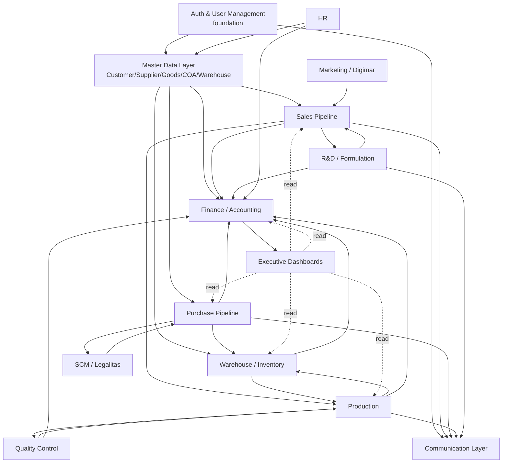

# NEX ERP — Master Specification (Actor-Focused)

> **Status**: PROVISIONAL — Phase P01 business decisions resolved; contract certification in progress
> **Version**: 1.1 — 2026-09-17
> **Project**: NEX ERP — replacement for legacy `code.gserp.id` (CodeIgniter 3 / PHP / MySQL)
> **Stack**: NestJS (backend) + Next.js (frontend) + Prisma + PostgreSQL 15
> **Target deployment**: `nexerp.id` on VPS Biznet `103.93.134.215`
> **Authoritative for**: scope, modules, actors, glossary, global principles, dependencies, build order.
> **Detailed in**: the canonical contract directory in §9.2. Legacy and raw documents are provenance only.

---

## Table of Contents

1. [Scope](#1-scope)
2. [Modules (high-level)](#2-modules-high-level)
3. [Actors (Roles)](#3-actors-roles)
4. [Glossary](#4-glossary)
5. [Global Principles (LOCKED)](#5-global-principles-locked)
6. [Module Cross-Dependencies](#6-module-cross-dependencies)
7. [Module Implementation Order](#7-module-implementation-order)
8. [Out-of-Scope (Explicit)](#8-out-of-scope-explicit)
9. [Authority, Governance, and Contract Directory](#9-authority-governance-and-contract-directory)

---

## 1. Scope

### 1.1 In Scope

NEX ERP delivers 9 ERP domains covering the full lifecycle of a contract-manufacturing cosmetics business (sales → purchasing → production → delivery → accounting), plus cross-cutting layers for dashboards, communication, and KPI tracking.

| # | Domain | Why it is in scope |
|---|--------|---------------------|
| 1 | **Sales Pipeline** | Core revenue; BusDev-facing flow with cart pattern (DEC-015) |
| 2 | **Purchase Pipeline** | Inbound goods; SCM-facing flow with PO → GR → Invoice → Payment |
| 3 | **Production** | Batch Record → Schedule → Mixing/Filling/Packaging → Delivery |
| 4 | **R&D / Formulation** | Sample brief → Formulation → Approval → Lock (FPR, FKKP, BPOM compliance) |
| 5 | **Warehouse / Inventory** | Stock movements, multi-warehouse, Bagus/Reject/Free pillars |
| 6 | **Finance / Accounting** | GL, AR/AP, reports, auto-journal posting (LOCKED principle) |
| 7 | **HR** | Employees, contracts, and event-derived per-person KPI (MVP); payroll expansion remains later phase |
| 8 | **Marketing / Digimar** | Campaigns, leads intake, social metrics (lower priority) |
| 9 | **SCM / Legalitas** | Procurement compliance, BPOM tracking, HKI, MoU |

**Plus cross-cutting**:
- 13 dashboards (per `_SSOT_KPI_BENCHMARK.md` §11)
- Communication Protocol (notes + document transfer status + @mention tags + cross-reference comments — DEC-004)
- KPI tracking (benchmark organisasi + scorecard per orang yang dihitung dari event operasional)
- Auth & RBAC (16 legacy roles migrated, 77 permission slugs preserved — DEC-024)

### 1.2 Out of Scope (Phase 2 / Not built)

- **External customer chat** — customer-facing WA stays as the channel of choice; NEX does NOT include a public chat widget.
- **Tax automation & e-Faktur** — explicitly skipped per `REQUIREMENT.md §12`.
- **Client Escrow / Pass-Through Disbursement** — Phase 2 candidate.
- **Fixed Assets full lifecycle** (asset register, depreciation, disposal) — Phase 2 candidate (design exists, deferred).
- **Stock-Intelligence module** — REMOVED per `DEC-007`.
- **External payment gateway** — Phase 2.
- **Mobile app** — Phase 2 (web-responsive only for MVP).
- **AI / LLM integration** — out of project; legacy mentions it as separate initiative.

### 1.3 Phase-2 Candidate Set (31 Expansion Features)

Per `NEX_ERP_LIVE_AUDIT_AND_PARITY_REFERENCE.md`, 31 expansion screens beyond the 144 parity baseline. Examples include:

- Fixed Asset lifecycle screens (Asset Register, Depreciation Schedule, Asset Transfer/Disposal)
- Bank Reconciliation with full filters
- AP Aging / AR Aging reports with H-3 / H-7 coloring
- Client Escrow Ledger
- Cost Allocation Setup / Job Order Costing
- Budget Entry / Budget vs Actual
- Cash Flow Statement
- Adjustment Journal
- Tax Transactions (PPh 21 / PPh 23 — display only, no automation)
- Compliance / Intangible Asset (BPOM / Halal / ISO amortization)
- Closing Checklist & Period Lock
- Laporan Cost Variance / Product-Customer Profitability
- Report Penerimaan Barang

> The provenance catalog contained 176 screens; the canonical screen count is generated by `scripts/ssot/validate_ssot.js` (179 as of 2026-09-17). **MVP target: 144 parity screens + the 9 domains above. The 31 expansion screens are Phase 2.**

### 1.4 Migration Baseline

| Metric | Value | Source |
|--------|-------|--------|
| Legacy platform | `code.gserp.id` (CodeIgniter 3 / PHP / MySQL) | DEC-010 |
| Live operational baseline | `kil.gserp.id` | DEC-010 |
| Legacy users | 45 | `_crawl/auth/users_extracted.json` |
| Legacy roles | 16 (one ORPHAN, will be deleted — DEC-023) | `_SSOT_AUTH.md §5.2` |
| Legacy permission slugs | 77 (preserved verbatim — DEC-024) | `_SSOT_AUTH.md §5.3` |
| Parity screens | 144 baseline + 1 defect | `NEX_ERP_LIVE_AUDIT_AND_PARITY_REFERENCE.md` |
| Gap to target catalog | 18.18% (32 screens, mostly 31 expansion + 1 defect) | DEC-010 |
| Historical source catalog | 176 screens | `NEX_ERP_SCREEN_AND_API_CATALOG.json` (provenance) |
| Canonical screen contract | 179 screens | generated from `06_SCREEN_CONTRACT.json` on 2026-09-17 |

### 1.5 Requirements Added by User Decision (2026-09-17)

| ID | Requirement | Acceptance anchor |
|---|---|---|
| REQ-035 | KPI per orang dihitung dari event operasional dan menyimpan evidence yang dapat diaudit; skor manual dilarang. | BUS-RULE-072, BUS-RULE-090, BUS-RULE-106, SCR-179 |
| REQ-036 | Karyawan multi-role dinilai per peran dengan assignment effective-dated; bobot aktif per periode harus berjumlah 100%. | BUS-RULE-074, `EmployeeRoleAssignment` |
| REQ-037 | Notes, comments, attachments, status history, watch, dan `@mention` tersedia sebagai communication protocol lintas entity dengan parent ACL. | BUS-RULE-091..095, generic entity communication APIs |

---

## 2. Modules (high-level)

### 2.1 Module Summary Table

| # | Module | Entity count (est.) | Pipeline / State Machine | Key dependencies | # Screens (from catalog) |
|---|--------|---------------------|---------------------------|------------------|--------------------------|
| 1 | **Auth & User Management** | 6 (User, Role, Permission, Session, MFA, AuditLog) | n/a (cross-cutting) | none (foundation) | 8 (Master Pengguna subset) |
| 2 | **Sales Pipeline** | 12 (Lead, Sample, SO, Invoice, Payment, Delivery, Return, Client) | Leads → Sample → SO → Invoice → Payment → Delivery | Master Data (Customer, Goods), Finance, Production | 28 |
| 3 | **Purchase Pipeline** | 10 (Vendor, PR, PO, GR, Invoice, Payment, Return) | PR → PO → GR → Invoice → Payment | Master Data (Supplier, Goods), Warehouse, Finance | 18 |
| 4 | **Production** | 9 (BatchRecord, Schedule, MixingRun, FillingRun, PackagingRun, Delivery, OEE) | BR → Schedule → Mixing → Filling → Packaging → Delivery | Sales (output), R&D (formula), Warehouse | 22 |
| 5 | **R&D / Formulation** | 7 (SampleBrief, Formula, Revision, Approval, Lock, BOM) | Sample brief → Formula (Rev 1-N) → Approval → Lock | Sales (sample request), BusDev | 12 |
| 6 | **Warehouse / Inventory** | 8 (Goods, Warehouse, StockMovement, Adjustment, Opname, Transfer) | Inbound (Bagus/Reject/Free) → Stock → Outbound | All transactional modules | 6 + shared stock endpoints |
| 7 | **Finance / Accounting** | 14 (COA, Journal, Invoice AR, Invoice AP, Payment, Bank, Tax, Asset, Report) | Doc → Journal → Post → Report | ALL transactional modules (auto-journal principle) | 56 |
| 8 | **HR** | 8 (Employee, Contract, Performance, Leave, Payroll base) | Employee → Contract → Performance | Master Data (Users) | 5 (Phase 2) |
| 9 | **Marketing / Digimar** | 6 (Campaign, Lead Source, Content, AdsDaily, SocialMetric) | Campaign → Ad → Lead → Hand-off to BusDev | BusDev (lead handoff) | 5 (lower priority) |
| 10 | **SCM / Legalitas** | 7 (Procurement, BPOM, HKI, MoU, Compliance, Sertifikasi) | Procurement → Compliance → Expiry tracking | Purchase, QC | 7 (Phase 2 priority) |
| — | **Executive Dashboards** | 13 dashboards (read-only aggregate) | n/a | All modules | 13 |

> **Note**: Modules 8, 9, 10 are listed as 3 of the 9 in-scope ERP domains but are lower implementation priority. See §7 build order.

### 2.2 Cross-cutting Foundations

These are not separate modules but foundational layers every module depends on:

- **Master Data Layer** — Customer, Supplier, Goods (Barang), Warehouse, COA, Bank Account, Category tables, Cost Allocation Rules, Asset Register.
- **Communication Layer** — Notes, Document Transfer Status, @mention tags, cross-reference comments (DEC-004).
- **Notification Center** — sidebar badge polling (legacy pattern preserved).
- **Audit Log** — every state change writes to audit BEFORE ack (LOCKED principle).
- **Format Kode Universal** — auto-generated codes per `DEC-020` / REQUIREMENT Poin 64-65.

### 2.3 Module Detail Anchors

| Module | Detailed in |
|---|---|
| Finance (deep) | `NEX_FINANCE_FINAL_SPEC.md` (59KB, 11 sections + 4 appendices) |
| Sales / Purchase / Production / R&D / Warehouse | `NEX_ERP_MASTER_SPECIFICATION.md` BAGIAN II (MOD-01 to MOD-07) + §6 Alur Makro |
| Auth & RBAC | `_SSOT_AUTH.md` |
| Communication Protocol | `_SSOT_COMMUNICATION.md` |
| KPI & Benchmarks | `_SSOT_KPI_BENCHMARK.md` |
| Quality Control & Compliance | Master Spec MOD-07 + Checklist 17-stage |

---

## 3. Actors (Roles)

The actor model is **16 legacy roles + 2 NEX cross-cutting roles** (Executive, Auditor) for a total of 18 named roles. Legacy role IDs (1-16) are preserved as `Role.legacyId` / `User.legacyRoleId` for traceability (DEC-025).

### 3.1 Role Matrix

| # | Role Name | Division | Users (legacy) | Key Responsibility | Legacy ID |
|---|-----------|----------|----------------|--------------------|-----------|
| 1 | **Super Admin** | Cross-cutting | (NEX new) | All-permission root; only NEX Super Admin can manage roles | (new) |
| 2 | **Administrator** | Cross-cutting | 4 | Operational admin (no role-management access) | 1 |
| 3 | **HR Admin** | HR | 1 | Manage HR master data, employees, contracts | 2 |
| 4 | **HR Staff** | HR | (split from HR Admin) | Day-to-day HR data entry | (sub of 2) |
| 5 | **Purchasing Admin** (SCM Admin) | SCM | 1 | Manage vendors, approve PO high-value | 4 |
| 6 | **Purchasing Staff** | SCM | (sub) | PR/PO entry, GR recording | (sub of 4) |
| 7 | **Warehouse Admin** | Warehouse | 3 | Manage warehouses, stock movement approval | 5 |
| 8 | **Warehouse Staff** | Warehouse | (sub) | GR, opname, adjustment | (sub of 5) |
| 9 | **BusDev Manager (Head Business Development)** | BusDev | 1 | Lead generation strategy, team oversight | 6 |
| 10 | **BusDev Admin** | BusDev | (new) | Full BusDev operational access | (new) |
| 11 | **BusDev Staff** | BusDev | 13 | Lead intake, sample request, SO entry | 7 |
| 12 | **RnD Manager (Head Research and Development)** | R&D | 1 | Formula approval authority, team oversight | 8 |
| 13 | **RnD Chemist** | R&D | 6 | Formulation, sample creation, revision handling | 9 |
| 14 | **Production Admin** | Production | (new) | Schedule all stages, operator assignment | 17 |
| 15 | **Production Operator (Mixing)** | Production | (split from orphan) | Mixing-run execution | 10 (orphan cleaned — DEC-023) |
| 16 | **Production Operator (Filling)** | Production | (new split) | Filling-run execution | (sub of 17) |
| 17 | **Production Operator (Packaging)** | Production | 2 | Packaging-run execution | 11 |
| 18 | **Apoteker Penanggung Jawab** | Quality / Regulatory | 1 | Formula approval for cosmetic compliance | 12 |
| 19 | **Finance Admin** | Finance | (new) | Full Finance operational access | (new) |
| 20 | **Finance Manager** | Finance | 5 (split) | Approval authority for payments > threshold | 13 (shared) |
| 21 | **Finance Staff** | Finance | (sub) | Journal entry, AR/AP, reconciliation | (sub of 13) |
| 22 | **Digital Marketing Admin** | Marketing | 1 | Campaign management, ads budget | 14 |
| 23 | **Digital Marketing Staff** | Marketing | (sub) | Daily ads input, content calendar | (sub of 14) |
| 24 | **Legalitas Admin** | Legalitas | (new) | BPOM/HKI/MoU tracking, expiry alerts | (new) |
| 25 | **Legalitas Staff** | Legalitas | (sub) | Document upload, status update | (sub of new) |
| — | **Executive** | Cross-cutting | (NEX new) | Read-only all modules + dashboards | (new) |
| — | **Auditor** | Cross-cutting | (NEX new) | Read-only all + audit log access | (new) |
| — | **Combined: BusDev + HRD** | Cross-divisional | 1 | Legacy dual-role (preserved as-is) | 15 |
| — | **Combined: BusDev + Purchasing** | Cross-divisional | 1 | Legacy dual-role (preserved as-is) | 16 |

**Role counts**:
- 25 distinct named roles in NEX
- 16 legacy IDs preserved for migration traceability
- 1 ORPHAN role (legacy ID 10, "Production Mixing & Filling" with 0 users) — to be DELETED before migration per DEC-023

### 3.2 Role Inheritance Tree

```
Super Admin (all)
├── Administrator (all except role-management)
├── Per-Division Roles:
│   ├── HR Admin / HR Staff
│   ├── Purchasing (SCM) Admin / Staff
│   ├── Warehouse Admin / Staff
│   ├── BusDev Admin / Staff / Manager
│   ├── RnD Admin / Chemist / Manager
│   ├── Production Admin / Operator (per stage: Mixing/Filling/Packaging)
│   ├── Finance Admin / Staff / Manager
│   ├── Digital Marketing Admin / Staff
│   └── Legalitas Admin / Staff
├── Cross-cutting:
│   ├── Executive (read-only all)
│   └── Auditor (read-only all + audit log access)
└── Legacy cross-divisional: BusDev+HRD, BusDev+Purchasing (preserved)
```

### 3.3 Actor Perspective Summary

| Actor | Primary screens | What they care about |
|---|---|---|
| **BusDev Staff** | Leads, Client (Sample/Produksi/RO/Lost), SO, DP Penjualan | Lead conversion, sample approval rate, repeat order |
| **RnD Chemist** | Sample Brief, Formulasi, Adjustment, Kelola Formulasi | FPR (First Pass Right), revision count |
| **Production Operator** | Batch Record, Jadwal Mixing/Filling/Packaging, Produksi runs | OEE, OTD, batch success rate |
| **QC (Apoteker)** | Checklist 17-stage, Checklist Progress | Defect rate, BPOM compliance |
| **Warehouse Staff** | Pembelian Masuk, Transfer Barang, Stok Opname | Stock accuracy, reject rate |
| **Finance Staff** | Jurnal Umum, AR/AP Aging, Bank Rec | Period close, journal accuracy |
| **Finance Manager** | Approval queues, Fund Request, Payment approval | Cash flow, AR/AP aging > 30 days |
| **Purchasing Staff** | PR, PO, Pembelian, Retur | OTD (on-time delivery), PO completion |
| **HR Staff** | Employees, Contracts, Performance | Leave balance, contract expiry |
| **Executive** | 13 dashboards | Aggregate KPI vs benchmark |
| **Auditor** | All modules (read-only) + audit log | Compliance, change history |

---

## 4. Glossary

Business terms in **Indonesian + English**, sorted alphabetically by English term. Cross-references to `_SSOT_AUTH.md`, `NEX_FINANCE_FINAL_SPEC.md`, and `REQUIREMENT.md`.

| EN | ID | Definition |
|---|---|---|
| **Accounts Payable (AP)** | AP / Hutang | Amount owed by the company to suppliers for goods/services received. |
| **Accounts Receivable (AR)** | AR / Piutang | Amount owed to the company by customers for goods/services delivered. |
| **Advance (DP / Down Payment)** | Uang Muka | Payment received (DP Penjualan) or paid (DP Pembelian) before delivery. |
| **Amortization** | Amortisasi | Systematic allocation of intangible asset cost (BPOM, Halal, ISO certifications) over useful life. |
| **AP Aging** | Aging Hutang | Report showing unpaid supplier invoices bucketed by age (H-3, H-7, > jatuh tempo). |
| **AR Aging** | Aging Piutang | Report showing unpaid customer invoices bucketed by age. |
| **Asset Register** | Daftar Aset | Master list of fixed assets with acquisition cost, depreciation, book value. |
| **Badan Pengawas Obat dan Makanan** | BPOM | Indonesian FDA — regulatory body for cosmetics, drugs, food. |
| **Bagus / Reject / Free** | Tiga Pilar Gudang | Three stock quality pillars: Good / Defective / Free-issue goods. (Per `NEX_ERP_MASTER_SPECIFICATION.md §3`.) |
| **Bank Reconciliation** | Rekonsiliasi Bank | Matching bank statement transactions against internal GL bank account. |
| **Batch Record (BR)** | Catatan Batch | Documented evidence of one production batch (mixing → filling → packaging). |
| **Bill of Materials (BOM)** | Daftar Bahan | List of raw materials + quantities needed per finished product. |
| **Bridge Field** | `sales_details_id` | Cross-pipeline connector linking Sales → Production → Delivery. (DEC-017) |
| **Budget vs Actual** | Anggaran vs Realisasi | Variance report comparing planned vs actual income/expense. |
| **Cara Pembuatan Kosmetika yang Baik** | CPKB | Indonesian cosmetics GMP standard — required for BPOM compliance. |
| **Cart Pattern** | Pola Cart | Session-backed multi-line item form: `add-cart` → `get-cart` → atomic commit. (DEC-015) |
| **Cash Advance (Fund Request)** | Pengajuan Dana | Internal request for cash before a known expense — multi-tier approval. |
| **Chart of Accounts (COA)** | Bagan Akun | Master chart of GL accounts. Categorization uses COA only (REQUIREMENT §1 Poin 3). |
| **Client Escrow** | Rekening Escrow Klien | Pass-through disbursement ledger for client funds held in trust. (Phase 2.) |
| **Closing Checklist** | Checklist Penutupan | Monthly period-end checklist + period lock to prevent back-dating. |
| **COGS / HPP** | Harga Pokok Penjualan | Cost of goods sold — auto-posted from production completion. |
| **Collection** | Penagihan | Process of pursuing outstanding AR from customers. |
| **Compliance Asset** | Aset Kepatuhan | Intangible asset — BPOM certification, Halal, ISO, etc. |
| **Cost Allocation** | Alokasi Biaya | Overhead distribution rules to batches/products. |
| **Cost Per Lead (CPL)** | Biaya per Leads | Marketing metric — ad spend / leads generated. |
| **Cost Variance** | Selisih Biaya | Difference between standard cost (HPP) and actual production cost. |
| **Cross-Reference Comment** | Komentar Lintas-Referensi | Comment that links to another entity — limited to genuinely related entities. (DEC-013.) |
| **Customer Lifetime Value** | Nilai Seumur Hidup Pelanggan | Predicted revenue from a customer across the relationship. |
| **Delivery Order (DO)** | Surat Jalan | Document accompanying goods shipment. |
| **Depreciation** | Penyusutan | Systematic allocation of tangible asset cost (Inventaris 4y, Motor 4y, Mobil 8y, Bangunan 20y). |
| **Disposal** | Penghapusan Aset | Process of retiring an asset from the books. |
| **Document Transfer Status** | Status Transfer Dokumen | Universal pattern tracking one document handed from one actor to another (e.g., SO → Production → Delivery). (Per `_SSOT_COMMUNICATION.md §3`.) |
| **Drop-ship** | Drop-Ship | Supplier ships directly to customer — uses pass-through ledger. |
| **Dunning Letter** | Surat Penagihan | Formal payment reminder to customer. |
| **e-Faktur** | Faktur Pajak Elektronik | Indonesian electronic tax invoice. (Phase 2 / not built — REQUIREMENT §12.) |
| **Effective Date** | Tanggal Efektif | Date from which a journal entry takes effect. |
| **Executive Dashboard** | Dasbor Eksekutif | Aggregate KPI dashboard for Executive role (read-only all modules). |
| **Expense** | Beban | Cost incurred in operations — auto-journaled to GL. |
| **First Pass Right (FPR)** | Lulus Sempurna | Formula approved without revision. KPI for R&D. |
| **Fixed Asset** | Aset Tetap | Tangible long-term asset (equipment, vehicle, building). |
| **Format Kode Universal** | Universal Code Format | Auto-generated code: `kode-perusahaan-divisi-produk-tanggal-nomor-urut` or compact `produk-tanggal-nomor-urut`. (DEC-020.) |
| **Formula Lock** | Kunci Formula | State after RnD Manager + Apoteker approval — formula is now read-only. |
| **Free Goods** | Barang Gratis | Goods received free from supplier — tracked separately from Bagus / Reject. |
| **Fund Request** | Pengajuan Dana | See Cash Advance. |
| **Goods Receipt (GR)** | Penerimaan Barang | Inbound confirmation of goods from PO — records Bagus / Reject / Free qty. |
| **Goodwill** | Nama Baik | Brand reputation affecting lead conversion. |
| **Halal Certificate** | Sertifikasi Halal | MUI halal certification — intangible asset. |
| **Hak Kekayaan Intelektual (HKI)** | HKI | IP rights — trademark, patent, copyright registered to brand. |
| **Harga Pokok Penjualan (HPP)** | COGS | See COGS / HPP. |
| **In-Process QC** | QC Dalam Proses | Quality check during production (before final release). |
| **Invoice (Purchase)** | Faktur Pembelian | Vendor invoice recording goods/services received. |
| **Invoice (Sales)** | Faktur Penjualan | Customer invoice for goods delivered. |
| **Job Order Costing** | Perhitungan Biaya Job Order | Actual cost rollup per production job — variance from HPP. |
| **Journal Entry** | Jurnal | GL posting — auto-generated by every operational transaction. |
| **Lead** | Prospek | Potential customer in BusDev pipeline. |
| **Lead Conversion Rate** | Tingkat Konversi Lead | BusDev KPI — leads → SO conversion. |
| **Memo Journal** | Jurnal Memo | Adjustment journal with no source transaction (manual correction). |
| **Minimum Order Quantity (MOQ)** | Jumlah Pesanan Minimum | Smallest order quantity per product / per supplier. |
| **Mixing** | Pencampuran | First production stage — combining raw materials per formula. |
| **MoU** | Nota Kesepahaman | Memorandum of Understanding — client contract before final agreement. |
| **Nota Kredit** | Credit Note | Document reversing part of a previous invoice. |
| **Nota Debet** | Debit Note | Document adding charges to a previous invoice. |
| **Notification Center** | Pusat Notifikasi | Sidebar badge polling — legacy pattern preserved. |
| **On-Time Delivery (OTD)** | Ketepatan Waktu Kirim | KPI — % of shipments arriving by promised date. |
| **Opening Balance** | Saldo Awal | GL account balance at period start (migration from legacy). |
| **Overall Equipment Effectiveness (OEE)** | Efektivitas Peralatan Total | KPI — Availability × Performance × Quality. |
| **Overhead Pool** | Pool Biaya Overhead | Group of indirect costs (electricity, QC lab, machine maintenance). |
| **Pass-Through Ledger** | Buku Pembayaran Lewat | Client escrow — funds held in trust, paid out on behalf. |
| **Payment Term** | Termin Pembayaran | Net 30, Net 60, etc. — per customer/supplier master. |
| **Pelunasan** | Settlement | Final payment clearing an invoice (Gate G3 per `§6 Alur Makro`). |
| **Pembelian** | Purchase | Inbound procurement — PR → PO → GR → Invoice → Payment. |
| **Penjualan** | Sales | Outbound — Leads → Sample → SO → Invoice → Payment. |
| **Penyesuaian Stok** | Stock Adjustment | Manual correction to stock balance (after opname variance). |
| **Period Lock** | Kunci Periode | Closing check — prevents back-dating prior period. |
| **Perpetual Inventory** | Persediaan Perpetual | Real-time stock balance, updated by every GR / Issue. |
| **PPh 21** | Pajak Penghasilan Pasal 21 | Employee income tax — display only, no automation (REQUIREMENT §4 Poin 3). |
| **PPh 23** | Pajak Penghasilan Pasal 23 | Withholding tax on services — display only. |
| **Pra Produksi** | Pre-Production | Stage covering Batch Record, Formula lock, Design approval. |
| **Production Order** | Perintah Produksi | See Work Order. |
| **Prospect** | Prospek | See Lead. |
| **Purchase Order (PO)** | Pesanan Pembelian | Order to supplier — date is read-only auto-today. (REQUIREMENT §13.) |
| **Purchase Request (PR)** | Permintaan Pembelian | Internal request for goods needed. |
| **QC Pass** | Lulus QC | Release certificate from QC — required before delivery. |
| **Quality Control (QC)** | Pengendalian Mutu | Process ensuring product meets spec — CPKB-aligned. |
| **Quotation** | Penawaran Harga | Price proposal sent to prospect before SO. |
| **Real Stok** | Stok Riil | Actual physical stock — replaces legacy "kondisi bagus + cacat" columns. (REQUIREMENT §13 Poin 56.) |
| **Repeat Order (RO)** | Pesanan Berulang | Returning customer placing another SO. |
| **Retur Pembelian** | Purchase Return | Goods returned to supplier. |
| **Retur Penjualan** | Sales Return | Goods returned from customer. |
| **Reverse Logistics** | Logistik Balik | Process handling returns — Return → Approval → Return In. |
| **Role-Based Access Control (RBAC)** | Kontrol Akses Berbasis Peran | Permission check via role + permission slug. (77 slugs preserved — DEC-024.) |
| **Sales Order (SO)** | Pesanan Penjualan | Confirmed customer order — Sales pipeline output. |
| **Sample** | Sampel | Product trial given to prospect. Has lifecycle: Pending → Approved → Paid. |
| **Sample Fee** | Biaya Sampel | Charge for sample creation — Gate G1 verification. |
| **Satuan** | UoM | Unit of Measure (pcs, kg, liter, etc.). |
| **Schedule (Produksi)** | Jadwal Produksi | Production calendar across Mixing / Filling / Packaging. |
| **Single Source of Truth (SSOT)** | Sumber Kebenaran Tunggal | Documentation tier — `docs/legacy-erp/_SSOT_*.md`. |
| **Soft Delete** | Hapus Lunak | Mark `deletedAt` timestamp; never hard delete (LOCKED principle). |
| **SO Line** | Baris SO | One line item inside a Sales Order — connects to Goods + Qty + Price. |
| **Stock Opname** | Opname | Periodic physical count comparing system stock vs actual. |
| **Stock Valuation** | Valuasi Stok | Monetary value of stock on hand (FIFO / Average). |
| **Sub-Contract** | Sub-Kontrak | Outsourced production run — uses pass-through ledger. |
| **Supplier** | Pemasok / Vendor | Provider of raw materials or services. |
| **Surat Jalan (DO)** | Delivery Order | See Delivery Order. |
| **Target Penjualan** | Sales Target | Per-period revenue target per BusDev / region. |
| **Tata Letak** | Layout | Display / form layout — DNA Design System. |
| **Tax Setup** | Pengaturan Pajak | Master rates (PPN, PPh) — display only, no automation. |
| **Three-Way Match** | Pencocokan 3-Arah | PO ↔ GR ↔ Invoice — accuracy HIDDEN in NEX per REQUIREMENT §2 Poin 5. |
| **TIN** | NPWP | Indonesian tax ID — 15-digit for companies, varies for individuals. |
| **Top Metric Cards** | Kartu Metrik Atas | KPI summary cards at top of list pages. |
| **Trial Balance** | Neraca Saldo | GL report — sum of all account balances. |
| **Universal Code Engine** | Mesin Kode Universal | Backend generator producing auto-codes per Format Kode Universal. |
| **Useful Life** | Masa Manfaat | Asset depreciation period — Inventaris 4y, Motor 4y, Mobil 8y, Bangunan 20y. |
| **Vendor** | Pemasok | See Supplier. |
| **Work Order (WO)** | Surat Perintah Kerja | Production run order per batch — connects to Batch Record. |
| **Year-to-Date (YTD)** | Tahun ke Tanggal | Cumulative from start of fiscal year. |

**Total: 80+ glossary terms** covering all Indonesian acronyms + English equivalents used in NEX ERP.

---

## 5. Global Principles (LOCKED)

Every implementation contract MUST enforce these. Each principle is **enforceable in code review**.

### 5.1 Process & Workflow Principles

1. **Doc-first workflow (DEC-002)** — every code change starts with a spec update in `docs/legacy-erp/` or `_IMPLEMENTATION_CONTRACTS/`. PR without spec diff is rejected.
2. **Single Source of Truth per spec** — `docs/legacy-erp/_SSOT_*.md` for functionality; `docs/legacy-erp/_PROCESS_*.md` for process; `_SSOT_FINAL.md` is the root index.
3. **Lock before build** — every LOCKED decision (`_PROCESS_DECISIONS_LOG.md`) is binding; deviation requires a new decision ID with rationale.
4. **Requirement source = `REQUIREMENT.md`** (DEC-009) — Upii's 34-point list ALWAYS WINS over default behavior.
5. **Live baseline reference = `kil.gserp.id`** (DEC-010) — operational reality is the source of truth for parity.
6. **Auth data extraction = `_crawl/auth/`** (DEC-011) — 45 users × 16 roles × 77 permissions snapshot 2026-09-16.

### 5.2 Architecture & Code Principles

7. **Audit-first writes** — every state change writes to audit log BEFORE ack to user. No silent mutations.
8. **Soft-delete only** — never hard delete; every entity has `deletedAt: DateTime?`. Hard delete requires DB admin + ticket.
9. **Single source of truth per entity** — one module owns each entity's write. Cross-module reads via API only.
10. **Multi-tenant ready** — every entity has `organizationId` (UUID). Tenant isolation enforced at Prisma middleware.
11. **Idempotent writes** — same request twice = same result. Use Idempotency-Key header on POST / POST-batch endpoints.
12. **Cart pattern preserved (DEC-015)** — multi-line item forms use session-backed cart (`/add-cart`, `/get-cart`, `/delete-cart`, `/clear-cart`). Single atomic commit at end. Backend: Redis-backed.
13. **Child entity creation via parent (DEC-016)** — no standalone `/create` URL for child entities. Always a button on parent detail view.
14. **Bridge field `sales_details_id` (DEC-017)** — connects Sales → Production → Delivery. Mandatory on every Sales-derived record.
15. **Auto-journal (Finance LOCKED)** — every operational transaction (SO, PO, GR, Payment, etc.) auto-posts to GL via COA trigger rules. No manual journal for transactional events.
16. **Universal Code Engine (DEC-020)** — all auto-generated codes follow Format Kode Universal. Backend generator shared across modules. Global sequence per code type, never resets.

### 5.3 Data & Schema Principles

17. **UUID primary keys** — all new entities use `id: String @id @default(uuid())`. Legacy IDs preserved in `legacyId` columns for traceability (DEC-025).
18. **TypeScript strict mode** — `"strict": true` in tsconfig. No `any` in shared code (test files exempt).
19. **Prisma relations only** — no manual foreign keys in SQL. All relations declared in `schema.prisma`.
20. **Soft references via legacyId** — never reference legacy numeric IDs directly. Always via the `legacyId` field with explicit migration map.
21. **Permission slugs preserved (DEC-024)** — 77 legacy permission slugs are canonical. New permissions add to the list, never rename existing ones.

### 5.4 UX & API Principles

22. **Backwards-compatible URL patterns** — legacy URLs preserved where possible (e.g., `/sales/{id}/print`, `/master/goods-manage`). New namespace: `/master/*`, `/bussdev/*`, `/scm/*`, `/finance/*`, `/production/*` per `NEX_ERP_LIVE_AUDIT_AND_PARITY_REFERENCE.md §5`.
23. **Top-metric cards + tabbed filters (REQUIREMENT §2 Poin 6)** — every list page shows summary cards above, tab filters below matching card order.
24. **Autocomplete on every input (REQUIREMENT §9)** — all form fields use search/autocomplete mode, not free-typing (except numeric/date fields).
25. **Period filter on every menu (REQUIREMENT §9 Poin 2)** — every list page exposes a date-range filter.
26. **i18n ready** — Indonesian first (`id-ID`), English second. Currency: IDR only for MVP.
27. **Currency: IDR only (MVP)** — multi-currency Phase 2. Display `Rp 1.234.567` formatting (dot-thousands, comma-decimal).
28. **Timezone: Asia/Jakarta (WIB)** — all timestamps stored as UTC, displayed as WIB. See `09_NON_FUNCTIONAL_CONTRACT.md`.

### 5.5 Security & Compliance Principles

29. **Bcrypt(12) password hashing** — all new users hashed with bcrypt cost 12. Legacy users force-reset on first login (DEC-022).
30. **Fresh reCAPTCHA key pair for `nexerp.id`** (DEC-021) — do NOT reuse legacy site key. Server-side secret only.
31. **JWT + refresh token (DEC-003)** — access token 15 min TTL, refresh token 7 days, stored in HttpOnly cookie. Token rotation on refresh.
32. **TOTP MFA optional** — user can enroll; admin can enforce per role. (See `_SSOT_AUTH.md §7`.)
33. **Cross-device logout** — for security incidents, force-logout all sessions for a user. (See `_SSOT_AUTH.md §6.2`.)
34. **Orphan role cleanup (DEC-023)** — Role 10 (Production Mixing & Filling, 0 users) deleted before migration. No NEX equivalent.
35. **Per-person KPI is event-derived** — KPI individu wajib dihitung dari event operasional yang menyimpan actor/evidence; angka performa tidak boleh diketik manual. Keputusan pengguna 2026-09-17 menggantikan pembatasan historis `DEC-005`.

### 5.6 Communication & Notification Principles

36. **No real-time chat (DEC-004)** — no chat widget in NEX. External WA stays the channel for external customers. Internal communication uses Notes + Document Transfer Status + @mentions + Cross-Reference Comments.
37. **Tag syntax: `@username` (DEC-012)** — tag a user to notify. Resolution: User lookup, fuzzy match. Visibility: same as comment's parent entity ACL.
38. **Cross-reference comments limited (DEC-013)** — comments may link to another entity ONLY if related. UI must discourage random linking.
39. **Sidebar badge polling (legacy pattern preserved)** — notification count polled every 30s. No WebSocket dependency in MVP.
40. **Watch / Subscribe** — users can opt-in to entity-level notifications beyond their role ACL. (See `_SSOT_COMMUNICATION.md §7`.)
40a. **Notes on every governed business entity** — detail transaksi/dokumen menyediakan Notes, Comments, Attachments, Status History, Watch, dan `@mention` sesuai ACL entity induk. Penyimpanan note/comment, Tag mention, Notification, dan outbox event harus atomik.

### 5.7 Migration & Shutdown Principles

41. **Old ERP shutdown after parallel run** — `code.gserp.id` stays live 2-4 weeks during parallel run (DEC-006). Cutover: P7 phase.
42. **ETL for parity screens only** — do NOT migrate data for the 31 Phase-2 expansion screens; they have no legacy counterpart.
43. **Rehash legacy passwords to bcrypt(12)** on import (DEC-022). Force password reset on first login.
44. **Preserve legacy IDs for analytics** — `User.legacyId`, `Role.legacyId`, `User.legacyRoleId`. Reports can reference old system.
45. **Stock-Intelligence module REMOVED (DEC-007)** — never rebuild it. Use built-in stock reports + Stock Opname.

### 5.8 Financial Principles

46. **Three-pillar gudang (Master Spec §3)** — every stock receipt records qty Bagus + Reject + Free separately. Reject is NEVER paid to supplier.
47. **Three-tier approval (Master Spec §2)** — Fund Request: Staff → Head → Accounting → Director; Head-submitter: Head → Accounting → Director.
48. **PO discount in Rupiah, not percent** (REQUIREMENT §13 Poin 52) — flat nominal discount; subtracted from ongkir.
49. **Tanggal PO read-only, auto-today** (REQUIREMENT §13 Poin 64) — PO date always today, immutable.
50. **Tanggal invoice can be custom** (REQUIREMENT §2 Poin 1) — invoice date is user-editable (departure from PO date behavior).
51. **Auto-posting parallel routes in Finance (DEC-018)** — `jurnal-umum` and `general-journal` both exist as parallel routes during migration. Phase 7 picks one.
52. **No finance mock fallback (DEC-019)** — production build does NOT silently fall back to mock data. Real backend only.

---

## 6. Module Cross-Dependencies

### 6.1 Dependency Diagram



### 6.2 Dependency Matrix

| Module | Depends on (reads/writes) | Read by |
|---|---|---|
| Auth | none | ALL modules |
| Master Data | Auth | Sales, Purchase, Production, Warehouse, Finance, HR |
| Sales | Master Data, Auth, R&D (sample), Production (via bridge) | Finance (auto-journal), Dashboards, BusDev roles |
| Purchase | Master Data, Auth, Warehouse (GR), Finance | Finance, SCM, Dashboards |
| Production | Sales (output), R&D (formula), Warehouse (stock), Auth | Finance (HPP), QC, Warehouse, Dashboards |
| R&D | Sales (sample request), Auth, Master (Goods) | Production, Finance, QC |
| Warehouse | Master (Goods, Warehouse), Purchase (GR), Production (issue) | Finance, Dashboards |
| Finance | ALL transactional modules (auto-journal consumer) | Dashboards, Executive |
| HR | Master (Users), Auth | Finance (payroll base), Dashboards |
| Marketing | Auth | Sales (lead handoff), Dashboards |
| SCM/Legalitas | Purchase, QC, Master | Dashboards, Compliance alerts |
| Communication | Auth | All modules (notes / comments / tags) |
| Dashboards | ALL modules (read-only aggregate) | Executive, Auditor |

### 6.3 Critical Edge Cases

- **Sales → Production bridge**: a Sales Order's `sales_details_id` is the ONLY field Production reads. No reverse lookup (Production does not know about Sales).
- **Finance consumes everyone**: Finance is the ultimate sink — every transactional event must emit a `JournalPostingRequested` event for the COA trigger engine.
- **Warehouse bidirectional**: Warehouse reads Purchase (GR) and writes back Stock; reads Production (issue) and writes back Stock. Always within same transaction.
- **Master Data write ownership**: Master Data owns writes to Customer/Supplier/Goods/Warehouse/COA. Other modules only READ.

---

## 7. Module Implementation Order

Build order respects both **dependency graph** (must come after dependencies) and **business priority** (revenue-generating modules first).

### 7.1 Recommended Build Order

| # | Module | Phase | Rationale |
|---|---|---|---|
| 1 | **Auth & User Management** | P1 | Foundation — every other module needs `User` + RBAC |
| 2 | **Master Data Layer** | P1 | Customer/Supplier/Goods/Warehouse/COA — every transaction needs these |
| 3 | **Sales Pipeline** | P2 | Revenue-generating; uses Master Data + Finance auto-journal |
| 4 | **Purchase Pipeline** | P2 | Inbound goods; uses Master Data + Warehouse + Finance |
| 5 | **Production** | P3 | Reads Sales output + R&D formula; writes to Warehouse + Finance |
| 6 | **R&D / Formulation** | P3 | Sample brief → Formula → Approval → Lock; precedes Production runs |
| 7 | **Warehouse / Inventory** | P3 | Required by Purchase + Production; stock movements + Bagus/Reject/Free |
| 8 | **Finance / Accounting** | P4 | Consumes all transactional data; auto-journal; reports; AR/AP aging |
| 9 | **Dashboards & Reporting** | P4 | Aggregates all modules — 13 dashboards per `_SSOT_KPI_BENCHMARK.md §11` |
| 10 | **HR** | P4/P5 | Employee + Contract + per-person KPI are MVP; payroll expansion follows |
| 11 | **Marketing / Digimar** | P6 (lower priority) | Campaigns + ads daily; lead handoff to BusDev only |
| 12 | **SCM / Legalitas** | P5 (Phase 2 priority) | BPOM/HKI/MoU tracking — driven by compliance need |

### 7.2 Migration Phases (DEC-006, SSOT_FINAL §8)

| Phase | Duration | Deliverable |
|---|---|---|
| **P1: Backend foundation** | 2 weeks | Prisma schema, JWT auth, RBAC skeleton, base modules |
| **P2: Master data migration** | 2 weeks | Customer, Supplier, Goods, Warehouse, User, Role |
| **P3: Sales + Purchase pipeline** | 3 weeks | SO + PR + PO end-to-end with cart pattern |
| **P4: Production + R&D + Checklist** | 3 weeks | Batch Record → Production → Delivery + 17-stage checklist |
| **P5: Finance + Reports + Dashboards** | 3 weeks | GL, AR/AP, all reports, 13 dashboards with KPI |
| **P6: Migration execution + parallel run** | 4 weeks | ETL from legacy → new, 2-4 weeks parallel, training |
| **P7: Old ERP shutdown** | 1 week | Final cutover |

**Total**: ~16-18 weeks (~4-4.5 months)

### 7.3 Build Order vs Migration Phase Mapping

| Build Order | Module | Migration Phase |
|---|---|---|
| 1 | Auth | P1 |
| 2 | Master Data | P2 |
| 3 | Sales | P3 |
| 4 | Purchase | P3 |
| 5 | Production | P4 |
| 6 | R&D | P4 |
| 7 | Warehouse | P4 (parallel) |
| 8 | Finance | P5 |
| 9 | Dashboards | P5 |
| 10 | HR | P4 for Employee/KPI; P6 for payroll expansion |
| 11 | Marketing | P6 (lower priority) |
| 12 | SCM / Legalitas | P6 (Phase 2 priority) |

---

## 8. Out-of-Scope (Explicit)

This section makes explicit what NEX will NOT build. Future requests to add these items require a new decision ID.

### 8.1 NOT Built in MVP

| Item | Reason | Source |
|---|---|---|
| Real-time chat | User explicit "ga ada chat real time" | DEC-004 |
| Tax automation & e-Faktur | Explicitly skipped | REQUIREMENT §12 |
| Client Escrow / Pass-Through Disbursement | Phase 2 | Master Spec MOD-01 Akuntansi |
| Fixed Asset full lifecycle | Phase 2 (design exists) | Master Spec MOD-01 SCR-024-026 |
| Stock-Intelligence module | REMOVED | DEC-007 |
| External payment gateway | Phase 2 | Implicit |
| Mobile app | Phase 2 (responsive web only) | Implicit |
| AI / LLM integration | Separate project | Legacy mention |

### 8.2 Phase-2 Candidates (Reference)

31 expansion screens from `NEX_ERP_LIVE_AUDIT_AND_PARITY_REFERENCE.md`:
- Fixed Asset: Asset Register, Depreciation Schedule, Asset Transfer / Disposal
- Compliance: Compliance / Intangible Asset
- Bank Reconciliation with full date + COA filters
- AP Aging with H-3 / H-7 coloring + saldo bank
- AR Aging with BusDev widget
- Client Escrow Ledger
- Cost Allocation Setup, Job Order Costing
- Budget Entry, Budget vs Actual
- Cash Flow Statement
- Adjustment Journal
- Tax Transactions (PPh 21, PPh 23 display only)
- Closing Checklist & Period Lock
- Cost Variance, Product / Customer Profitability
- Report Penerimaan Barang
- + 14 others (full list in `NEX_ERP_SCREEN_AND_API_CATALOG.json`)

### 8.3 Pending Decisions (Open — Need User Input)

| ID | Topic | Status |
|---|---|---|
| OD-1 | Session timeout for inactive users (default 30 min?) | RESOLVED — 30 min idle, configurable by security policy; refresh session maximum remains 7 days. |
| OD-2 | Password policy for legacy-imported users (force reset on first login?) | RESOLVED — force reset on first login per DEC-022. |
| OD-3 | Email digest frequency (per-event vs daily?) | RESOLVED — critical per-event; non-critical daily digest. |
| OD-4 | Mobile push notifications (Phase 2?) | RESOLVED — Phase 2; MVP uses in-app + email. |
| OD-5 | External customer communication in feed? | RESOLVED — no; external customer communication remains WA, internal feed only. |
| OD-6 | Note editing history (keep all or last only?) | RESOLVED — current body only; every edit remains in AuditLog. |
| OD-7 | Quarterly benchmark review (manual or automated?) | RESOLVED — manual governance review. |
| OD-8 | Per-division KPI override? | RESOLVED 2026-09-17 — definisi KPI dapat dibedakan per divisi melalui `KpiDefinition.division`; hasil individu tetap event-derived dan tidak menerima input skor manual. |
| OD-9 | Finance parallel routes keep which? | RESOLVED — keep both during migration; canonical route selected at P7 cutover per DEC-018. |

---

## 9. Authority, Governance, and Contract Directory

### 9.1 Canonical subject-based Authority Map

This is the only global authority map. Authority is determined by the subject being changed; no file-wide precedence chain may override the subject owner.

| Subject | Sole canonical owner |
|---|---|
| System scope, terminology, module boundaries, requirement IDs, change governance | `00_MASTER_SPEC.md` |
| Semantic entity meaning and business relationships | `01_DOMAIN_MODEL.md` |
| Physical fields, types, relations, indexes, and database constraints | `schema.prisma` plus migrations |
| Authoritative writer, system of record, delegation, cross-module writes | `02_DATA_OWNERSHIP.yaml` |
| States, transitions, actors, preconditions, forbidden transitions, transition side effects | `03_WORKFLOW_STATE_MACHINE.yaml` |
| Validation, calculations, eligibility, invariants, semantic business constraints | `04_BUSINESS_RULES.md` |
| HTTP methods, paths, request/response schemas, errors, authentication | `05_API_CONTRACT.yaml` |
| Page routes, UI behavior, columns, forms, actions, filters, and API references | `06_SCREEN_CONTRACT.json` |
| Roles, permission slugs, data scopes, action authorization, approval rights | `07_RBAC_MATRIX.yaml` |
| Event names, producers, consumers, payloads, delivery and idempotency | `08_INTEGRATION_EVENT_CONTRACT.yaml` |
| System-wide audit, security, money, time, transaction, concurrency, deletion, backup, logging, and performance constraints | `09_NON_FUNCTIONAL_CONTRACT.md` |
| Coverage and evidence links only | `10_TRACEABILITY_MATRIX.yaml` |

`reference/`, `data/`, `ssot/`, `process/`, `_REVIEW/`, and historical documents are provenance or decision evidence. They may explain why a decision exists, but they do not define current runtime behavior after that behavior is reconciled into its canonical owner.

When evidence conflicts, determine the subject, inspect explicit requirements and locked decision evidence, and update the subject owner. If evidence supports materially different business choices, record a `DECISION_REQUIRED` and keep the affected contract `PROVISIONAL`; never choose by timestamp, document length, implementation behavior, or generic ERP convention.

### 9.2 Canonical Contract Directory

| Contract | Canonical responsibility |
|---|---|
| `00_MASTER_SPEC.md` | Scope, glossary, requirements, governance |
| `01_DOMAIN_MODEL.md` | Semantic domain model |
| `schema.prisma` | Physical persistence |
| `02_DATA_OWNERSHIP.yaml` | Data ownership and mutation authority |
| `03_WORKFLOW_STATE_MACHINE.yaml` | Lifecycles and transitions |
| `04_BUSINESS_RULES.md` | Business logic and invariants |
| `05_API_CONTRACT.yaml` | OpenAPI contract |
| `06_SCREEN_CONTRACT.json` | Screen/UI contract |
| `07_RBAC_MATRIX.yaml` | Access control |
| `08_INTEGRATION_EVENT_CONTRACT.yaml` | Integration events |
| `09_NON_FUNCTIONAL_CONTRACT.md` | Non-functional constraints |
| `10_TRACEABILITY_MATRIX.yaml` | Coverage evidence/index |

### 9.3 Change Governance

A business or system behavior change MUST begin in its owning authoritative contract. Dependent contracts, tests, traceability, generated views, and implementation follow in that order. Code-first changes are permitted only for an emergency hotfix and must be backfilled through the same contract-first process before the incident is closed.

Change lifecycle: `PROPOSED → DECIDED → SPECIFIED → IMPLEMENTED → VERIFIED → ACCEPTED → DEPRECATED`.

Document statuses:

- `DRAFT`: incomplete working material.
- `PROVISIONAL`: usable only with listed limitations or unresolved decisions.
- `LOCKED`: machine-valid, all material references resolve, and no implementation-changing TBD/open decision remains.
- `DEPRECATED`: retained only for history/provenance.
- `GENERATED`: derived artifact; never edited directly.

Generated counts and views must be produced by `scripts/ssot/validate_ssot.js`; manually maintained counts are informational only.

### 9.4 Provenance Directory

The following documents are evidence, not parallel runtime authority. Any behavior needed for implementation must be migrated into the owner listed in §9.1.

| Document | Provenance purpose | Size |
|---|---|---|
| `_SSOT_FINAL.md` | Historical overview/index | 15 KB |
| `_SSOT_AUTH.md` | Authentication, RBAC, MFA, password policy, role migration | 9.5 KB |
| `_SSOT_COMMUNICATION.md` | Notes, document transfer status, @mentions, cross-ref comments | 10 KB |
| `_SSOT_KPI_BENCHMARK.md` | National + global multi-industry KPI benchmarks | 9.1 KB |
| `_PROCESS_DECISIONS_LOG.md` | Decision history; current queue contains 4 implementation-changing blockers | generated size |
| `NEX_ERP_MASTER_SPECIFICATION.md` | Full blueprint — 178 screens, 12 modules, principles | 193 KB |
| `NEX_FINANCE_FINAL_SPEC.md` | Finance module deep dive — 11 sections + 4 appendices | 59 KB |
| `NEX_ERP_LIVE_AUDIT_AND_PARITY_REFERENCE.md` | Official parity reference (98.63% baseline, 18.18% gap) | 12 KB |
| `NEX_ERP_SCREEN_AND_API_CATALOG.json` | Machine-readable catalog (176 screens, 49 endpoints) | 360 KB |
| `API_CONTRACT.yaml` | OpenAPI 3.0 spec | 52 KB |
| `REQUIREMENT.md` | Upii's 34 requirement points (final, no ambiguity) | 10 KB |
| `KPI_REFERENCE.md` | Per-division KPI definitions | 23 KB |
| `LEGACY_ERP_SPEC.md` | Legacy system spec | 33 KB |
| `LEGACY_ERP_AUDIT.md` | Legacy audit findings | 8.6 KB |
| `README.md` | Folder index | 7.7 KB |

External evidence includes:

| Reference | Purpose |
|---|---|
| Legacy `code.gserp.id` (CodeIgniter 3 / PHP / MySQL) | System being replaced |
| Live `kil.gserp.id` | Operational reality baseline (DEC-010) |
| `nexerp.id` (target) | New deployment on VPS Biznet `103.93.134.215` |
| `BPOM` (`pom.go.id`) | Cosmetics regulatory reference |
| `CPKB` (Cara Pembuatan Kosmetika yang Baik) | Indonesian GMP for cosmetics |
| `SNI` (Standar Nasional Indonesia) | Quality benchmarks |
| `IAPI` (Indonesian Institute of Accountants) | Finance benchmarks |
| `Apindo` | HR benchmarks |
| BPS, Kemenperin | National manufacturing KPIs |

---

## Appendix A — Validation Checklist

This document satisfies:

| Check | Status |
|---|---|
| 9 in-scope ERP domains listed | YES |
| All 16+ actor roles defined | YES (25 distinct roles) |
| Glossary with 20+ terms | YES (80+ terms) |
| 10+ global principles | YES (52 principles) |
| Module dependency diagram | YES (Mermaid + matrix) |
| Module implementation order | YES (12-step build + 7 phases) |
| Explicit out-of-scope list | YES |
| All references to SSOT docs cited | YES |
| File in target location | `docs/legacy-erp/_IMPLEMENTATION_CONTRACTS/00_MASTER_SPEC.md` |

---

## Appendix B — Cross-Reference Index

| Reference | Section in this doc |
|---|---|
| DEC-001 (SSOT folder) | §9 References |
| DEC-002 (Doc-first) | §5 Principle 1 |
| DEC-003 (Auth strategy JWT) | §5 Principle 31 |
| DEC-004 (Comm scope, no chat) | §5 Principle 36 |
| DEC-005 (historical KPI scope) | Superseded by user decision 2026-09-17; see §5 Principle 35 |
| DEC-006 (Old ERP shutdown) | §7.2 |
| DEC-007 (Stock intel REMOVED) | §1.2, §5 Principle 45 |
| DEC-008 (Finance SSOT) | §9 References |
| DEC-009 (Requirement source) | §5 Principle 4, §9.4 |
| DEC-010 (Live baseline) | §1.4, §5 Principle 5 |
| DEC-011 (Auth extraction) | §1.4, §5 Principle 6 |
| DEC-012 (Tag user required) | §5 Principle 37 |
| DEC-013 (Cross-ref limited) | §5 Principle 38 |
| DEC-014 (Crawl coverage) | Implicit |
| DEC-015 (Cart pattern) | §5 Principle 12 |
| DEC-016 (Child entity creation) | §5 Principle 13 |
| DEC-017 (`sales_details_id` bridge) | §5 Principle 14 |
| DEC-018 (Finance parallel routes) | §5 Principle 51, §8.3 OD-9 |
| DEC-019 (No finance mock) | §5 Principle 52 |
| DEC-020 (Format Kode Universal) | §5 Principle 16, Glossary "Format Kode Universal" |
| DEC-021 (reCAPTCHA rotation) | §5 Principle 30 |
| DEC-022 (Legacy hash verify) | §5 Principle 29, 43 |
| DEC-023 (Orphan role cleanup) | §3.1, §5 Principle 34 |
| DEC-024 (Permission slug preservation) | §5 Principle 21 |
| DEC-025 (Legacy role ID preservation) | §3.1, §5 Principle 17 |
| DEC-026 (Auth data extraction complete) | §1.4 |

---

*End of `00_MASTER_SPEC.md` — v1.0 LOCKED 2026-09-16*
*Next: review by user; on approval, freeze this version and proceed to module-by-module implementation contracts (01–10).*
