# NEX ERP — Domain Model & Entity Catalog

> **Contract**: `01_DOMAIN_MODEL.md`
> **Version**: 1.0 — 2026-09-16
> **Status**: PROVISIONAL — unresolved material decisions are listed in the certification report.
> **Owner**: Domain Architect | **Reviewer**: Tech Lead + Product Owner (Upii)
> **Sister docs**: `02_MASTER_DATA_CONTRACT.md`, `03_SALES_PIPELINE_CONTRACT.md`, `04_PURCHASE_PIPELINE_CONTRACT.md`, `05_PRODUCTION_RND_CONTRACT.md`, `06_WAREHOUSE_CONTRACT.md`, `07_FINANCE_CONTRACT.md`, `08_HR_CONTRACT.md`, `10_DASHBOARD_REPORTING_CONTRACT.md`

This document defines **all persistent entities** in NEX ERP, their fields, relationships, business rules, indexes, and migration mapping from legacy `kil.gserp.id`. Every other implementation contract (API, RBAC, business rules, workflows, dashboards) references entities by the names declared here. If an entity is not listed here, it does not exist in the model.

**Authority**: owns semantic entity meaning and business relationships per `00_MASTER_SPEC.md §9.1`; `schema.prisma` owns physical persistence.

---

## Table of Contents

1. [Overview](#1-overview)
2. [Entity Catalog (sections 3–12)](#2-entity-catalog)
   - 3. [Auth & User Management](#3-auth--user-management)
   - 4. [Master Data](#4-master-data)
   - 5. [Sales Pipeline](#5-sales-pipeline)
   - 6. [Purchase Pipeline](#6-purchase-pipeline)
   - 7. [Production & R&D](#7-production--rd)
   - 8. [Warehouse / Inventory](#8-warehouse--inventory)
   - 9. [Finance / Accounting](#9-finance--accounting)
   - 10. [Checklist (17-stage QC + Closing)](#10-checklist-17-stage-qc--closing)
   - 11. [HR](#11-hr)
   - 12. [Communication Layer (per-entity)](#12-communication-layer-per-entity)
3. [Relationships (ER Diagram)](#13-relationships-er-diagram)
4. [Indexes & Performance](#14-indexes--performance)
5. [Data Migration Mapping (legacy → NEX)](#15-data-migration-mapping-legacy--nex)
6. [Validation Rules (per entity)](#16-validation-rules-per-entity)
7. [Open Questions](#17-open-questions)
8. [Appendix A — Code Format Reference](#appendix-a--code-format-reference)
9. [Appendix B — Status Machine Summary](#appendix-b--status-machine-summary)

---

## 1. Overview

### 1.1 Total entity count

**100 Prisma models** are currently defined in `schema.prisma`, grouped into **11 generated physical sections**. The count is validated by `scripts/ssot/validate_ssot.js`; new entities require contract-first change governance.

| Section | Entity count | Purpose |
|---|---|---|
| 1. Auth & User | 8 | Organization, auth, RBAC, sessions, audit |
| 2. Master Data | 13 | Division, Customer, Supplier, Goods, Warehouse, COA, Formulation |
| 3. Sales Pipeline | 17 | Lead → Sample → SO → DP → Invoice → Payment → Return |
| 4. Purchase Pipeline | 15 | PR → PO → GR → DP → Invoice → Payment → Return |
| 5. Production & R&D | 12 | Batch Record → Schedule → Mixing/Filling/Packaging → Delivery |
| 6. Warehouse / Inventory | 4 | Movements, Opname, Opname detail, Adjustment |
| 7. Finance / Accounting | 7 | Journal, CashBank, Tax, Asset, Budget, FundRequest |
| 8. Checklist | 4 | 17-stage template + tracking |
| 9. HR & KPI | 6 | Employee, Contract, Performance, effective-dated role assignment, KPI definition/result |
| 10. Communication | 6 | Note, StatusTransition, Tag, Comment, Attachment, Notification |
| 11. Creative / Design & Legalitas Permits | 8 | DesignTask, DesignVersion, DesignFeedback, LegalStaff, HkiRecord, BpomRecord, HalalRecord, LegalTimelineLog |
| **Total** | **100** | Generated from the physical schema |

> **Known gap (not a P08 blocker).** The canonical `schema.prisma` is a **subset projection** of
> the running database: it holds 100 models against 203 in `backend/prisma/schema/`. P08
> canonicalized only the models its acceptance checks depend on. The remainder is recorded as
> backlog per `DEC-2026-09-20-059`; a full canonical↔live reconciliation is a repo-wide job and
> is not owned by any single phase.
>
> **Naming divergence.** The running schema also names two P08 concepts differently from this
> contract: `SampleRequest`/`Formula` (live) vs `SalesSample`/`Formulation` (canonical here).
> `DEC-2026-09-20-060` records the divergence and its resolution direction; the rename is
> deliberately a separate change from the P08 subject-ownership work above.

### 1.2 Naming conventions

| Layer | Convention | Example |
|---|---|---|
| Prisma model | PascalCase singular | `SalesOrder` |
| DB table | snake_case plural via `@@map` | `sales_orders` |
| Column | camelCase | `organizationId`, `createdAt` |
| DB column | snake_case (Prisma maps automatically except FK columns) | `organization_id` |
| Enum value | UPPER_SNAKE | `JASA_MAKLON` |
| Auto-code format | `{PREFIX}-{YYMM}-{XXXX}` (per-month) or `{PREFIX}-{DDMMYYYY}-{XXXX}` (global) | `FJ-2609-0001`, `SO-16092026-0001` |
| Permission slug | kebab-case (preserved verbatim per DEC-024) | `sales-invoice`, `customer-manage` |

### 1.3 Multi-tenant strategy

**Every business entity carries `organizationId`** (UUID, FK to `Organization`). Tenant isolation is enforced at Prisma middleware level (per `09_NON_FUNCTIONAL_CONTRACT.md` §5). The only entities WITHOUT `organizationId` are:
- `Organization` itself (tenant root)
- `Role` (may be system-global or per-org, nullable FK)
- `Permission` (global, kebab-case slugs are canonical)
- `AuditLog`, `ActivityLog` (cross-tenant logs, filtered at query layer)
- `UserSession` (scoped via `userId`, tenant inferred)

### 1.4 Soft-delete strategy

Per `09_NON_FUNCTIONAL_CONTRACT.md` §5:
- Every business entity has `deletedAt: DateTime? @db.Timestamptz`
- Active record default query: `where: { deletedAt: null }` (Prisma middleware auto-applies)
- Admin view with "Show Deleted" toggle (`includeDeleted: true`)
- Undelete within 30 days (set `deletedAt = null`)
- Hard delete requires DBA intervention + change ticket
- Exceptions: `audit_logs`, `activity_logs`, `notifications`, `user_sessions` (TTL cleanup only)
- Cascade rule: soft-deleted parent does NOT auto soft-delete children. Children become "orphaned" — admin reassigns or hard-deletes separately.

### 1.5 UUID primary keys + legacyId traceability

- All new entity PKs: `id: String @id @default(uuid()) @db.Uuid`
- Legacy IDs preserved as `legacyId: Int? @unique` for traceability (DEC-025)
- 45 legacy users, 16 legacy roles, 77 legacy permission slugs all carry `legacyId` or matching slug
- Soft references via `legacyId`, never raw FK to legacy numeric IDs

### 1.6 Audit-first writes

Every state change writes to `audit_logs` BEFORE returning success (NFR §6). The audit row carries `entityType`, `entityId`, `action`, `beforeState`/`afterState` (JSONB), `actorId`, `actorRoleId`, `ipAddress`, `correlationId`, `retentionTier` (HOT/COLD/PERMANENT).

### 1.7 Audit + communication are cross-cutting

`AuditLog`, `ActivityLog`, `Note`, `StatusTransition`, `Tag`, `Comment`, `Attachment`, `Notification` apply to ANY business entity via `(entityType, entityId)` polymorphic pair. No need to add `noteId` FK on every business table — the entity is linked via the polymorphic key.

---

## 2. Entity Catalog

> The catalog below uses the same section grouping as `schema.prisma`. Each entity lists **fields with type + constraints + notes**. Cross-references point to contract docs that own the operational behavior.

### 3. Auth & User Management

> Detailed behavior: `_SSOT_AUTH.md`. Module contract: `01_AUTH_RBAC_CONTRACT.md`.

#### 3.1 `Organization`

Tenant root. Every business entity references this.

| Field | Type | Constraints | Notes |
|---|---|---|---|
| id | UUID | PK, default uuid | |
| name | String | required | |
| slug | String | unique | |
| isActive | Boolean | default true | |
| createdAt | DateTime | default now, timestamptz | |
| updatedAt | DateTime | @updatedAt | |

#### 3.2 `Role`

| Field | Type | Constraints | Notes |
|---|---|---|---|
| id | UUID | PK | |
| organizationId | UUID? | FK Organization, nullable | NULL = global/system role |
| name | String | required | e.g. "BusDev Staff", "Finance Manager" |
| description | String? | | |
| isSystem | Boolean | default false | Protected from edit |
| legacyId | Int? | unique | Preserves legacy 1-16 IDs |
| createdAt, updatedAt, deletedAt | timestamps | soft-delete | |

#### 3.3 `Permission`

| Field | Type | Constraints | Notes |
|---|---|---|---|
| id | UUID | PK | |
| slug | String | unique | kebab-case, preserved (DEC-024): `sales-invoice`, `customer-manage`, `D. Jadwal Produksi` |
| module | String | indexed with action | e.g. `sales`, `purchase`, `production`, `finance` |
| action | String | | `read`/`create`/`update`/`delete`/`approve`/`export`/`import` |
| description | String? | | |
| category | String? | | `sub-module` / `dashboard` / `special` |

**77 legacy permissions** migrate verbatim (55 sub-module + 22 dashboard widgets). Per `_SSOT_AUTH.md` §5.3.

#### 3.4 `RolePermission`

Join table (M:N between Role and Permission).

| Field | Type | Constraints | Notes |
|---|---|---|---|
| roleId | UUID | FK Role, CASCADE on delete | |
| permissionId | UUID | FK Permission, CASCADE on delete | |
| createdAt | DateTime | default now | |
| PK (roleId, permissionId) | | | |

#### 3.5 `User`

| Field | Type | Constraints | Notes |
|---|---|---|---|
| id | UUID | PK | |
| organizationId | UUID | FK Organization, RESTRICT | |
| email | String | unique, login identifier | |
| fullName | String | required | |
| employeeCode | String? | | NIP from legacy `user.code` |
| phone | String? | | |
| avatarUrl | String? | | Migrated from `/uploads/common/YYYYMM/` |
| roleId | UUID | FK Role, RESTRICT | |
| isActive | Boolean | default true | |
| joinedAt | DateTime? | | legacy `tgl_bergabung` |
| lastLoginAt | DateTime? | | NEW (legacy did not expose this — NFR §11.3 fix) |
| mfaEnabled | Boolean | default false | |
| mfaSecret | String? | | AES-256-GCM encrypted, never logged |
| passwordHash | String | bcrypt cost 12 | NFR §7 — legacy rehash on import, force reset |
| passwordChangedAt | DateTime? | | 90-day expiry policy |
| legacyId | Int? | unique | 1-46 in legacy |
| legacyRoleId | Int? | | Original role ID at migration |
| createdAt, updatedAt, deletedAt | timestamps | | |

**Indexes**: `(organizationId, isActive)`, `(roleId)`, `(email)`, `(deletedAt)`.

#### 3.6 `UserSession`

| Field | Type | Constraints | Notes |
|---|---|---|---|
| id | UUID | PK | |
| userId | UUID | FK User, CASCADE | |
| refreshTokenHash | String | SHA-256 of refresh token (NFR §13) | |
| device | String? | | "Chrome / Windows" |
| ip | INET? | | |
| userAgent | String? | | |
| expiresAt | DateTime | TTL 30 days | Redis EXPIRE also |
| revokedAt | DateTime? | | Set on logout / rotation |
| createdAt | DateTime | default now | |

#### 3.7 `AuditLog`

| Field | Type | Constraints | Notes |
|---|---|---|---|
| id | UUID | PK | |
| entityType | String | indexed with entityId | e.g. `SalesOrder`, `Customer` |
| entityId | UUID | | |
| action | String | enum: `create`/`update`/`delete`/`status_change`/`approve`/`reject`/`payment`/`login`/`logout`/`permission_change` | |
| beforeState | JSONB? | | |
| afterState | JSONB? | | |
| changes | JSONB? | | Diff only |
| actorId | UUID? | FK User, SET NULL | |
| actorRoleId | UUID? | | Snapshot of role at action time |
| ipAddress | INET? | | |
| userAgent | String? | | |
| correlationId | UUID? | | Same across multi-step operations |
| retentionTier | String | default `HOT` | `HOT` / `COLD` / `PERMANENT` |
| createdAt | DateTime | default now | |

**Retention** (NFR §6): HOT 1 year → COLD 5 years → PERMANENT (financial, role, auth, password reset events).

#### 3.8 `ActivityLog`

Separate from `AuditLog` — replicates legacy `activity-log` page (`# | Waktu | Pengguna | Modul | Aksi | Deskripsi | IP`). **Never purged** (NFR §5 exception).

| Field | Type | Constraints | Notes |
|---|---|---|---|
| id | BigInt | autoincrement PK | High volume, no UUID overhead |
| userId | UUID? | FK User, SET NULL | |
| module | String | | |
| action | String | | |
| description | String? | | |
| ipAddress | INET? | | |
| createdAt | DateTime | default now | |

---

### 4. Master Data

> Module contract: `02_MASTER_DATA_CONTRACT.md`. Detailed fields per legacy `_crawl/auth` + `NEX_ERP_MASTER_SPECIFICATION.md`.

#### 4.1 `Division`

| Field | Type | Constraints | Notes |
|---|---|---|---|
| id | UUID | PK | |
| organizationId | UUID | FK Organization | |
| name | String | | HR / BusDev / RnD / SCM / Warehouse / Production / Finance / Marketing / Legalitas |
| code | String? | | |
| createdAt, updatedAt, deletedAt | | | |

#### 4.2 `CustomerCategory`

| Field | Type | Constraints | Notes |
|---|---|---|---|
| id | UUID | PK | |
| organizationId | UUID | FK | |
| name | String | | |

#### 4.3 `Customer`

| Field | Type | Constraints | Notes |
|---|---|---|---|
| id | UUID | PK | |
| organizationId | UUID | FK | |
| code | String | unique, auto (DEC-020) | |
| name | String | | |
| brandName | String? | | |
| categoryId | UUID? | FK CustomerCategory, SET NULL | |
| contractType | String? | enum: `Jasa Maklon` / `Jual Putus` | Per NFR-Finance §3.1 — drives tax treatment |
| segmentation | String? | CSV: `Sample` / `Produksi` / `Legalitas` | Per REQUIREMENT Poin 2 |
| picName / picPhone / picEmail | String? | | Portfolio PIC |
| phone / email | String? | | |
| dateOfBirth | Date? | | |
| npwp | String? | | 15-digit TIN |
| ownerUserId | UUID? | FK User, SET NULL | BusDev staff (sales scope) |
| province / city / address | String? | | |
| creditLimit | Decimal(18,2)? | | NFR-Finance §3.2 — credit limit check |
| paymentTerm | Int? | days | Net 30 / Net 60 |
| defaultRevenueCoaId | UUID? | FK Coa, SET NULL | Auto-post when invoice is `Jual Putus` |
| isActive | Boolean | default true | |
| legacyId | Int? | unique | |

**Indexes**: `(organizationId, isActive)`, `(categoryId)`, `(ownerUserId)`.

#### 4.4 `SupplierCategory`

4 pillars (per NEX_FINANCE_FINAL_SPEC §2.1 + ERP_PARITY_MATRIX): **Bahan Baku, Kemasan Primer, Kemasan Sekunder, Bahan Pembantu**.

| Field | Type | Constraints | Notes |
|---|---|---|---|
| id | UUID | PK | |
| organizationId | UUID | FK | |
| name | String | | One of 4 pillars + custom |

#### 4.5 `Supplier`

| Field | Type | Constraints | Notes |
|---|---|---|---|
| id | UUID | PK | |
| organizationId | UUID | FK | |
| code | String | unique, auto | |
| name | String | | |
| categoryId | UUID? | FK SupplierCategory, SET NULL | |
| phone | String? | | |
| pic | String? | | Person in charge |
| tax / npwp | String? | | NPWP 15-digit |
| pkpStatus | Boolean | default false | PKP kena PPN (REQUIREMENT Poin 3) |
| description | String? | | |
| province / city / address | String? | | |
| bankAccountId | UUID? | FK CashBank | Payment destination |
| paymentTerm | Int? | days | Net 30 / 60 |
| defaultCoaId | UUID? | FK Coa | Auto-select COA on Faktur Pembelian |
| isActive | Boolean | default true | |
| legacyId | Int? | unique | |

#### 4.6 `GoodsCategory`

| Field | Type | Constraints | Notes |
|---|---|---|---|
| id | UUID | PK | |
| organizationId | UUID | FK | |
| name | String | | |
| parentId | UUID? | FK self, SET NULL | Hierarchical |

#### 4.7 `Goods`

| Field | Type | Constraints | Notes |
|---|---|---|---|
| id | UUID | PK | |
| organizationId | UUID | FK | |
| code | String | unique, auto (`BRG-...`) | |
| name | String | | |
| categoryId | UUID? | FK GoodsCategory | |
| subCategory | String? | | |
| unit | String | required | pcs / kg / liter / box |
| price | Decimal(18,2)? | | |
| lowestStock | Decimal(18,2)? | | Reorder threshold |
| photoUrl | String? | | |
| ownershipType | String | default `OWNED_ASSET` | enum: `OWNED_ASSET` / `CUSTOMER_CONSIGNMENT` (NFR §0.6) |
| ownerCustomerId | UUID? | FK Customer | If consignment |
| coa1Id..coa8Id | UUID? | FK Coa × 8 | 8 GL mapping slots per goods (auto-journal) |
| isActive | Boolean | default true | |
| legacyId | Int? | unique | |

#### 4.8 `Warehouse`

| Field | Type | Constraints | Notes |
|---|---|---|---|
| id | UUID | PK | |
| organizationId | UUID | FK | |
| code | String? | | |
| name | String | | |
| phone | String? | | |
| province / city / address | String? | | |
| zone | String? | enum: `KARANTINA` / `RUAHAN` / `FINISHED_GOODS` | |
| isActive | Boolean | default true | |
| legacyId | Int? | unique | |

#### 4.9 `WarehouseAccess`

| Field | Type | Constraints | Notes |
|---|---|---|---|
| userId | UUID | FK User, CASCADE | |
| warehouseId | UUID | FK Warehouse, CASCADE | |
| PK (userId, warehouseId) | | | |

#### 4.10 `Coa` (Chart of Accounts)

| Field | Type | Constraints | Notes |
|---|---|---|---|
| id | UUID | PK | |
| organizationId | UUID | FK | |
| code | String | unique per org | Auto: `1xxx` Asset, `2xxx` Liability, `3xxx` Equity, `4xxx` Revenue, `5xxx` Expense |
| name | String | | |
| type | String | enum: `ASSET` / `LIABILITY` / `EQUITY` / `REVENUE` / `EXPENSE` | |
| parentId | UUID? | FK self | Hierarchy |
| normalBalance | String | enum: `DEBIT` / `CREDIT` | |
| head | String? | | Top-level group code |
| allowManualJournal | Boolean | default false | AP/AR Control, WIP = false (NFR-Finance §1.1) |
| isActive | Boolean | default true | |
| legacyId | Int? | unique | |

**Unique constraint**: `(organizationId, code)`.

#### 4.11 `CoaAuto` (auto-journal posting rules)

Per NEX_FINANCE_FINAL_SPEC §1.2 — the "brain" of auto-posting.

| Field | Type | Constraints | Notes |
|---|---|---|---|
| id | UUID | PK | |
| organizationId | UUID | FK | |
| transactionEvent | String | unique per org | enum: `FP` / `FJ` / `DPB` / `BPB` / `DPJ` / `BPJ` / `KBM` / `KBK` / `JU` / `BSP` / `DL` / `ESC` |
| description | String? | | |
| coa1DebitId..coa12DebitId | UUID? | FK Coa × 12 (debit slots) | |
| coa1CreditId..coa12CreditId | UUID? | FK Coa × 12 (credit slots) | |
| isActive | Boolean | default true | |

#### 4.12 `Formulation`

| Field | Type | Constraints | Notes |
|---|---|---|---|
| id | UUID | PK | |
| organizationId | UUID | FK | |
| code | String | unique | `SS-YYYYMM-NNNNNN` |
| date | Date | | |
| name | String | | |
| note | String? | | |
| goodsId | UUID? | FK Goods | Final product |
| status | String | default `DRAFT` | `DRAFT`/`SUBMITTED`/`APPROVED`/`LOCKED` |
| currentRev | Int | default 0 | Rev 0, 1, 2… |
| lockedAt | DateTime? | | |
| lockedByUserId | UUID? | | |
| createdAt, updatedAt, deletedAt | | | |

#### 4.13 `FormulationAdjustment`

| Field | Type | Constraints | Notes |
|---|---|---|---|
| id | UUID | PK | |
| formulationId | UUID | FK Formulation, CASCADE | |
| organizationId | UUID | FK | |
| date | Date | | |
| rev | Int | | Revision number |
| netto | Decimal(18,4)? | | Final product weight |
| note | String? | | |
| status | String | default `DRAFT` | `DRAFT`/`SUBMITTED`/`APPROVED`/`REJECTED` |
| adjustedById | UUID | FK User, RESTRICT | Chemist who adjusted |

---

### 5. Sales Pipeline

> Module contract: `03_SALES_PIPELINE_CONTRACT.md`. State machine per `03_WORKFLOW_STATE_MACHINE.yaml`.

#### 5.1 `Lead`

| Field | Type | Constraints | Notes |
|---|---|---|---|
| id | UUID | PK | |
| organizationId | UUID | FK | |
| code | String? | unique, auto | |
| date | Date | | |
| customerId | UUID? | FK Customer | Prospect before Customer exists |
| note | String? | | |
| totalQty | Decimal(18,2) | default 0 | |
| ownerUserId | UUID | FK User | BusDev PIC |
| status | String | default `NEW_LEAD` | `NEW_LEAD`/`CONTACTED`/`SAMPLE`/`WON`/`LOST` |
| lostReason | String? | | When LOST |
| source | String? | | WA / IG / Referral / etc |
| productInterest | String? | | |
| estimatedValue | Decimal(18,2)? | | |
| isRepeatOrder | Boolean | default false | |
| province / city / address | String? | | |
| firstFollowUpAt / lastFollowUpAt | DateTime? | | |
| convertedAt | DateTime? | | When → Sample/SO |

#### 5.2 `LeadDetail` (M:N: Lead × User assignees with qty)

| Field | Type | Constraints | Notes |
|---|---|---|---|
| id | UUID | PK | |
| leadId | UUID | FK Lead, CASCADE | |
| userId | UUID | FK User | BusDev co-owner |
| qty | Decimal(18,2) | | |

#### 5.3 `SalesSample`

| Field | Type | Constraints | Notes |
|---|---|---|---|
| id | UUID | PK | |
| organizationId | UUID | FK | |
| code | String | unique, auto | |
| date | Date | | |
| customerId | UUID? | FK Customer | |
| productName | String | | |
| rev | Int | default 1 | Sample revision |
| formulatorId | UUID? | FK User | RnD Chemist |
| totalAmount | Decimal(18,2) | default 0 | Sample fee |
| status | String | default `DRAFT` | `DRAFT`/`SUBMITTED`/`IN_PROGRESS`/`APPROVED`/`REJECTED`/`CONVERTED` |
| notes | String? | | |

#### 5.4 `SalesSampleApproval`

| Field | Type | Constraints | Notes |
|---|---|---|---|
| id | UUID | PK | |
| salesSampleId | UUID | FK SalesSample, CASCADE | |
| status | String | `PENDING`/`APPROVED`/`REJECTED` | |
| approverId | UUID | FK User | |
| notes | String? | | |
| decidedAt | DateTime? | | |

#### 5.5 `SalesSamplePayment` (BSP — Bayar Sample / Sample Fee)

Per NEX_FINANCE_FINAL_SPEC §3.7. Fee yang bisa di-offset ke DP Produksi.

| Field | Type | Constraints | Notes |
|---|---|---|---|
| id | UUID | PK | |
| organizationId | UUID | FK | |
| code | String | unique | `BSP-YYMM-XXXX` |
| salesSampleId | UUID | FK SalesSample, CASCADE | |
| customerId | UUID? | FK Customer | |
| date | Date | | |
| amount | Decimal(18,2) | | |
| bankAccountId | UUID? | | |
| status | String | default `RECEIVED` | `RECEIVED` / `OFFSET` / `EXPIRED` |
| offsetToDpId | UUID? | | When applied to DP Produksi |
| validityPeriod | Date? | | Expires → revenue murni |

#### 5.6 `SalesDownPayment` (DPJ)

| Field | Type | Constraints | Notes |
|---|---|---|---|
| id | UUID | PK | |
| organizationId | UUID | FK | |
| code | String | unique | `DPJ-YYMM-XXXX` |
| salesOrderId | UUID? | FK SalesOrder | Nullable until SO is linked |
| customerId | UUID? | FK Customer | |
| category | String | `SAMPLE` / `LEGALITAS` / `PRODUKSI` | Drives different COA flow (NFR-Finance §3.3) |
| date | Date | | |
| amount / used / remaining | Decimal(18,2) | | |
| bankAccountId | UUID? | | |
| status | String | default `RECEIVED` | |

#### 5.7 `SalesOrder` (SO)

| Field | Type | Constraints | Notes |
|---|---|---|---|
| id | UUID | PK | |
| organizationId | UUID | FK | |
| code | String | unique | `SO-YYYYMMDD-XXXX` (global sequence) |
| date | Date | | |
| customerId | UUID? | FK Customer | |
| category / brand | String? | | |
| contractType | String? | `Jasa Maklon` / `Jual Putus` | |
| totalAmount / paid / remaining | Decimal(18,2) | | |
| status | String | default `DRAFT` | `DRAFT`/`DP_PAID`/`IN_PRODUCTION`/`QC_PASS`/`SHIPPED`/`CLOSED`/`CANCELLED` |
| ownerUserId | UUID | FK User | BusDev |
| deliveryGateStatus | String | default `HELD` | `HELD` / `RELEASED` — NFR-Finance §3.2 AR Delivery Gatekeeper |
| formulaLocked | Boolean | default false | Required for production |
| formulationId | UUID? | FK Formulation | |
| notes | String? | | |
| legacyId | Int? | unique | |

#### 5.8 `SalesOrderDetail`

| Field | Type | Constraints | Notes |
|---|---|---|---|
| id | UUID | PK | |
| salesOrderId | UUID | FK SalesOrder, CASCADE | |
| goodsId | UUID | FK Goods, RESTRICT | |
| qty / price / discount / total | Decimal(18,2) | discount = nominal (REQUIREMENT Poin 52) | |

#### 5.9 `SalesOrderApproval`

| Field | Type | Constraints | Notes |
|---|---|---|---|
| id | UUID | PK | |
| salesOrderId | UUID | FK SalesOrder, CASCADE | |
| status | String | | |
| approverId | UUID | FK User | |
| notes | String? | | |
| decidedAt | DateTime? | | |

#### 5.10 `SalesInvoice` (FJ — Faktur Penjualan)

| Field | Type | Constraints | Notes |
|---|---|---|---|
| id | UUID | PK | |
| organizationId | UUID | FK | |
| code | String | unique | `FJ-YYMM-XXXX` |
| date | Date | **custom (REQUIREMENT Poin 4)** | Not auto-today |
| customerId | UUID | FK Customer, RESTRICT | |
| salesOrderId | UUID? | FK SalesOrder | |
| total / paid / remaining | Decimal(18,2) | | |
| ppnAmount | Decimal(18,2)? | | Auto-calc if PKP |
| makerUserId | UUID | FK User | |
| status | String | default `DRAFT` | `DRAFT`/`POSTED`/`PAID`/`PARTIAL`/`CANCELLED` |
| dueDate | Date? | | |
| notes | String? | | |
| jobOrderRef | String? | | |

#### 5.11 `SalesInvoiceDetail`

| Field | Type | Constraints | Notes |
|---|---|---|---|
| id | UUID | PK | |
| salesInvoiceId | UUID | FK SalesInvoice, CASCADE | |
| goodsId | UUID | FK Goods | |
| qty / price / discount / total | Decimal(18,2) | | |

#### 5.12 `SalesPayment` (BPJ — Bayar Penjualan / AR Receipt)

| Field | Type | Constraints | Notes |
|---|---|---|---|
| id | UUID | PK | |
| organizationId | UUID | FK | |
| code | String | unique | `BPJ-YYMM-XXXX` |
| salesInvoiceId | UUID? | FK SalesInvoice | |
| customerId | UUID | FK Customer | |
| date | Date | | |
| grandTotal / paid / remaining | Decimal(18,2) | | |
| bankAccountId | UUID? | | |
| pph23Deducted | Decimal(18,2)? | | NFR-Finance §3.4 — customer withholding |
| status | String | | |
| notes | String? | | |

#### 5.13 `SalesReturn`

| Field | Type | Constraints | Notes |
|---|---|---|---|
| id | UUID | PK | |
| organizationId | UUID | FK | |
| code | String | unique | |
| date | Date | | |
| salesInvoiceId | UUID? | FK SalesInvoice | |
| salesOrderId | UUID? | FK SalesOrder | |
| customerId | UUID | FK Customer | |
| total | Decimal(18,2) | | |
| status | String | default `DRAFT` | |

#### 5.14 `SalesReturnDetail`

| Field | Type | Constraints | Notes |
|---|---|---|---|
| id | UUID | PK | |
| salesReturnId | UUID | FK SalesReturn, CASCADE | |
| goodsId | UUID | FK Goods | |
| qty / availableQty / returnQty | Decimal(18,2) | | |
| note | String? | | |

#### 5.15 `SalesReturnApproval`

| Field | Type | Constraints | Notes |
|---|---|---|---|
| id | UUID | PK | |
| salesReturnId | UUID | FK SalesReturn, CASCADE | |
| status | String | | |
| approverId | UUID | FK User | |
| notes | String? | | |
| decidedAt | DateTime? | | |

#### 5.16 `SalesReturnIn` (inbound return from customer → warehouse)

| Field | Type | Constraints | Notes |
|---|---|---|---|
| id | UUID | PK | |
| organizationId | UUID | FK | |
| code | String | unique | |
| date | Date | | |
| salesReturnId | UUID | FK SalesReturn, CASCADE | |
| customerId | UUID | FK Customer | |
| makerUserId | UUID | FK User | |
| status | String | default `DRAFT` | |

#### 5.17 `SalesTarget`

| Field | Type | Constraints | Notes |
|---|---|---|---|
| id | UUID | PK | |
| organizationId | UUID | FK | |
| period | String | `YYYY-MM` | |
| marketingUserId | UUID | FK User | BusDev staff |
| targetAmount | Decimal(18,2) | | |
| achievedAmount | Decimal(18,2) | default 0 | |
| Unique (orgId, period, marketingUserId) | | | |

---

### 6. Purchase Pipeline

> Module contract: `04_PURCHASE_PIPELINE_CONTRACT.md`.

#### 6.1 `PurchaseRequest` (PR)

| Field | Type | Constraints | Notes |
|---|---|---|---|
| id | UUID | PK | |
| organizationId | UUID | FK | |
| code | String | unique, auto | |
| date | Date | | |
| requesterUserId | UUID | FK User | |
| supplierId | UUID? | FK Supplier | Optional at PR stage |
| status | String | default `DRAFT` | `DRAFT`/`PENDING`/`APPROVED`/`REJECTED`/`CONVERTED` |
| notes | String? | | |

#### 6.2 `PurchaseRequestDetail`

| Field | Type | Constraints | Notes |
|---|---|---|---|
| id | UUID | PK | |
| purchaseRequestId | UUID | FK PurchaseRequest, CASCADE | |
| goodsId | UUID | FK Goods | |
| qty | Decimal(18,2) | | |
| targetWarehouseId | UUID? | FK Warehouse | |
| date | Date? | | |
| note | String? | | |

#### 6.3 `PurchaseRequestApproval`

| Field | Type | Constraints | Notes |
|---|---|---|---|
| id | UUID | PK | |
| purchaseRequestId | UUID | FK PurchaseRequest, CASCADE | |
| status | String | | |
| approverId | UUID | FK User | |
| notes | String? | | |
| decidedAt | DateTime? | | |

#### 6.4 `PurchaseOrder` (PO)

| Field | Type | Constraints | Notes |
|---|---|---|---|
| id | UUID | PK | |
| organizationId | UUID | FK | |
| code | String | unique | `PO-YYYYMMDD-XXXX` (global sequence, REQUIREMENT Poin 56) |
| date | Date | **read-only = today (REQUIREMENT Poin 64)** | |
| supplierId | UUID | FK Supplier, RESTRICT | |
| targetWarehouseId | UUID? | FK Warehouse | |
| top | Int? | days (term of payment) | |
| total | Decimal(18,2) | | |
| discount | Decimal(18,2) | default 0 | Nominal (REQUIREMENT Poin 52) |
| ongkir | Decimal(18,2) | default 0 | Shipping cost |
| status | String | default `DRAFT` | `DRAFT`/`PENDING`/`APPROVED`/`REJECTED`/`PARTIAL`/`CLOSED`/`CANCELLED` |
| notes | String? | | |
| purchaseRequestId | UUID? | FK PurchaseRequest | Link to source PR |
| legacyId | Int? | unique | |

#### 6.5 `PurchaseOrderDetail`

| Field | Type | Constraints | Notes |
|---|---|---|---|
| id | UUID | PK | |
| purchaseOrderId | UUID | FK PurchaseOrder, CASCADE | |
| goodsId | UUID | FK Goods | |
| qty / price / discount / total | Decimal(18,2) | | |

#### 6.6 `PurchaseOrderApproval`

Multi-tier approval based on PO amount (per legacy parity).

| Field | Type | Constraints | Notes |
|---|---|---|---|
| id | UUID | PK | |
| purchaseOrderId | UUID | FK PurchaseOrder, CASCADE | |
| status | String | | |
| approverId | UUID | FK User | |
| notes | String? | | |
| decidedAt | DateTime? | | |

#### 6.7 `PurchaseDownPayment` (DPB)

| Field | Type | Constraints | Notes |
|---|---|---|---|
| id | UUID | PK | |
| organizationId | UUID | FK | |
| code | String | unique | `DPB-YYMM-XXXX` |
| purchaseOrderId | UUID? | FK PurchaseOrder | |
| supplierId | UUID | FK Supplier | |
| date | Date | | |
| amount / used / remaining | Decimal(18,2) | | |
| cashBankId | UUID? | | |
| status | String | | |

#### 6.8 `GoodsReceipt` (GR — Pembelian Masuk) — CHILD of PO

Per DEC-016: no standalone `/create` endpoint — always created from PO detail view.

| Field | Type | Constraints | Notes |
|---|---|---|---|
| id | UUID | PK | |
| organizationId | UUID | FK | |
| code | String | unique | `GR-YYMM-XXXX` |
| date | Date | | |
| supplierId | UUID | FK Supplier | |
| warehouseId | UUID | FK Warehouse | |
| purchaseOrderId | UUID | FK PurchaseOrder, RESTRICT | |
| total | Decimal(18,2) | | |
| free | Decimal(18,2) | default 0 | Free-issue qty |
| good | Decimal(18,2) | default 0 | **Bagus** (Master Spec §3) |
| reject | Decimal(18,2) | default 0 | **Reject** (Master Spec §3) |
| makerUserId | UUID | FK User | |
| status | String | default `DRAFT` | |

#### 6.9 `GoodsReceiptDetail`

| Field | Type | Constraints | Notes |
|---|---|---|---|
| id | UUID | PK | |
| goodsReceiptId | UUID | FK GoodsReceipt, CASCADE | |
| goodsId | UUID | FK Goods | |
| qtyReceived | Decimal(18,2) | | |
| qtyGood | Decimal(18,2) | | |
| qtyReject | Decimal(18,2) | | |
| qtyFree | Decimal(18,2) | | |
| qtyQcPassed | Decimal(18,2) | default 0 | **NEW** — drives 4-leg matching engine (NFR-Finance §2.2) |
| batchNumber | String? | | Required for QC |
| expiryDate | Date? | | |
| coaVerified | Boolean | default false | Certificate of Analysis check |
| coaUrl | String? | | |

#### 6.10 `PurchaseInvoice` (FP — Faktur Pembelian) — CHILD of PO/GR

Per DEC-016: no standalone `/create`.

| Field | Type | Constraints | Notes |
|---|---|---|---|
| id | UUID | PK | |
| organizationId | UUID | FK | |
| code | String | unique | `FP-YYMM-XXXX` |
| vendorInvoiceNo | String? | | Vendor's own number |
| date | Date | **custom (REQUIREMENT Poin 4)** | |
| dueDate | Date? | | Auto from PaymentTerm |
| supplierId | UUID | FK Supplier | |
| purchaseOrderId | UUID? | FK PurchaseOrder | |
| goodsReceiptId | UUID? | FK GoodsReceipt | |
| total / paid / remaining | Decimal(18,2) | | |
| ppnAmount | Decimal(18,2)? | | Auto-calc if Vendor.PKPStatus |
| status | String | default `DRAFT` | `DRAFT`/`PENDING`/`APPROVED`/`POSTED`/`PAID`/`PARTIAL` |
| matchingStatus | String? | `MATCHED` / `EXCEPTION` | **Accuracy % hidden** (REQUIREMENT Poin 8) |
| notes | String? | | |

#### 6.11 `PurchaseInvoiceDetail`

| Field | Type | Constraints | Notes |
|---|---|---|---|
| id | UUID | PK | |
| purchaseInvoiceId | UUID | FK PurchaseInvoice, CASCADE | |
| goodsId | UUID | FK Goods | |
| qty / price / discount / total | Decimal(18,2) | | |
| jobOrderRef | String? | | |

#### 6.12 `PurchasePayment` (BPB — Bayar Pembelian)

| Field | Type | Constraints | Notes |
|---|---|---|---|
| id | UUID | PK | |
| organizationId | UUID | FK | |
| code | String | unique | `BPB-YYMM-XXXX` |
| purchaseInvoiceId | UUID? | FK PurchaseInvoice | |
| supplierId | UUID | FK Supplier | |
| date | Date | | |
| grandTotal / paid / remaining | Decimal(18,2) | | |
| cashBankId | UUID? | | |
| status | String | | |

#### 6.13 `PurchaseReturn`

| Field | Type | Constraints | Notes |
|---|---|---|---|
| id | UUID | PK | |
| organizationId | UUID | FK | |
| code | String | unique | |
| date | Date | | |
| goodsReceiptId | UUID | FK GoodsReceipt | |
| purchaseOrderId | UUID? | FK PurchaseOrder | |
| supplierId | UUID | FK Supplier | |
| total | Decimal(18,2) | | |
| status | String | default `DRAFT` | |

#### 6.14 `PurchaseReturnApproval`

| Field | Type | Constraints | Notes |
|---|---|---|---|
| id | UUID | PK | |
| purchaseReturnId | UUID | FK PurchaseReturn, CASCADE | |
| status | String | | |
| approverId | UUID | FK User | |
| notes | String? | | |
| decidedAt | DateTime? | | |

#### 6.15 `PurchaseReturnOut`

| Field | Type | Constraints | Notes |
|---|---|---|---|
| id | UUID | PK | |
| organizationId | UUID | FK | |
| code | String | unique | |
| date | Date | | |
| purchaseReturnId | UUID | FK PurchaseReturn, CASCADE | |
| supplierId | UUID | FK Supplier | |
| warehouseId | UUID | FK Warehouse | |
| status | String | default `DRAFT` | |

---

### 7. Production & R&D

> Module contract: `05_PRODUCTION_RND_CONTRACT.md`. Bridge from SO via `BatchRecord.salesOrderId` (DEC-017).

#### 7.1 `BatchRecord` (SPK Induk)

| Field | Type | Constraints | Notes |
|---|---|---|---|
| id | UUID | PK | |
| organizationId | UUID | FK | |
| code | String | unique, auto | |
| date | Date | | |
| salesOrderId | UUID | FK SalesOrder, RESTRICT | **Bridge (DEC-017)** |
| salesOrderDetailId | UUID? | | Link to specific SO line |
| attachment | String? | | PDF/photo URL (CPKB evidence) — REMOVE_INTENTIONALLY in legacy parity, kept optional |
| note | String? | | |
| status | String | default `DRAFT` | `DRAFT`/`APPROVED`/`LOCKED`/`IN_PROGRESS`/`COMPLETED` |
| formulaLocked | Boolean | default false | |
| formulationId | UUID? | FK Formulation | |
| makerUserId | UUID? | FK User | |
| legacyId | Int? | unique | |

#### 7.2 `ScheduleMixing`

| Field | Type | Constraints | Notes |
|---|---|---|---|
| id | UUID | PK | |
| organizationId | UUID | FK | |
| batchRecordId | UUID | FK BatchRecord, CASCADE | |
| scheduleDate | Date | | |
| targetPcs | Decimal(18,2) | | |
| hasilUpscale | Decimal(18,2)? | | Actual upscaled volume |
| status | String | default `PLANNED` | `PLANNED`/`IN_PROGRESS`/`COMPLETED`/`CANCELLED` |
| makerUserId | UUID? | FK User | |
| notes | String? | | |

#### 7.3 `ScheduleFilling`

| Field | Type | Constraints | Notes |
|---|---|---|---|
| id | UUID | PK | |
| organizationId | UUID | FK | |
| batchRecordId | UUID | FK BatchRecord, CASCADE | |
| scheduleDate | Date | | |
| targetPcs | Decimal(18,2) | | |
| packagingId | UUID? | FK Goods | Primary packaging |
| hasil | Decimal(18,2)? | | |
| status | String | | |

#### 7.4 `SchedulePackaging`

| Field | Type | Constraints | Notes |
|---|---|---|---|
| id | UUID | PK | |
| organizationId | UUID | FK | |
| batchRecordId | UUID | FK BatchRecord, CASCADE | |
| scheduleDate | Date | | |
| targetPcs | Decimal(18,2) | | |
| secondaryPackagingId | UUID? | FK Goods | |
| hasil | Decimal(18,2)? | | |
| status | String | | |

#### 7.5 `ProductionMixing`

| Field | Type | Constraints | Notes |
|---|---|---|---|
| id | UUID | PK | |
| organizationId | UUID | FK | |
| scheduleMixingId | UUID | FK ScheduleMixing, CASCADE | |
| batchRecordId | UUID | FK BatchRecord, CASCADE | |
| date | Date | | |
| resultBulk | Decimal(18,4)? | kg | |
| temperature | Decimal(8,2)? | | |
| rpm | Int? | | |
| status | String | default `IN_PROGRESS` | |
| notes | String? | | |

#### 7.6 `ProductionMixingItem` (BOM execution per material)

| Field | Type | Constraints | Notes |
|---|---|---|---|
| id | UUID | PK | |
| productionMixingId | UUID | FK ProductionMixing, CASCADE | |
| goodsId | UUID | FK Goods | |
| concentration | Decimal(8,4) | % | Must total 100.00% per formula |
| qtyTheoretical | Decimal(18,4) | | |
| qtyActual | Decimal(18,4) | | Variance tracked |
| note | String? | | |

#### 7.7 `ProductionFilling`

| Field | Type | Constraints | Notes |
|---|---|---|---|
| id | UUID | PK | |
| organizationId | UUID | FK | |
| scheduleFillingId | UUID | FK ScheduleFilling, CASCADE | |
| batchRecordId | UUID | FK BatchRecord, CASCADE | |
| date | Date | | |
| bulkUsed | Decimal(18,4)? | | |
| bottleReject | Int? | default 0 | |
| status | String | | |

#### 7.8 `ProductionFillingItem`

| Field | Type | Constraints | Notes |
|---|---|---|---|
| id | UUID | PK | |
| productionFillingId | UUID | FK ProductionFilling, CASCADE | |
| goodsId | UUID | FK Goods | |
| qty | Decimal(18,2) | | |
| reject | Int | default 0 | |

#### 7.9 `ProductionPackaging`

| Field | Type | Constraints | Notes |
|---|---|---|---|
| id | UUID | PK | |
| organizationId | UUID | FK | |
| schedulePackagingId | UUID | FK SchedulePackaging, CASCADE | |
| batchRecordId | UUID | FK BatchRecord, CASCADE | |
| date | Date | | |
| bpomLabel | Boolean | default false | |
| expiryDateInkjet | Date? | | |
| status | String | | |

#### 7.10 `ProductionPackagingItem`

| Field | Type | Constraints | Notes |
|---|---|---|---|
| id | UUID | PK | |
| productionPackagingId | UUID | FK ProductionPackaging, CASCADE | |
| goodsId | UUID | FK Goods | |
| qty | Decimal(18,2) | | |

#### 7.11 `DeliveryOut` (Surat Jalan / DO)

| Field | Type | Constraints | Notes |
|---|---|---|---|
| id | UUID | PK | |
| organizationId | UUID | FK | |
| code | String | unique | `DO-YYYYMMDD-XXXX` |
| date | Date | | |
| salesOrderId | UUID | FK SalesOrder, RESTRICT | |
| salesOrderDetailId | UUID? | | |
| batchRecordId | UUID? | FK BatchRecord | |
| customerId | UUID | FK Customer | |
| photoUrl | String? | | |
| notes | String? | | |
| status | String | default `DRAFT` | `DRAFT`/`DISPATCHED`/`DELIVERED`/`VERIFIED` |
| qrCode | String? | | Public QR for verification |
| makerUserId | UUID | FK User | |

**Business rule**: Warehouse cannot create DeliveryOut if `salesOrder.deliveryGateStatus = HELD` (NFR-Finance §3.2 AR Delivery Gatekeeper).

#### 7.12 `DeliveryOutDetail`

| Field | Type | Constraints | Notes |
|---|---|---|---|
| id | UUID | PK | |
| deliveryOutId | UUID | FK DeliveryOut, CASCADE | |
| goodsId | UUID | FK Goods | |
| qtyKirim | Decimal(18,2) | | |

---

### 8. Warehouse / Inventory

> Module contract: `06_WAREHOUSE_CONTRACT.md`. Three-pillar gudang (Bagus/Reject/Free) per Master Spec §3.

#### 8.1 `StockMovement`

Universal stock transaction log. Every GR, issue, transfer, opname adjustment writes one or more `StockMovement` rows.

| Field | Type | Constraints | Notes |
|---|---|---|---|
| id | UUID | PK | |
| organizationId | UUID | FK | |
| goodsId | UUID | FK Goods | |
| warehouseId | UUID | FK Warehouse | |
| type | String | enum: `IN` / `OUT` / `TRANSFER` / `ADJUSTMENT` / `OPNAME` | |
| quality | String | default `GOOD` | `GOOD` / `REJECT` / `FREE` (3 pillars) |
| availability | String | default `QUARANTINE` | `QUARANTINE` / `AVAILABLE` / `HOLD`; only AVAILABLE is allocatable/sellable |
| qty | Decimal(18,2) | | |
| sourceEntityType | String? | | e.g. `GoodsReceipt` / `SalesInvoice` / `DeliveryOut` |
| sourceEntityId | UUID? | | |
| date | DateTime | timestamptz | |
| makerUserId | UUID | FK User | |
| batchNumber | String? | | |
| expiryDate | Date? | | |
| notes | String? | | |

**Indexes**: `(organizationId, goodsId, warehouseId, availability)`, `(sourceEntityType, sourceEntityId)`, `(date)`.

#### 8.2 `StockOpname`

| Field | Type | Constraints | Notes |
|---|---|---|---|
| id | UUID | PK | |
| organizationId | UUID | FK | |
| code | String | unique, auto | |
| date | Date | | |
| warehouseId | UUID | FK Warehouse | |
| note | String? | | |
| status | String | default `DRAFT` | `DRAFT`/`SUBMITTED`/`APPROVED`/`ADJUSTED` |

#### 8.3 `StockOpnameDetail`

| Field | Type | Constraints | Notes |
|---|---|---|---|
| id | UUID | PK | |
| stockOpnameId | UUID | FK StockOpname, CASCADE | |
| goodsId | UUID | FK Goods | |
| stockSystem | Decimal(18,2) | | |
| stockActual | Decimal(18,2) | | |
| variance | Decimal(18,2) | actual − system | |
| notes | String? | | |

#### 8.4 `StockAdjustment` — CHILD of StockOpname

| Field | Type | Constraints | Notes |
|---|---|---|---|
| id | UUID | PK | |
| organizationId | UUID | FK | |
| code | String | unique, auto | |
| stockOpnameId | UUID? | FK StockOpname | |
| warehouseId | UUID | FK Warehouse | |
| date | Date | | |
| makerUserId | UUID | FK User | |
| status | String | default `DRAFT` | |

---

### 9. Finance / Accounting

> Module contract: `07_FINANCE_CONTRACT.md` (deep reference `NEX_FINANCE_FINAL_SPEC.md`).

#### 9.1 `CashBank` (Bank Account Master)

Separate from CoA — keeps operating cash position (NFR-Finance §4.1).

| Field | Type | Constraints | Notes |
|---|---|---|---|
| id | UUID | PK | |
| organizationId | UUID | FK | |
| code | String | unique, auto | |
| name | String | | |
| type | String | enum: `CASH` / `BANK` / `PETTY_CASH` | |
| accountNumber | String? | | |
| bankName | String? | | |
| currency | String | default `IDR` | |
| currentBalance | Decimal(18,2) | default 0 | Real-time running balance |
| glCoaId | UUID? | FK Coa | Link to GL bank account |
| isActive | Boolean | default true | |
| legacyId | Int? | unique | |

#### 9.2 `JournalEntry` (Jurnal Umum)

Per NFR-Finance §1.3. Auto-posting LOCKED (Master Spec §5.2 principle 15).

| Field | Type | Constraints | Notes |
|---|---|---|---|
| id | UUID | PK | |
| organizationId | UUID | FK | |
| code | String | unique | `JU-YYMM-XXXX` |
| date | Date | | |
| description | String | | |
| type | String | enum: `MANUAL` / `SAMPLE_INVOICE` / `GOODS_RECEIPT` / `STOCK_OPNAME` / `ADJUSTMENT` / etc. | Source type |
| reference | String? | | Link to source document |
| sourceEntityType | String? | | |
| sourceEntityId | UUID? | | |
| status | String | default `DRAFT` | `DRAFT`/`PENDING`/`APPROVED`/`POSTED`/`REVERSED` |
| makerUserId | UUID | FK User | |
| isAdjustment | Boolean | default false | For hard-locked period |
| lockedPeriod | String? | `YYYY-MM` | |
| correlationId | UUID? | | Multi-step operation trace |
| postedAt | DateTime? | | |

#### 9.3 `JournalLine`

| Field | Type | Constraints | Notes |
|---|---|---|---|
| id | UUID | PK | |
| journalEntryId | UUID | FK JournalEntry, CASCADE | |
| coaId | UUID | FK Coa, RESTRICT | |
| debit | Decimal(18,2) | default 0 | |
| credit | Decimal(18,2) | default 0 | |
| note | String? | | |

**Business rule**: sum(debit) == sum(credit) before post (Balanced Check).

#### 9.4 `TaxSetup`

| Field | Type | Constraints | Notes |
|---|---|---|---|
| id | UUID | PK | |
| organizationId | UUID | FK | |
| type | String | enum: `PPN` / `PPH21` / `PPH23` / `PPH_FINAL` | |
| name | String | | |
| rate | Decimal(8,4) | | e.g. 11.00 for PPN |
| glCoaId | UUID? | FK Coa | |
| effectiveDate | Date | | |
| expiryDate | Date? | | |
| isActive | Boolean | default true | |

**Unique constraint**: `(organizationId, type, effectiveDate)`.

#### 9.5 `FixedAsset` (Asset Register)

Per NFR-Finance §6.1. **Phase 2 priority** but entity defined in MVP.

| Field | Type | Constraints | Notes |
|---|---|---|---|
| id | UUID | PK | |
| organizationId | UUID | FK | |
| code | String | unique | `AST-YYYYMMDD-XXXX` (global sequence, REQUIREMENT Poin 28) |
| name | String | | |
| category | String | enum: `INVENTARIS` / `MOTOR` / `MOBIL` / `BANGUNAN_PERMANEN` / `INTANGIBLE` | |
| acquisitionDate | Date | | |
| acquisitionCost | Decimal(18,2) | | |
| usefulLife | Int | years | Default 4/4/8/20 per category (REQUIREMENT Poin 29-30) |
| salvageValue | Decimal(18,2) | default 0 | |
| accumulatedDepreciation | Decimal(18,2) | default 0 | |
| bookValue | Decimal(18,2) | | |
| depreciationMethod | String | default `STRAIGHT_LINE` | |
| location | String? | | |
| department | String? | | |
| sourceType | String? | `MANUAL` / `PURCHASE_INVOICE` | |
| sourceInvoiceId | UUID? | FK PurchaseInvoice | CapEx link |
| status | String | default `ACTIVE` | `ACTIVE` / `TRANSFERRED` / `DISPOSED` |

#### 9.6 `Budget`

| Field | Type | Constraints | Notes |
|---|---|---|---|
| id | UUID | PK | |
| organizationId | UUID | FK | |
| period | String | `YYYY-MM` | |
| fiscalYear | Int | | |
| department | String? | | |
| coaId | UUID? | FK Coa | |
| amount | Decimal(18,2) | | |
| version | String | default `DRAFT` | `DRAFT` / `APPROVED` |

**Unique constraint**: `(organizationId, period, department, coaId, version)`.

#### 9.7 `FundRequest` (Pengajuan Dana / Cash Advance)

Per NFR-Finance §2.6. 3-tier approval (Staff → Head → Accounting → Director).

| Field | Type | Constraints | Notes |
|---|---|---|---|
| id | UUID | PK | |
| organizationId | UUID | FK | |
| code | String | unique, auto | |
| requesterId | UUID | FK User | |
| department | String? | | |
| purpose | String | | |
| amount | Decimal(18,2) | | |
| neededDate | Date? | | |
| attachment | String? | | quotation, etc |
| currentLevel | Int | default 1 | 1=Head, 2=Accounting, 3=Director |
| status | String | default `DRAFT` | `DRAFT`/`SUBMITTED`/`APPROVED`/`REJECTED`/`DISBURSED`/`CLOSED` |
| approverId | UUID? | FK User | |
| disburserId | UUID? | FK User | |
| disbursedAt | DateTime? | | |
| cashBankId | UUID? | | Triggers KBM on Disburse |

---

### 10. Checklist (17-stage QC + Closing)

> Maps to NFR-Finance §9.1 (Closing Checklist) + 17-stage production checklist (Master Spec MOD-07).

#### 10.1 `ChecklistCategory` (template master)

| Field | Type | Constraints | Notes |
|---|---|---|---|
| id | UUID | PK | |
| organizationId | UUID | FK | |
| name | String | | e.g. "DP Diterima", "Formulasi Dikunci", "Mixing", "QC Pass"… |
| order | Int | | Sequence position (1-17 for production, custom for closing) |
| daysPerCategory | Int? | | SLA duration |
| afterCategoryId | UUID? | FK self | Chain predecessor |
| isActive | Boolean | default true | |

#### 10.2 `Checklist` (per customer/so instance)

| Field | Type | Constraints | Notes |
|---|---|---|---|
| id | UUID | PK | |
| organizationId | UUID | FK | |
| code | String? | unique | |
| salesOrderId | UUID? | FK SalesOrder | |
| customerId | UUID? | FK Customer | |
| productName | String | | |
| startDate | Date | | |
| endDate | Date? | | |
| status | String | default `OPEN` | `OPEN`/`IN_PROGRESS`/`COMPLETED`/`CANCELLED` |

#### 10.3 `ChecklistProgress`

| Field | Type | Constraints | Notes |
|---|---|---|---|
| id | UUID | PK | |
| checklistId | UUID | FK Checklist, CASCADE | |
| checklistCategoryId | UUID | FK ChecklistCategory | |
| stageName | String | | Snapshot at create time |
| status | String | default `NOT_STARTED` | `NOT_STARTED`/`IN_PROGRESS`/`DONE`/`BLOCKED` |
| deadline | Date? | | |
| startedAt | DateTime? | | |
| completedAt | DateTime? | | |
| notes | String? | | |
| evidence | String? | | Attachment URL |
| approver | String? | | |

#### 10.4 `ChecklistTracking` (aggregate rollup)

| Field | Type | Constraints | Notes |
|---|---|---|---|
| id | UUID | PK | |
| checklistId | UUID | unique FK Checklist, CASCADE | |
| currentStage | String? | | |
| overallStatus | String | default `OPEN` | |
| deadline | Date? | | |
| progressPct | Decimal(5,2) | default 0 | 0.00–100.00 |

---

### 11. HR

> Module contract: `08_HR_CONTRACT.md`. Employee, contract, and per-person KPI are MVP; payroll expansion remains later phase.

#### 11.1 `Employee`

| Field | Type | Constraints | Notes |
|---|---|---|---|
| id | UUID | PK | |
| organizationId | UUID | FK | |
| userId | UUID | unique FK User, CASCADE | 1-to-1 with User |
| divisionId | UUID? | FK Division | |
| contractType | String? | `PERMANENT` / `CONTRACT` / `INTERN` | |
| contractEndDate | Date? | | |
| managerUserId | UUID? | FK User | |
| laborGrade | String? | | |
| joinDate | Date? | | |
| resignDate | Date? | | |
| status | String | default `ACTIVE` | `ACTIVE`/`RESIGNED`/`SUSPENDED` |
| baseSalary | Decimal(18,2)? | | |

#### 11.2 `EmployeeContract`

| Field | Type | Constraints | Notes |
|---|---|---|---|
| id | UUID | PK | |
| employeeId | UUID | FK Employee, CASCADE | |
| type | String | | |
| startDate | Date | | |
| endDate | Date? | | |
| salary | Decimal(18,2) | | |
| status | String | default `ACTIVE` | |

#### 11.3 `EmployeePerformance`

| Field | Type | Constraints | Notes |
|---|---|---|---|
| id | UUID | PK | |
| employeeId | UUID | FK Employee, CASCADE | |
| period | String | `YYYY-MM` or `YYYY-Qn` | |
| kpiScore | Decimal(5,2)? | | |
| division | String? | | |
| status | String | default `DRAFT` | |
| notes | String? | | |

`EmployeePerformance` adalah ringkasan periode. `kpiScore` dihitung dari `EmployeeKpiResult`; endpoint tidak menerima penulisan skor manual.

#### 11.4 `EmployeeRoleAssignment`

| Field | Type | Constraints | Notes |
|---|---|---|---|
| id | UUID | PK | |
| organizationId | UUID | FK Organization | Tenant boundary |
| employeeId | UUID | FK Employee, CASCADE | |
| roleId | UUID | FK Role, RESTRICT | Peran yang dinilai |
| weight | Decimal(5,2) | `> 0`; jumlah aktif per periode = 100 | Bobot agregasi dual-role |
| validFrom, validTo | Date | `validTo` nullable | Effective dated |

#### 11.5 `KpiDefinition`

| Field | Type | Constraints | Notes |
|---|---|---|---|
| id | UUID | PK | |
| organizationId | UUID | FK Organization | |
| key | String | unique per organization | Stable KPI key |
| name, division | String | | `division` boleh null untuk definisi global |
| direction | String | `HIGHER` / `LOWER` / `ZERO` | Semantik target |
| unit | String | | `%`, count, jam, IDR, dll. |
| targetValue, weight | Decimal | | Bobot terhadap scorecard |
| formulaRuleId | String | BUS-RULE reference | Formula tidak disimpan sebagai executable code |
| sourceEvent, attributionKey | String | required | Event dan actor field sumber |
| isActive | Boolean | default true | |

#### 11.6 `EmployeeKpiResult`

| Field | Type | Constraints | Notes |
|---|---|---|---|
| id | UUID | PK | |
| organizationId, employeeId, definitionId | UUID | FK; unique bersama `period` | |
| performanceId | UUID? | FK EmployeePerformance | Ringkasan periode |
| period | String | `YYYY-MM` or `YYYY-Qn` | WIB boundary |
| numerator, denominator, value | Decimal? | | `denominator=0` menghasilkan N/A |
| achievementScore, weightedScore | Decimal? | derived | Tidak menerima input manual |
| evidence | JSON | required | Event ID, entity type/id, actor field, occurredAt |
| calculationVersion | String | required | Reproducibility |
| calculatedAt, finalizedAt | DateTime | `finalizedAt` nullable | Finalized result immutable tanpa audited reopen |

---

### 12. Communication Layer (per-entity)

> Per `_SSOT_COMMUNICATION.md`. All business entities participate via polymorphic `(entityType, entityId)` pair — no FK pollution on business tables.

#### 12.1 `Note`

| Field | Type | Constraints | Notes |
|---|---|---|---|
| id | UUID | PK | |
| organizationId | UUID | FK | |
| entityType | String | indexed | e.g. `SalesOrder`, `BatchRecord` |
| entityId | UUID | indexed | |
| authorId | UUID | FK User, RESTRICT | |
| body | String | markdown | |
| visibility | String | default `ALL` | `ALL`/`INTERNAL`/`ADMIN` |
| createdAt, updatedAt, deletedAt | | | Soft-delete |

#### 12.2 `StatusTransition`

| Field | Type | Constraints | Notes |
|---|---|---|---|
| id | UUID | PK | |
| organizationId | UUID | FK | |
| entityType | String | indexed | |
| entityId | UUID | indexed | |
| fromStatus | String | | |
| toStatus | String | | |
| fromUserId | UUID | FK User, RESTRICT | |
| toUserId | UUID? | FK User, SET NULL | Recipient |
| toRoleId | UUID? | FK Role | Or role receiving |
| notes | String? | | |
| slaDeadline | DateTime? | | Per `_SSOT_COMMUNICATION.md` §3.3 |
| acknowledgedAt | DateTime? | | When recipient acks |
| createdAt | DateTime | default now | |

#### 12.3 `Tag`

| Field | Type | Constraints | Notes |
|---|---|---|---|
| id | UUID | PK | |
| organizationId | UUID | FK | |
| type | String | enum: `USER` / `ROLE` / `DIVISION` | |
| targetId | UUID | | User/Role/Division ID |
| contextType | String | `NOTE` / `COMMENT` / `TRANSITION` | |
| contextId | UUID | | |
| mentionedById | UUID | FK User, RESTRICT | |
| createdAt | DateTime | default now | |

#### 12.4 `Comment` (cross-reference per DEC-013)

| Field | Type | Constraints | Notes |
|---|---|---|---|
| id | UUID | PK | |
| organizationId | UUID | FK | |
| entityType | String | indexed | |
| entityId | UUID | indexed | |
| authorId | UUID | FK User, RESTRICT | |
| body | String | | |
| relatedEntityType | String? | | e.g. `BatchRecord` when commenting on SO |
| relatedEntityId | UUID? | | |
| createdAt | DateTime | default now | |
| deletedAt | DateTime? | | Soft-delete |

#### 12.5 `Attachment`

| Field | Type | Constraints | Notes |
|---|---|---|---|
| id | UUID | PK | |
| organizationId | UUID | FK | |
| entityType | String | indexed | |
| entityId | UUID | indexed | |
| filename | String | | |
| mimeType | String | | |
| sizeBytes | Int | | Max 10MB (NFR §10) |
| storageUrl | String | | Supabase Storage path |
| uploaderId | UUID | FK User, RESTRICT | |
| description | String? | | |
| uploadedAt | DateTime | default now | |
| deletedAt | DateTime? | | Soft-delete |

#### 12.6 `Notification`

| Field | Type | Constraints | Notes |
|---|---|---|---|
| id | UUID | PK | |
| recipientUserId | UUID | FK User, CASCADE | |
| type | String | enum: `MENTION`/`APPROVAL_REQUEST`/`SLA_WARNING`/`SLA_BREACH`/`STATUS_CHANGED`/`SYSTEM` | |
| contextType | String? | | |
| contextId | UUID? | | |
| title | String | | |
| body | String? | | |
| readAt | DateTime? | | Never deleted (NFR §5 exception) |
| createdAt | DateTime | default now | |

---

### 12A. Creative / Design and Legalitas Permits

> Canonical owner established by `DEC-2026-09-20-051` (design/artwork approval) and
> `DEC-2026-09-20-053` (permit record + expiry monitoring). Before that, neither subject had
> an entity: `artwork_status`, `design_locked` and `legal_artwork_approved` were consumed only
> as bare precondition predicates in `03_WORKFLOW_STATE_MACHINE.yaml`, with no domain model,
> state machine, API or screen behind them. Physical persistence is `schema.prisma` SECTION 11.
>
> Scope boundary: permits are **recorded and expiry-monitored only**. Permit submission,
> regulatory filing and product stability testing are out of scope. The live-only
> `RegulatoryPipeline` / `ArtworkReview` / `PNBPRequest` tables implement that deferred
> submission flow and are deliberately **not** modelled here — see `DEC-2026-09-20-058`.

#### 12A.1 `DesignTask`

| Field | Type | Constraints | Notes |
|---|---|---|---|
| id | UUID | PK | |
| organizationId | UUID | FK | |
| leadId | UUID | FK Lead | |
| soId | UUID? | FK SalesOrder | Set once the sample converts |
| brief | String | | |
| taskType | String? | | |
| kanbanState | String | default `INBOX` | `INBOX`/`IN_PROGRESS`/`WAITING_APJ`/`WAITING_CLIENT`/`REVISION`/`LOCKED` |
| revisionCount | Int | default 0 | Revisions used in the **current** allowance |
| isLocked | Boolean | default false | True only once `revisionCount` reaches the bound of 3 |
| isFinal | Boolean | default false | Client-approved; drives the finalized-designs page |
| slaDeadline | DateTime? | | |
| finalArtworkUrl, finalMockupUrl | String? | | |
| createdAt, updatedAt, deletedAt | | | |

`LOCKED` means "client-approved / finalized" — it is **not** the hard revision lock. The hard
lock is `isLocked`, set only at the bound (`BUS-RULE-111`). Read scope is deliberately broad:
every PIC who appears on the milestone checklist progress/tracking may read
(`DEC-2026-09-20-057`).

#### 12A.2 `DesignVersion`

| Field | Type | Constraints | Notes |
|---|---|---|---|
| id | UUID | PK | |
| taskId | UUID | FK DesignTask, CASCADE | |
| versionNumber | Int | unique per task | |
| artworkUrl | String? | | High-res master file |
| mockupUrl | String? | | Visual preview |
| printSpecs | JSON? | | Finishing, paper type (Tab A/B) |
| uploadedBy | UUID? | FK User | |
| createdAt | DateTime | default now | |

Append-only. A reopen raises the allowance rather than rewriting a version.

#### 12A.3 `DesignFeedback`

| Field | Type | Constraints | Notes |
|---|---|---|---|
| id | UUID | PK | |
| taskId | UUID | FK DesignTask, CASCADE | |
| versionId | UUID? | FK DesignVersion | **The version this decision is about** |
| fromDivision | String | | Whose gate: APJ / client / internal |
| authorId | UUID | FK User | |
| content | String? | | |
| approvalStatus | String? | | `WAITING`/`APPROVED`/`REJECTED` |
| signatureHash | String? | | E-signature evidence |
| ipAddress | String? | | |
| createdAt | DateTime | default now | |

`versionId` is a stored fact, never inferred from timestamps — an approval that cannot name the
version it approved is rejected (`BUS-RULE-110`).

#### 12A.4 `LegalStaff`

| Field | Type | Constraints | Notes |
|---|---|---|---|
| id | UUID | PK | |
| name | String | | |
| role | String | default `LEGAL_OFFICER` | |
| createdAt, updatedAt | | | |

PIC master referenced by all three permit record types.

#### 12A.5 `HkiRecord`, 12A.6 `BpomRecord`, 12A.7 `HalalRecord`

One logical subject — **permit record** — in three typed variants. They share identity, issue
date, expiry date, lifecycle stage, compliance status and audit risk; field-name drift
(`brandName` vs `productName`, `HalalRecord.stage` as free text) is preserved verbatim from the
running schema so the contract describes reality. `BUS-RULE-112` operates on the shared shape,
not on the drift.

| Field | Type | Constraints | Notes |
|---|---|---|---|
| id | UUID | PK | |
| organizationId | UUID | FK | |
| hkiId / bpomId / halalId | String | unique | Certificate identity |
| brandName / productName | String | | |
| type / category | String | | |
| clientName | String | | HKI and BPOM |
| manufacturer | String | | Halal only |
| picId | UUID | FK LegalStaff | |
| applicationDate | DateTime | | Issue/application date |
| expiryDate | DateTime? | | **Single expiry input for `BUS-RULE-112`** |
| stage | String | | `DRAFT`/`SUBMITTED`/`EVALUATION`/`REVISION`/`PUBLISHED` |
| status | String | | `IN_PROGRESS`/`DONE`/`REJECTED` |
| auditRisk | String | | `OK`/`DELAY_AUDIT`/`CRITICAL` — **derived, never hardcoded at insert** |
| createdAt, updatedAt, deletedAt | | | |

`expiryDate` is nullable and a null expiry resolves to `NO_EXPIRY`, never to "expires today".

#### 12A.8 `LegalTimelineLog`

| Field | Type | Constraints | Notes |
|---|---|---|---|
| id | UUID | PK | |
| recordId | String | | Polymorphic — not a FK |
| recordType | String | | `HKI`/`BPOM`/`HALAL` |
| action | String | | |
| previousStage, newStage | String? | | |
| notes | String? | | |
| staffName | String | | |
| createdAt | DateTime | default now | |

Append-only permit history. The authoritative audit trail additionally lives in `AuditLog`.

---

## 13. Relationships (ER Diagram)

### 13.1 High-level Mermaid ER

```mermaid
erDiagram
    Organization ||--o{ User : "employs"
    Organization ||--o{ Role : "scopes"
    Organization ||--o{ Customer : "owns"
    Organization ||--o{ Supplier : "owns"
    Organization ||--o{ Goods : "owns"
    Organization ||--o{ Warehouse : "owns"
    Organization ||--o{ Coa : "books"

    User }o--|| Role : "has"
    Role }o--o{ Permission : "via RolePermission"
    User ||--o{ UserSession : "has"
    User ||--o{ AuditLog : "performs"

    Customer ||--o{ Lead : "preceded by"
    Customer ||--o{ SalesOrder : "places"
    Customer ||--o{ SalesInvoice : "billed"
    Customer ||--o{ SalesPayment : "pays"
    Customer ||--o{ Checklist : "tracks"

    Supplier ||--o{ PurchaseOrder : "fulfills"
    Supplier ||--o{ GoodsReceipt : "ships"
    Supplier ||--o{ PurchaseInvoice : "bills"
    Supplier ||--o{ PurchasePayment : "paid"

    Goods ||--o{ SalesOrderDetail : "line"
    Goods ||--o{ PurchaseOrderDetail : "line"
    Goods ||--o{ GoodsReceiptDetail : "received"
    Goods ||--o{ StockMovement : "moves"
    Goods ||--o{ ProductionMixingItem : "consumed"

    Warehouse ||--o{ StockMovement : "stores"
    Warehouse ||--o{ GoodsReceipt : "receives"
    Warehouse ||--o{ StockOpname : "counted"

    SalesOrder ||--o{ SalesOrderDetail : "has lines"
    SalesOrder ||--o{ SalesInvoice : "billed by"
    SalesOrder ||--o{ SalesDownPayment : "DP"
    SalesOrder ||--o{ SalesReturn : "may return"
    SalesOrder ||--o{ DeliveryOut : "ships via"
    SalesOrder ||--o{ BatchRecord : "produces"

    PurchaseOrder ||--o{ PurchaseOrderDetail : "has lines"
    PurchaseOrder ||--o{ GoodsReceipt : "received via"
    PurchaseOrder ||--o{ PurchaseInvoice : "billed"
    PurchaseOrder ||--o{ PurchaseReturn : "may return"

    GoodsReceipt ||--o{ GoodsReceiptDetail : "has lines"
    GoodsReceipt ||--o{ PurchaseInvoice : "billed"
    GoodsReceipt ||--o{ PurchaseReturn : "may return"

    BatchRecord ||--o{ ScheduleMixing : "scheduled"
    BatchRecord ||--o{ ScheduleFilling : "scheduled"
    BatchRecord ||--o{ SchedulePackaging : "scheduled"
    BatchRecord ||--o{ ProductionMixing : "executes"
    BatchRecord ||--o{ ProductionFilling : "executes"
    BatchRecord ||--o{ ProductionPackaging : "executes"
    BatchRecord ||--o{ DeliveryOut : "delivers"

    ScheduleMixing ||--|| ProductionMixing : "executed by"
    ScheduleFilling ||--|| ProductionFilling : "executed by"
    SchedulePackaging ||--|| ProductionPackaging : "executed by"

    ProductionMixing ||--o{ ProductionMixingItem : "consumes"
    ProductionFilling ||--o{ ProductionFillingItem : "fills"
    ProductionPackaging ||--o{ ProductionPackagingItem : "packs"

    Coa ||--o{ Coa : "parent of"
    Coa ||--o{ JournalLine : "posted"
    JournalEntry ||--o{ JournalLine : "balanced"
    JournalEntry ||--o{ CoaAuto : "rule"

    Checklist ||--o{ ChecklistProgress : "tracks"
    Checklist ||--|| ChecklistTracking : "aggregates"
    ChecklistCategory ||--o{ ChecklistProgress : "templates"

    Employee ||--|| User : "extends"
    Employee ||--o{ EmployeeContract : "has"
    Employee ||--o{ EmployeePerformance : "evaluated"

    Formulation ||--o{ FormulationAdjustment : "revised"

    SalesSample ||--o{ SalesSampleApproval : "approvals"
    SalesSample ||--o{ SalesSamplePayment : "fees"
    SalesOrder ||--o{ SalesOrderApproval : "approvals"
    SalesReturn ||--o{ SalesReturnApproval : "approvals"
    PurchaseRequest ||--o{ PurchaseRequestApproval : "approvals"
    PurchaseOrder ||--o{ PurchaseOrderApproval : "approvals"
    PurchaseReturn ||--o{ PurchaseReturnApproval : "approvals"

    Note }o--|| User : "authored"
    StatusTransition }o--|| User : "from/to"
    Tag }o--|| User : "mentioned by"
    Comment }o--|| User : "authored"
    Attachment }o--|| User : "uploaded"
    Notification }o--|| User : "received"

    Warehouse }o--o{ User : "via WarehouseAccess"

    CashBank ||--o{ Coa : "GL mapping"
```



### 13.2 Relationship summary

| Cardinality | Count | Examples |
|---|---|---|
| One-to-one (1:1) | 4 | `Employee ↔ User`, `Checklist ↔ ChecklistTracking` |
| One-to-many (1:N) | ~80 | Every parent→child header→detail pattern |
| Many-to-many (M:N) | 5 | `Role ↔ Permission` (via RolePermission), `User ↔ Warehouse` (via WarehouseAccess), `Lead × User` (via LeadDetail), `Goods × Coa` (8 slots), `CoaAuto × Coa` (12 pairs) |

### 13.3 Cascade rules

| Parent action | Default child behavior | Override |
|---|---|---|
| Soft-delete parent | Children NOT auto soft-deleted (orphaned) | None by default |
| Hard-delete parent | CASCADE for join tables, RESTRICT for business refs | Per FK declaration in `schema.prisma` |
| Soft-delete user | UserSession CASCADE, Employee CASCADE, others SET NULL | Per FK declaration |
| Soft-delete org | All children CASCADE (org = tenant root) | None |

---

## 14. Indexes & Performance

### 14.1 Foreign key indexes

All FK columns auto-indexed by Prisma (`@@index([fkCol])` or implicit). This includes every `*Id` field.

### 14.2 Composite indexes (per-entity hot path)

Already declared in `schema.prisma`. Examples:

- `User`: `(organizationId, isActive)`, `(roleId)`, `(email)`
- `SalesOrder`: `(organizationId, status)`, `(customerId)`, `(ownerUserId)`
- `PurchaseOrder`: `(organizationId, status)`, `(supplierId)`
- `GoodsReceipt`: `(organizationId, status)`
- `StockMovement`: `(organizationId, goodsId, warehouseId)`, `(sourceEntityType, sourceEntityId)`, `(date)`
- `JournalEntry`: `(organizationId, status)`, `(date)`
- `AuditLog`: `(entityType, entityId)`, `(actorId)`, `(createdAt)`, `(retentionTier)`

### 14.3 List-page hot-path composite

For every list endpoint (per NFR §9.1 API conventions), these patterns are supported:

```
(organizationId, status, createdAt)        // default list filter
(organizationId, status, date)             // finance list filter
(organizationId, deletedAt, status)        // soft-delete aware
```

### 14.4 Full-text search

To be added in Phase 2 via PostgreSQL `tsvector` columns (migration):
- `Customer.name`, `Customer.brandName`
- `Supplier.name`
- `Goods.name`, `Goods.code`
- `Note.body`, `Comment.body`

Until then, use ILIKE search via `filter[name][like]=...`.

### 14.5 Soft-delete middleware (per NFR §5)

Already declared in NFR Appendix A. Prisma extension auto-filters `deletedAt: null` on `findFirst`/`findMany`/`findUnique`. Admin can override with `{ includeDeleted: true }`.

---

## 15. Data Migration Mapping (legacy → NEX)

Per `ERP_FUNCTIONAL_PARITY_MATRIX.md` + `_SSOT_AUTH.md` §5.

### 15.1 Master parity table

| Legacy URL | Legacy table (kil.gserp.id) | NEX entity | Classification |
|---|---|---|---|
| `/user-manage` | `users` | `User` | UPGRADE |
| `/role-manage` | `roles`, `role_modules` | `Role` + `RolePermission` | UPGRADE |
| `/account` (own profile) | `users` | `User` | KEEP |
| `/activity-log` | `activity_log` | `ActivityLog` | KEEP |
| `/customer-manage`, `/customer-category-manage`, `/customer-my-manage` | `customers`, `customer_categories` | `Customer` + `CustomerCategory` | UPGRADE (MoU + credit limit added) |
| `/supplier-manage`, `/supplier-category-manage` | `suppliers`, `supplier_categories` | `Supplier` + `SupplierCategory` | UPGRADE (4 pillars) |
| `/goods-manage`, `/goods-category-manage` | `goods`, `goods_categories` | `Goods` + `GoodsCategory` | UPGRADE (Bagus vs Reject split + COA mappings) |
| `/warehouse-manage`, `/warehouse-access-manage` | `warehouses`, `warehouse_access` | `Warehouse` + `WarehouseAccess` | UPGRADE (zone + multi-warehouse) |
| `/coa-manage` | `coa` | `Coa` | UPGRADE (D365 sub-ledger integration) |
| `/coa-auto-manage` | `coa_auto_journal` | `CoaAuto` | UPGRADE (12-pair mapping) |
| `/bank-account-manage` | `bank_accounts` | `CashBank` | KEEP |
| `/lead-capture` | `leads` | `Lead` + `LeadDetail` | UPGRADE |
| `/sales-sample`, `/sales-sample-payment` | `sales_samples`, `sales_sample_payments` | `SalesSample` + `SalesSampleApproval` + `SalesSamplePayment` | KEEP |
| `/sales`, `/sales-down-payment` | `sales_orders`, `sales_down_payments` | `SalesOrder` + `SalesOrderDetail` + `SalesDownPayment` | UPGRADE (DP 50%, formula lock, MRP trigger) |
| `/sales-invoice`, `/sales-payment` | `sales_invoices`, `sales_payments` | `SalesInvoice` + `SalesInvoiceDetail` + `SalesPayment` | KEEP |
| `/sales-return`, `/sales-return-in` | `sales_returns`, `sales_return_ins` | `SalesReturn` + `SalesReturnDetail` + `SalesReturnIn` + `SalesReturnApproval` | KEEP |
| `/sales-target` | `sales_targets` | `SalesTarget` | KEEP |
| `/purchase` | `purchase_requests`, `purchase_orders` | `PurchaseRequest` + `PurchaseOrder` + `*Detail` + `*Approval` | UPGRADE (1-click convert PR→PO) |
| `/purchase-invoice`, `/purchase-payment` | `purchase_invoices`, `purchase_payments` | `PurchaseInvoice` + `PurchasePayment` | UPGRADE (3-way match) |
| `/purchase-down-payment` | `purchase_down_payments` | `PurchaseDownPayment` | KEEP |
| `/purchase-return`, `/purchase-return-out` | `purchase_returns`, `purchase_return_outs` | `PurchaseReturn` + `PurchaseReturnApproval` + `PurchaseReturnOut` | UPGRADE (auto debit memo) |
| `/purchase-in` (alias: Pembelian Masuk) | `goods_receipts` | `GoodsReceipt` + `GoodsReceiptDetail` | UPGRADE (batch + COA + QC qty) |
| `/goods-transfer` | `stock_movements` | `StockMovement` (type=TRANSFER) | KEEP |
| `/delivery-out` | `delivery_outs` | `DeliveryOut` + `DeliveryOutDetail` | UPGRADE (QR code, public verify) |
| `/formulation-manage`, `/formulation-adjustment`, `/formulation` | `formulations`, `formulation_adjustments` | `Formulation` + `FormulationAdjustment` | UPGRADE (CPKB 100% concentration, 4-phase A/B/C/Fragrance) |
| `/request-cogs` | `hpp_requests` | Embedded in `Formulation` (no separate entity) | NEW_VALID |
| `/batch-record` | `batch_records` | `BatchRecord` | UPGRADE (digital W/O vs legacy PDF) |
| `/schedule-mixing`, `/schedule-filling`, `/schedule-packaging` | `schedule_mixings` etc. | `ScheduleMixing`/`ScheduleFilling`/`SchedulePackaging` | KEEP |
| `/production-mixing`, `/production-filling`, `/production-packaging` | `production_*` | `Production*` + `Production*Item` | KEEP |
| `/stock-opname`, `/stock-adjustment` | `stock_opnames`, `stock_adjustments` | `StockOpname` + `StockOpnameDetail` + `StockAdjustment` | UPGRADE |
| `/general-journal`, `/jurnal-umum` | `journal_entries`, `journal_lines` | `JournalEntry` + `JournalLine` | UPGRADE (auto-post) |
| `/other-deposit`, `/other-payment` | `cash_bank_in`, `cash_bank_out` | Reuse `JournalEntry` + `JournalLine` (no separate entity, NFR-Finance §4.2) | UPGRADE |
| `/bank-reconciliation` | `bank_reconciliations` | Phase 2 — no entity yet | NEW_VALID (Phase 2) |
| `/tax-setup`, `/tax-transactions` | `tax_setups`, `tax_transactions` | `TaxSetup` (Phase 2 for transactions) | UPGRADE |
| `/asset-register`, `/depreciation-schedule` | `assets`, `depreciations` | `FixedAsset` | UPGRADE |
| `/budget-entry`, `/budget-vs-actual` | `budgets` | `Budget` | NEW_VALID |
| `/fund-request` | `fund_requests` | `FundRequest` | NEW_VALID |
| `/closing-checklist` | `closing_checklists` | `Checklist` + `ChecklistProgress` + `ChecklistTracking` | UPGRADE |
| `/adjustment-journal` | `adjustment_journals` | `JournalEntry` with `isAdjustment=true` | NEW_VALID |
| `/employees`, `/employee-contracts`, `/employee-performance` | `employees`, `contracts` | `Employee` + `EmployeeContract` + `EmployeePerformance` | NEW_VALID |
| `/checklist-progress` | `checklist_progresses` | `ChecklistProgress` + `ChecklistTracking` | UPGRADE |
| `/buku-tamu` (Guest Log) | `guest_logs` | Optional: extend `Lead.source = 'GUEST_BOOK'` (no separate entity) | KEEP |
| `/sales-category`, `/sales-target` | `sales_targets` | `SalesTarget` | KEEP |

### 15.2 Migration counts (from `_crawl/auth/_auth_extract.json` 2026-09-16)

| Entity | Legacy count | Notes |
|---|---|---|
| User | 45 | All Aktif; bcrypt rehash + force reset on first login |
| Role | 16 | Delete role 10 (orphan, 0 users) before migration (DEC-023) → 15 |
| Permission | 77 | Kebab-case preserved (DEC-024) |
| RolePermission | (depends) | Migrate 1:1 from `role_modules` |
| ActivityLog | 4,989 | No purge (NFR §5 exception) |
| Customer | (TBD) | ETL from `/customer-manage` |
| Supplier | (TBD) | ETL + 4-pillar remapping |
| Goods | (TBD) | ETL + 8 COA mapping slots |
| SalesOrder | (TBD) | ETL + add `deliveryGateStatus=HELD` |
| PurchaseOrder | (TBD) | ETL + date = today (read-only) |
| SalesInvoice | (TBD) | ETL |
| PurchaseInvoice | (TBD) | ETL |
| JournalEntry | (TBD) | Opening balance migration (REQUIREMENT Poin 1) |

### 15.3 Migration phases (per Master Spec §7.2)

- **P1** (week 1-2): Schema + Auth migration (User, Role, Permission, AuditLog)
- **P2** (week 3-4): Master Data migration (Customer, Supplier, Goods, Warehouse, Coa)
- **P3** (week 5-7): Sales + Purchase end-to-end
- **P4** (week 8-10): Production + R&D + Warehouse + Checklist
- **P5** (week 11-13): Finance + Reports + 13 Dashboards
- **P6** (week 14-17): Parallel run + ETL + training
- **P7** (week 18): Old ERP shutdown

### 15.4 Cleanup before migration (DEC-023)

- **Role 10** (Production Mixing & Filling, 0 users) → DELETE
- All migrated users → force password reset on first login (DEC-022)
- Legacy user IDs → preserved in `User.legacyId`
- Legacy role IDs → preserved in `Role.legacyId`
- Permission slugs → kebab-case verbatim preserved

---

## 16. Validation Rules (per entity)

> Module contracts own the per-entity rules. This section captures the universal rules.

### 16.1 Universal field rules

| Rule | Enforcement | Notes |
|---|---|---|
| UUID PK | DB constraint + Prisma | All new entities |
| `organizationId` NOT NULL | App + Prisma middleware | All business entities except User/Role/Permission/AuditLog/ActivityLog/Organization |
| `deletedAt` nullable timestamptz | DB column | All business entities except audit/activity/sessions |
| Auto-generated `code` | Universal Code Engine service | Per Format Kode Universal (Appendix A) |
| Money columns `Decimal(18,2)` | DB type | NFR §3 |
| Timestamps `timestamptz` | DB type | NFR §2 |
| Server-side `createdAt` | `default(now())` | Never client-provided |
| Server-side `updatedAt` | `@updatedAt` | |

### 16.2 Unique constraints

| Entity | Unique keys |
|---|---|
| `Organization` | `slug` |
| `Role` | `legacyId` |
| `Permission` | `slug` |
| `User` | `email`, `legacyId` |
| `Customer` | `code`, `legacyId` |
| `Supplier` | `code`, `legacyId` |
| `Goods` | `code`, `legacyId` |
| `Warehouse` | `legacyId` |
| `Coa` | `(organizationId, code)`, `legacyId` |
| `CoaAuto` | `(organizationId, transactionEvent)` |
| `Formulation` | `code` |
| `CashBank` | `code`, `legacyId` |
| `TaxSetup` | `(organizationId, type, effectiveDate)` |
| `FixedAsset` | `code`, `legacyId` |
| `Budget` | `(organizationId, period, department, coaId, version)` |
| `SalesTarget` | `(organizationId, period, marketingUserId)` |
| `Employee` | `userId` |

### 16.3 Cross-entity validations

| Rule | Where enforced |
|---|---|
| Sales Order line must reference valid `goodsId` | Service layer (FK constraint as last line) |
| Sales Invoice `customerId` must match `SalesOrder.customerId` | Service layer |
| Purchase Order `date` is auto-today (read-only after create) | Service layer + DB trigger |
| Purchase Invoice can reference PO and/or GR | Service layer |
| Goods Receipt MUST have parent PurchaseOrder (DEC-016) | UI + service |
| Purchase Invoice MUST have parent PO or GR (DEC-016) | UI + service |
| Batch Record MUST have parent SalesOrder (bridge, DEC-017) | UI + service |
| DeliveryOut blocked when `SalesOrder.deliveryGateStatus = HELD` | Service layer (NFR-Finance §3.2) |
| JournalEntry debit sum = credit sum before post | Service layer (Balanced Check) |
| `Coa.allowManualJournal = false` cannot accept manual JournalEntry line | Service layer |
| Period-locked month: posting blocked except via `isAdjustment=true` JournalEntry | Service layer |
| WarehouseAccess only for active users + active warehouses | Service layer |
| Employee `userId` must reference a User with an HR role | Service layer (Phase 2) |
| Formulation sum(concentration) = 100.00% | Service layer |
| SalesReturnDetail.availableQty must be ≤ original SO qty | Service layer |

### 16.4 Format constraints

| Format | Applies to |
|---|---|
| Email RFC 5321 | `User.email`, `Customer.email`, `Supplier.*` |
| Indonesian phone `+62…` or `08…` | Phone fields |
| UUID v4 | All IDs |
| ISO 8601 dates | All date/datetime fields |
| IDR formatting `Rp 1.500.000` | UI layer (DB stores integer/decimal) |
| 10-20 char password w/ upper+lower+digit+symbol | `User.passwordHash` (validated at register/reset) |
| NPWP 15-digit numeric | `Customer.npwp`, `Supplier.npwp` |
| Batch number alphanumeric | `GoodsReceiptDetail.batchNumber` |

---

## 17. Open Questions

Per-entity or per-module open questions requiring user clarification before finalizing implementation. Tracked also in `_PROCESS_DECISIONS_LOG.md` (OD-1 … OD-9).

| ID | Topic | Affected entities | Default behavior pending decision |
|---|---|---|---|
| OD-1 | Session timeout for inactive users | `UserSession` | 30 min idle (NFR §7) |
| OD-2 | Password policy for legacy-imported users | `User.passwordHash` | Force reset on first login |
| OD-3 | Email digest frequency | `Notification` | Per-event critical, daily digest non-critical |
| OD-4 | Mobile push notifications | `Notification` | Not in MVP (in-app + email only) |
| OD-5 | External customer communication in feed | `Note`, `Comment` | WA external via existing integration, not in feed |
| OD-6 | Note editing history | `Note.body` | Keep only last (audit_log shows who edited) |
| OD-7 | Quarterly benchmark review (KPI) | N/A here (KPI module) | Manual |
| OD-8 | Per-division KPI override | `KpiDefinition.division` | RESOLVED 2026-09-17 — allowed; score remains event-derived |
| OD-9 | Finance parallel routes (`jurnal-umum` vs `general-journal`) | `JournalEntry` | Keep both during migration; P7 picks one (DEC-018) |
| OD-10 | **NEW** — Multi-org isolation for Super Admin across tenants | `Organization` | Super Admin sees all orgs, normal users see only `organizationId = their org` |
| OD-11 | **NEW** — `CoaAuto` 12-pair mapping: keep 12 slots or reduce to 6? | `CoaAuto` | 12 slots (current schema) |
| OD-12 | **NEW** — Soft-delete of posted JournalEntry: allowed? | `JournalEntry.deletedAt` | Block — use `REVERSED` status instead |
| OD-13 | **NEW** — Goods Receipt free qty: separate `FREE` quality in `StockMovement` or separate SKU? | `StockMovement`, `Goods` | Separate `quality=FREE` flag (current schema) |
| OD-14 | **NEW** — Customer credit limit enforcement: hard block or warning? | `Customer.creditLimit`, `SalesInvoice` | Hard block with Finance Manager override |
| OD-15 | **NEW** — Production stage transition SLA timing (per `_SSOT_COMMUNICATION.md` §3.3) | `StatusTransition.slaDeadline` | Use defaults from SSOT (4h SO→Production, 1h Mix→Fill, etc.) |
| OD-16 | **NEW** — `Customer.segmentation` field: single value or CSV? | `Customer` | CSV (multi-segment per NFR-Finance §3.1) |
| OD-17 | **NEW** — Should `BankAccount` and `CashBank` be one entity or two? (per NEX_FINANCE_FINAL_SPEC §4.1) | `CashBank` | One entity (current) — type field differentiates |
| OD-18 | **NEW** — Does `JournalLine` need a `department` or `costCenter` dimension? (REQUIREMENT Poin 25 says NO) | `JournalLine` | No — Financial Dimensions eliminated |
| OD-19 | **NEW** — `Warehouse.zone` enum values: keep enum or free-text? | `Warehouse` | Enum (current) |
| OD-20 | **NEW** — `Goods.coa1..8` slots: keep 8 or migrate to `GoodsCoaMapping` join table? | `Goods` | Keep 8 for performance (avoid join for hot auto-journal path) |
| OD-21 | **NEW** — `FixedAsset` vs `ComplianceAsset` (BPOM/Halal/ISO intangible): merge or separate? | `FixedAsset` | Merge into one with `category` enum including `INTANGIBLE` |
| OD-22 | **NEW** — `Lead → SalesOrder` conversion: separate `Lead.convertedAt` or workflow transition? | `Lead` | Keep both — `convertedAt` for analytics + `StatusTransition` for audit |
| OD-23 | **NEW** — `DeliveryOut.qrCode`: auto-generate or upload? | `DeliveryOut` | Auto-generate UUID-based public verify URL |
| OD-24 | **NEW** — Cross-org sales (one customer multiple orgs): supported? | `Customer.organizationId` | Single-org per customer (multi-org needs separate `Customer` rows) |

---

## Appendix A — Code Format Reference

> Per `_SSOT_AUTH.md` + NFR-Finance §0.2 + `NEX_FINANCE_FINAL_SPEC.md` Lampiran A.

### A.1 Finance documents (sequence per month)

`{PREFIX}-{YYMM}-{XXXX}` — sequence resets each month per prefix.

| Prefix | Document | Entity | Status |
|---|---|---|---|
| FP | Faktur Pembelian | `PurchaseInvoice` | LOCKED |
| DPB | DP Pembelian | `PurchaseDownPayment` | LOCKED |
| BPB | Bayar Pembelian | `PurchasePayment` | LOCKED |
| BSP | Bayar Sample | `SalesSamplePayment` | LOCKED |
| DPJ | DP Penjualan | `SalesDownPayment` | LOCKED |
| FJ | Faktur Penjualan | `SalesInvoice` | LOCKED |
| BPJ | Bayar Penjualan | `SalesPayment` | LOCKED |
| JU | Jurnal Umum | `JournalEntry` | LOCKED |
| KBM | Kas Bank Masuk | `JournalEntry` (type=CASH_IN) | LOCKED |
| KBK | Kas Bank Keluar | `JournalEntry` (type=CASH_OUT) | LOCKED |
| JO | Job Order | (not separate entity — see `BatchRecord.code`) | TBD |
| AJ | Adjustment Journal | `JournalEntry.isAdjustment=true` | LOCKED |
| ESC | Client Escrow | Phase 2 | LOCKED |

### A.2 Master Data / Operational documents (global sequence)

`{kode-perusahaan}-{divisi}-{produk}-{DDMMYYYY}-{XXXX}` or compact `{produk}-{DDMMYYYY}-{XXXX}`.

| Prefix | Document | Entity |
|---|---|---|
| SO | Sales Order | `SalesOrder` |
| PO | Purchase Order | `PurchaseOrder` |
| GR | Goods Receipt | `GoodsReceipt` |
| DO | Delivery Out | `DeliveryOut` |
| BR | Batch Record | `BatchRecord` |
| AST | Asset | `FixedAsset` |
| SS | Sample / Formulation | `Formulation` |

### A.3 CoA auto-numbering

| Prefix range | Type |
|---|---|
| `1xxx` | Asset |
| `2xxx` | Liability |
| `3xxx` | Equity |
| `4xxx` | Revenue |
| `5xxx` | Expense |

---

## Appendix B — Status Machine Summary

Per `_SSOT_COMMUNICATION.md` §3.1 + `03_WORKFLOW_STATE_MACHINE.yaml`.

### B.1 Universal pattern

```
draft → pending → acknowledged → in_progress → completed → archived
            │
            ├──→ rejected (with reason)
            └──→ cancelled
```

### B.2 Per-entity status values

| Entity | Status enum |
|---|---|
| `SalesOrder` | `DRAFT` → `DP_PAID` → `IN_PRODUCTION` → `QC_PASS` → `SHIPPED` → `CLOSED` (or `CANCELLED`) |
| `SalesInvoice` | `DRAFT` → `POSTED` → (`PAID` / `PARTIAL` / `CANCELLED`) |
| `SalesPayment` | `DRAFT` → `POSTED` |
| `SalesReturn` | `DRAFT` → `PENDING` → `APPROVED`/`REJECTED` → `COMPLETED` |
| `PurchaseRequest` | `DRAFT` → `PENDING` → `APPROVED`/`REJECTED` → `CONVERTED` |
| `PurchaseOrder` | `DRAFT` → `PENDING` → `APPROVED`/`REJECTED` → `PARTIAL`/`CLOSED`/`CANCELLED` |
| `GoodsReceipt` | `DRAFT` → `POSTED` → `INVOICED` |
| `PurchaseInvoice` | `DRAFT` → (`MATCHING` if PO) → `PENDING` → `APPROVED` → `POSTED` → (`PAID` / `PARTIAL`) |
| `BatchRecord` | `DRAFT` → `APPROVED` → `LOCKED` → `IN_PROGRESS` → `COMPLETED` |
| `ScheduleMixing`/`Filling`/`Packaging` | `PLANNED` → `IN_PROGRESS` → `COMPLETED`/`CANCELLED` |
| `DeliveryOut` | `DRAFT` → `DISPATCHED` → `DELIVERED` → `VERIFIED` |
| `Checklist` | `OPEN` → `IN_PROGRESS` → `COMPLETED`/`CANCELLED` |
| `JournalEntry` | `DRAFT` → `PENDING` → `APPROVED` → `POSTED` (or `REVERSED`) |
| `FundRequest` | `DRAFT` → `SUBMITTED` → (`APPROVED` / `REJECTED`) → `DISBURSED` → `CLOSED` |
| `StockOpname` | `DRAFT` → `SUBMITTED` → `APPROVED` → `ADJUSTED` |
| `Formulation` | `DRAFT` → `SUBMITTED` → `APPROVED` → `LOCKED` |

---

**End of `01_DOMAIN_MODEL.md` v1.0 LOCKED 2026-09-16.**
**Companion file: `schema.prisma` (syntactically valid, ready for `prisma format && prisma validate`).**
