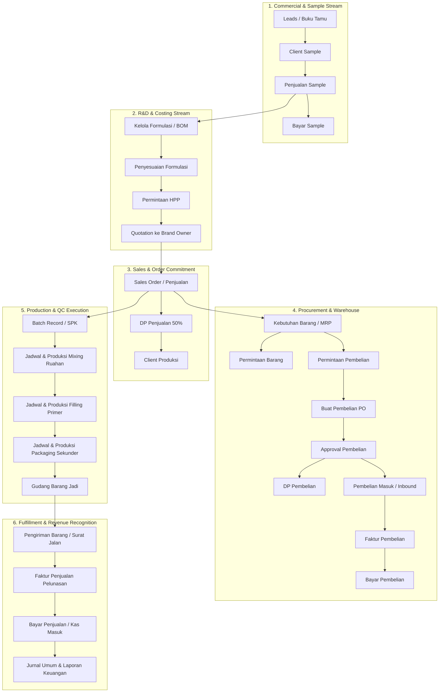

# ERP OLD BUSINESS FLOW (GsERP KIL)
**Enterprise Context:** PT. Karya Impian Laboratoris (Dreamlab - Toll Manufacturing Kosmetik & Skincare)  
**Document Version:** 1.0 — Reconstructed Baseline Operasional  
**Auditor:** ERP Business Process Auditor & Systems Analyst  

---

## 1. Core End-to-End Business Value Stream Overview

The cosmetics contract manufacturing (maklon) lifecycle in GsERP KIL operates through 6 interconnected macro business workflows:

---

## 2. Detailed Macro Business Flows

### FLOW 1: Customer Intake & Sample Prototyping (Lead to Sample Payment)
**Business Object:** `Sample Trial Contract`  
**Start Event:** Brand owner berkunjung ke kantor atau mengirim chat inquiry konsep maklon produk kosmetik baru.

* **STEP 1: Registrasi Calon Pelanggan**
  * **Actor:** Frontdesk / Resepsionis / BusDev Admin.
  * **Page:** `/guest-book` (`buku-tamu-input.html`).
  * **Input:** Nama Tamu, Brand Impian, No. Telepon/WA, Minat Kategori (Serum, Cream, Toner), Nama BusDev.
  * **Process:** Menyimpan record tamu dan mengarahkan ke meja konsultasi BusDev.
  * **Output:** Record Buku Tamu (`ID: BT-xxx`).
  * **Next Consumer:** BusDev Officer.

* **STEP 2: Pembuatan Order Sample (Penjualan Sample)**
  * **Actor:** BusDev Specialist.
  * **Page:** `/sales-sample` (`penjualan-sample-input.html`).
  * **Input:** Calon Pelanggan, Produk Sample (contoh: "Acne Clear Gel 20g"), Catatan Preferensi Wangi/Warna, Biaya Trial Sample (e.g. Rp 300.000).
  * **Process:** Membuat order pembuatan sampel lab berbayar.
  * **Output:** Dokumen Penjualan Sample (`No: SS-xxx`), Status: `Menunggu Pembayaran`.
  * **Next Consumer:** Finance Kasir & Client.

* **STEP 3: Pembayaran Sample**
  * **Actor:** Finance Kasir.
  * **Page:** `/sales-sample-payment` (`bayar-sample.html`).
  * **Input:** Pilih No. SS, Rekening Kas/Bank Penerima, Tanggal Bayar, Jumlah Transfer, Bukti Bayar.
  * **Process:** Memvalidasi mutasi bank dan mengubah status sample menjadi lunas.
  * **Output:** Status Sample: `Paid / Lunas`, Jurnal Kas Masuk (`Debit: Bank, Credit: Pendapatan Sample`).
  * **Next Consumer:** R&D Formulator Lab.

* **STEP 4: Perumusan Resep Lab & Pembuatan Sample**
  * **Actor:** R&D Specialist (Formulator).
  * **Page:** `/formulation-manage` (`formulasi-input.html`).
  * **Input:** Target Netto, Komposisi Bahan Baku (Konsentrasi %, Fase Peleburan).
  * **Process:** Peracikan bahan di lab skala 100g, uji organoleptis, dan pengemasan sample tester.
  * **Output:** Master Formula Draf (`ID: FORM-xxx`), Fisik Sample Tester.
  * **Next Consumer:** Client Brand Owner (untuk dicoba/review).

* **STEP 5: Feedback & Penyesuaian Formulasi (Revisi Sample)**
  * **Actor:** BusDev & R&D Formulator.
  * **Page:** `/formulation-adjustment` (`penyesuaian-formulai.html`).
  * **Input:** Nomor Formula awal, Feedback Client (misal: "Kurang kental, wangi terlalu tajam"), Bahan Pengganti / Perubahan Konsentrasi %.
  * **Process:** Menyimpan versi revisi berurutan (Rev 1, Rev 2).
  * **Output:** Versi Formula Final yang disetujui (Approved Formula).
  * **Next Consumer:** Permintaan HPP (Costing).

---

### FLOW 2: Product Costing & Quotation (HPP to Sales Order)
**Business Object:** `Commercial Quotation & Sales Contract`  
**Start Event:** Brand owner menyetujui formula sample dan meminta penawaran harga produksi massal (MOQ).

* **STEP 1: Pengajuan Permintaan HPP (COGS Request)**
  * **Actor:** BusDev Officer.
  * **Page:** `/request-cogs` (`permintaan-hpp-input.html`).
  * **Input:** Pelanggan, Sample Produk, Nomor Revisi Formula Final, Pilihan Kemasan Primer (Botol Kaca/Akrilik), Kemasan Sekunder (Box Cetak Spot UV), Target MOQ (e.g. 1.000 pcs, 3.000 pcs, 5.000 pcs).
  * **Process:** Meminta tim R&D & Purchasing mengalkulasi total biaya bahan baku, biaya kemasan, dan biaya upah produksi.
  * **Output:** Dokumen Permintaan HPP (`No: HPP-REQ-xxx`), Status: `Pending Review`.
  * **Next Consumer:** Persetujuan HPP & Purchasing.

* **STEP 2: Verifikasi Biaya & Persetujuan HPP**
  * **Actor:** R&D Head / Finance Manager.
  * **Page:** `/request-cogs-approval` (`permintaan-hpp.html`).
  * **Input:** Evaluasi harga perolehan bahan baku terakhir, biaya kemasan dari vendor, margin keuntungan pabrik (%).
  * **Process:** Otorisasi harga dasar HPP per satuan pcs.
  * **Output:** HPP Terkunci (e.g. Rp 18.500 / botol). Status: `Approved`.
  * **Next Consumer:** BusDev (membuat Quotation harga jual e.g. Rp 25.000 / botol).

* **STEP 3: Kontrak Maklon / Penjualan Produk (Sales Order)**
  * **Actor:** BusDev Specialist.
  * **Page:** `/sales` (`penjualan-input.html`).
  * **Input:** Pelanggan, Tanggal Order, Produk, Qty Pesanan (e.g. 5.000 pcs), Harga Jual Satuan, Total Nilai Kontrak (e.g. Rp 125.000.000), Termin DP 50%.
  * **Process:** Mengonfirmasi pesanan maklon resmi ke dalam sistem.
  * **Output:** Dokumen Sales Order (`No: SO-202609-xxx`), Status: `Pending Approval`.
  * **Next Consumer:** Management Approver (`/sales-approval`).

* **STEP 4: Penerimaan Down Payment (DP Penjualan)**
  * **Actor:** Finance AR.
  * **Page:** `/sales-down-payment` (`dp-penjualan-input.html`).
  * **Input:** Pilih No. SO, Rekening Bank Penerima, Nilai DP (e.g. Rp 62.500.000), Bukti Transfer.
  * **Process:** Validasi dana masuk dan aktivasi status Sales Order menjadi `In Production Preparation`.
  * **Output:** Dokumen DP Penjualan, Jurnal (`Debit: Bank, Credit: Uang Muka Penjualan / Hutang DP`).
  * **Next Consumer:** SCM (Pengadaan Bahan) & PPIC (Perencanaan Batch).

---

### FLOW 3: Material Requirements & Procurement (SCM Stream)
**Business Object:** `Purchase Order & Goods Receipt`  
**Start Event:** Sales Order berstatus `Confirmed / DP Received`.

* **STEP 1: Analisis Kebutuhan Barang (Explode BOM vs Stock)**
  * **Actor:** Admin Gudang / PPIC.
  * **Page:** `/need-for-goods` (`kebutuhan-barang-input.html`).
  * **Input:** Pilih No. SO dan Produk Maklon.
  * **Process:** Sistem memecah formula produk menjadi kebutuhan total:
    * Total Kg Bahan Baku (Niacinamide, Glycerin, Water, dll).
    * Total Pcs Kemasan Primer (Botol Dropper 20ml).
    * Total Pcs Kemasan Sekunder (Box Luar, Label Barcode).
    * Membandingkan kebutuhan dengan saldo fisik gudang saat ini.
  * **Output:** Daftar Material Defisit (Barang Kurang).
  * **Next Consumer:** Permintaan Pembelian (PR).

* **STEP 2: Permintaan Pembelian (Purchase Request / PR)**
  * **Actor:** Admin Gudang / PPIC.
  * **Page:** `/purchase-request` (`permintaan-pembelian-input.html`).
  * **Input:** Tanggal Permintaan, Daftar Material Defisit, Qty Diperlukan, Gudang Tujuan, Catatan Prioritas.
  * **Process:** Pengajuan pengadaan bahan ke divisi Purchasing.
  * **Output:** Dokumen PR (`No: PR-xxx`), Status: `Pending Purchasing`.
  * **Next Consumer:** Purchasing SCM.

* **STEP 3: Buat Pembelian (Purchase Order / PO)**
  * **Actor:** Purchasing Officer.
  * **Page:** `/purchase` (`buat-pembelian-input.html`).
  * **Input:** Pilih Supplier, Gudang Bongkar, Tanggal PO, Jatuh Tempo (TOP), Baris Material, Qty Beli, Harga Negosiasi, Pajak PPN (11%).
  * **Process:** Menerbitkan PO vendor resmi.
  * **Output:** Dokumen PO (`No: PO-xxx`), Status: `Pending Approval`.
  * **Next Consumer:** SCM Manager / Direksi (`/purchase-approval`).

* **STEP 4: Persetujuan PO (PO Approval)**
  * **Actor:** SCM Manager / Direksi.
  * **Page:** `/purchase-approval`.
  * **Process:** Evaluasi kewajaran harga vendor dan komitmen anggaran.
  * **Output:** Status PO: `Approved`.
  * **Next Consumer:** Finance (jika perlu DP Pembelian) & Supplier.

* **STEP 5: DP Pembelian Vendor (Jika Ada Term DP)**
  * **Actor:** Finance AP.
  * **Page:** `/purchase-down-payment` (`dp-pembelian-input.html`).
  * **Input:** No. PO, Supplier, Rekening Bank Pengirim, Jumlah DP Transfer.
  * **Output:** Jurnal Uang Muka Pembelian (`Debit: Uang Muka Pembelian, Credit: Bank`).

* **STEP 6: Penerimaan Barang Masuk (Goods Receipt PO)**
  * **Actor:** Staf Penerimaan Gudang.
  * **Page:** `/purchase-in` (`pembelian-masuk.html`).
  * **Input:** Pilih No. PO, No. Surat Jalan Vendor, Tanggal Masuk, Qty Fisik Diterima, Verifikasi Visual Kemasan.
  * **Process:** Menambah saldo stok fisik di Gudang Bahan Baku / Kemasan.
  * **Output:** Dokumen Pembelian Masuk (`No: GR-xxx`), Update Status PO: `Diterima Sebagian` atau `Selesai`.
  * **Next Consumer:** Finance AP & Lantai Produksi.

* **STEP 7: Faktur Pembelian (AP Bill) & Bayar Pembelian**
  * **Actor:** Finance AP.
  * **Page:** `/purchase-invoice` & `/purchase-payment` (`faktur-pembelian.html`, `bayar-pembelian.html`).
  * **Input:** No. GR Inbound, Faktur Pajak Vendor, Potongan DP, Tanggal Jatuh Tempo.
  * **Process:** Pengakuan Hutang Dagang dan penerbitan bukti pelunasan kas keluar.
  * **Output:** Pelunasan Hutang Dagang (`Debit: Hutang Dagang, Credit: Bank`).

---

### FLOW 4: Production Execution & Quality Control (Plant Floor Stream)
**Business Object:** `Batch Record & Production Realization`  
**Start Event:** Semua bahan baku kimia dan kemasan untuk Sales Order terkait telah lengkap di gudang.

* **STEP 1: Terbit Dokumen Batch Record (SPK Produksi)**
  * **Actor:** PPIC / Supervisor Produksi.
  * **Page:** `/batch-record` (`batch-record.input.html`).
  * **Input:** No. Sales Order, Produk, Kategori Produk, Ukuran Batch (Total Pcs & Netto Kg), Lampiran SOP Produksi CPKB (PDF).
  * **Process:** Menerbitkan nomor batch unik pabrik (identitas batch kosmetik wajib BPOM).
  * **Output:** Dokumen Batch Record (`No: BR-xxx`), Status: `Ready for Scheduling`.
  * **Next Consumer:** Supervisor Mixing, Filling, Packaging.

* **STEP 2: Penjadwalan & Eksekusi Produksi Mixing (Pengolahan Ruahan)**
  * **Actor:** PPIC & Operator Mixing.
  * **Pages:** `/schedule-mixing` (`jadwal-mixing-input.html`) & `/production-mixing` (`produksi-mixing.html`).
  * **Input:**
    * Penjadwalan: No. BR, Tanggal Rencana, Mesin Homogenizer, Target Hasil Upscale (Kg).
    * Realisasi: Bahan Baku Ditimbang Aktual, Suhu (°C), RPM Kecepatan Pengadukan, Waktu Sirkulasi, Hasil Ruahan Akhir (Kg).
  * **Process:** Pemotongan stok bahan baku di gudang kimia; penciptaan produk antara: Ruahan Kosmetik (Bulk).
  * **Output:** Dokumen Realisasi Mixing (`No: PM-xxx`), Ruahan masuk Gudang Ruahan/WIP, siap uji QC mikro/stabilitas.
  * **Next Consumer:** Supervisor Filling.

* **STEP 3: Penjadwalan & Eksekusi Produksi Filling (Pengisian Wadah Primer)**
  * **Actor:** Operator Filling & Supervisor.
  * **Pages:** `/schedule-filling` (`jadwal-filing-input.html`) & `/production-filling` (`produksi-filing.html`).
  * **Input:**
    * Penjadwalan: No. BR, Tanggal Rencana, Kemasan Primer (Botol/Jar).
    * Realisasi: Mesin Filling, Qty Ruahan Digunakan (Kg), Kemasan Primer Terpakai (Pcs), Botol Pecah/Reject, Hasil Terisi (Pcs).
  * **Process:** Pemotongan stok ruahan dan botol primer di gudang; penciptaan produk terisi unboxed.
  * **Output:** Dokumen Realisasi Filling (`No: PF-xxx`).
  * **Next Consumer:** Supervisor Packaging.

* **STEP 4: Penjadwalan & Eksekusi Produksi Packaging (Kemas Akhir & Finishing)**
  * **Actor:** Operator Packaging & Mandor Kemas.
  * **Pages:** `/schedule-packaging` (`jadwal-packing-input.html`) & `/production-packaging` (`produksi-packing.html`).
  * **Input:** No. BR, Tanggal, Kotak Sekunder (Inner Box), Brosur, Master Box Karton, Realisasi Output Akhir (Pcs Bagus), Reject Label.
  * **Process:** Perakitan produk akhir, penempelan etiket notifikasi BPOM, expired date coding, dan sealing plastik shrink.
  * **Output:** Dokumen Realisasi Packaging (`No: PP-xxx`), Hasil Jadi Fisik Kosmetik (Finished Goods).
  * **Next Consumer:** Tim Gudang Barang Jadi (Inbound Finished Goods).

---

### FLOW 5: Outbound Fulfillment, Invoicing & Settlement (Order to Cash)
**Business Object:** `Delivery Order & Final AR Settlement`  
**Start Event:** Produk jadi lolos verifikasi akhir QC dan siap dikirim ke brand owner.

* **STEP 1: Surat Jalan / Pengiriman Barang (Delivery Out)**
  * **Actor:** Staf Pengiriman Gudang.
  * **Page:** `/delivery-out` (`pengiriman-barang-input.html`).
  * **Input:** No. Sales Order, Tanggal Pengiriman, Alamat Pengiriman Pelanggan, Baris Barang Jadi, Qty Kirim (e.g. 5.000 pcs), Ekspedisi / No. Truk, Foto Muatan.
  * **Process:** Mengurangi stok Gudang Barang Jadi dan menerbitkan Surat Jalan rangkap pengemudi.
  * **Output:** Dokumen Surat Jalan Pengiriman (`No: DO-xxx`), Status SO: `Shipped / Terkirim`.
  * **Next Consumer:** Brand Owner (penerima) & Finance AR.

* **STEP 2: Faktur Penjualan (Sales Invoice / AR Bill)**
  * **Actor:** Finance AR.
  * **Page:** `/sales-invoice` (`faktur-penjualan.html`).
  * **Input:** No. Surat Jalan (DO), No. Sales Order (SO), Nilai Kontrak, Potongan DP yang pernah dibayar (50%), Sisa Tagihan Pelunasan (50%), PPN (11%).
  * **Process:** Pengakuan Piutang Dagang (`Debit: Piutang Dagang, Debit: Uang Muka Penjualan, Credit: Pendapatan Penjualan Maklon, Credit: Hutang PPN Keluaran`).
  * **Output:** Faktur Penjualan resmi (PDF/Print) dikirim ke brand owner.
  * **Next Consumer:** Brand Owner & Finance Kasir.

* **STEP 3: Bayar Penjualan (Pelunasan Piutang)**
  * **Actor:** Finance Kasir.
  * **Page:** `/sales-payment` (`bayar-penjualan.html`).
  * **Input:** Pilih Faktur Penjualan, Rekening Bank Penerima, Tanggal Bayar, Nilai Pelunasan, Bukti Transfer.
  * **Process:** Pelunasan piutang di buku besar.
  * **Output:** Status Faktur Penjualan: `Lunas`, Jurnal Penerimaan Bank (`Debit: Bank, Credit: Piutang Dagang`). Transaksi pesanan maklon dinyatakan selesai (Closed).

---

## 3. Division Handoff Matrix & Traceability Audit

| From Division | To Division | Transaction / Handoff Record | Physical Asset / Evidence | Traceable in Old ERP? | Classification |
| :--- | :--- | :--- | :--- | :--- | :--- |
| **Commercial / BusDev** | **Finance** | Penjualan Sample (`SS-xxx`) | Bukti transfer biaya trial | Yes (via `/sales-sample-payment`) | VALID HANDOFF |
| **Finance** | **R&D** | Status Sample `Paid` | Formulasi Sample Lab | **BROKEN HANDOFF** (R&D tidak punya notifikasi otomatis dari finance; formulator harus diberitahu manual lewat WhatsApp bahwa sample sudah dibayar) | ⚠️ BROKEN_HANDOFF |
| **R&D** | **BusDev** | Approved Formula (`FORM-xxx`) | Sampel fisik tester dikirim ke client | Yes (via revisi formulasi & master formula) | VALID HANDOFF |
| **BusDev** | **R&D / Purchasing** | Permintaan HPP (`HPP-REQ-xxx`) | Form COGS request | Yes (via `/request-cogs-approval`) | VALID HANDOFF |
| **BusDev** | **Finance** | Sales Order (`SO-xxx`) & DP Penjualan | Bukti transfer DP 50% | Yes (via `/sales-down-payment`) | VALID HANDOFF |
| **Finance** | **SCM / Warehouse** | SO Confirmed (DP Paid) | Kebutuhan Barang (BOM explode) | **BROKEN HANDOFF** (Di Old ERP, admin gudang harus memilih SO secara manual di form Kebutuhan Barang, tidak otomatis meng-generate MRP reservation) | ⚠️ BROKEN_HANDOFF |
| **Warehouse** | **Purchasing (SCM)** | Permintaan Pembelian (`PR-xxx`) | Defisit material list | Yes (via `/purchase-request`) | VALID HANDOFF |
| **Purchasing** | **Supplier** | Purchase Order (`PO-xxx`) | PO Cetak PDF / Email | Yes (via `/purchase` & approval) | VALID HANDOFF |
| **Supplier** | **Warehouse** | Inbound Goods Receipt (`GR-xxx`) | Surat Jalan Supplier & Fisik Bahan Baku | Yes (via `/purchase-in`) | VALID HANDOFF |
| **Warehouse** | **Finance** | Dokumen GR Inbound | Dasar pembuatan Faktur Pembelian (AP) | Yes (via `/purchase-invoice` lookup GR) | VALID HANDOFF |
| **Commercial** | **PPIC / Produksi** | Sales Order Confirmed | Dokumen Batch Record (`BR-xxx`) | **BROKEN HANDOFF** (Input Batch Record mewajibkan upload file PDF secara manual tanpa integrasi langsung ke instruksi kerja digital) | ⚠️ BROKEN_HANDOFF |
| **PPIC / Produksi** | **Warehouse** | Permintaan Bahan Baku Mixing | Pengeluaran Bahan Kimia & Kemasan | **BROKEN HANDOFF** (Modul Jadwal Mixing dan Produksi Mixing tidak otomatis memotong stok gudang melalui reservasi batch; stok dipotong lewat form terpisah) | ⚠️ BROKEN_HANDOFF |
| **Produksi** | **Warehouse** | Realisasi Packaging (`PP-xxx`) | Fisik Finished Goods (Karton Box) | **BROKEN HANDOFF** (Hasil jadi produk tidak otomatis memicu mutasi penerimaan barang jadi di Gudang FG; gudang harus input manual di stok/penyesuaian) | ⚠️ BROKEN_HANDOFF |
| **Warehouse** | **Finance** | Pengiriman Barang (`DO-xxx`) | Surat Jalan pengemudi tercatat | Yes (Faktur Penjualan mengambil referensi DO) | VALID HANDOFF |
| **Finance** | **Management** | Jurnal & Laporan Keuangan | Laba Rugi & Neraca Saldo | Yes (Terintegrasi ke CoA) | VALID HANDOFF |

---

## 4. Key Takeaways of Old ERP Baseline

1. **Kelengkapan Siklus Maklon:** Old ERP mencakup seluruh pilar esensial industri kosmetik OEM/ODM (Commercial -> R&D Sample -> HPP Costing -> SCM Procurement -> 3-Stage Plant Execution -> Invoicing).
2. **Kelemahan Integrasi Antar-Divisi (Manual Islands):** Meskipun form-form transaksi tersedia, aliran data antar divisi banyak yang putus (broken handoffs) dan bergantung pada re-input manual nomor dokumen, pemilihan dropdown ulang, atau koordinasi lisan/WhatsApp di luar sistem.
3. **Pilar Produksi Bertahap (3-Phase Production):** Pemisahan tegas antara `Mixing` (Kimia ruahan), `Filling` (Kemasan primer), dan `Packaging` (Kemasan sekunder) adalah **karakteristik wajib CPKB industri kosmetik** yang harus dipertahankan dan ditingkatkan di ERP Baru.
