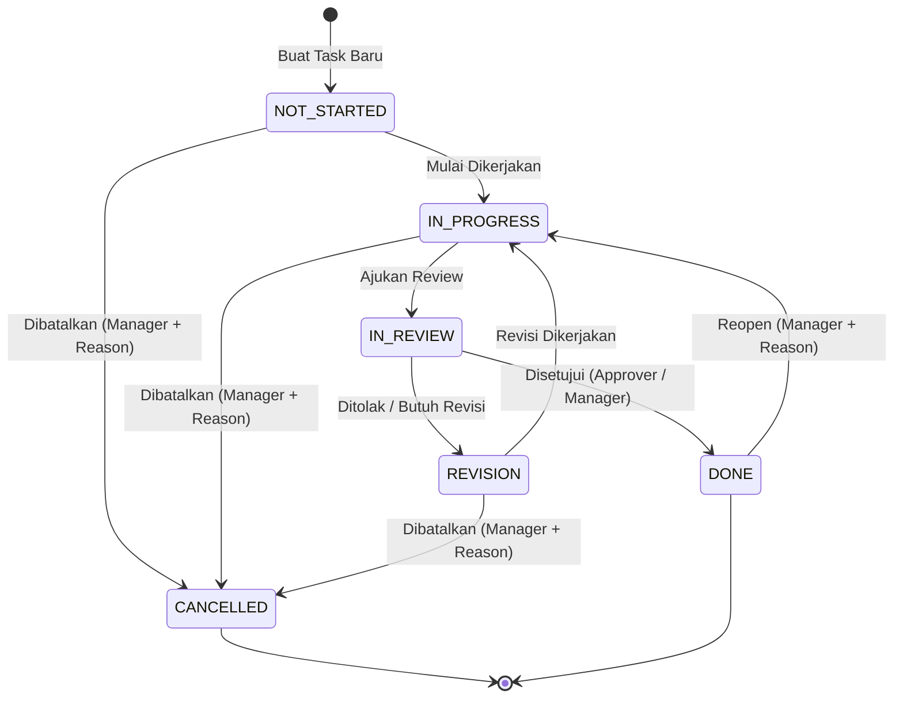

# Management Task SSOT & Contract Specification

**Contract Version**: 1.1.0  
**Status**: 🔒 BINDING SSOT CONTRACT  
**Tanggal Efektif**: 2026-09-12  
**Domain**: Digital Marketing — Management Task Workspace (`/marketing/management-task`)  
**Visual Authority**: `VISUAL_DNA.md` & `DNA-RULES-CONTRACT.md`  
**Backend Authority**: `docs/marketing/PHASE-3-CANONICAL-BACKEND.md`  

---

## 1. Tujuan & Latar Belakang

Dokumen ini adalah **Single Source of Truth (SSOT)** definitif untuk modul **Management Task** di NexERP. Dokumen ini dirancang untuk:
1. Menghilangkan ketidaksesuaian (*spec drift*) antara arsitektur prototype legacy (`docs/legacy-erp/` dan `docs/reference/`) dengan arsitektur relasional kanonikal ERP.
2. Memastikan antarmuka pengguna (UI) **100% mudah diaudit**, transparan, dan patuh terhadap aturan baku Visual DNA 5-Layer.
3. Menjamin sistem bekerja **ready to live**, dengan **minim bug** dan **zero error**, didukung oleh penanganan konflik konkurensi optimistik dan pelarangan mutlak fallback mock data.

---

## 2. Arsitektur Route & Navigasi

### 2.1 Definisi Route Kanonikal

| Path | Tipe Route | Handler Fisik | Deskripsi & Perilaku |
|---|---|---|---|
| `/marketing/management-task` | Client/Server Redirect | `src/app/(dashboard)/marketing/management-task/page.tsx` | Entry point stabil. Mengarahkan request secara otomatis via HTTP 307 atau client router ke `/marketing/management-task/overview`. |
| `/marketing/management-task/overview` | Dynamic Team Workspace | `src/app/(dashboard)/marketing/management-task/[member]/page.tsx` (`params.member = 'overview'`) | Tampilan agregat seluruh tim marketing. Menampilkan metrik KPI global, board Kanban, dan tabel semua task tanpa filter anggota. Bukan *ghost route*, melainkan resolved dynamic segment. |
| `/marketing/management-task/[member]` | Dynamic Personal Workspace | `src/app/(dashboard)/marketing/management-task/[member]/page.tsx` (`params.member = '<username>'`) | Workspace khusus anggota tim (misal: `/marketing/management-task/aurel`). Otomatis menyaring task berdasarkan assignee yang bersangkutan. |

### 2.2 Navigasi Sidebar Resmi

Sidebar modul Digital Marketing (`MarketingModuleSidebar.tsx` dan `Sidebar.tsx`) mengarahkan menu **Management Task** langsung ke `/marketing/management-task/overview`.
- Label: `Management Task`
- Icon: `CheckSquare` / `Kanban`
- Target URL: `/marketing/management-task/overview`
- Active State: Aktif jika path diawali dengan `/marketing/management-task`.

### 2.3 Deep-Link URL State Contract

Semua filter, pencarian, dan pagination wajib disimpan di URL query parameter sehingga user dapat membagikan tautan (*deep-link*) dan menggunakan tombol navigasi browser (*Back/Forward*) tanpa kehilangan state:

| Query Param | Tipe | Contoh Nilai | Keterangan |
|---|---|---|---|
| `view` | enum | `kanban` \| `table` | Mode visualisasi utama (default: `kanban`). |
| `tab` | enum | `overview` \| `my-tasks` \| `team` \| `projects` | Tab aktif di L03 (default: `overview`). |
| `q` | string | `kampanye lebaran` | Kata kunci pencarian judul task. |
| `status` | enum | `ALL` \| `NOT_STARTED` \| `IN_PROGRESS` \| `IN_REVIEW` \| `REVISION` \| `DONE` \| `CANCELLED` | Filter status task. |
| `brand` | UUID | `9a3b...` | Filter berdasarkan brand aktif. |
| `project` | UUID | `c1d2...` | Filter berdasarkan project terkait. |
| `priority` | enum | `LOW` \| `MEDIUM` \| `HIGH` \| `URGENT` | Filter tingkat urgensi. |
| `page` | integer | `1` | Halaman aktif pada mode tabel (1-indexed). |
| `limit` | integer | `20` \| `50` | Jumlah baris per halaman (default: `20`). |

---

## 3. Standar Auditabilitas UI & Visual DNA 5-Layer

Sesuai dengan `docs/DNA-RULES-CONTRACT.md`, UI Management Task **dilarang menggunakan elemen HTML mentah** (`<table>`, native `<input>`, native `<select>`, `<button>` biasa). Semua komponen wajib diimpor dari `@/components/dna`.

### 3.1 Komposisi 5-Layer

```
┌────────────────────────────────────────────────────────────────────────┐
│ L01: Top Metrics Grid (DnaKpiGrid / DnaTopMetrics)                      │
│ [Total Tasks: 48]  [In Progress: 14]  [In Review: 6]  [Overdue: 2]     │
├────────────────────────────────────────────────────────────────────────┤
│ L02: URL-Backed Filter Bar (DnaFilterBar / DnaSearchBar)               │
│ [🔍 Cari Task...] [Status: All ▾] [Brand: All ▾] [Project ▾] [Reset]  │
├────────────────────────────────────────────────────────────────────────┤
│ L03: Tab Navigation (DnaTabs)                                          │
│ [Overview]  [My Tasks]  [Team Workload]  [Projects Portfolio]          │
├────────────────────────────────────────────────────────────────────────┤
│ L04: Operational Toolbar (DnaToolbar)                                  │
│ [View: Kanban | Table]                     [+ Quick Add Task (Primary)]│
├────────────────────────────────────────────────────────────────────────┤
│ L05: Presentation Workspace (DnaDataTableCard / Kanban Board)          │
│ ┌───────────────┐ ┌───────────────┐ ┌───────────────┐ ┌──────────────┐ │
│ │  NOT STARTED  │ │  IN PROGRESS  │ │   IN REVIEW   │ │     DONE     │ │
│ │  [Task Card]  │ │  [Task Card]  │ │  [Task Card]  │ │  [Task Card] │ │
│ └───────────────┘ └───────────────┘ └───────────────┘ └──────────────┘ │
└────────────────────────────────────────────────────────────────────────┘
```

### 3.2 Spesifikasi Drawer Detail & Audit Trail (`DnaAuditTimeline`)

Setiap klik pada kartu/baris task akan membuka Drawer Detail (`<DnaSheet side="right">`).
Drawer wajib memiliki 4 tab navigasi internal:
1. **Ringkasan (Overview)**: Informasi umum, deskripsi brief, link output/referensi, estimasi menit vs aktual, status dropdown, priority.
2. **Checklist Sub-task**: Daftar item checklist interaktif dengan penanda penyelesaian (checked by Actor + Timestamp).
3. **Komentar & Kolaborasi**: Thread komentar terotentikasi dengan avatar, timestamp, dan teks komentar.
4. **Audit Trail (`DnaAuditTimeline`)**: Panel riwayat audit mutasi **read-only & immutable**:
   - **Waktu**: Tanggal dan jam dalam format lokal Indonesia (`DD MMM YYYY, HH:mm:ss`).
   - **Aktor**: Nama pengguna dan Role yang melakukan perubahan (diambil dari relasi user, bukan free text).
   - **Jenis Aksi**: `STATUS_CHANGE`, `ASSIGNEE_REASSIGNED`, `PRIORITY_UPDATE`, `CHECKLIST_TOGGLED`, `TASK_CREATED`.
   - **Diff Perubahan**: Perubahan eksplisit (contoh: `IN_PROGRESS → IN_REVIEW`).
   - **Catatan / Reason**: Wajib terisi jika aksi adalah pembatalan (`CANCELLED`) atau pembukaan kembali task yang telah selesai (`REOPEN_TASK`).

---

## 4. State Machine & Aturan Validasi Alur Kerja

### 4.1 Diagram Alur Status Task



### 4.2 Aturan Bisnis Wajib (Enforced Rules)

1. **Mandatory Checklist Guard**:
   - Status task **tidak dapat diubah menjadi `DONE`** jika masih terdapat item checklist bertipe `isRequired = true` yang belum dicentang (`isCompleted = false`).
   - Backend melempar error `422 UNPROCESSABLE_ENTITY` dengan pesan `"Semua item checklist wajib diselesaikan sebelum task diselesaikan."`
2. **Role Authorization Guard**:
   - Transisi ke `DONE` hanya dapat dilakukan oleh `SUPER_ADMIN`, `HEAD_OPS`, `MARKETING`, atau user yang ditunjuk sebagai `reviewerId`. Role `DIGIMAR` biasa yang merupakan assignee hanya dapat memindahkan hingga status `IN_REVIEW`.
3. **Cancellation & Reopening Audit**:
   - Perubahan status ke `CANCELLED` atau membuka kembali dari `DONE` mewajibkan pengisian kolom alasan (`reason`). Backend menolak mutasi jika payload `reason` kosong.

---

## 5. Matriks RBAC (Role-Based Access Control)

| Kemampuan Operasional | SUPER_ADMIN | HEAD_OPS | MARKETING | DIGIMAR | DIRECTOR | COMMERCIAL |
|---|:---:|:---:|:---:|:---:|:---:|:---:|
| Lihat Semua Task (Team Overview) | ✅ | ✅ | ✅ | ❌ (Hanya Scoped) | ✅ (Read-only) | ✅ (Read-only) |
| Lihat Scoped Tasks (Milik Sendiri / Ditugaskan) | ✅ | ✅ | ✅ | ✅ | ✅ (Read-only) | ✅ (Read-only) |
| Buat Task Baru & Tugaskan ke Siapa Saja | ✅ | ✅ | ✅ | ❌ | ❌ | ❌ |
| Buat Task untuk Diri Sendiri (Self-assigned) | ✅ | ✅ | ✅ | ✅ | ❌ | ❌ |
| Ubah Status Task Sendiri (`NOT_STARTED` → `IN_REVIEW`) | ✅ | ✅ | ✅ | ✅ | ❌ | ❌ |
| Approve Task (`IN_REVIEW` → `DONE`) | ✅ | ✅ | ✅ | ❌ (Kecuali Reviewer) | ❌ | ❌ |
| Batalkan Task (`CANCELLED`) / Reopen Task | ✅ | ✅ | ✅ | ❌ | ❌ | ❌ |
| Tambah & Hapus Item Checklist | ✅ | ✅ | ✅ | ✅ (Pada tasknya) | ❌ | ❌ |
| Kirim Komentar & Lampiran | ✅ | ✅ | ✅ | ✅ | ❌ | ❌ |
| Manajemen Brand & Master Project | ✅ | ✅ | ✅ | ❌ | ❌ | ❌ |

---

## 6. Protokol Concurrency & Penanganan Error UI

### 6.1 Optimistic Concurrency Control (`version`)

1. Setiap entitas task di database memiliki field integer `version` (dimulai dari `1`).
2. Frontend wajib menyertakan nilai `version` terkini saat mengirim request mutasi (`PATCH /tasks/:id` atau `PATCH /tasks/:id/status`).
3. Jika record di database telah diubah oleh pengguna lain, backend menolak transaksi dan mengembalikan respon HTTP:
   ```json
   {
     "statusCode": 409,
     "error": "Conflict",
     "code": "VERSION_CONFLICT",
     "message": "Data task telah diperbarui oleh pengguna lain. Silakan muat ulang data terbaru.",
     "currentVersion": 4
   }
   ```
4. **UI Behavior pada 409 Conflict**:
   - UI **dilarang crash** atau menampilkan unhandled runtime error.
   - UI memunculkan modal peringatan: *"Konflik Perubahan: Task ini baru saja diperbarui oleh [Nama Pengguna]. Apakah Anda ingin menyinkronkan data terbaru?"*
   - Tombol utama: **"Muat Ulang Data"** (otomatis melakukan refetch data task dan mengupdate UI secara bersih).

### 6.2 Kebijakan Zero Mock Fallback

1. Jika pemanggilan API gagal (misal: HTTP 500, timeout, koneksi terputus):
   - UI **DILARANG KERAS** mengambil data dari `localStorage` atau mock array statis.
   - UI wajib menampilkan komponen `<DnaErrorState>` pada area kerja yang terdampak dengan informasi:
     - Deskripsi kesalahan yang mudah dipahami.
     - Kode error HTTP / server timestamp.
     - Tombol **"Coba Lagi (Retry)"**.
2. State data kosong (ketika filter tidak menemukan hasil):
   - Wajib menampilkan `<DnaEmptyState>` dengan ikon yang relevan dan tombol **"Reset Filter"** atau **"Tambah Task Baru"**.

---

## 7. Katalog Kriteria Penerimaan (`AC-TASK-001` s/d `AC-TASK-013`)

Katalog ini menjadi acuan mutlak bagi penulisan test suite otomatis (Unit, Integration, dan Playwright E2E).

| ID | Fitur | Prekondisi | Aksi / Payload | Hasil yang Diharapkan (DB & Audit) | Tampilan UI |
|---|---|---|---|---|---|
| `AC-TASK-001` | Deterministic Entrypoint | Pengguna terotentikasi membuka `/marketing/management-task` | Request HTTP GET | Menerima respon 307 / redirect ke `/marketing/management-task/overview`. | Halaman overview termuat tanpa kedipan layout (*layout shift*). |
| `AC-TASK-002` | Overview KPI & Workload | Data task tersimpan di database | Masuk ke Overview | Endpoint `/marketing/tasks/kpi` mengembalikan agregat akurat (`total`, `inProgress`, `inReview`, `overdue`). | 4 KPI Cards di Layer 01 menampilkan angka riil (bukan strip atau mock). |
| `AC-TASK-003` | Board & Table Views | Berada di task workspace | Toggle tombol Switch View di Toolbar L04 | Parameter URL `view=table` atau `view=kanban` terupdate. Data ditampilkan sesuai mode. | Kartu Kanban atau tabel `<DnaTable>` merender daftar task dengan kolom lengkap. |
| `AC-TASK-004` | Task Creation & Mutation | Role `MARKETING` mengisi form Tambah Task | Submit form task dengan title, channel, priority, dueDate, assigneeId | Record baru tersimpan di tabel `MarketingTask` dengan `version = 1`. Audit record `TASK_CREATED` tercatat. | Task baru langsung muncul di kolom `NOT_STARTED` tanpa full page reload. |
| `AC-TASK-005` | State Workflow Transition | Task berstatus `NOT_STARTED` | Drag kartu atau ubah via dropdown status ke `IN_PROGRESS` | Status di DB berubah menjadi `IN_PROGRESS`. `MarketingTaskHistory` mencatat aktor, waktu, dan perubahan. | Kartu berpindah kolom; toast sukses muncul dengan aria-live polite. |
| `AC-TASK-006` | Mandatory Checklist Guard | Task memiliki checklist dengan `isRequired = true` yang belum checked | Pengguna mencoba memindahkan status langsung ke `DONE` | Backend menolak mutasi dengan respon HTTP 422. DB tidak mengalami perubahan. | Modal peringatan checklist muncul; status task tetap pada posisi semula. |
| `AC-TASK-007` | Comments & Collaboration | Task terbuka di drawer detail | Pengguna memasukkan komentar baru dan klik kirim | Record baru tercatat di `MarketingTaskComment` terhubung dengan UUID pengguna. | Komentar baru muncul di thread riwayat seketika. |
| `AC-TASK-008` | Attachment Handling | Pengguna memiliki dokumen pendukung | Mengunggah file via tab lampiran | Metadata file tersimpan di `MarketingTaskAttachment`. | Nama file, tipe, ukuran KB, dan pengunggah tampil dalam daftar lampiran. |
| `AC-TASK-009` | Immutable Audit History | Beberapa mutasi telah dilakukan pada task | Membuka tab "Riwayat Audit" pada drawer task | Endpoint history mengembalikan runtutan event terurut descending berdasarkan timestamp. | `<DnaAuditTimeline>` merender seluruh jejak aktivitas tanpa tombol edit/hapus. |
| `AC-TASK-010` | Project Portfolio Linking | Master project aktif tersedia di sistem | Menghubungkan task bertipe `PROJECT` ke project ID | `projectId` tersimpan di `MarketingTask`. Task dihitung dalam progres project. | Badge nama project terpasang pada kartu task. |
| `AC-TASK-011` | Scoped Team Workload | User dengan role `DIGIMAR` login | Membuka `/marketing/management-task/overview` | Query backend menerapkan klausul filter `WHERE assigneeId = currentUser.id OR ownerId = currentUser.id`. | Hanya task yang relevan dengan user yang tampil; KPI terisolasi ke scope pribadi. |
| `AC-TASK-012` | Search & Deep-link Filter | Terdapat >50 task di database | Mengetik kata kunci dan memilih filter brand | URL query string terupdate (`?q=...&brand=...`). Data difilter di level backend. | Tabel/board menyaring data sesuai kriteria; navigasi browser Back mengembalikan state filter. |
| `AC-TASK-013` | Optimistic Concurrency Recovery | 2 tab browser membuka task yang sama | Tab 1 mengubah status; Tab 2 kemudian mencoba mengubah status tanpa refresh | Request Tab 2 ditolak dengan HTTP 409 `VERSION_CONFLICT`. | Tab 2 menampilkan dialog konfirmasi refresh data untuk mencegah penimpaan silent. |

---

## 8. Definisi API Kontrak Kanonikal

### 8.1 Header Standar

Setiap request mutasi (`POST`, `PATCH`, `PUT`, `DELETE`) wajib menyertakan:
- `Authorization: Bearer <JWT_TOKEN>`
- `Content-Type: application/json`
- `Idempotency-Key: <UUID_V4>` (Wajib untuk pembuatan task dan transaksi penting)

### 8.2 Endpoint Utama

| Method | Endpoint | Deskripsi | Status Sukses |
|---|---|---|---|
| `GET` | `/marketing/tasks` | Mengambil daftar task dengan filter dan paginasi | `200 OK` |
| `POST` | `/marketing/tasks` | Membuat task baru | `201 Created` |
| `GET` | `/marketing/tasks/:id` | Mengambil detail lengkap task termasuk checklist & audit | `200 OK` |
| `PATCH` | `/marketing/tasks/:id` | Memperbarui informasi task (membutuhkan `version`) | `200 OK` |
| `PATCH` | `/marketing/tasks/:id/status` | Melakukan transisi status workflow (membutuhkan `version`) | `200 OK` |
| `POST` | `/marketing/tasks/:id/checklist` | Menambahkan item checklist baru | `201 Created` |
| `PATCH` | `/marketing/tasks/:id/checklist/:itemId` | Toggle centang item checklist | `200 OK` |
| `POST` | `/marketing/tasks/:id/comments` | Menambahkan komentar diskusi | `201 Created` |
| `GET` | `/marketing/tasks/kpi` | Mengambil agregat KPI ringkas | `200 OK` |

---

## 9. Penandatanganan & Kepatuhan

Spesifikasi dalam dokumen ini bersifat **mengikat secara mutlak** bagi seluruh fase pengembangan selanjutnya (Fase 2 UI, Fase 3 QA Gate, dan Fase 4 Live Deployment). Setiap perubahan terhadap kontrak ini wajib melalui persetujuan formal dan pembaruan versi dokumen.
